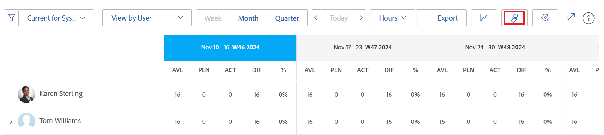
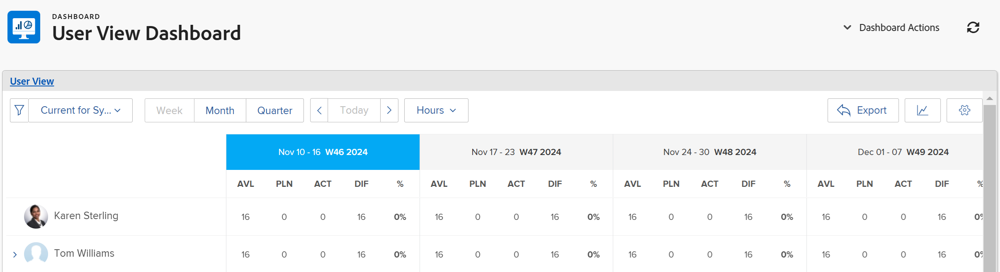

# Share the Resource Planner user view with a link

Adobe Workfront can generate a unique URL for the User View of the Resource Planner which you can embed into a dashboard as an External Page, or open it separately in a new browser tab. This is helpful when sharing the Resource Planner information with users who might not have direct access to the Resourcing area.

## Access requirements

+++ Expand to view access requirements for the functionality in this article.

You must have the following access to perform the steps in this article:

<table style="table-layout:auto"> 
 <col> 
 <col> 
 <tbody> 
  <tr> 
   <td role="rowheader">Adobe Workfront plan</td> 
    <td>
New: Any

       
or

       
Current: Pro or higher
 </td> 
  </tr> 
  <tr> 
   <td role="rowheader">Adobe Workfront license</td> 
   <td>
New: Standard

       
or

       
Current: Plan
</td> 
  </tr> 
  <tr> 
   <td role="rowheader">Access level configurations</td> 
   <td> 
View or higher access to Resource Management, Projects, and Users
 
View access to Financial Data to view cost information
</td> 
  </tr> 
  <tr> 
   <td role="rowheader">Object permissions</td> 
   <td> 
View or higher permissions to the projects you want to display in the Resource Planner
</td> 
  </tr> 
 </tbody> 
</table>

For more detail about the information in this table, see [Access requirements in Workfront documentation](/help/quicksilver/administration-and-setup/add-users/access-levels-and-object-permissions/access-level-requirements-in-documentation.md).

+++

Consider the following when generating the unique URL for the User View of the Resource Planner:

* You can obtain a unique URL only for the User View. The option to generate the URL does not exist in the Project or Role Views. 
* You can share the URL with other users, including Work and Review licensed users.   
  They must have access to view other users in order to view the information in the Resource Planner from the URL that you share with them. 
* The following information is saved when you share the URL with other users:

   * The type of time periods (week, month, quarter).
   * The filters that you apply.
   * The type of display (Hours or FTE).

To obtain a unique URL in the User View of the Resource Planner and share it with other users:

{{step1-to-resourcing}}

1. Select **View by User**.
1. (Optional) Select the timeframe by which you want to view the information in the Resource Planner. Select from the following:

   * Week
   * Month
   * Quarter

1. (Optional) Select whether you want to view the information by **FTE** or **Hours**.  
   

1. (Optional) Apply filters to the Resource Planner.  
   For information about applying filters, see [Filter information in the Resource Planner](../../resource-mgmt/resource-planning/filter-resource-planner.md) .

1. Click the **hyperlink** icon.  
   

1. Click **Copy URL**.  
   This copies the unique URL of the Resource Planner in the User View to your clipboard. 

1. (Optional) Do one of the following: &nbsp;

   * Paste the URL into another application to send it to another user.  
     The user must be logged in to Workfront to view the Resource Planner in the User view.
   * Open a new browser tab or window and paste the link you copied, then click Enter on your keyboard to open the Resource Planner in a new tab or window. 
   * Do the following:   
   
     <!--   
     <MadCap:conditionalText data-mc-conditions="QuicksilverOrClassic.Draft mode">   
     (NOTE:&nbsp;turn this into a numbered list)   
     </MadCap:conditionalText>   
     -->

      1. Go to **Reporting**>**Dashboards**>**New Dashboard**>**Add External Page.**
      
      1. Paste the link you copied to your clipboard in the **URL** field.
      1. Click **Save**, then **Save + Close**.  
         This will embed the URL into the dashboard and the User view of the Resource Planner displays in a separate dashboard.

1. (Optional) If you embedded the URL into a dashboard, consider adding it to a layout template or sharing it with other users who might not have access to the Resource Management area.  
   For information about adding dashboards to a layout template, see [Create and manage layout templates](../../administration-and-setup/customize-workfront/use-layout-templates/create-and-manage-layout-templates.md) .   
   For information about sharing dashboards, see [Share a dashboard](../../reports-and-dashboards/dashboards/creating-and-managing-dashboards/share-dashboard.md) .   
   When viewing the shared URL, users can see the information with the settings that you originally applied to the Resource Planner. They must be logged in to Workfront to view the shared URL.  
   
