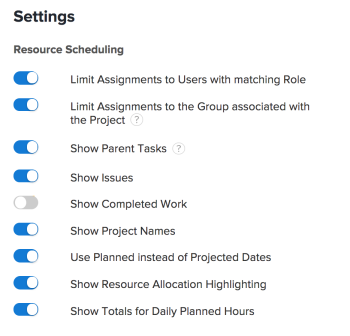
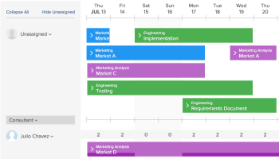

# Configure settings in the Scheduling areas

>[!IMPORTANT]  
>  
>The Scheduling functionality described in this article has been deprecated and removed from Adobe Workfront starting with the 23.1 release in January 2023.     
>  
>  This article will also be removed shortly after the 23.1 release, in early 2023. At this time, we recommend that you update any bookmarks accordingly.  
> 
> You can now use the Workload Balancer to schedule work for your resources.   
>  
> For information about scheduling resources using the Workload Balancer, see the section [The Workload Balancer](../../resource-mgmt/workload-balancer/workload-balancer.md). 

<!--  

>[!CAUTION] 
> 
> 
> The information in this article refers to the Adobe Workfront's Scheduling tools. The Scheduling areas have been removed from the Preview environment and will be removed from the Production environment in **January 2023**. 
>  Instead, you can schedule resources in the Workload Balancer.  
> 
>*  For information about scheduling resources using the Workload Balancer, see the section [The Workload Balancer](../../resource-mgmt/workload-balancer/workload-balancer.md). 
> 
>*  For more information about the deprecation and removal of the Scheduling tools, see [Deprecation of Resource Scheduling tools in Adobe Workfront](../../resource-mgmt/resource-mgmt-overview/deprecate-resource-scheduling.md). 
-->

You can configure various settings to customize how and what information displays in the scheduling timeline.

## Access requirements

You must have the following access to perform the steps in this article::

<table style="table-layout:auto"> 
 <col> 
 <col> 
 <tbody> 
  <tr> 
   <td role="rowheader">Adobe Workfront plan*</td> 
   <td> 
Any
 </td> 
  </tr> 
  <tr> 
   <td role="rowheader">Adobe Workfront license*</td> 
   <td> 
Work or higher
 </td> 
  </tr> 
  <tr> 
   <td role="rowheader">Access level*</td> 
   <td> 
View access or higher to Projects, Tasks,&nbsp;and Issues
 
<b>NOTE</b> 
   
   If you still don't have access, ask your Workfront administrator if they set additional restrictions in your access level. For information on how a Workfront administrator can change your access level, see <a href="../../administration-and-setup/add-users/configure-and-grant-access/create-modify-access-levels.md" class="MCXref xref">Create or modify custom access levels</a>.
 </td> 
  </tr> 
  <tr> 
   <td role="rowheader">Object permissions</td> 
   <td> 
Contribute permissions or higher to projects, tasks, and issues
 
For information on requesting additional access, see <a href="../../workfront-basics/grant-and-request-access-to-objects/request-access.md" class="MCXref xref">Request access to objects </a>.
 </td> 
  </tr> 
 </tbody> 
</table>

*To find out what plan, license type, or access you have, contact your Workfront administrator.

## Configure issues to display on the scheduling timeline

<!--

(NOTE: ALL THE SECTIONS BELOW ARE LINKED TO PRODUCT. DO NOT CHANGE TITLES) 

-->

You can configure issues to be displayed in addition to tasks on the scheduling timeline.   
When scheduling resources  in the Scheduling section for a team , issues are displayed by default in addition to tasks. When scheduling resources for projects, only tasks are displayed by default.

1. Go to the scheduling timeline for multiple projects, for an individual project, or for a team:

   * **For multiple projects**:&nbsp;  Click the **Main Menu** icon  in the upper-right corner of Workfront, click **Resourcing > Workload Balancer**, then select **Scheduling** in the upper-left drop-down menu. 
   * **For an individual project**:  Go to a project, click the **Workload Balancer** section in the left panel, then select **Scheduling** from the upper-left drop-down menu. 
   * **For a team**:  Click the **Main Menu** icon  in the upper-right corner of Workfront, then click **Teams**, select a team, click **Workload Balancer** in the left panel, then select **Scheduling** from the upper-left drop-down menu.

1. Click the **Settings** icon on the scheduling timeline.  

1. On the Resource Scheduling Settings dialog box, enable the&nbsp;**Show Issues**&nbsp;option.  
   

1. Click **Return to Scheduling**.&nbsp;

## Configure completed work to display on the scheduling timeline

You can configure the scheduling timeline to display work that has already been marked as Complete. By default, completed work is not displayed on the scheduling timeline.&nbsp;

1. Go to the scheduling timeline for multiple projects, for an individual project, or for a team:

   * **For multiple projects**:&nbsp;  Click the **Main Menu** icon  in the upper-right corner of Workfront, click **Resourcing > Workload Balancer**, then select **Scheduling** in the upper-left drop-down menu. 
   * **For an individual project**:  Go to a project, click the **Workload Balancer** section in the left panel, then select **Scheduling** from the upper-left drop-down menu. 
   * **For a team**:  Click the **Main Menu** icon  in the upper-right corner of Workfront, then click **Teams**, select a team, click **Workload Balancer** in the left panel, then select **Scheduling** from the upper-left drop-down menu.

1. Click the **Settings** icon on the scheduling timeline.  

1. On the Resource Scheduling Settings dialog box, enable the **Show Completed Work**&nbsp;option.  
   

1. Click **Return to Scheduling**.  
   Completed work is displayed with a checkmark in the upper-right corner of the work item.

## Configure Project Names to display on the scheduling timeline&nbsp;

You can configure the project name to display on each task and issue on the scheduling timeline. This allows users viewing the scheduling timeline to quickly see the name of the project where the task or issue resides.

When you enable project names to display, each task and issue consumes more vertical space on the scheduling timeline, resulting in fewer tasks and issues displaying in a single view.

By default, project names are not displayed on tasks and issues on the scheduling timeline.

To display project names on tasks and issues on the scheduling timeline:

1. Go to the scheduling timeline for multiple projects or for a team:

   * **For multiple projects**:&nbsp;  Click the **Main Menu** icon  in the upper-right corner of Workfront, click **Resourcing > Workload Balancer**, then select **Scheduling** in the upper-left drop-down menu. 
   * **For a team**:  Click the **Main Menu** icon  in the upper-right corner of Workfront, then click **Teams**, select a team, click **Workload Balancer** in the left panel, then select **Scheduling** from the upper-left drop-down menu.

1. Click the **Settings** icon on the scheduling timeline.  

1. On the Resource Scheduling Settings dialog box, enable the option,&nbsp;**Show Project Names**.  
   

1. Click **Return to Scheduling**.  
   Each task and issue on the scheduling timeline displays the name of the project where the task or issue resides.  
   

## Configure Projected Dates to display on the scheduling timeline

By default, Planned Dates are used on the scheduling timeline. Alternatively, you can configure the scheduling timeline to use Projected Dates.

Consider the following information about Planned and Projected Dates:

* Planned Dates for tasks can be set manually, or they can be set automatically, depending on task constraint and duration type. For more information, see&nbsp;the articles [Task Constraint overview](../../manage-work/tasks/task-constraints/task-constraint-overview.md)&nbsp;and&nbsp; [Overview of Task Duration and Duration Type](../../manage-work/tasks/taskdurtn/task-duration-and-duration-type.md)&nbsp;.

  Planned Dates for issues&nbsp;are manually set on issues by users. However, the system administrator can restrict users from adjusting Planned Dates for issues.

* Projected Dates for both tasks and issues are set&nbsp;automatically. For more information about the Projected Dates, see&nbsp;the articles [Overview of the Projected Completion Date for projects, tasks, and issues](../../manage-work/projects/planning-a-project/project-projected-completion-date.md).

>[!NOTE]
>
>When using Projected Dates on the scheduling timeline, user allocation information cannot be displayed. For more information about user allocations, see the article [Manually assign unassigned tasks and issues in the Scheduling areas](../../resource-mgmt/resource-scheduling/manually-assign-items-scheduling-areas.md).

To configure the scheduling timeline to display tasks and issues according to Projected Dates:&nbsp;

1. Go to the scheduling timeline for multiple projects, for an individual project, or for a team:

   * **For multiple projects**:&nbsp;  Click the **Main Menu** icon  in the upper-right corner of Workfront, click **Resourcing > Workload Balancer**, then select **Scheduling** in the upper-left drop-down menu. 
   * **For an individual project**:  Go to a project, click the **Workload Balancer** section in the left panel, then select **Scheduling** from the upper-left drop-down menu. 
   * **For a team**:  Click the **Main Menu** icon  in the upper-right corner of Workfront, then click **Teams**, select a team, click **Workload Balancer** in the left panel, then select **Scheduling** from the upper-left drop-down menu.

1. Click the&nbsp;**Settings**&nbsp;icon on the scheduling timeline.  

1. On the Resource Scheduling Settings dialog box, disable&nbsp;the&nbsp;**Use Planned instead of Projected Dates**&nbsp;option.
1. Click **Return to Scheduling**.

## Configure how users are displayed on the scheduling timeline

>[!NOTE]
>
>This section applies only when scheduling resources for teams (from the  Scheduling section for a team ). When scheduling resources for multiple projects (from the Scheduling tab) or for a single project (from the Staffing tab), users cannot be displayed alphabetically; they are always organized by role.

When scheduling resources for a team, you can configure users to be displayed on the&nbsp;scheduling timeline either alphabetically or by role. By default, users are displayed alphabetically (roles are not displayed).

1. Click the **Main Menu** icon  in the upper-right corner of Workfront, then click&nbsp;Teams. A team is selected by default. 

1. Click the **Settings** icon on the scheduling timeline.  

1. On the Settings dialog box,&nbsp;select&nbsp;whether to enable the **Group by Role** option.   
   When this option is disabled, users are displayed in alphabetical order, and roles are not shown on the scheduling timeline.  
   When this option is enabled, roles are displayed on the scheduling timeline, and users are grouped within their respective role. If a given user has multiple roles defined in the system, that user appears multiple times on the scheduling timeline, beneath each appropriate role.  
   

1. Click **Return to Scheduling**.

## Configure whether parent tasks are displayed on the scheduling timeline

<!--

(NOTE: This section is linked to the UI in a tooltip inside the Settings of the scheduler. do not rename/ remove/ edit the tag!! - Resource Scheduling (People> Scheduling>Settings>Show Parent Tasks tooltip)

-->

Parent Tasks display differently depending on which scheduling timeline you are accessing.&nbsp;

* [Display parent tasks for multiple projects](#display-parent-tasks-for-multiple-projects) 
* [Display parent tasks for a project or a team](#display-parent-tasks-for-a-project-or-a-team)

### Display parent tasks for multiple projects {#display-parent-tasks-for-multiple-projects}

When scheduling resources for multiple projects in the Scheduling  section , whether parent tasks display or not depends on the following settings:

* The Completion Mode of the Project.
* The Summary Completion Mode of the Project.
* The Show Parent Tasks setting on the Scheduling tab.

The following table outlines when the parent tasks display in the Scheduling tab, and when only the subtasks display.&nbsp;

| **Show Parent Tasks Setting** |**Completion Mode of the Project** |**Summary Completion Mode of the Project** |**Type of Tasks Displayed on the Scheduling Timeline** |
|---|---|---|---|
| Disabled |Manual |Automatic |Subtasks only |
| Disabled |Manual |Manual |Subtasks only |
| Disabled |Automatic |Automatic |Subtasks only |
| Disabled |Automatic |Manual |Subtasks only |
| Enabled |Automatic |Manual |Subtasks and Parent Tasks |
| Enabled |Automatic |Automatic |Subtasks only |
| Enabled |Manual |Manual |Subtasks and Parent Tasks |
| Enabled |Manual |Automatic |Subtasks only |

For information about configuring&nbsp;the**Completion Mode** and the **Summary Completion Mode** fields for each project, see the section "Settings"&nbsp;in&nbsp;the article [Edit projects](../../manage-work/projects/manage-projects/edit-projects.md).

You can manually configure the Show Parent Tasks setting in the Scheduling  section  for multiple projects.&nbsp;

To configure the Show Parent Tasks setting:&nbsp;

1. Click the **Main Menu** icon  in the upper-right corner of Workfront, click **Resourcing > Workload Balancer**, then select **Scheduling** in the upper-left drop-down menu.  
1. Click the **Settings** icon on the scheduling timeline.  

1. In the Resource Scheduling Settings dialog box, select whether to enable the option,&nbsp;**Show Parent Tasks.** 
   When this option is enabled, parent tasks from all projects are displayed according to the Summary Completion Mode and the Completion Mode settings of the projects, as outlined in the above table. This option is enabled by default.  
   

1. Click **Return to Scheduling** in the lower-left corner.

### Display parent tasks for a project or a team {#display-parent-tasks-for-a-project-or-a-team}

When scheduling resources in the Staffing  section of a project or in the  Schedule section , whether Parent Tasks display or not depends on the following settings:

* The Completion Mode of the Project.
* The Summary Completion Mode of the Project.

For information about configuring&nbsp;the **Completion Mode** and the&nbsp;**Summary Completion Mode** fields for each project, see the section "Settings" in&nbsp;the article [Edit projects](../../manage-work/projects/manage-projects/edit-projects.md).

The following table outlines when the Parent Tasks display in the Staffing  section of a project or in the  Schedule section , and when only the subtasks display.&nbsp;

| Completion Mode of the Project |Summary Completion Mode of the Project |Type of tasks displayed in the &nbsp; Scheduling section  |Type of tasks displayed in the Teams  Scheduling section  |
|---|---|---|---|
| Manual |Automatic |Subtasks only |Subtasks only |
| Manual |Manual |Subtasks and Parent Tasks |Subtasks only |
| Automatic |Automatic |Subtasks only |Subtasks only |
| Automatic |Manual |Subtasks and Parent Tasks |Subtasks only |
| Automatic |Manual |Subtasks and Parent Tasks |Subtasks only |
| Automatic |Automatic |Subtasks only |Subtasks only |
| Manual |Manual |Subtasks and Parent Tasks |Subtasks only |
| Manual |Automatic |Subtasks only |Subtasks only |

## Configure whether daily Planned Hours are displayed on the scheduling timeline

To configure the scheduling timeline to display the daily totals for the Planned Hours for every user:&nbsp;

1. Go to the scheduling timeline for multiple projects, for an individual project, or for a team:

   * **For multiple projects**:&nbsp;  Click the **Main Menu** icon  in the upper-right corner of Workfront, click **Resourcing > Workload Balancer**, then select **Scheduling** in the upper-left drop-down menu. 
   * **For an individual project**:  Go to a project, click the **Workload Balancer** section in the left panel, then select **Scheduling** from the upper-left drop-down menu. 
   * **For a team**:  Click the **Main Menu** icon  in the upper-right corner of Workfront, then click **Teams**, select a team, click **Workload Balancer** in the left panel, then select **Scheduling** from the upper-left drop-down menu.

1. Click the **Settings** icon on the scheduling timeline.  

1. In the Settings dialog box, enable the following options:

   * &nbsp;**Show Totals for Daily Planned Hours**: Shows the total of the daily Planned Hours for each user.
   * **Show Resource Allocation Highlighting**: Highlights the allocation of the user for tasks and issues, as well as highlights the days when the users are overallocated.  
     These options are disabled by default.  
     

1. Click **Return to Scheduling**.  
   The total of Planned Hours allocated to the user display for each day.  
   The Planned Hours for the days when the user is overallocated are highlighted in red.  
   For more information about user allocations, see the article [Manually assign unassigned tasks and issues in the Scheduling areas](../../resource-mgmt/resource-scheduling/manually-assign-items-scheduling-areas.md).

## Configure whether all&nbsp;user tasks are displayed on the scheduling timeline

>[!NOTE]
>
>This option applies only when scheduling resources for individual projects (from the  Scheduling section of the project ). This option is not available when scheduling resources for multiple projects (from the Scheduling  section ) or for teams (from the  Scheduling section for a team ).

To configure whether all tasks assigned to each user (not just the tasks associated with the project you are viewing) are displayed on the scheduling timeline:

1. Go to the project where you want to configure the scheduling timeline to display all tasks assigned to each user.
1. Click the **Workload Balancer** section in the left panel (it might be located under **Show More**), then select **Scheduling** from the upper-left drop-down menu.  
1. Click the **Settings** icon on the scheduling timeline.  

1. In the Settings area, select whether to enable the option,&nbsp;**Show All User Tasks**.  
   When this option is enabled, all tasks assigned to each user are displayed on the scheduling timeline, regardless of the project where the tasks are located.  
   This option is disabled by default.   
   

1. Click **Return to Scheduling**.
