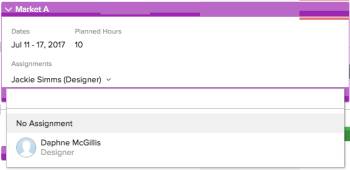

# Manually assign unassigned tasks and issues in the Scheduling areas

<!--
<p data-mc-conditions="QuicksilverOrClassic.Draft mode">NOTE: Alina: several sections ask for the screen shot to be updated - check into those notes; Alina: broken off article, needs formatting, restructuring, new linking) </p>
-->

>[!NOTE]
>
>We are no longer developing the Resource Scheduling tools and they will soon be removed from Adobe Workfront. We recommend that you use the Workload Balancer for scheduling your resources. 
>
>For information about scheduling resources using the new Workload Balancer, see the section [The Workload Balancer](../../resource-mgmt/workload-balancer/workload-balancer.md).
>
>For more information about the timeline for removing the Resource Scheduling tools and replacing them with the Workload Balancer, see [Deprecation of Resource Scheduling tools in Adobe Workfront](../../resource-mgmt/resource-mgmt-overview/deprecate-resource-scheduling.md).

In addition to assigning users to work items from the task and issue level, or in a list of tasks and issues using inline edit, you can also manage user assignments as part of the resource scheduling functionality in Adobe Workfront.

For general information about assigning tasks, see [Overview of modifying task assignments](../../manage-work/tasks/assign-tasks/modify-task-assignments-overview.md).

Using the scheduling timeline, you can manage user assignments, including how much time each user is allocated for a work item.

## Access requirements

You must have the following:

<table cellspacing="0"> 
 <col> 
 <col> 
 <tbody> 
  <tr> 
   <td role="rowheader">Adobe Workfront plan*</td> 
   <td> <p>Any</p> </td> 
  </tr> 
  <tr> 
   <td role="rowheader">Adobe Workfront license*</td> 
   <td> <p>Work or higher</p> </td> 
  </tr> 
  <tr> 
   <td role="rowheader">Access level*</td> 
   <td> <p>View or higher access to Projects, Tasks,&nbsp;and Issues</p> <p>Note: If you still don't have access, ask your Workfront administrator if they set additional restrictions in your access level. For information on how a Workfront administrator can change your access level, see <a href="../../administration-and-setup/add-users/configure-and-grant-access/create-modify-access-levels.md" class="MCXref xref">Create or modify custom access levels</a>.</p> </td> 
  </tr> 
  <tr> 
   <td role="rowheader">Object permissions</td> 
   <td> <p>Contribute permissions to projects, tasks, and issues</p> <p>For information on requesting additional access, see <a href="../../workfront-basics/grant-and-request-access-to-objects/request-access.md" class="MCXref xref">Request access to objects </a>.</p> </td> 
  </tr> 
 </tbody> 
</table>

&#42;To find out what plan, license type, or access you have, contact your Workfront administrator.

## Prerequisites before assigning tasks and issues in the Scheduling timeline

Before you begin managing user assignments as described in this section, become familiar with how resource scheduling works in Workfront, as described in [Get started with Resource Scheduling](../../resource-mgmt/resource-scheduling/get-started-resource-scheduling.md).

To successfully manage user assignments as described in this section, you must first ensure that you, your projects, and your tasks and issues meet the prerequisites described in the [Prerequisites for using the scheduling tools in Workfront](../../resource-mgmt/resource-scheduling/get-started-resource-scheduling.md#prerequisites) section in the article [Get started with Resource Scheduling](../../resource-mgmt/resource-scheduling/get-started-resource-scheduling.md).

The following sections describe how to modify user assignments manually, automatically, or by swapping assignments by user or role.

## ```<font size="5"><span style="line-height: 36px;">Manually assign unassigned tasks or issues to users</span></font>```

The scheduling timeline provides the needed visibility into which users are capable of completing the task or issue.   
For more information about the scheduling timeline, see [Get started with Resource Scheduling](../../resource-mgmt/resource-scheduling/get-started-resource-scheduling.md).

You can assign individual tasks and issues to users on the scheduling timeline from the following areas of Workfront:

* The Scheduling section under Resourcing (when scheduling resources for multiple projects).
* The Scheduling section under a project (when scheduling resources for a single project).
* The Schedule section under a team (when scheduling resources for a team).

The information displayed in the Unassigned area at the top of the scheduling timeline differs depending on the area of Workfront where you are using resource scheduling (either from the Scheduling  section (when scheduling resources for multiple projects), the  Scheduling section  (when scheduling resources for a single project), or the  Schedule section  (when scheduling resources for a team). For more information, see the section [Functionality available in the Scheduling area](../../resource-mgmt/resource-scheduling/overview-scheduling-areas.md#functionality-available-in-the-scheduling-area) in the article [Overview of the Scheduling areas](../../resource-mgmt/resource-scheduling/overview-scheduling-areas.md).

Depending on the area of Workfront where you are viewing the scheduling timeline, only some users might be eligible to be assigned work. For more information, see [Overview of the Scheduling areas](../../resource-mgmt/resource-scheduling/overview-scheduling-areas.md).

To assign unassigned tasks or issues to users on the scheduling timeline:

1. Go to the scheduling timeline for multiple projects, for an individual project, or for a team:

   * **For multiple projects**:&nbsp;  Click the **Main Menu** icon  in the upper-right corner of Workfront, click **Resourcing > Workload Balancer**, then select **Scheduling** in the upper-left drop-down menu. 
   * **For an individual project**:  Go to a project, click the **Workload Balancer** section in the left panel, then select **Scheduling** from the upper-left drop-down menu. 
   * **For a team**:  Click the **Main Menu** icon  in the upper-right corner of Workfront, then click **Teams**, select a team, click **Workload Balancer** in the left panel, then select **Scheduling** from the upper-left drop-down menu.

   

1. (Optional) Create a filter to customize what content is displayed on the scheduling timeline, as described in [Filter information in the Scheduling area](../../resource-mgmt/resource-scheduling/filter-scheduling-area.md) . [Filter information in the Scheduling area](../../resource-mgmt/resource-scheduling/filter-scheduling-area.md). For example, for issues to be displayed on the scheduling timeline, you must create a filter.

1. (Optional) Modify the date range that is displayed on the scheduling timeline, as described in [Adjust the date range of the Scheduling areas](../../resource-mgmt/resource-scheduling/get-started-resource-scheduling.md#adjusting-the-date-range-for-which-data-is-displayed) in [Get started with Resource Scheduling](../../resource-mgmt/resource-scheduling/get-started-resource-scheduling.md).

1. Do the following to assign an unassigned task or issue:

   * Drag the task or issue to the row of the user you want to assign.  
     A maximum of 10 tasks per day are displayed for a given user. You can expand the list to view all tasks currently assigned to that user. (After making assignments on the scheduling timeline, more than 10 tasks might be temporarily displayed.)  
     As you drag an item, the following information is displayed prior to releasing the task or issue and completing the assignment:
   
   * If user allocations are enabled on the scheduling timeline, the red overallocation indicators display if completing the assignment results in the user being overallocated.  
     For more information about overallocation indicators, see the section [Allocation indicators](../../resource-mgmt/resource-scheduling/manage-allocations-scheduling-areas.md#understanding-allocation-indicators) in the article [Manage user allocations in the Scheduling areas](../../resource-mgmt/resource-scheduling/manage-allocations-scheduling-areas.md).

     If the **Limit Assignments to Users with a Matching Role** option is enabled in the Settings area, users who are not eligible to receive the assignment are dimmed. If this option is disabled, all users are available to receive the assignment. The option is enabled by default.  
     For more information about this option, see [](../../resource-mgmt/resource-scheduling/assignments-regardless-of-role-or-group-scheduling-areas.md#allowing-assignmennts-to-users-regardless-of-role) in [Allow user assignments regardless of role and group membership in the Scheduling areas](../../resource-mgmt/resource-scheduling/assignments-regardless-of-role-or-group-scheduling-areas.md)

     A drop indicator displays in the row of the user. This enables you to see where an item is being assigned prior to making the assignment.

     Expand the task or issue you want to assign, click the drop-down arrow in the **Assignments** field, begin typing the name of the user you want to assign, then click the user's name in the drop-down list.  
     

1. (Conditional) After assigning an unassigned task or issue to a user, you might want to adjust the existing assignments for tasks and issues among the users on the scheduling timeline. When scheduling resources for projects (either on the Scheduling tab or the Staffing tab), only users that have the same job role can receive the assignment.   
   To re-assign a task or issue to another user, drag the task from the row of one user to the row of another user.
1. ```(Optional) Configure the number of hours each assigned user is allocated to the task or issue, as described in [Manage user allocations in the Scheduling areas](../../resource-mgmt/resource-scheduling/manage-allocations-scheduling-areas.md)``` .

