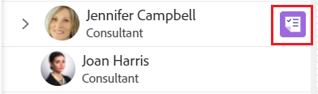
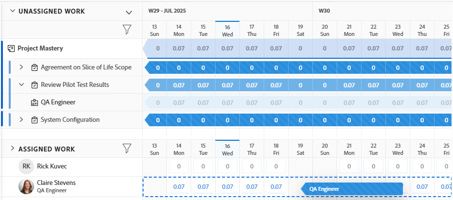
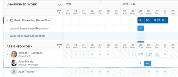

# Assign work in the Workload Balancer by dragging and dropping

{{preview-fast-release-general}}

You can assign work items using the Adobe Workfront Workload Balancer by dragging and dropping work items to the correct users.

For general information about assigning work to users using the Workload Balancer, see [Overview of assigning work in the Workload Balancer](../../resource-mgmt/workload-balancer/assign-work-in-workload-balancer.md).

## Access requirements

+++ Expand to view access requirements for the functionality in this article.

<table style="table-layout:auto"> 
 <col> 
 <col> 
 <tbody> 
  <tr> 
   <td>Adobe Workfront package</td> 
   <td>
Any
</td>
  </tr>
  <tr> 
   <td>Adobe Workfront license</td> 
   <td>
Standard

       
Plan, when using the Workload Balancer in the Resourcing area; Work, when using the Workload Balancer of a team or project
</td>
  </tr>
  <tr> 
   <td>Access level configurations</td> 
   <td> 
Edit access to the following:
 
    <ul> 
     <li>Resource Management</li> 
     <li>Projects</li> 
     <li>Tasks</li> 
     <li>Issues</li> 
    </ul>
   </td> 
  </tr> 
  <tr> 
   <td>Object permissions</td> 
   <td>Contribute permissions or higher to the projects, tasks, and issues that include Make Assignments</td> 
  </tr> 
 </tbody> 
</table>

For information, see [Access requirements in Workfront documentation](/help/quicksilver/administration-and-setup/add-users/access-levels-and-object-permissions/access-level-requirements-in-documentation.md).

+++

## Assign an item by dragging and dropping

You can assign an item from the Unassigned Work area to a user, or you can reassign an already assigned item to another user in the Assigned Work area.

1. Go to the Workload Balancer where you want to assign work.

   You can assign work to users using the Workload Balancer in the Resourcing area, at the project, or at the team level. For more information about where the Workload Balancer is located in Workfront, see [Locate the Workload Balancer](../../resource-mgmt/workload-balancer/locate-workload-balancer.md).

1. (Optional) Go to the **Unassigned Work** area and apply a filter to view tasks, issues, and role assignments that are not assigned to users

   Or

   Go to the **Assigned Work** area and expand the name of a user to view the work items assigned to them, if you want to reassign their items.

   >[!NOTE]
   >
   >Role assignments are displayed under work items in the Unassigned Work area when the Show Role Assignments setting is enabled. For more information, see [Customize the view](/help/quicksilver/resource-mgmt/workload-balancer/navigate-the-workload-balancer.md#customize-the-view) in [Navigate the Workload Balancer](/help/quicksilver/resource-mgmt/workload-balancer/navigate-the-workload-balancer.md).

1. (Conditional) In the Workload Balancer of a project, click the **Show all users** icon  to display all Workfront users.

   This displays all users that you have access to view.

   The users who are also part of the project team and are already assigned to items on the project have the project icon to the right of their name in the Assigned Work area.

   

   >[!TIP]
   >
   >* The Show all users option is available only in the Workload Balancer of a project. 
   >* Use filters to display only the  users that are important to you. For example, use a filter to display only users from your teams or groups.

1. Click the bar of a work item or role assignment that indicates either the planned or the projected timeline and drag it over the hours for a user in the **Assigned** area.

   The user you hover over to drop the work item to is highlighted.

   When dragging and dropping role assignments, the user is highlighted in orange if their current role does not match the role assignment. You can still assign the work to the user when the roles do not match.

   >[!TIP]
   >
   >The Planned Hours for the user you're hovering over update in real time with the number of daily Planned Hours from the work item, to indicate what the impact of adding a new item might be to their overall allocation.

   Sample image in the Preview environment:
   

   Sample image in the Production environment:
   

1. When you are ready, drop the selected work item or role assignment in the same line as the user's name in the Assigned Area. The item is assigned and the allocated Planned Hours are updated for the user with the new hours from the work item.

   If the Show Role Assignments setting is not enabled, and the work item was assigned to a job role that the user cannot fulfill, the item displays under the user's name in the Assigned Work area. It also remains in the Unassigned Work area to indicate that the job role associated with it has not been replaced by a user yet.

   >[!TIP]
   >
   >* If you enabled Group by Project in the Settings area, the assigned task displays under the corresponding project. If the setting is disabled, the assigned task displays in the user area. 
   >
   >
   >     The item displays according to the Workload Balancer criteria for sorting work items. For more information, see [Navigate the Workload Balancer](../../resource-mgmt/workload-balancer/navigate-the-workload-balancer.md).
   >
   >
   >* If you enabled Show all users in the Workload Balancer of a project and assigned items to users who were not previously assigned to items on the project, the users are added to the Project Team. For more information, see [Manage project team](../../manage-work/projects/planning-a-project/manage-project-team.md).

1. (Optional) Click the bar of a work item under the name of a user in the Assigned Work area and drag it then drop it over the Unassigned Work area to unassign it. The item is unassigned from the user, but it might still be assigned to a job role in which case it displays in the Unassigned Work area. If the item is assigned to another user, it remains in the Assigned Work area under the name of the user who is still assigned. 
1. (Optional) Click the **Show allocations icon** , then click the **More menu**  > **Edit allocations**. 

   <!--
   (make sure these are still called this, and that the icon has not changed)
   -->
   Or

   Double-click a daily or weekly allocation to modify the amount of time the user is allocated to the work item.

   For information about modifying user allocations in the Workload Balancer, see the "Modify user allocations" section in the article [Manage user allocations in the Workload Balancer](../../resource-mgmt/workload-balancer/manage-user-allocations-workload-balancer.md).

   For information about removing assignments from a work item using the Workload Balancer, see [Unassign work in the Workload Balancer](../../resource-mgmt/workload-balancer/unassign-work-in-workload-balancer.md).

