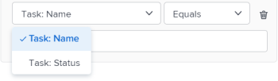
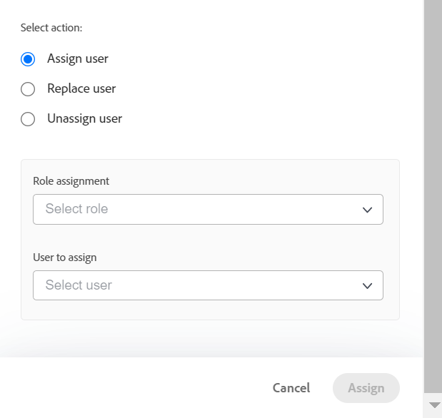
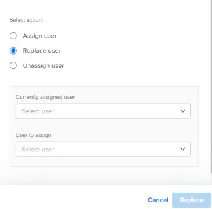

# Assign work in bulk using the Workload Balancer

<!--Audited: 07/2024-->

You can assign resources to multiple tasks and issues in bulk using the Adobe Workfront Workload Balancer.

For general information about assigning work to users using the Workload Balancer, see [Overview of assigning work in the Workload Balancer](../../resource-mgmt/workload-balancer/assign-work-in-workload-balancer.md).

## Access requirements

+++ Expand to view access requirements for the functionality in this article.

You must have the following access to perform the steps in this article:

<table style="table-layout:auto"> 
 <col> 
 <col> 
 <tbody> 
  <tr> 
   <td role="rowheader">Adobe Workfront plan</td> 
   <td> 
Any 
 </td> 
  </tr> 
  <tr> 
   <td role="rowheader">Adobe Workfront license</td> 
   <td>
New: Standard

       
or

       
Current: Plan, when using the Workload Balancer in the Resourcing area; 
       Work, when using the Workload Balancer of a team or project
</td>
  </tr>
  <tr> 
   <td role="rowheader">Access level configurations</td> 
   <td> 
Edit access to the following:
 
    <ul> 
     <li>Resource Management</li> 
     <li>Projects</li> 
     <li>Tasks</li> 
     <li>Issues</li> 
    </ul>
   </td> 
  </tr> 
  <tr> 
   <td role="rowheader">Object permissions</td> 
   <td>Contribute permissions or higher to the projects, tasks, and issues that include Make Assignments</td> 
  </tr> 
 </tbody> 
</table>

For more detail about the information in this table, see [Access requirements in Workfront documentation](/help/quicksilver/administration-and-setup/add-users/access-levels-and-object-permissions/access-level-requirements-in-documentation.md).

+++

## Considerations for making bulk assignments in the Workload Balancer

* You can quickly manage user assignments for multiple tasks and issues across one or more projects. Changes in assignments are visible in the Workload Balancer immediately. 
* You cannot assign resources to work items that are completed, or to items that are on a completed project. 
* You can do the following when assigning users in bulk:

   * Assign a user to all work items currently assigned to a job role.
   * Replace user assignments between users.
   * Unassign a user from all their work items.

**EXAMPLES** 

* You are responsible for making user assignments on several new projects. The projects were originally created from templates and job roles are already assigned to the various tasks within the projects. You want to assign a specific user, Jackie Simms, to all tasks that are currently assigned to a job role. You can use the Assign function to assign these tasks to Jackie Simms.
* 45 tasks across 3 different projects are assigned to Jackie Simms. Jackie leaves the organization, and now you need to reassign her tasks to another user. You can use the Replace function to assign these tasks to the new person. 
* 10 tasks across 2 different projects are assigned to another user, Rick Kuvec. You realize that Rick was assigned to these tasks in error, but you are not sure who they need to be assigned to at this time. You need to unassign Rick to all the tasks at the same time. You can use the Unassign function to remove Rick from these tasks.

## Assign work in bulk in the Workload Balancer

1. Go to the Workload Balancer where you want to assign work.

   You can assign work to users using the Workload Balancer in the Resourcing area, at the project, or at the team level. For more information about where the Workload Balancer is located in Workfront, see [Locate the Workload Balancer](../../resource-mgmt/workload-balancer/locate-workload-balancer.md).

1. Click **Bulk Assignments**  at the top of the Workload Balancer.

   The Bulk Assignments panel opens to the right of the Workload Balancer. 

1. (Conditional) If you are accessing the Workload Balancer from the Resourcing area or for a team, expand the **Project: Name** drop-down menu and use the filter modifiers to select the project or projects that you want to make assignments for. You can select projects by Name (this is the default option) or by Status. 

   For information about Workfront filter modifiers, see [Filters and condition modifiers](../../reports-and-dashboards/reports/reporting-elements/filter-condition-modifiers.md). 

   >[!NOTE]
   >
   >The Project Name is selected by default when you access the Workload Balancer for a project.

   

1. (Optional) Click **Select project tasks** to select the task or tasks that you want to make assignments for, then in the **Task: Name** drop-down menu, select tasks by Name (this is the default option) or Status and use the filter modifiers to search for specific tasks. 

   For information about Workfront filter modifiers, see [Filters and condition modifiers](../../reports-and-dashboards/reports/reporting-elements/filter-condition-modifiers.md).

   >[!NOTE]
   >
   >You cannot select tasks in a Complete status.

   

   >[!TIP]
   >
   >Leave this selection blank if you want to make bulk assignments for issues as well as tasks.

1. (Optional) Click the **Delete** icon  next to one of the selected criteria

   Or

   Click **Clear all** in the upper-right corner of the Bulk Assignments panel to remove all selections. 

1. Select one of the following options and continue with the steps described below:

   * [Assign user](#assign-user) 
   * [Replace user](#replace-user) 
   * [Unassign user](#unassign-user)

   >[!TIP]
   >
   >If no items match the selected filters, these options are dimmed.

### Assign user {#assign-user}

When you assign a user using Bulk Assignments in the Workload Balancer, the following things occur:

* A user is assigned to all work items currently assigned to a specified role within the selected projects.
* The user is not assigned to the following types of work items:

   * Items that are already assigned to a user.
   * Completed items.

* If the user you selected is not associated with the specified role, the role is replaced by the user in the user's Primary Role.

To assign a user to work items previously assigned to job roles:

1. Start assigning work items using Bulk Assignments in the Workload Balancer as described above and select **Assign**. 

1. In the **Role assignment** field, click the drop-down arrow to choose from a list of roles. Only roles currently assigned within the specified projects are displayed. This is a required field. 

   

1. In the **User to assign** field, click the drop-down arrow to choose from a list of suggested users or to type another user's name.

   Select users from the following areas:

   * **Suggested Assignments**: Users who can fulfill the selected role and who match the criteria for Smart Assignments. For more information, see [Smart assignments overview](../../manage-work/tasks/assign-tasks/smart-assignments.md).
   * **Other Assignments**: All users in the system who can fulfill the selected role. 
   
      >[!TIP]
      >
      >Only the first 50 users are listed in the Other Assignments area.

   After selecting a user, Workfront displays a note about the number of items where the user you specified will be assigned and what job role they will replace.

   >[!TIP]
   >
   >All the roles of the user display in the list, under the user's name.

1. Click **Assign**.

   The specified roles are replaced with the users that you selected.

   You receive a confirmation about how many work items have had the selected role replaced with the selected user.

   

### Replace user {#replace-user}

You can replace a user who is already assigned to work items with another user in the selected projects.

When you replace a user with another user using Bulk Assignments in the Workload Balancer, the following things occur:

* The replacement user is assigned to all work items currently assigned to an original user within the selected projects.

* The new user is not assigned to any work items that are already marked Complete.
* If the role associated with the first user does not match any of the roles of the second user, the second user is assigned in their Primary Role.

To replace a user with another user:

1. Start assigning work items in the Workload Balancer as described above and select **Replace**. 
1. In the **Currently assigned user** field, click the drop-down arrow to choose from a list of users. Only users currently assigned to incomplete work items within the specified projects are displayed. This is a required field.

   

1. In the **User to assign** field, click the drop-down arrow to choose from a list of suggested users or to type another user name. Users listed in the list by default match the criteria for Smart Assignments. For more information, see [Smart assignments overview](../../manage-work/tasks/assign-tasks/smart-assignments.md).

   Workfront displays a note about the number of items where the currently assigned user will replace the second user and which roles they will replace.

   

1. Click **Replace**.

   The first user selected is replaced by the second user in all work items from the selected project.

   You receive a confirmation about how many work items have had the original user assignment replaced with the selected second user.

### Unassign user {#unassign-user}

You can unassign a user from all work items that the user is assigned to in the selected projects.

When you unassign a user from all their assignments using Bulk Assignments in the Workload Balancer, the following things occur:

* The specified user is removed from all the work items that they are assigned to.
* If the unassigned user is associated with job roles, the job roles remain assigned to the work items when the user is removed.

* If the specified user is assigned to work items that are completed, the user remains assigned to those work items.

For more information about user and job role assignments, see [Overview of assigning work in the Workload Balancer](../../resource-mgmt/workload-balancer/assign-work-in-workload-balancer.md).

To unassign a user from work items in the selected projects or for the selected tasks or issues where they are assigned:

1. Start assigning work items in the Workload Balancer as described above and select **Unassign**.  

1. In the **User to unassign** field, click the drop-down arrow to choose from a list of users. Only users currently assigned to incomplete work items within the specified projects display. This is a required field.

   

   Workfront displays a note about the number of items where the currently assigned user will be unassigned.

   

1. Click **Unassign**.  
   You receive a confirmation about the number of work items where the specified user was removed.

 
