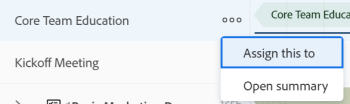
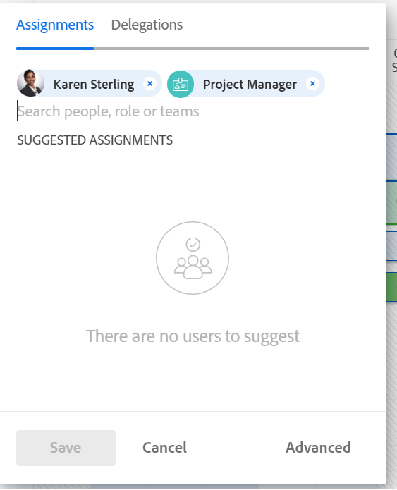

# Assign work manually using the Workload Balancer

You can manually assign work items to users using the Adobe Workfront Workload Balancer.

For general information about assigning work to users using the Workload Balancer, see [Overview of assigning work in the Workload Balancer](../../resource-mgmt/workload-balancer/assign-work-in-workload-balancer.md).

## Access requirements

You must have the following access to perform the steps in this article:

<table style="table-layout:auto"> 
 <col> 
 <col> 
 <tbody> 
  <tr> 
   <td role="rowheader">Adobe Workfront plan*</td> 
   <td> 
Any 
 </td> 
  </tr> 
  <tr> 
   <td role="rowheader">Adobe Workfront license*</td> 
   <td> 
Plan, when using the Workload Balancer in the Resourcing area

   
Work, when using the Workload Balancer of a team or project

 </td> 
  </tr> 
  <tr> 
   <td role="rowheader">Access level*</td> 
   <td> 
Edit access to&nbsp;the following:
 
    <ul> 
     <li> 
Resource Management
 </li> 
     <li> 
Projects
 </li> 
     <li> 
Tasks
 </li> 
     <li> 
Issues
 </li> 
    </ul> 
<b>NOTE</b> 
    
   If you still don't have access, ask your Workfront administrator if they set additional restrictions in your access level. For information on how a Workfront administrator can change your access level, see <a href="../../administration-and-setup/add-users/configure-and-grant-access/create-modify-access-levels.md" class="MCXref xref">Create or modify custom access levels</a>.
 </td> 
  </tr> 
  <tr> 
   <td role="rowheader">Object permissions</td> 
   <td> 
Contribute permissions or higher to the projects, tasks, and issues that include Make Assignments
 
For information on requesting additional access, see <a href="../../workfront-basics/grant-and-request-access-to-objects/request-access.md" class="MCXref xref">Request access to objects </a>.
 </td> 
  </tr> 
 </tbody> 
</table>

&#42;To find out what plan, license type, or access you have, contact your Workfront administrator.

## Manually assign work in the Workload Balancer

You can assign work items that have not yet been assigned to a user or reassign items that have been assigned to users in the Workload Balancer.

1. Go to the Workload Balancer where you want to assign work.

   You can assign work to users using the Workload Balancer in the Resourcing area, at the project, or at the team level. For more information about where the Workload Balancer is located in Workfront, see [Locate the Workload Balancer](../../resource-mgmt/workload-balancer/locate-workload-balancer.md).

1. (Optional) Go to the **Unassigned Work** area and apply a filter to view tasks or issues

   Or

   Go to the **Assigned Work** area and expand the name of a user to view the work items assigned to them, if you want to reassign their items.

1. Click the **More menu**  to the left of a work item name, then click **Assign this to**.

   

   >[!TIP]
   >
   >You can also use the following shortcuts to assign tasks or issues: 
   >
   >* In Windows: CTRL+click the task or issue bar. 
   >* In Mac: CMD+click the task or issue bar. 

1. Do one of the following:

   * Start typing the name of a user, job role, or team that you want to assign to the item in the **Search people, role or teams** field, select it when it displays in the list, then click **Save**.

   >[!TIP]
   >
   >When adding a user, notice the avatar, the user's Primary Role, and their email address to distinguish between users with identical names. 
   >
   >Users must be associated with at least one job role to view it as you add them.     
   >
   > You must have the View Contact Info setting enabled in your access level for Users to view users' emails. For information, see [Grant access to users](../../administration-and-setup/add-users/configure-and-grant-access/grant-access-other-users.md). 

     

      >[!TIP]
      >
      > If your Workfront or group administrator enabled delegations in your environment, use the Assignments tab to assign users to the task or issue. Use the Delegations tab to view users who are delegated to the work item. For information about delegating work, see [Manage task and issue delegation](../../manage-work/delegate-work/how-to-delegate-work.md). 

     This assigns or reassigns the work item to the specified assignees.

     If you assign an item to just a team or a job role, the item displays only in the Unassigned Work area. You must assign work items to users in order to display them in the Assigned Work area of the Workload Balancer.

     >[!TIP]
     >
     >You can assign multiple users, job roles, or teams. You can assign only active users, job roles, and teams.
     >
     >
     >If a user, job role, or a team was assigned before they were deactivated, they remain assigned to the work item. In this case, we recommend the following: 
     >
     >   
     >   
     >   * Reassign the work item to active resources. 
     >   * Associate the users in a deactivated team with an active team and reassign the work item to the active team. 
     >   
     >

   * Click **Advanced** to access Advanced Assignments.

     For more information about making Advanced Assignments, see [Create advanced assignments](../../manage-work/tasks/assign-tasks/create-advanced-assignments.md).

1. (Optional) Click the **Show allocations icon** , then click the **More menu**  > **Edit allocations**.

   Or

   Double-click a daily or weekly allocation to modify the amount of time the user is allocated to the work item.

   For information about modifying user allocations in the Workload Balancer, see the "Modify user allocations" section in the article [Manage user allocations in the Workload Balancer](../../resource-mgmt/workload-balancer/manage-user-allocations-workload-balancer.md).

   For information about removing assignments from a work item using the Workload Balancer, see [Unassign work in the Workload Balancer](../../resource-mgmt/workload-balancer/unassign-work-in-workload-balancer.md).

   &nbsp;
