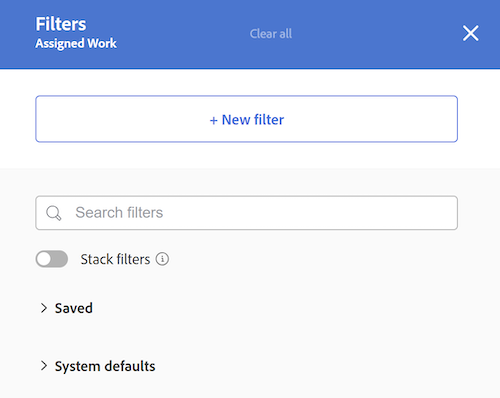
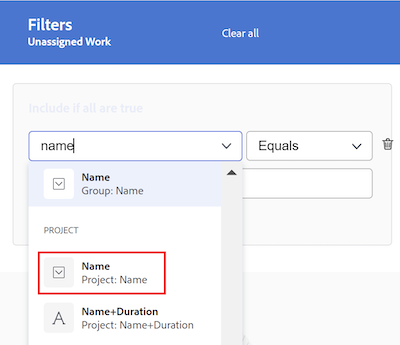
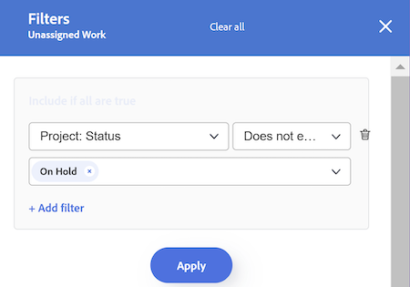
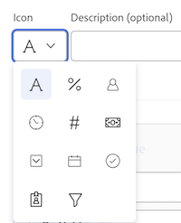
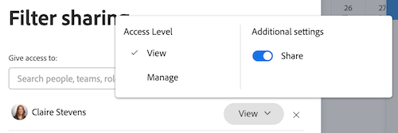

# Filter information in the Workload Balancer

<!-- Audited: 6/2025 -->

<!--
(when they add custom fields to fitlering, add the caveat you added for the Resource Planner : only field NAMES and not LABELS are to be found in the drop-down >> ADD THIS IN THE STEP BELOW WHEN ADDING A FILTER)
-->

As a resource manager, you can use the Workload Balancer to view and manage the workload of your users. For more general information about the Workload Balancer, see the following articles:

* [Workload Balancer overview](../../resource-mgmt/workload-balancer/overview-workload-balancer.md) 
* [Navigate the Workload Balancer](../../resource-mgmt/workload-balancer/navigate-the-workload-balancer.md)

>[!IMPORTANT]
>
>To efficiently find work items and to focus on the users or items you manage, we strongly recommend that you use filters in the Workload Balancer. This allows you to display the correct information before you start managing your resources' assignments.
>
>When you navigate away from the Workload Balancer after saving and applying a new filter, the filter is still applied even after you log off and log back on.

This article contains information about filters in the Workload Balancer. For information about filters in Workfront, see [Filters overview](../../reports-and-dashboards/reports/reporting-elements/filters-overview.md).

## Access requirements

<table style="table-layout:auto"> 
 <col> 
 <col>
 <tbody> 
  <tr> 
   <td>Adobe Workfront package</td> 
   <td>
Any
</td>
  </tr>
  <tr> 
   <td>Adobe Workfront license</td> 
   <td>
Standard

       
Plan, when using the Workload Balancer in the Resourcing area; Work, when using the Workload Balancer of a team or project
</td>
  </tr>
  <tr> 
   <td>Access level configurations</td> 
   <td> 
View or higher access to the following:
 
    <ul> 
     <li>Resource Management</li> 
     <li>Projects</li> 
     <li>Tasks</li> 
     <li>Issues</li>
     <li>Filters, Views, and Groupings</li>
    </ul>
    
Edit access to Filters, Views, and Groupings when building or editing filters 
 </td>
  </tr> 
  <tr> 
   <td>Object permissions</td> 
   <td> 
View or higher permissions to the projects, tasks, issues

   
Manage permissions to the filters you want to edit or delete

   </td> 
  </tr> 
 </tbody> 
</table>

For information, see [Access requirements in Workfront documentation](/help/quicksilver/administration-and-setup/add-users/access-levels-and-object-permissions/access-level-requirements-in-documentation.md).

+++

## Overview of filters in the Workload Balancer

Consider the following when working with filters in the Workload Balancer:

* Depending on where you access the Workload Balancer from, Workfront might already be filtering the information for you. For more information, see the following section in this article: [Pre-applied filters in the Workload Balancer](#pre-applied-filters-in-the-workload-balancer).
* You can create and apply a filter without saving it, or you can save a filter to reuse at a later time. 
* When you apply a filter without saving it, you can revert to the original lists by refreshing your page. 
* You can view filters you created or filters that other users created and shared with you. 
* When you delete or edit a shared filter, the filter is also deleted or edited for everyone you've shared it with.
* When you create filters in the Workload Balancer in one area, they aren't available in other areas. 

  For example, filters created in the Resourcing area are not available in a project or team's Workload Balancer.

  For information about where to locate the Workload Balancer, see [Locate the Workload Balancer](../../resource-mgmt/workload-balancer/locate-workload-balancer.md).

* You can only view items that match the selected filters if they also match the dates in the timeline displayed on the Workload Balancer screen.

## Pre-applied filters in the Workload Balancer {#pre-applied-filters-in-the-workload-balancer}

The Workload Balancer displays information in 2 separate areas:

* **The Unassigned Work area**: Work items that aren't yet assigned to users. 
* **The Assigned Work area**: Work items that are assigned to users.

  For information about what displays in each of the areas, see [Navigate the Workload Balancer](../../resource-mgmt/workload-balancer/navigate-the-workload-balancer.md).

>[!IMPORTANT]
>
>Each area of the Workload Balancer has its own set of filters which work independently from one another. You must configure both filters to indicate what information you want to see in each area.

The Workload Balancer displays users and their work items. 
The work items assigned to the users only display when the dates of the items match the time frame displayed on the screen. 

Depending on where you access the Workload Balancer from, the Unassigned and Assigned areas are already filtered by certain criteria, as described in the following table:

<table style="table-layout:auto"> 
 <col> 
 <col> 
 <col> 
 <tbody> 
  <tr> 
   <td role="rowheader"><strong>Workfront area where you access the Workload Balancer</strong></td> 
   <td><b>Items that display in the Unassigned Work area by default</b> </td> 
   <td><b>Items that display in the Assigned Work area by default</b> </td> 
  </tr> 
  <tr> 
   <td role="rowheader">The Resourcing area</td> 
   <td>No items display here by default. You must customize filters to view work items in this area.</td> 
   <td>Users who are members of any of your teams and their work items. </td> 
  </tr> 
  <tr> 
   <td role="rowheader">A team</td> 
   <td>Work items that are assigned to the team or the team and a job role. </td> 
   <td> 
Users who are members of the selected team and their work items.
 </td> 
  </tr> 
  <tr> 
   <td role="rowheader">A project</td> 
   <td> 
Unassigned work items or items assigned to teams or job roles in the selected project display in this area.
 </td> 
   <td> 
Users that are assigned to at least one work item on the selected project and their work items on the project when the <b>This project's work items</b> system default filter is selected. 
 
   
   
When the <b>This project's work items</b> system default filter is deselected, the Assigned Work area of a project displays all the work items of the users assigned to at least one item on the selected project.    This filter is deselected by default.
 
   
   
 <b>Note</b>: You can enable the <b>Show all users</b> option in the project's Workload Balancer to display all users in the system. For more information, see <a href="../workload-balancer/navigate-the-workload-balancer.md" class="MCXref xref">Navigate the Workload Balancer</a>
 
   
   </td> 
  </tr> 
 </tbody> 
</table>

## Create Workload Balancer filters

The process for creating filters for the Unassigned Work and Assigned Work areas in the Workload Balancer is identical regardless of where you access the Workload Balancer from. For information about locating the Workload Balancer, see [Locate the Workload Balancer](../../resource-mgmt/workload-balancer/locate-workload-balancer.md).

You can create a filter from scratch or edit one of the predefined filters. For information about existing filters that you can edit, see the [Edit an existing filter in the Workload Balancer](#edit-an-existing-filter-in-the-workload-balancer) section in this article.

1. Go to the Workload Balancer.

   For information about accessing the Workload Balancer, see [Navigate the Workload Balancer](../../resource-mgmt/workload-balancer/navigate-the-workload-balancer.md).

1. In the upper-right corner of either the **Unassigned Work** or the **Assigned Work** areas, click the **Filter** icon . The **Filters** box displays on the right, and the name of the area you are creating the filter for displays in the header.

   

1. (Optional and conditional) If you access the Workload Balancer in the **Resourcing** area, the predefined Default filter might already be applied to the **Assigned Work** area. You can edit and save a copy of the Default filter.

   >[!TIP]
   >
   >The Default filter displays users that belong to any of your teams and their work items. You can edit a copy of this filter.

   If you access the [!UICONTROL Workload Balancer] from a project, the **This project's work items** filter might already be applied. This displays only work items assigned to users in this project. You can duplicate and save a copy of this filter. 
   
   By default, the project's [!UICONTROL Workload Balancer] displays all work items assigned to all users on the project.

1. Click **New filter**.

1. To create a filter, do the following:

   1. Select a field name in the first drop-down menu or click **Browse fields** at the bottom of the drop-down to type the name of a field that doesn't display by default.

      >[!IMPORTANT]
      >
      >When referencing custom fields, you must type the field name and not the field label. The field label displays on a custom form attached to an object. For information about the difference between the label and the name of a custom field, see [Create a custom form](/help/quicksilver/administration-and-setup/customize-workfront/create-manage-custom-forms/form-designer/design-a-form/design-a-form.md).

   1. (Conditional) If you clicked **Browse fields**, type the name of a field in the **Search** field and select it when it displays in the list.

      

      >[!TIP]
      >
      >You can select a field from the following sections:
      >
      >* **Recent selections**: the fields you have recently filtered for.
      >* **Suggested**: the fields most commonly used.
      

   1. Select a modifier from the second drop-down menu. For information about Workfront filter modifiers, see [Filters and condition modifiers](../../reports-and-dashboards/reports/reporting-elements/filter-condition-modifiers.md). 
   1. Select or type a value for the field you are filtering for. 
   
      >[!NOTE]
      >
      > When you want to display work objects from a specific portfolio, you can apply the following filter: Portfolio ID Equals < PORTFOLIO NAME >.
      >
      >
      >
      >To exclude projects in a status of On Hold, you must apply the following filter: Project: Status Does not equal On Hold. This prevents work items in On Hold projects from displaying in the Workload Balancer.
      >
      >

   1. (Optional) Click the **Delete** icon  to remove a filter criteria.

1. (Optional) Click **Add filter** to add another filter criteria, then repeat the actions from step 4. 

   <!--(NOTE: ensure this stays correct)-->

1. Click **Apply** to apply the results of the filter to the selected Workload Balancer area without saving it. The list of work items updates on the left.

   >[!IMPORTANT]
   >
   >Results display in the Workload Balancer when all the filter statements that you added are simultaneously true.

   The filter is preserved until you refresh the page, and the **Apply** button is replaced with a **Save as new** button. 

1. Click **Save as new** to save the filter for future use.

   >[!TIP]
   >
   >Clicking **Cancel** at any time takes you back to the filter building area.

1. In the **Untitled Filter** field, enter the new filter name. 
1. (Optional) Select an icon for the new filter from the **Icon** drop-down menu.

   

1. (Optional) Add a filter **Description**. The description displays under the filter name in the filter list. 
1. Click **Save**. The saved filter displays in the **My filters** area of the filter box.

   For information about applying saved filters, see the section [Delete a saved filter in the Workload Balancer](#delete-a-saved-filter-in-the-workload-balancer) in this article. 

1. (Conditional) Mouse over the **Filter** icon  in the upper-right corner of the **Unassigned Work** or the **Assigned Work** areas to display a tooltip with the name or the number of filters that are currently applied.

   

## Duplicate a filter

You can duplicate and edit a filter to create a new one.

1. Go to the Workload Balancer.

   For information about accessing the Workload Balancer, see [Navigate the Workload Balancer](../../resource-mgmt/workload-balancer/navigate-the-workload-balancer.md).

1. In the upper-right corner of either the **Unassigned Work** or the **Assigned Work** areas, click the **Filter** icon .  The **Filters** box displays on the right, and the name of the area you're duplicating the filter for displays in the header.

1. Hover over an existing filter, then click the **More** menu .
1. Click **Duplicate**.

   >[!TIP]
   >
   > While editing a filter, you can click the **More** menu  in the lower-left corner of the **Edit Filter** box, then click **Duplicate**.

1. Edit the following information for the duplicated filter:

   * Name
   * Icon
   * Description
   * Any of the fields, modifiers, or values.

1. (Optional) Click **Add filter** to add more statements to the duplicated filter. 
1. Click **Save** to save the duplicated filter in the **My filters** area. The original filter remains unchanged and the duplicated filter is saved as a new filter.

## Edit an existing filter in the Workload Balancer {#edit-an-existing-filter-in-the-workload-balancer}

You can edit a saved filter in the Workload Balancer.

>[!TIP]
>
>When you edit a filter shared with others, they will also see the changes you make.

1. Go to the Workload Balancer.

   For information about accessing the Workload Balancer, see [Navigate the Workload Balancer](../../resource-mgmt/workload-balancer/navigate-the-workload-balancer.md).

1. In the upper-right corner of either the **Unassigned** or **Assigned Work** areas, click the **Filter** icon  . The filter builder displays on the right. 

1. Mouse over the filter you want to edit, then click the **Edit** icon .

1. Do one of the following:

   * Modify any of the filter statements.
   * Click **Add filter** to add new filter statements.
   * Click the **Delete** icon  to remove existing filter statements.

1. (Optional) Click **Apply**. The results update in the Workload Balancer on the left to illustrate the changes you made to the filter.

1. Click **Save**. The results update in the Workload Balancer on the left and the filter is updated with the new information you selected.

## Delete a saved filter in the Workload Balancer {#delete-a-saved-filter-in-the-workload-balancer}

Consider the following before deleting a filter:

* You can't recover deleted filters.
* You can't delete predefined filters. 
* You can't delete an unsaved filter. They're removed automatically after logging out and logging back in to Workfront. 
* When you delete a shared filter, it's also deleted for all users that it's shared with. 
* After you delete all saved filters, the Workload Balancer displays according to the original defaults.

>[!NOTE]
>
>When you delete a filter shared with others, it will also be deleted for them.

1. Go to the Workload Balancer.

   For information about accessing the Workload Balancer, see [Navigate the Workload Balancer](../../resource-mgmt/workload-balancer/navigate-the-workload-balancer.md).

1. In the upper-right corner of either the **Unassigned Work** or **Assigned Work** areas, click the **Filter icon** . The **Filters** box displays on the right. 

1. Mouse over a filter, click the **More** menu , then click **Delete**.

   >[!TIP]
   >
   >While editing a filter, you can click the **More** menu  in the lower-left corner of the **Edit Filter** box, then click **Delete**.

1. (Optional) Click **Cancel** to cancel the deletion and return to the list of filters. 
1. Click **Delete** to confirm the deletion. The filter is deleted for you and all users who have permissions to it.

## Share a filter in the Workload Balancer

You can share a filter that you created or that was shared with you by other users.

Consider the following when sharing filters in the Workload Balancer:

* You can share filters with active users, teams, roles, and companies or you can make them visible for everyone in your Workfront instance. 
* Filters you share in the Resourcing area are not visible in the Workload Balancer of a project or a team. 
* Workload Balancer filters that you share with others are not visible in other areas of Workfront.

To share a filter:

1. Go to the Workload Balancer.

   For information about accessing the Workload Balancer, see [Navigate the Workload Balancer](../../resource-mgmt/workload-balancer/navigate-the-workload-balancer.md).

1. In the upper-right corner of either the **Unassigned Work** or **Assigned Work** areas, click the **Filter icon** . The **Filters** box displays on the right. 

1. Hover over a filter, then click the **More** menu .

1. Click **Share**. The **Filter sharing** box displays. 

   >[!TIP]
   >
   > While editing a filter, you can click the **More** menu  in the lower-left corner of the **Edit Filter** box, then click **Share**.

1. In the **Give access to** field, type the names of users, teams, roles, groups, or companies that you want to share the filter with, and then select them when they appear.

1. (Optional) To edit the filter permissions for an entity, click the right-pointing arrow next to their name, then select either **View** or **Manage**.

   

1. (Optional) Enable or disable the additional permissions for an entity by doing one of the following:

   1. Click **View** and disable the **Share** option. This is enabled by default.
   
   1. Click **Manage** and enable either the **Share** or **Delete** option. 

   >[!TIP]
   >
   >Users can't receive a higher permission than their access level. If they don't have access to Edit filters in their access level, they can't receive permissions to manage a filter. Workfront disables the Manage option for these users.

1. Click **Share**. The filter is shared with the entities you specified, and the shared filter displays in the **Shared with me** area of the **Filters** box.

   

<!--   

## Add a filter to your favorites list

You can mark a filter as a favorite for quicker access to it. 

The filters that you mark as a favorite do not count towards your system Favorites list. There is no limit for how many filters you can favorite. 

1. Go to the Workload Balancer
1. Click the **Filter** icon  in the upper-right corner of the **Unassigned Work** or **Assigned Work** areas. The filter builder box displays on the right. 
1. Mouse over a filter, then click the **Favorite** . 
(NOTE: insert screen shot here with Favorite as part of this menu - same as above ones but with Favorite)
1. The filter is listed in the **Favorited** section inside the filter panel. 
1. (Optional) Click the **Favorite** icon again to remove the filter from the list of favorite filters
(I logged bugs for "Favorited" and "Unfavorite" wordings - make sure these have not updated)
-->
