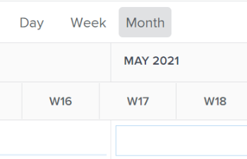

# Manage user allocations in the Workload Balancer

{{highlighted-preview}}

As a Resource Manager, you can assign work to users and manage their daily, weekly, or monthly allocations from the Workload Balancer to ensure they are allocated an amount of hours that fits in their available schedules.

## Access requirements {#access-requirements}

You must have the following:

<table style="table-layout:auto"> 
 <col> 
 <col> 
 <tbody> 
  <tr> 
   <td role="rowheader">Adobe Workfront plan*</td> 
   <td> 
Any 
 </td> 
  </tr> 
  <tr> 
   <td role="rowheader">Adobe Workfront license*</td> 
   <td> 
Plan, when using the Workload Balancer in the Resourcing area

   
Work, when using the Workload Balancer of a team or project

 </td> 
  </tr> 
  <tr> 
   <td role="rowheader">Access level configuration*</td> 
   <td> 
Edit access to the following:
 
    <ul> 
     <li> 
Resource Management
 </li> 
     <li> 
Projects
 </li> 
     <li> 
Tasks
 </li> 
     <li> 
Issues
 </li> 
    </ul> 
If you still don't have access, ask your Workfront administrator if they set additional restrictions in your access level. For information on how a Workfront administrator can change your access level, see <a href="../../administration-and-setup/add-users/configure-and-grant-access/create-modify-access-levels.md" class="MCXref xref">Create or modify custom access levels</a>.
 </td> 
  </tr> 
  <tr> 
   <td role="rowheader">Object permissions</td> 
   <td> 
Contribute permissions or higher that include Make Assignments to the tasks and issues that you want to manage allocations for. 
 
Or 
 
Manage permissions to the tasks that you want to update the Planned Hours for, in addition to updating allocations. For information about updating Planned Hours in the Workload Balancer, see the <a href="#update-task-planned-hours-when-managing-user-allocations">Update task Planned Hours when managing user allocations</a> section in this article. 
 
For information about tasks permissions, see <a href="../../workfront-basics/grant-and-request-access-to-objects/share-a-task.md">Share a task </a> and for information about issue permissions, see <a href="../../workfront-basics/grant-and-request-access-to-objects/share-an-issue.md">Share an issue </a>. 
 
For information on requesting additional access, see <a href="../../workfront-basics/grant-and-request-access-to-objects/request-access.md">Request access to objects </a>.
 </td> 
  </tr> 
 </tbody> 
</table>

*To find out what plan, license type, or access you have, contact your Workfront administrator.

## Understand user allocations

User allocations are amounts of hours that indicate the time that a user should spend on one given day or weekday, week, or month to complete the work item. They are included in the Planned Hours of the work item.

This article describes how to update daily, weekly, or monthly hourly allocations for users assigned to tasks or issues. For information about managing overall allocations for users and job roles to tasks, see [Manage user and role allocation hours on tasks](../../manage-work/tasks/assign-tasks/manage-allocation-hours-on-tasks.md).

* [User allocation overview](#user-allocation-overview) 
* [Criteria that reset user allocations](#criteria-that-reset-user-allocations)

### User allocation overview {#user-allocation-overview}

You can display user allocation as hours or as a percentage value in the Workload Balancer. You can adjust hours or percentages.

User allocations are included in the number of Planned Hours of a work item. For information about Planned Hours, see [Planned Hours overview](../../manage-work/tasks/task-information/planned-hours.md).

The task Planned Hours are distributed equally between all the days within the Duration of the task for the user assigned to the task. For example, if a task has a Duration of 5 days and a total of 10 Planned Hours, the number of daily allocations for the task is 2 hours. The weekly allocation is 10 hours. This means, that a user is allocated to work on the task for 2 hours each day. However, you can manually change the daily allocation for the user using the Workload Balancer.

>[!CAUTION]
>
>The Workload Balancer displays only up to 1000 Planned Hours per work item and up to 1000 days of an item's duration. The allocations in the Workload Balancer display as zero after the 1000 hour or 1000 day limit is reached. We recommend dividing tasks in smaller subtasks to accommodate for a larger number of Planned Hours or for Durations of more than 1000 days.

Consider the following when locating daily, weekly or monthly allocations for tasks or issues in the Workload Balancer:

* You can view daily, weekly, and monthly allocations of the users to their work items. Enable the Week or Month view to display weekly or monthly allocations. 
* You can use the Workload Balancer to modify the daily, weekly or monthly allocation of the users to the tasks or issues. For information about adjusting the view of the Workload Balancer, see [Navigate the Workload Balancer](../../resource-mgmt/workload-balancer/navigate-the-workload-balancer.md).

  >[!NOTE]
  >
  >We recommend that you make a decision which time frame (daily, weekly, or monthly) you want to always use when managing user allocations and not switch between them for the same work items. Updating weekly allocations for the same user for which you previously updated daily allocations changes the daily allocation for the user.

* You can update allocations for both working and non-working days. 
* The time stamps for the Planned Start and Planned Completion Dates of the work items as well as the Schedule of the project are important when Workfront automatically calculates the daily allocation for the task.

>[!INFO]
>
> For example, a task might have a Duration of 2 days and 2 Planned Hours and it has a Planned Start time of 12:00 PM on the first day of the duration with a user and a Project Schedule that ends at 5 PM. The user's capacity for the first day is 5 hours. The user's capacity for the second day is 8 hours (if the schedule starts at 9 AM).   
>
>Workfront calculates the allocation of the 2 hours over the 2 days of the duration using the following formula: 
>
>`Daily allocation hours = (Total Planned Hours / Total of available hours) * Daily available hours`
>
>  For our example, the daily allocation hours for each day are: 
>   
>  (2 / 13) * 5 = 0.77 allocation hours for the first day
>
>  (2 / 13) * 8 = 1.23 allocation hours for the second day
>
>  In the calculations above, 13 is the total available hours for the task: 5 + 8 = 13

* Two users in different timezones or Schedules in different timezones than those of the assigned users can cause the allocation amounts to appear differently to two users viewing the same work items.

* When a user has scheduled time off, the day or the portion of the day displays in a gray background. If the Workfront administrator enabled the User Time Off setting in the Setup area to take into consideration the user's time off, the allocated hours move to the next available day in the timeline. If the setting is disabled, the allocated hours remain on the day marked for time off and the user displays as overallocated. For more information, see [Configure system-wide project preferences](../../administration-and-setup/set-up-workfront/configure-system-defaults/set-project-preferences.md).

  >[!TIP]
  >
  >If the time off was marked after the user was assigned to a work item, you must recalculate the project's timeline to display the moved allocation. For information, see [Recalculate project timelines](../../manage-work/projects/manage-projects/recalculate-project-timeline.md).

* If there are multiple users assigned to the task, the amount of the Planned Hours is distributed evenly to each user first, then evenly to each day within the Duration of the task. This distribution becomes the allocation of each user to the task.

  For example, the following scenarios might exist:

   * For a task with a Duration of 2 Days and with 10 Planned Hours assigned to one user, the daily allocation for the user is 5 hours for each day by default. 
   * For a task with a Duration of 2 days and with 10 Planned Hours assigned to two users, the daily allocation for each user is 2.5 hours for each day by default.

* If a task or issue completed before the Planned Completion Date, the number of allocated hours for the remaining days is struck through and does not count towards the user's overall allocation. This displays only when both the Show allocations icon and the Show Projected Dates setting are enabled. For more information about enabling settings in the Workload Balancer, see [Navigate the Workload Balancer](../../resource-mgmt/workload-balancer/navigate-the-workload-balancer.md).

  

* When a user is overallocated, their allocated hours display with a red background in the user field.
* When the user is underallocated or allocated an equal amount of hours to their scheduled available time, the hours display with a blue background. 
* You can display the users' allocation in a chart view in the user line. For information about enabling the chart view for user allocations, see the "Navigate the Workload Balancer" section in the article [Navigate the Workload Balancer](../../resource-mgmt/workload-balancer/navigate-the-workload-balancer.md).

  

### Criteria that reset user allocations {#criteria-that-reset-user-allocations}

Not all task changes trigger the modified allocations to redistribute. However, there are certain actions that could reset the already adjusted allocations on your resources and redistribute them evenly to all the days during the duration of the work item for each of the assignees.

>[!NOTE]
>
>If you have not modified the automatic distribution of allocations on work items, the hours redistribute evenly among all the assignees when there is a change in the number of assignees, the Duration of a task, or the amount of Planned Hours on the work item.

* [Actions that reset adjusted allocations](#actions-that-reset-adjusted-allocations) 
* [Actions that do not reset adjusted allocations](#actions-that-do-not-reset-adjusted-allocations)

#### Actions that reset adjusted allocations {#actions-that-reset-adjusted-allocations}

The following actions either reset or modify the daily, weekly or monthly allocations for users after you have manually adjusted them as described in the [Modify user allocations](#modify-user-allocations) section in this article:

* When you shorten the length of a work item which shortens the amount of days in its Duration, the adjusted allocated hours from the lost days is added to the allocation amount of the last day of the work item. 
* When you change the amount of Planned Hours on an assignment or on the work item, the new number of Planned Hours redistributes uniformly for the entire Duration of the work item.
* When you add or remove an assignee to a work item and this causes the Planned Hours of the task to change, the adjusted values redistribute uniformly.

#### Actions that do not reset adjusted allocations {#actions-that-do-not-reset-adjusted-allocations}

The following changes to a work item do not trigger the adjusted allocations to reset or modify:

* When you move the days of a work item but the amount of days in the Duration does not change, the adjusted allocated values stay the same and move to the new dates. 
* When you increase the Duration of a work item which increases the number of days in its Duration, the adjusted allocated hours remain the same for the adjusted days. Additional days are added to the work item with 0 allocated hours. 
* When you add or remove an assignee to a work item and this does not cause the Planned Hours of the item to change, the adjusted values remain the same.

## Locate Planned Hours in the Workload Balancer

You can modify user allocations to tasks or issues using the Workload Balancer by finding the Planned Hours of the tasks or issues assigned to users.

Consider the following when viewing Planned Hours in the Workload Balancer:

* The total Planned Hours for a task or an issue display next to the Task or Issue Name on the left of the Workload Balancer.

* The total Planned Hours for a project displays next to the Project Name on the left of the Workload Balancer. This represents the total of Planned Hours for all the tasks and issues listed under the project in the Workload Balancer and not all the Planned Hours of the project. 
* The amount of time allocated daily or weekly for all task and for all project displays only when you manually enable the Show allocations setting. For information about enabling settings in the Workload Balancer see [Navigate the Workload Balancer](../../resource-mgmt/workload-balancer/navigate-the-workload-balancer.md).

## Modify user allocations {#modify-user-allocations}

As part of assigning work to users, you can modify user allocations in the Workload Balancer to ensure that they are never overallocated, or to ensure an accurate balance of hours between your resources. For information about identifying whether a user is overallocated, see the section [User allocation overview](#user-allocation-overview) in this article.

1. Ensure you have tasks and issues assigned to users. For information about assigning work to users in the Workload Balancer see [Overview of assigning work in the Workload Balancer](../../resource-mgmt/workload-balancer/assign-work-in-workload-balancer.md).
1. Go to the Workload Balancer.
1. (Optional) Click **Week** or **Month** to manage weekly or monthly allocations for users.

   

1. In the **Assigned Work** area, find the user that you want to manually modify the allocation for, and click the right-pointing arrow to the left of the user name to expand the user.

   

1. Click the right-pointing arrow to the left of the project name to expand the project and display the work items that the user is assigned to.

   >[!TIP]
   >
   >You can modify user allocations only for tasks and issues. You cannot modify user allocations for projects.

1. (Optional) Click the **Show allocations icon**  to display allocations for all work items.

   The name of the tasks and of the projects is replaced with the allocation of the user for the task or the project. 

1. (Optional) Click the **Settings** icon  and select any of the following options:

   1. **Include hours from issues**. This allows you to manage issue allocations in addition to task allocations. 
   1. **Show completed work**. This displays items that have been completed and are scheduled during the timeline you manage allocations for. 
   1. **Show remaining time**. The total number of hours for each user (in the user line) changes. With this setting enabled, the Workload Balancer displays the hours that each user has available for work instead of the number of hours they are allocated for.

      >[!TIP]
      >
      >Modifying allocations when this setting is enabled makes the total number in the user line decrease.

   1. **Project** in the **Select color theme** section. This displays each project and its respective work items in unique colors and makes it easier to understand which items belong to which project. 
   1. **Percentage** in the **Display user allocation in** section. This displays allocations as a percentage value. The user's capacity according to the schedule is considered to be 100%. For example, if a user is associated with a schedule of 8 hours per day, 8 hours equals 100% capacity. If you want to allocate the user to work 4 hours in a day, you would update his allocation to 50%. 

      >[!NOTE]
      >
      >The Workfront administrator decides which schedule to use across your system for calculating user's capacity in the Resource Managament area of Setup. For more information, see [Configure Resource Management preferences](../../administration-and-setup/set-up-workfront/configure-system-defaults/configure-resource-mgmt-preferences.md).

1. Click the **More** menu  for a work item, then click **Edit allocations**.

   

   Or

   Double-click the day, week, or month in the bar of a task or issue.
   
   The allocation boxes become editable. 

1. Click inside the box of each daily, weekly, or monthly allocation to manually update the amount of hours or the percentage value for which you want the user to be allocated each day, week, or month then click the **Save** icon .

   >[!TIP]
   >
   >Click the **Cancel** icon  to remove the allocations you adjusted.

   

   The allocations for the user update.

   >[!TIP]
   >
   >If a task or issue completed before the Planned Completion Date, the number of allocated hours for the remaining days is struck through and does not count towards the user's overall allocation. This displays only when both the Show allocations icon and the Show Projected Dates setting are enabled.

   The following scenarios exist:

   * For tasks with Duration Types that are not Simple or for issues, the total of the allocations must match the task Planned Hours before you can click the check mark icon. 
   * For tasks with a Simple Duration Type the total of the allocations can be higher or lower than the Planned Hours and you can click the check mark icon even if they don't match. This also updates the amount of Planned Hours for the task. You must have the correct permissions and access to update Planned Hours on tasks from the Workload Balancer.

     >[!TIP]
     >
     >A lock icon displays to the right of the task name as you start adjusting your allocations to indicate that the task has a Simple Duration Type.

     

   For more information about the conditions that need to be met to update Planned Hours in the Workload Balancer, see the following section in this article: [Update task Planned Hours when managing user allocations](#update-task-planned-hours-when-managing-user-allocations). For information about task Duration Types, see [Overview of Task Duration and Duration Type](../../manage-work/tasks/taskdurtn/task-duration-and-duration-type.md).

1. (Conditional) If the task is assigned to more than one user, repeat these steps for each user assigned to the task to update the allocations for each user.

   Anyone that has access to view the Workload Balancer and views the same users and the same projects you managed now views the updated allocation for the users you managed.

>[!TIP]
>
>A pencil icon displays to the right of the work item name to indicate that it was manually adjusted.

## Update task Planned Hours when managing user allocations {#update-task-planned-hours-when-managing-user-allocations}

You can update the Planned Hours of a task when managing user allocations in the Workload Balancer for the task. This happens when the total of the updated allocated hours does not match the original total of the Planned Hours for a task.

>[!IMPORTANT]
>
>* Updating Planned Hours for tasks can impact the progress on your project. 
>* Manually updating Planned Hours by changing daily allocations can have an impact to the Planned Hours when removing assignments from the tasks in the future. For more information, see [Planned Hours overview](../../manage-work/tasks/task-information/planned-hours.md).
>
>* It's not possible to update Planned Hours for issues by updating allocations in the Workload Balancer.

This is possible when the following conditions exist:

* You have the correct permissions and access to manage Planned Hours from the Workload Balancer. These include the following:

   * Manage permissions to the tasks.
   * Update Planned Hours in the Workload Balancer access in the Resource Management area of your Access Level.

  For more information about the access needed to use the Workload Balancer, see the following section in this article: [Access requirements](#access-requirements). 

* The task has a Duration Type of Simple.

  <!--
  
(NOTE:&nbsp;the statement above might include other duration types in the future)

  -->
