# Navigate the Workload Balancer

Use the Workload Balancer in Adobe Workfront to assign work to users based on their availability. This article describes how you can use settings and options to navigate the Workload Balancer and display the information that is relevant to you. Additional articles listed here describe how you can use the Workload Balancer to manage your resources and their allocation to work. 

The Workload Balancer is available in multiple areas of Adobe Workfront. Navigating it is similar in all areas. 

For more information about where the Workload Balancer is located, see [Locate the Workload Balancer](https://experienceleague.adobe.com/docs/workfront/using/manage-resources/the-workload-balancer/locate-workload-balancer.html?lang=en).

## Access requirements

+++ Expand to view access requirements for the functionality in this article.

You must have the following access to perform the steps in this article:

<table style="table-layout:auto"> 
 <col> 
 <col> 
 <tbody> 
  <tr> 
   <td role="rowheader">Adobe Workfront plan</td> 
   <td> 
Any 
 </td> 
  </tr> 
  <tr> 
   <td role="rowheader">Adobe Workfront license</td> 
   <td>
New: Standard

       
or

       
Current: Plan, when using the Workload Balancer in the Resourcing area; 
       Work, when using the Workload Balancer of a team or project
</td>
  </tr>
  <tr> 
   <td role="rowheader">Access level configurations</td> 
   <td> 
View or higher access to the following:
 
    <ul> 
     <li>Resource Management</li> 
     <li>Projects</li> 
     <li>Tasks</li> 
     <li>Issues</li> 
    </ul>
   </td> 
  </tr> 
  <tr> 
   <td role="rowheader">Object permissions</td> 
   <td>View or higher permissions to the projects, tasks, and issues</td> 
  </tr> 
 </tbody> 
</table>

For more detail about the information in this table, see [Access requirements in Workfront documentation](/help/quicksilver/administration-and-setup/add-users/access-levels-and-object-permissions/access-level-requirements-in-documentation.md).

+++

## Considerations for viewing items in the Workload Balancer

Consider the following when viewing the Workload Balancer:

* The Workload Balancer displays work items in two separate areas, depending on their assignments. Work items and users display in the following areas:

    * **Unassigned Work**: Items that have no assignments or are assigned only to job roles or teams.
    * **Assigned Work**: Items that are assigned to at least one user. The assigned items display under the assigned user's name. 

    >[!NOTE]
    >
    >* Work items assigned to a job role or a team, and also assigned to a user, display in both the Unassigned Work area and under the assigned user's name in the Assigned Work area.
    >* Work items assigned to a user and a job role, where the job role is selected as the primary assignee of the item, display in the Unassigned Work area.
    >* Work items assigned to more than one user display under all of the assigned users' names in the Assigned Work area.

    For more information, see "Assignment areas in the Workload Balancer" in [Overview of assigning work in the Workload Balancer](/help/quicksilver/resource-mgmt/workload-balancer/assign-work-in-workload-balancer.md).

* When a project has no tasks during a period of time, the bar at the project level is blank for that time.

  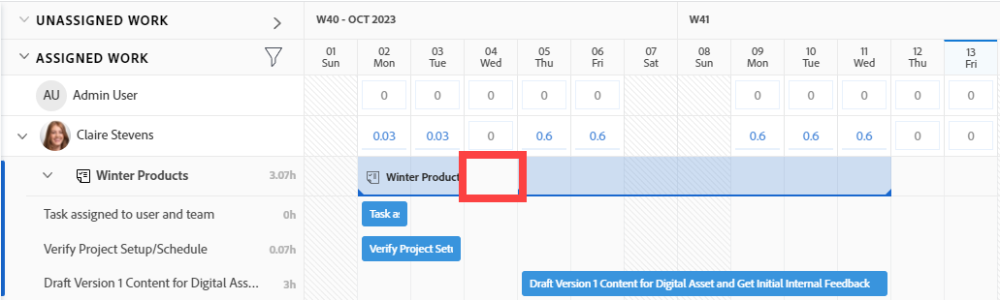

* When you don't have permissions to see certain items, they display as **Inaccessible work items** or **Inaccessible projects**.

  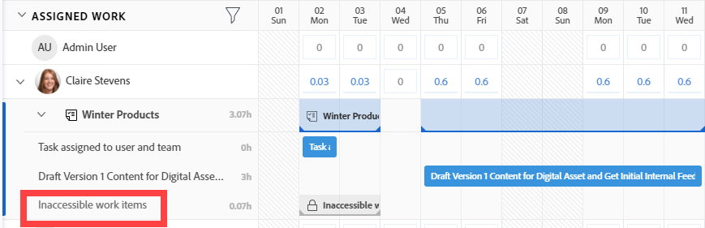

* The names of the work items display on the left and their timeline displays on the right. 
* The total of Planned Hours for each work item displays to the right of the name of the work item and to the left of the bar that represents the work item's timeline. 
* The total of the Planned Hours for each project displays to the right of the name of the project and to the left of the bar that represents the project's timeline.

  The Planned Hours information for the project is a total of Planned Hours from all items listed in the Workload Balancer, and not a total of Planned Hours on the project.

For more information about viewing information in the Workload Balancer, also see the following articles:

* [Locate the Workload Balancer](../workload-balancer/locate-workload-balancer.md)
* [Filter information in the Workload Balancer](../workload-balancer/filter-information-workload-balancer.md)
* [Share the Workload Balancer with a link](../workload-balancer/share-link-for-workload-balancer.md)
* [Update work items in the Workload Balancer using the Summary](../workload-balancer/update-items-in-summary-panel-in-workload-balancer.md) 

For information about managing resources using the Workload Balancer, also see the following articles:

* [Overview of assigning work in the Workload Balancer](https://experienceleague.adobe.com/docs/workfront/using/manage-resources/the-workload-balancer/assign-work-in-workload-balancer.html?lang=en)
* [Manage user allocations in the Workload Balancer](https://experienceleague.adobe.com/docs/workfront/using/manage-resources/the-workload-balancer/manage-user-allocations-workload-balancer.html?lang=en)

## Navigate the Workload Balancer for multiple projects in the Resourcing area

Navigating the Workload Balancer is similar in all the areas where you access it from. 

The following subsections describe how to view the information in the Workload Balancer for multiple projects. 

You can adjust a number of settings and options in the Workload Balancer to display the information you need to focus on in the time frame that makes the most sense to you.

After selecting the settings you want to apply to your view, the Workload Balancer remembers these settings every time you access it from any browser or device.

### Access the Workload Balancer for multiple projects in the Resourcing area

To navigate the Workload Balancer for multiple projects: 

{{step1-to-resourcing}}

1. Click **Workload Balancer** in the left panel.

    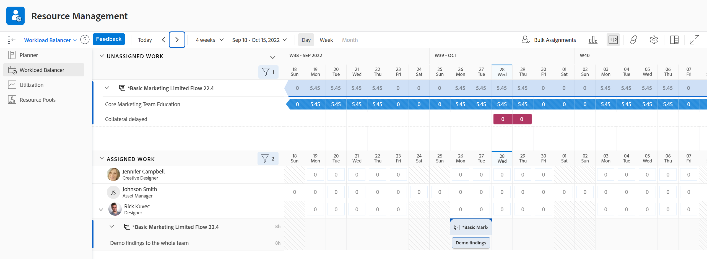
    
    The Workload Balancer displays work assignment information starting with the current week in the following two areas:

    * The **Unassigned Work** area displays the following work items:

        * Work items (tasks and issues) assigned to roles, teams, or that are unassigned display after you apply filters.
        The Unassigned Work area does not display any work items by default. We recommend using filters to display relevant information for you in this area.  
        
            For information about using filters, see [Filter information in the Workload Balancer](../workload-balancer/filter-information-workload-balancer.md).
        
        * Projects display only when you enable the Group by Project setting. For information, see the section [Customize the view](#customize-the-view) in this article.

    * The **Assigned Work** area displays the following work items:
        
        * All active users in the system display in this area by default. We recommend using filters to limit the amount of information in this area. If users are assigned to items, the work items also display under their name. 
        
        * Tasks and issues assigned to at least one user display under the user's name.  

            The work items under users' names in the Assigned Work area are sorted by the following criteria, in this order:

            1. Planned Start Date (oldest first)
            1. Planned Completion Date (oldest first)
            1. Alphabetical by project (only when the first two criteria are identical for multiple work items)

                >[!TIP]
                >
                >* You can customize the project sorting by selecting an option from the "Sort projects by" setting.  
                >
                >* Projects display only when you enable the "Group by Project" setting.
                > 
                >For information about customizing settings, see the section [Customize the view](#customize-the-view) in this article.               

1. (Optional) Click the **Filter** icon  in the **Assigned Work** area, then select the **Default filter** in the **Suggested** area of the filter box.  

    When applying the Default filter, users that belong to any of your teams and their work items display. You can edit a copy of this filter.
 
    >[!TIP]
    >
    >The Default filter is available only in the Workload Balancer in the Resourcing area.

1. Continue with the following steps to navigate the Workload Balancer: 

    * [Select a time frame in the Workload Balancer](#select-a-time-frame-in-the-workload-balancer)
    * [Customize the view](#customize-the-view) 
    * [Assign work items and adjust user allocations](#assign-work-items-and-adjust-user-allocations)
    * [View allocations in a chart](#view-allocations-in-a-chart)
    
### Select a time frame in the Workload Balancer

1. Access the Workload Balancer in the **Resourcing** area, as described in the section [Access the Workload Balancer for multiple projects in the Resourcing area](#access-the-workload-balancer-for-multiple-projects-in-the-resourcing-area) in this article. 

    The Workload Balancer displays work assignment information starting with the current week. 

1. Use the horizontal scroll to view the timeline of work items that extend beyond the limits of the screen.
1. Click the **back or forward** icons  in the upper-left corner to navigate the timeline, then click **Today** to return to the current week.
1. Click the **time frame drop-down menu** on the toolbar, then click the beginning date of the period you want to display. By default, the first week selected on the calendar is the week you navigated to.

    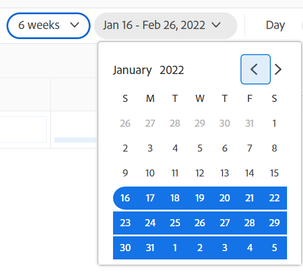

1. Select the number of weeks you want to display at one time in the Workload Balancer from the following options:
    * 1 week
    * 2 weeks
    * 4 weeks. This is the default setting.
    * 6 weeks
    * 3 months 

    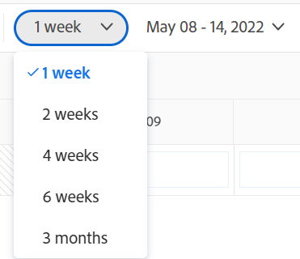

1. Click one of the following options in the toolbar to display information by different time frames:
    * **Day**: Displays information by day for four weeks starting with today's date, by default.
    * **Week**: Displays information by week for four weeks. 
    * **Month**: Displays information by month for three months.

1. Continue navigating the Workload Balancer as described in the following sections. 

### Customize the view

1. Access the Workload Balancer in the **Resourcing** area, as described in the section [Access the Workload Balancer for multiple projects in the Resourcing area](#access-the-workload-balancer-for-multiple-projects-in-the-resourcing-area) in this article.

    The names of work items are listed on the left side and are represented by bars on the right side of the Workload Balancer. The length of the bar represents the timeline of a work item.

1. (Optional and recommended) Use filters in the Unassigned and Assigned Work areas to display only work items or users that are relevant to you.

    For more information, see [Filter information in the Workload Balancer](../workload-balancer/filter-information-workload-balancer.md).

    By default, blue bars represent the timelines of projects and tasks and maroon bars represent issues.
    
    You can change the color of the bars for projects and tasks when you select your color theme to match the project. For more information, continue reading this procedure. 

    Work items in the Assigned Work area are sorted by projects by the following criteria, in this order:
    1. Planned Start Date (oldest first)
    1. Planned Completion Date (oldest first)
    1. Alphabetical by project (only when the first two criteria are identical for multiple work items)

1. Click the **right-pointing arrow** to the left of the Unassigned or Assigned areas to expand all items under the project names (in the Unassigned area) and under the user names (in the Assigned area).

    >[!TIP]
    >
    >Work items are listed under project names in the Unassigned area only when you enable the "Group by Project" setting.

1. Click the **down-pointing arrow** to the left of the Unassigned or Assigned areas to collapse all items under the project names (in the Unassigned area) and under the user names (in the Assigned area).

1. Drag and drop the **separation line** between the left panel and the timeline area to adjust the size of the left panel.

    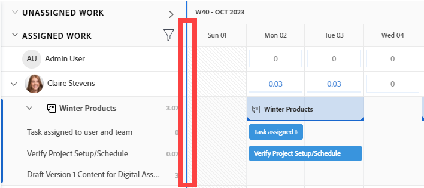

1. Click the **Settings** icon .

    The Settings panel displays on the right.

    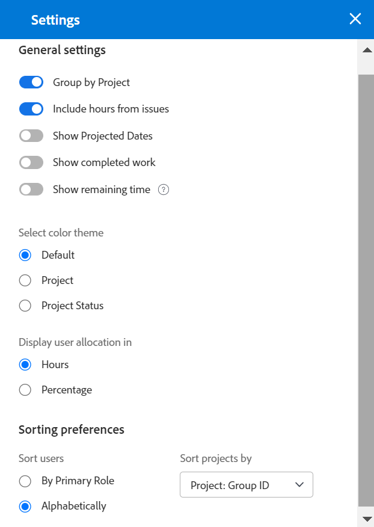

    Select from the options listed below to update the information you view in the Workload Balancer, then click the **X icon** in the upper-right of the Settings box to close it.

    * **Group by Project**: When this is selected, the items in the Unassigned and Assigned Work areas are grouped by project. This is selected by default.

    * **Include hours from issues**: When this is selected, issues assigned to users display under the user's name in the Assigned Work area and issues that are not assigned to users display in the Unassigned Work area. The Planned Hours from the issues count towards the Planned Hours for the project and for the user in the Assigned Work area.
    * **Show Projected Dates**: When this is selected, the projected timeline of work items displays in addition to the planned timeline. Notice the following:
        * The projected timeline of project, tasks, and issues displays as a dark blue line above the task, issue, and project bars.
        * The projected timeline that is outside of the planned timeline displays in light blue, even when you update the color theme, as described below.
        * The projected timeline for the items that you have no access to view displays in light gray with a line underneath.
        * When a task or issue completes before the due Planned Completion Date the allocation numbers for the remaining days are struck through and do not count towards the user's allocation. This displays only when both the Show Projected Dates setting and the Show allocation icon are enabled.
        
        >[!TIP]
        >
        >Notice that work items display in the Workload Balancer when either their planned or the projected timelines (not necessarily both at the same time) occur during the time frame selected.

    * **Show completed work**: When this is enabled, completed tasks and issues display in the Assigned Work area. This is enabled by default. 
    
        A green checkmark icon displays in the upper-right corner of a task or issue bar when they are completed. The same icon displays for a project when the tasks or issues for the selected time frame of the project are completed.
    * **Show remaining time**: When this is enabled, Workfront displays the difference between the daily time for which the user is available to work based on their schedules and the hours for which they are allocated in the Assigned Work area for the users. This is disabled by default and allocated time displays by default.
    * In the **Select color theme** section, select the color that you want for the project and task bars.
            
        >[!TIP]
        >
        >The setting for selecting the color theme does not affect the color of the issue bars. Issues always display in a maroon-color bar. 

        Select from the following:
        * **Default**: The bars for all projects and their work items display in blue.
        * **Project**: The bars associated with each project and its tasks change according to the name of the project. All tasks that belong to the project display in bars that match the color of the project. The project bars display in a lighter shade to distinguish them from the tasks. The project bars also include a project icon when choosing not to display allocations.
        * **Project Status**: The bars associated with each project and its work items change to the color of the status of the project. 

            The project status is that associated with the Group of the project. If the Group does not have group-specific statuses, the color of the work item bars is that of the system-level project status. Both system as well as custom statuses display. For information about group statuses, see [Create or edit a group status](../../administration-and-setup/manage-groups/manage-group-statuses/create-or-edit-a-group-status.md).
    
    * In the **Display user allocation in** section, select from the following:
        * **Hours**: Displays allocated time as hours. This is the default.
        * **Percentage**: Displays allocated time as a percentage of the total available time
    * In the **Sorting preferences** section, select how you want the items to be sorted in the Workload Balancer. Select from the following options:
        * **Sort users by Primary Role**: Users display in the alphabetical order of their Primary Roles in the Assigned Work area.
        * **Sort users alphabetically**: Users display in the alphabetical order of their first names in the Assigned Work area.
        * **Sort projects by**: Select a project field from the drop-down menu to sort projects alphabetically by that field in the Unassigned or Assigned Work areas. 
 
    >[!TIP]
    >
    >You can sort by projects only when the Group by Project setting is enabled. Otherwise, this setting is dimmed.

1. (Optional and conditional) When you change the color theme to Project Status, hover over the name of a project on the left to view the status of the project. 

    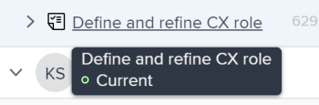

### Assign work items and adjust user allocations

1. Access the Workload Balancer in the Resourcing area, as described in the section [Access the Workload Balancer for multiple projects in the Resourcing area](#access-the-workload-balancer-for-multiple-projects-in-the-resourcing-area) in this article. 
1. Click the **Show allocations icon**  to view the daily or weekly Planned Hours for work items. 

    This replaces the name in the bars of the work items with the amount of daily or weekly Planned Hours in the Unassigned and Assigned Work areas. This setting is disabled by default. 

    Days that show overallocations display in red.
 
    >[!TIP]
    >
    >* The Show allocations option only affects what displays for projects, tasks, issues and inaccessible items. Daily Planned Hours for users display by default and cannot be hidden.
    >* You must enable the Group by Project setting to display daily Planned Hours for projects.
    >* When you view the Workload Balancer by week, the hours displayed are the weekly Planned Hours.

1. (Optional) Hover over the allocated time in the user line to understand the capacity and allocation of the user. The capacity is the availability of the user according to their schedule.

    

1. (Optional) Click the **Hide allocations icon**  to display the name of the tasks and issues  in the bars of the work items.
1. Click the **More menu** icon  to the right of a task or issue name, then click one of the options below.

    

    * **Assign this to**, then start typing the name of a user, role, or team you want to assign the work item to in the **Search people, role, or teams** field. 

        You can also use the following shortcuts to assign tasks or issues:

        * In Windows: CTRL+click the task or issue bar.
        * In Mac: CMD+click the task or issue bar.
 
        For more information about assigning work items to users in the Workload Balancer, see [Overview of assigning work in the Workload Balancer](../workload-balancer/assign-work-in-workload-balancer.md).
        
        >[!TIP]
        >
        >If your Workfront or group administrator enabled delegations in your environment, use the Assignments tab to assign users to the task or issue. For information about delegating work, see [Manage task and issue delegation](../../manage-work/delegate-work/how-to-delegate-work.md).

    * **Edit allocations**, then edit the daily or weekly allocations for the user. For information about managing user allocations, see [Manage user allocations in the Workload Balancer](../workload-balancer/manage-user-allocations-workload-balancer.md).
    
    * **Open Summary**. The Summary panel opens on the right, then click the Assignments field and start typing the name of a user, role, or team in the **Search people, role, or teams** field to assign the item. For more information, see the section [Display more information about tasks and issues](#display-more-information-about-tasks-and-issues) in this article. 

1. (Optional) Double-click a daily or weekly allocation for a user inside the bar of a work item to edit the number of allocated hours, then click the **Save** icon  to save the allocations or the **Cancel** icon  to remove the allocations you adjusted.

    >[!TIP]
    >
    >The Save and Cancel icons display towards the end of a task or an issue's timeline bar. 
    >
    >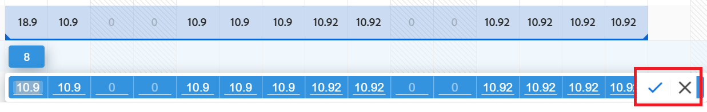
    
    For information about managing user allocations, see [Manage user allocations in the Workload Balancer](../workload-balancer/manage-user-allocations-workload-balancer.md). 

1. Click **Bulk Assignments** to assign work items in bulk.

    For more information, see [Assign work in bulk using the Workload Balancer](../workload-balancer/assign-work-in-workload-balancer-in-bulk.md). 
1. Drag items from the **Unassigned Work** area or from a user and drop them on another user to assign them. 

    For more information, see [Assign work in the Workload Balancer by dragging and dropping](../workload-balancer/assign-work-in-workload-balancer-by-drag-and-drop.md). 

### View allocations in a chart

Instead of viewing allocations in daily or weekly numbers, you can view them in a chart.

1. Access the Workload Balancer in the Resourcing area, as described in the section [Access the Workload Balancer for multiple projects in the Resourcing area](#access-the-workload-balancer-for-multiple-projects-in-the-resourcing-area) in this article.
1. Click the **Chart icon**  to display the user allocation in a chart format.

   Days where the user is overallocated display as red blocks, and days where the user is underallocated or at capacity display as blue blocks.  
    
   The size of the blocks indicates the amount of the allocation: the larger the box, the more time the user is allocated to work items for that day or week. 
   
   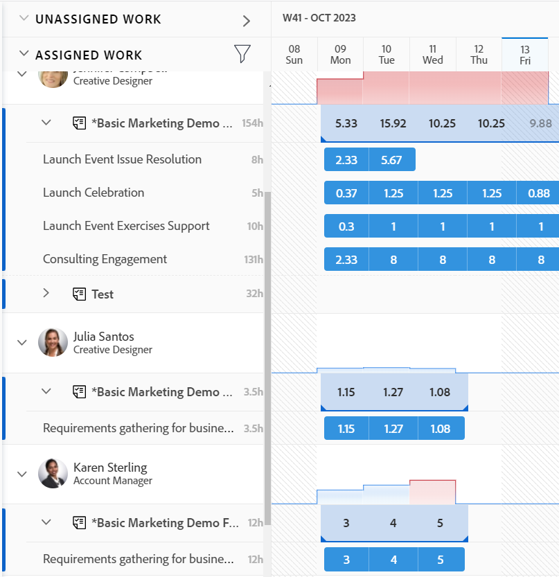

### Display more information about tasks and issues

You can view more information about the tasks and the issues in the Workload Balancer.

1. Access the Workload Balancer in the Resourcing area, as described in the section [Access the Workload Balancer for multiple projects in the Resourcing area](#access-the-workload-balancer-for-multiple-projects-in-the-resourcing-area) in this article.
1. To view more information in the Summary panel, do one of the following:
    
   * Click the bar of a task or issue to open the Summary panel on the right. 
   * Click the **Open Summary** icon , then click the bar of a task or issue to open the Summary panel. 
   * Click the **More** menu to the right of a task or issue, then click **Open Summary**.

   For information about updating task information in the Summary in the Workload Balancer, see [Update work items in the Workload Balancer using the Summary](../workload-balancer/update-items-in-summary-panel-in-workload-balancer.md). 

1. Hover over the name of a task or issue to view more information about it. A box displays above the task or the issue with the following information:

    * The name of the task or issue.
    * The name of the project.
    * The Planned Start and Completion Dates. 
    * The number of Planned Hours.
    * For tasks, the predecessor number.
    * For tasks, an indicator in the upper-corner of the box that indicates whether the task is ready to be worked on or not. 

    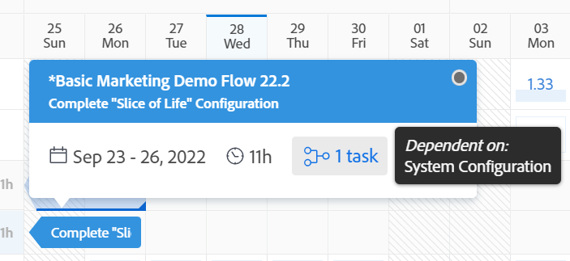

1. Click the name of a work item on the left to access it. The work item opens in a new browser tab.

### Display the Workload Balancer in full screen

1. Access the Workload Balancer in the Resourcing area, as described in the section [Access the Workload Balancer for multiple projects in the Resourcing area](#access-the-workload-balancer-for-multiple-projects-in-the-resourcing-area) in this article.

1. Click the **Full screen** icon  to display the Workload Balancer in full screen. 

    The Workload Balancer occupies the entire screen. Browser windows and tabs are excluded from the view. 
 
1. Click the **Exit full screen** icon  to return to the default screen and view the Workload Balancer inside the browser tab. 

## Navigate the Workload Balancer of a team

Navigating the Workload Balancer of a team is similar to how you navigate the Workload Balancer for multiple projects. For information, see the section [Navigate the Workload Balancer for multiple projects](#navigate-the-workload-balancer-for-multiple-projects-in-the-resourcing-area) in this article. 

{{step1-to-team}}

   The page of your Home Team displays by default.

1. Click **Workload Balancer** in the left panel.

    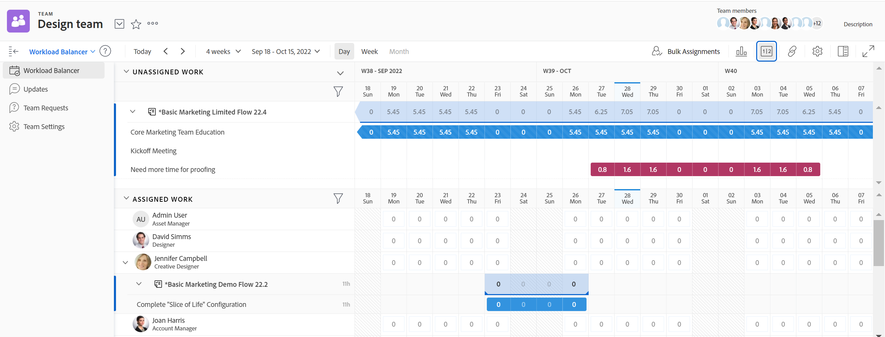

    The Workload Balancer of a team displays the following information, by default:

    * In the **Unassigned Work** area: Work items assigned to the team or to the team and job roles and that are not assigned to users. 
    * In the **Assigned Work** area: Work items assigned to users display under the users' names.

1. Continue navigating the Workload Balancer of a team as described in the [Navigate the Workload Balancer for multiple projects in the Resourcing area](#navigate-the-workload-balancer-for-multiple-projects-in-the-resourcing-area) section of this article.

## Navigate the Workload Balancer of a single project

{{step1-to-projects}}

1. Click the name of a project to open the project page.
1. Click **Workload Balancer** in the left panel. You might have to click **Show More**, then **Workload Balancer**.

    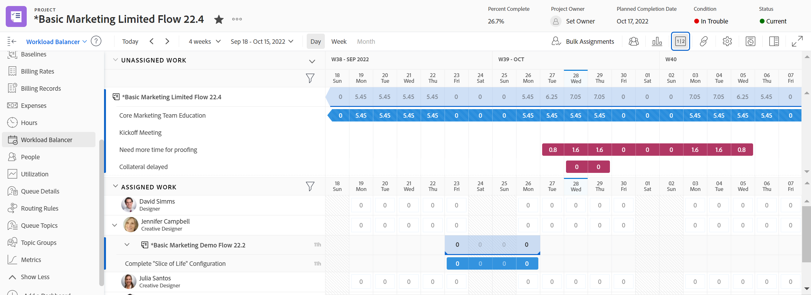

    The Workload Balancer for the project displays the following information, by default: 
    
    * In the **Unassigned Work** area: Work items on the project that are assigned to roles or teams and are not assigned to users. 
    * In the **Assigned Work** area: Work items on the project that are assigned to at least one user. 
    
    We recommend using filters to only show users that are important to you.  
    
    For example, you might consider displaying only users that belong to your teams or groups. For more information, see [Filter information in the Workload Balancer](../workload-balancer/filter-information-workload-balancer.md). 

1. (Optional) Click the **Filter** icon  in the Assigned Work area and select the **This project's work items** option from the **Suggested** area of the filter panel. This filter is deselected by default.

    When this option is selected, only the items assigned to users on the selected project display. 
    
    When the option is not selected, all the items assigned to the users on the project display, regardless of what projects the items belong to.

1. (Optional and recommended) Apply a filter in the Assigned Work area to display users that are important to you but might not be assigned to items on the project, then click the **Show all users** icon . 

    By showing all users, you can display all users in Workfront that are not yet assigned to work or other roles on the project. 
    
    You can apply a filter first, to reduce the number of users you display. 
    
    For example, you might want to filter first for users that belong to your teams or groups, and then display all those users. 
    
    For information about how to build a filter, see [Filter information in the Workload Balancer](../workload-balancer/filter-information-workload-balancer.md). 

    >[!NOTE]
    >
    > The Show all users option is available only for the Workload Balancer of a project.

1. (Optional) Click the **Show role allocations** icon .

    The Role Allocation panel displays. 
    
    You can view information about Planned Hours associated with the job roles on the project and those job roles associated with initiatives linked to the projects from the Scenario Planner. 
    
    For more information, see [Overview of reconciling resource allocations between projects and initiatives](../../scenario-planner/overview-reconcile-allocations-between-projects-initiatives.md).
    
    
    >[!NOTE]
    >
    >You cannot view initiative job role information if your organization has not purchased a license for the Workfront Scenario Planner. In this case, you can only view the planned hours associated with job roles on the project. For more information, see [Access needed to use the Scenario Planner](../../scenario-planner/access-needed-to-use-sp.md).

1. Continue navigating the Workload Balancer of a project as described in the [Navigate the Workload Balancer for multiple projects](#navigate-the-workload-balancer-for-multiple-projects-in-the-resourcing-area) section of this article.

<!--old content below - this used to be a one-large-procedure article - outdated, and rewrote it above with several smaller procedures: 

# Navigate the Workload Balancer

<!-drafted note for 22.4 release: remove all production/ preview references at Prod release>

The highlighted information on this page refers to functionality not yet generally available. It is available only in the Preview environment. 

Use the Workload Balancer to understand the availability of your resources as well as to assign work to your users. This article walks you through using the icons and settings available to update the view for and navigate the Workload Balancer.

>[!NOTE]
>
>The Workload Balancer is a resource scheduling tool that will eventually replace the current resource scheduling tools which are currently deprecated. 
>
>For more information about removing the resource scheduling tools and replacing them with the Workload Balancer, see [Deprecation of Resource Scheduling tools in Adobe Workfront](../../resource-mgmt/resource-mgmt-overview/deprecate-resource-scheduling.md).
>
>We recommend that you use the Workload Balancer for scheduling your resources.

The Workload Balancer is available in multiple areas of Adobe Workfront. Navigating it is similar in all areas. This article describes how to navigate the Workload Balancer for multiple projects in the Resourcing area. For more information about where the Workload Balancer is located, see [Locate the Workload Balancer](../../resource-mgmt/workload-balancer/locate-workload-balancer.md).

For information about managing resources using the Workload Balancer, also consider reading the following articles:

* [Overview of assigning work in the Workload Balancer](../../resource-mgmt/workload-balancer/assign-work-in-workload-balancer.md)
* [Manage user allocations in the Workload Balancer](../../resource-mgmt/workload-balancer/manage-user-allocations-workload-balancer.md)

## Access requirements

You must have the following access to perform the steps in this article:

<table style="table-layout:auto"> 
 <col> 
 <col> 
 <tbody> 
  <tr> 
   <td role="rowheader">Adobe Workfront plan*</td> 
   <td> 
Any 
 </td> 
  </tr> 
  <tr> 
   <td role="rowheader">Adobe Workfront license*</td> 
   <td> 
Plan, when using the Workload Balancer in all areas in the Production environment

   
Work, when using the Workload Balancer of a project, in the Preview environment 
 </td> 
  </tr> 
  <tr> 
   <td role="rowheader">Access level configurations*</td> 
   <td> 
View or higher access to the following:
 
    <ul> 
     <li> 
Resource Management
 </li> 
     <li> 
Projects
 </li> 
     <li> 
Tasks
 </li> 
     <li> 
Issues
 </li> 
    </ul> 
If you still don't have access, ask your Workfront administrator if they set additional restrictions in your access level. For information on how a Workfront administrator can change your access level, see <a href="../../administration-and-setup/add-users/configure-and-grant-access/create-modify-access-levels.md" class="MCXref xref">Create or modify custom access levels</a>.
 </td> 
  </tr> 
  <tr> 
   <td role="rowheader">Object permissions</td> 
   <td> 
View or higher permissions to the projects, tasks, and issues 
 
For information on requesting additional access, see <a href="../../workfront-basics/grant-and-request-access-to-objects/request-access.md" class="MCXref xref">Request access to objects </a>.
 </td> 
  </tr> 
 </tbody> 
</table>

*To find out what plan, license type, or access you have, contact your Workfront administrator.

## Considerations for viewing items in the Workload Balancer

Consider the following when viewing the Workload Balancer:

* Projects display in the Workload Balancer only when the Group by Project setting is enabled. This setting is enabled by default.
* Mousing over a task or an issue displays the following additional information about the task or issue:

  * Project name

  * Task or issue name

  * Parent task

  * Planned Start and Completion Dates

  * Number of Planned Hours

  * Ready to start or Not ready status

  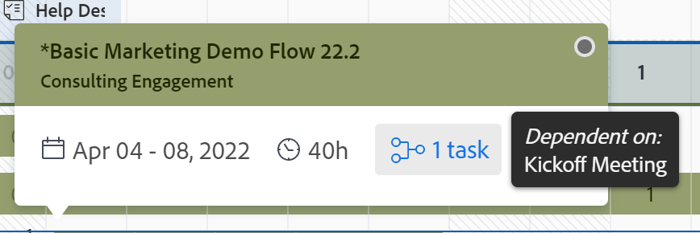

* When a project has no tasks during a period of time, the bar at the project level becomes a dimmed color.

  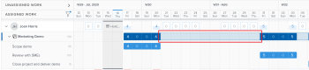

* When you don't have permissions to see certain items, they display as **Inaccessible work items** or **Inaccessible projects**.

  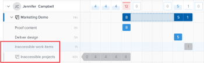

* The names of the work items display on the left and within the timeline selected on the right. 
* The total of Planned Hours for each work item displays to the right of the name of the work items on the left. 
* The total of the Planned Hours for each project displays to the right of the name of the project on the left.

  The Planned Hours information for the project is a total of Planned Hours from all items listed in the Workload Balancer, and not a total of Planned Hours on the project.

## Overview of the Unassigned Work and Assigned Work areas

The Workload Balancer displays work items in two separate areas, depending on their assignments.

The two areas of the Workload Balancer display the following information:

<table style="table-layout:auto"> 
 <col> 
 <col> 
 <tbody> 
  <tr> 
   <td role="rowheader">Unassigned Work</td> 
   <td> 
This area displays tasks and issues unassigned to users. 
 
Projects display when the Group by Project setting is enabled.
 
This area does not display any work items by default. We recommend using filters to display relevant information for you in this area.
 
After you apply a filter, this area displays the following work items:
 
    <ul> 
     <li>unassigned</li> 
     <li>assigned to a team </li> 
     <li>assigned to a job role</li> 
     <li> 
assigned to a team and a role at the same time
 </li> 
    </ul> 
Tip: Items assigned to a user as the primary assignee do not display in the Unassigned Work area. 
 </td> 
  </tr> 
  <tr> 
   <td role="rowheader">Assigned Work</td> 
   <td> 
 All active users in the system display in this area by default. We recommend using filters to limit the amount of information in this area.  
 
Both tasks and issues display in the Assigned Work area. 
 
Projects display when the Group by Project setting is enabled.
 
The work items that the users are assigned to display under their names. 
 
If a work item is assigned to multiple users, the item displays under each assigned user. 
 </td> 
  </tr> 
 </tbody> 
</table>

For information about applying a filter in the Workload Balancer, see [Filter information in the Workload Balancer](../../resource-mgmt/workload-balancer/filter-information-workload-balancer.md).

## Navigate the Workload Balancer

You can update the view in the Workload Balancer to display exactly the information you need to focus on in the time frame that makes the most sense to you.

After selecting the settings you want to apply to your view, the Workload Balancer remembers these settings every time you access it from any browser or device.

1. Click the **Main Menu** icon  in the upper-right corner of Workfront, then click **Resourcing**.
1. Click **Workload Balancer** in the left panel.

   The Workload Balancer displays work assignment information starting with the current week. The names of work items are listed on the left side as well as represented by bars on the right side of the of the Workload Balancer within their respective timelines. By default, blue bars represent the timelines of projects and tasks and maroon bars represent issues.

   >[!TIP]
   >
   >You can change the color of the bars for projects and tasks when you select your color scheme to match the project. For more information, continue reading this procedure.

   The work items that display under the name of users in the Workload Balancer are sorted by the following criteria, in this order:

   1. Planned Start Date (oldest first)
   1. Planned Completion Date (oldest first)
   1. Alphabetical by project (only when the first two criteria are identical for multiple work items)

1. Click the right-pointing arrow to the left of the Unassigned or Assigned areas to expand all items under the project names (in the Unassigned area) and under the user names (in the Assigned area).
1. Click the down-pointing arrow to the left of the Unassigned or Assigned areas to collapse all items under the project names (in the Unassigned area) and under the user names (in the Assigned area).
1. Use the horizontal scroll to navigate the timelines of work items that extends beyond the limits of the screen. 
1. Use the vertical scroll to display additional users and work items. 
1. Drag and drop the separation line between the left panel and the timeline areas to adjust the size of the left panel.

   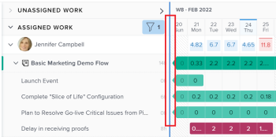

1. Click the **Filter icon**  in the upper-right corner of the **Unassigned Work** or the **Assigned Work** areas to select the type of information to display in the Workload Balancer.

   For information about filtering information in the Workload Balancer, see [Manage filters in the Workload Balancer](../../resource-mgmt/workload-balancer/filter-information-workload-balancer.md). 

1. Click the right-pointing arrow next to **Unassigned Work** to expand this area or the down-pointing arrow to collapse it.

   >[!TIP]
   >
   >No items display in this area by default. You must apply a filter to view unassigned work items.

1. Drag and drop the separation line between the **Unassigned Work** and **Assigned Work** areas to adjust their size.

   

1. Click the back or forward icons  to navigate the timeline, then click **Today** to return to the current week. 

1. Click the **time frame drop-down menu** on the toolbar, then click the beginning date of the period you want to display. By default, the first week selected on the calendar is the week you navigated to.

   

1. Click one of the following options in the toolbar to display information by different time frames:

   <table style="table-layout:auto"> 
    <col> 
    <col> 
    <tbody> 
     <tr> 
      <td role="rowheader">Day</td> 
      <td>Displays information by day for four weeks starting with today's date, by default. </td> 
     </tr> 
     <tr> 
      <td role="rowheader">Week</td> 
      <td>Displays information by week for four weeks. </td> 
     </tr> 
     <tr data-mc-conditions=""> 
      <td role="rowheader">Month</td> 
      <td> 
Displays information by month for three months. 
 </td> 
     </tr> 
    </tbody> 
   </table>

1. Select the number of weeks you want to display at one time in the Workload Balancer from the following options:

   * 1 week
   * 2 weeks
   * 4 weeks. This is the default setting.
   * 6 weeks
   * 3 months
        

1. Click the **Settings** icon .

   The Settings panel displays.

   

   Select from the options listed below to update the information you view in the Workload Balancer, then click the **X icon** in the upper-right of the Settings box to close it.

   * **Group by Project**: When this is selected, the items in the Unassigned and Assigned Work areas are grouped by project. This is selected by default.

     

   * **Include hours from issues**: When this is selected, issues assigned to users display under the user's name in the Assigned Work area and issues that are not assigned to users display in the Unassigned Work area. The Planned Hours from the issues count towards the Planned Hours for the project and for the user in the Assigned Work area. 

        

   
      * **Show Projected Dates**: When this is selected, the projected timeline of work items displays in addition to the planned timeline. Notice the following:

         * The projected timeline of project, tasks, and issues displays as a dark blue line above the task, issue, and project bars.
         * The projected timeline that is outside of the planned timeline displays in light blue, even when you update the color theme, as described below.
         * The projected timeline for the items that you have no access to view displays in light gray with a line underneath.
         * When a task or issue completes before the due Planned Completion Date the allocation numbers for the remaining days are struck through and do not count towards the user's allocation. This displays only when both the Show Projected Dates setting and the Show allocation icon are enabled.

         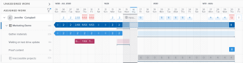

         >[!TIP]
         >
         >Notice that work items display in the Workload Balancer when either their planned or the projected timelines (not necessarily both at the same time) occur during the timeframe selected.

   * **Show completed work**: When this is enabled, tasks and issues that are completed display in the Assigned Work area. This is enabled by default.

     A green checkmark icon  displays to the upper-right corner of a task or issue bar when they are completed. The same icon displays for a project when the tasks or issues for the selected time frame of the project are completed. 
   
   * **Show remaining time**: When this is enabled, Workfront displays the difference between the daily time for which the user is available to work based on their schedules and the hours for which they are allocated in the Assigned Work area for the users. This is disabled by default and allocated time displays by default.

   * In the **Select color theme** section, select the color that you want for the project and task bars.  

      >[!NOTE]
      >
      >The setting for selecting the color theme  does not affect the color of the issue bars. Issues always display in a maroon-color bar. 

      Select from the following:

      * **Default**: The bars for all projects and their work items display in blue.  
      * **Project**: The bars associated with each project and its tasks change according to the name of the project. All tasks that belong to the project display in bars that match the color of the project. The project bars display in a lighter shade to distinguish them from the tasks. The project bars also include a project icon when choosing not to display allocations.
      * **Project Status**: The bars associated with each project and its work items change to the color of the status of the project.

        >[!TIP]
        >
        >* The project status is that associated with the Group of the project. If the Group does not have group-specific statuses, the color of the work item bars is that of the system-level project status. Both system as well as custom statuses display. For information about group statuses, see [Create or edit a group status](../../administration-and-setup/manage-groups/manage-group-statuses/create-or-edit-a-group-status.md).
        
   * In the **Display user allocation in** section, select from the following:

      * **Hours**: Displays allocated time as hours. This is the default. 
      * **Percentage**: Displays allocated time as a percentage of the total available time

   * In the **Sorting preferences** section, select how you want the items to be sorted in the Workload Balancer. Select from the following options: 

      * **Sort users by Primary Role**: Users display in the alphabetical order of their Primary Roles in the Assigned Work area.

      * **Sort users alphabetically**: Users display in the alphabetical order of their first names in the Assigned Work area.

      * **Sort projects by**: Select a project field from the drop-down menu to sort projects alphabetically by that field in the Unassigned or Assigned Work areas. 

      >[!TIP]
      >
      >You can sort by projects only when the Group by Project setting is enabled. Otherwise, this setting is dimmed.

1. (Optional and conditional) If you changed the color theme to Project Status, hover over the name of a project on the left to view the status of the project.

   

1. (Conditional and recommended) In the Workload Balancer of a project, apply a filter in the Assigned Work area to display users that are important to you but might not be assigned to items on the project, then click the **Show all users** icon . This displays other users in the system that are not yet assigned on the project. For information about how to build a filter, see [Manage filters in the Workload Balancer](../workload-balancer/filter-information-workload-balancer.md).

 
   >[!TIP]
   >
   >The Show all users icon is available only for the Workload Balancer of a project. 

1. Click the **Chart icon**  to display the user allocation in a chart format. Days where the user is overallocated display as red blocks, and days where the user is underallocated or at capacity display as blue blocks. The size of the blocks indicates the amount of the allocation: the larger the box, the more time the user is allocated to work items for that day or week.

   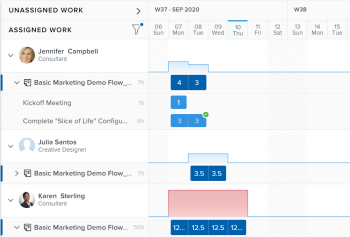

1. Click the **Show allocations icon**  to view the daily or weekly Planned Hours for work items.

   This replaces the name in the bars of the work items with the amount of daily or weekly Planned Hours in the Unassigned and Assigned Work areas. This setting is disabled by default.

   >[!TIP]
   >
   >* The Show allocations setting only affects what displays for projects, tasks, issues and inaccessible items. Daily Planned Hours for users display by default and cannot be hidden.
   >* You must enable the Group by Project setting to display daily Planned Hours for projects. 
   >* When you view the Workload Balancer by week, the hours displayed are the weekly Planned Hours. 

   Days that show overallocations display in red. 

1. (Optional) Hover over the allocated time in the user line to understand what the capacity and allocation of the user. The capacity is the availability of the user according to their schedule.

   

1. (Optional) Click the **Hide allocations icon**  to display the name of the tasks in the bars of the work items. 
1. Click the **More menu** icon  to the right of a task or issue name, then click one of options below. 

   

      * **Assign this to**, then start typing the name of a user, role, or team you want to assign the work item to in the **Search people, role, or teams** field.
    
      >[!TIP]
      >
      >You can also use the following shortcuts to assign tasks or issues:
      >
      >* In Windows: CTRL+click the task or issue bar.
      >* In Mac: CMD+click the task or issue bar.

      For more information about assigning work items to users in the Workload Balancer, see [Overview of assigning work in the Workload Balancer](../../resource-mgmt/workload-balancer/assign-work-in-workload-balancer.md). 

      >[!TIP]
      >
      >If your Workfront or group administrator enabled delegations in your environment, use the Assignments tab to assign users to the task or issue. For information about delegating work, see [Manage task and issue delegation](../../manage-work/delegate-work/how-to-delegate-work.md).

   * **Edit allocations**, then edit the daily or weekly allocations for the user. For information about managing user allocations, see [Manage user allocations in the Workload Balancer](../../resource-mgmt/workload-balancer/manage-user-allocations-workload-balancer.md).

1. Click the bar of a task or issue to open the Summary panel on the right

   Or

   Click **Open Summary** icon , then click the bar of a task or issue to open the Summary panel

   Or

   Click the **More** menu  to the right of a task or issue, then click **Open Summary**.

   For information about updating task information in the Summary in the Workload Balancer, see [Update work items in the Workload Balancer using the Summary](../../resource-mgmt/workload-balancer/update-items-in-summary-panel-in-workload-balancer.md).

    The Summary panel opens on the right. 

1. Click **Bulk Assignments** to assign work items in bulk.

   For more information, see [Assign work in bulk using the Workload Balancer](../../resource-mgmt/workload-balancer/assign-work-in-workload-balancer-in-bulk.md). 

1. Click the **Full screen** icon  to display the Workload Balancer in full screen, then click the **Exit full screen** icon  to return to the default screen. 
1. (Optional) Double-click a daily or weekly allocation for a user inside the bar of a work item to edit the number of allocated hours, then click the **Save** icon  to save the allocations or the **Cancel** icon  to remove the allocations you adjusted.

   >[!TIP]
   >
   >The Save and Cancel icons display towards the end of a task or an issue's timeline bar.

   For information about managing user allocations, see [Manage user allocations in the Workload Balancer](../../resource-mgmt/workload-balancer/manage-user-allocations-workload-balancer.md). 

1. Click the name of a work item on the left to access it. 
1. Click the **Shareable link icon**  to copy the direct URL for the Workload Balancer to your clipboard. 
1. (Optional) Share the link with any user who does not have direct access to the Workload Balancer.

   For information about sharing the Workload Balancer with a link, see [Share the Workload Balancer with a link](../../resource-mgmt/workload-balancer/share-link-for-workload-balancer.md). 

1. (Conditional) From the Workload Balancer of a project, click the **Show role allocations** icon .

   The Role Allocation panel displays. You can view information about Planned Hours associated with job roles on the project and job roles associated with initiatives from the Scenario Planner. For more information, see [Overview of reconciling resource allocations between projects and initiatives](../../scenario-planner/overview-reconcile-allocations-between-projects-initiatives.md).

   >[!TIP]
   >
   >You cannot view initiative job role information if your organization has not purchased a license for the Workfront Scenario Planner. In this case, you can only view the planned hours associated with job roles on the project. For more information, see [Access needed to use the Scenario Planner](../../scenario-planner/access-needed-to-use-sp.md).

--> 