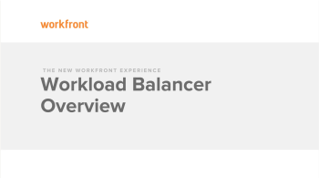

# Overview of the Workload Balancer

The highlighted information on this page refers to functionality not yet generally available. It is available only in the Preview Sandbox environment.

After project managers plan the work on projects and create tasks, you can use the Workload Balancer to assign this work to users in your teams.

>[!IMPORTANT]
>
>You can use the Workload Balancer to assign actual work (tasks and issues) to users. 
>
>You must use the Resource Planner and not the Workload Balancer to estimate job role allocations for your projects, at a high level. For more information about the Resource Planner, see [Resource Planner overview](../../resource-mgmt/resource-planning/get-started-resource-planner.md).

This article describes the general purpose for the&nbsp;Workload Balancer and some of the best practices for how you can set up your projects and resources to successfully use it.

>[!NOTE]
>
>The Workload Balancer is a resource scheduling tool that will eventually replace the current resource scheduling tools which are currently deprecated. 
>
>For more information about removing the resource scheduling tools and replacing them with the Workload Balancer, see [Deprecation of Resource Scheduling tools in Adobe Workfront](../../resource-mgmt/resource-mgmt-overview/deprecate-resource-scheduling.md).
>
>We recommend that you use the Workload Balancer for scheduling your resources.

## Resource scheduling areas and tools

You can assign work items to users in the following areas of Adobe Workfront:

* At the system level, in the Resourcing area:

  You can use the following tools:

   * The Workload Balancer in the Scheduling section.

     For information about using the Workload Balancer, continue reading this article and all articles in this section. 
   
   * The existing resource scheduler in the Scheduling section

* At the project level, in the following areas of Workfront:

   * The Workload Balancer in the Scheduling section of a project. The Scheduling section becomes the Workload Balancer section.
   * The existing resource scheduler in the  Scheduling section of a project

* At the team level, in the following areas of Workfront:

   * The Workload Balancer in the Schedule section of a team. The Schedule section becomes the Workload Balancer section. 
   * The existing resource scheduler in the  Schedule section ```<MadCap:conditionalText data-mc-conditions="">  of a team. </MadCap:conditionalText>```

For information about scheduling resources at the project, team level, or at the system level when using the existing resource scheduling tools see the articles in the section [Resource Scheduling](../../resource-mgmt/resource-scheduling/resource-scheduling-overview.md).

For more information about locating the Workload Balancer, see [Locate the Workload Balancer](../../resource-mgmt/workload-balancer/locate-workload-balancer.md).

## Benefits of the Workload Balancer

At the system level, you can access the Workload Balancer in addition to the existing resource scheduling tools. For information about accessing the Workload Balancer, see [Navigate the Workload Balancer](../../resource-mgmt/workload-balancer/navigate-the-workload-balancer.md).

Consider the following benefits when using the Workload Balancer:

* Access a clear visual mapping of resource overallocation and underutilization which is transparent to all stakeholders. 
* As a people manager, you can protect your people from burnout and empower them to do their best work with better focus, quality and engagement. You can ensure their full utilization, break silos, and enable alignment of work across teams. 
* When you assign work at the task ```or issue``` level you don't have visibility into how busy a user might be. When you use the Workload Balancer, you can view which users have availability in their workload to complete the task ```or issue``` on time. This includes their time off and schedule exceptions details.

  For more information, see [Overview of assigning work in the Adobe Workfront Workload Balancer](../../resource-mgmt/workload-balancer/assign-work-in-workload-balancer.md).

  You can also assigning work items in bulk which makes it easier to distribute a large number of work items at one time, across multiple projects. For more information, see [Assign work in bulk using the Adobe Workfront Workload Balancer](../../resource-mgmt/workload-balancer/assign-work-in-workload-balancer-in-bulk.md). 

* Executives can make timely staffing decisions through transparency into how people in their organization are utilized. 
* Team members benefit from better collaboration, as they can all view what their coworkers are working on at any given time. For information about the access needed to view or manage resources in the Workload Balancer, see [Access needed to manage resources in the Workload Balancer](../../resource-mgmt/workload-balancer/access-needed-manage-resources-balancer.md).
* Share it with anyone that does not have access to the Resourcing area by embedding a link to it in a custom tab.&nbsp;For information, see [Share the Workload Balancer with a link](../../resource-mgmt/workload-balancer/share-link-for-workload-balancer.md)
* Visualize and manage people’s workloads and demand in one view at the global, project, or team level, depending on your role. ```When managing projects, this includes not only resource allocation for the project, but also visualizing the allocation of resources``` ```from``` ```the Adobe Workfront Scenario Planner. People managers use the Workfront Scenario Planner to manage job skills across the organization. The Scenario Planner is only available in the new Adobe Workfront experience.```

  This is available only in the new Adobe Workfront experience and requires an additional license. For information about the Workfront Scenario Planner, see [The Adobe Workfront Scenario Planner overview](../../scenario-planner/scenario-planner-overview.md).

<!--
<div data-mc-conditions="QuicksilverOrClassic.Draft mode">
<p>Watch the following video for an overview of the Workload Balancer. </p>
<p><a href="https://one.workfront.com/s/managed-content-videos/workload-balancer-overview-20Y0z000000bmGLEAY" target="_blank"></a> </p>
</div>
-->

## Best practices for using the Workload Balancer

We recommend the following best practices for planning projects, configuring users, ```and using filters``` before starting scheduling your resources using the Workload Balancer.

* [Best practices for displaying information in the Workload Balancer](#best-practices-for-displaying-information-in-the-workload-balancer) 
* [Best practices for setting up users](#best-practices-for-setting-up-users) 
* [Best practices for setting up tasks and issues](#best-practices-for-setting-up-tasks-and-issues)

### Best practices for displaying information in the Workload Balancer {#best-practices-for-displaying-information-in-the-workload-balancer}

```We recommend that you use filters so you can display only the information that is pertinent to you for both unassigned and assigned work items.```

For information about creating and using filters in the Workload Balancer, see [Manage filters in the Workload Balancer](../../resource-mgmt/workload-balancer/filter-information-workload-balancer.md).

### Best practices for setting up users   
{#best-practices-for-setting-up-users}

* As the user who schedules work for others, you must have the correct access and permissions to schedule resources for work.

  For information about the access needed to manage the workload of your resources in the Workload Balancer, see [Access needed to manage resources in the Workload Balancer](../../resource-mgmt/workload-balancer/access-needed-manage-resources-balancer.md). 

* The users whose workload you want to manage need to meet the following criteria so that the information about their availability and skills is accurate:

   * Have Schedules and Job Roles associated with their profile.
   * For more information about associating Schedules and Job Roles with users, see [Add users](../../administration-and-setup/add-users/create-and-manage-users/add-users.md)
   * If a user is not associated with a Schedule, the Default Schedule of your Workfront system is associated with the user by default, for the purposes of resource management. 
   * Have Schedule Exceptions updated in their schedules.  
     For more information about creating schedules, see [Create a schedule](../../administration-and-setup/set-up-workfront/configure-timesheets-schedules/create-schedules.md)
   
   * Have their Time Off calendar updated in their profile.   
     For information about updating a user's Time Off calendar, see [Configure personal time off in Adobe Workfront](../../workfront-basics/manage-your-account-and-profile/configuring-your-user-profile/personal-time-overview.md).

* The Workfront administrator must determine how Workfront calculates user availability.&nbsp;They can decide whether Workfront uses either the System Default Schedule, or the user's schedule to calculate the time that the user is available to work. For more information, see [Configure Resource Management preferences](../../administration-and-setup/set-up-workfront/configure-system-defaults/configure-resource-mgmt-preferences.md).

### Best practices for setting up tasks ```and``` ```issues``` {#best-practices-for-setting-up-tasks-and-issues}

Ensure the following task and ```issue``` setup exists before starting assigning work to users in the Workload Balancer:

* Parent tasks are not assigned to users or roles. They do not display in the Workload Balancer. 
* Tasks ```and``` ```issues``` have a value for Planned Hours which is greater than zero. 

* Tasks ```and issues``` have a value for their Duration which is greater than zero. 
* The Planned Dates of the issues are within the timeline of the project.

## Before you start to use the Workload Balancer

* You can use the Workload Balancer to assign work and manage daily allocations for users in your organization.

  This article walks you through how to navigate the Workload Balancer to perform these actions. 

* The Workload Balancer can be located in several different areas of Workfront.&nbsp;For information about where you can find the Workload Balancer, see [Locate the Workload Balancer](../../resource-mgmt/workload-balancer/locate-workload-balancer.md).

## Access needed to use the Workload Balancer

You must have the correct Workfront access and permissions to specific projects to be able to view and use the Workload Balancer in Workfront. For information about the access needed to use the Workload Balancer, see the article [Access needed to manage resources in the Workload Balancer](../../resource-mgmt/workload-balancer/access-needed-manage-resources-balancer.md).
