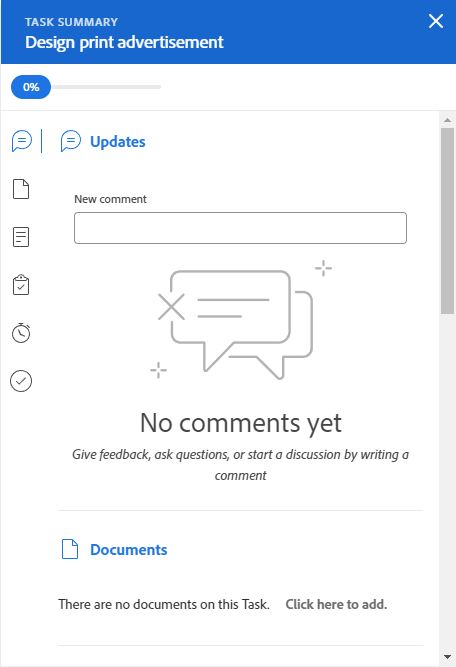

# Update work items in the Workload Balancer using the Summary

You can use the Summary panel of a task or an issue to update important information for that item. in the Workload Balancer.

The Summary panel is available for tasks and issues in both the Assigned and Unassigned Work areas of the Workload Balancer.

## Access requirements

+++ Expand to view access requirements for the functionality in this article.

You must have the following access to perform the steps in this article:

<table style="table-layout:auto"> 
 <col> 
 <col> 
 <tbody> 
  <tr> 
   <td role="rowheader">Adobe Workfront plan</td> 
   <td> 
Any 
 </td> 
  </tr> 
  <tr> 
   <td role="rowheader">Adobe Workfront license</td> 
   <td>
New: Standard

       
or

       
Current: Plan, when using the Workload Balancer in the Resourcing area; 
       Work, when using the Workload Balancer of a team or project
</td>
  </tr>
  <tr> 
   <td role="rowheader">Access level configurations</td> 
   <td> 
Edit access to the following:
 
    <ul> 
     <li>Resource Management</li> 
     <li>Projects</li> 
     <li>Tasks</li> 
     <li>Issues</li> 
    </ul>
   </td> 
  </tr> 
  <tr> 
   <td role="rowheader">Object permissions</td> 
   <td>Contribute permissions or higher to the projects, tasks, and issues</td> 
  </tr> 
 </tbody> 
</table>

For more detail about the information in this table, see [Access requirements in Workfront documentation](/help/quicksilver/administration-and-setup/add-users/access-levels-and-object-permissions/access-level-requirements-in-documentation.md).

+++

## Update tasks and issues in the Workload Balancer Summary panel

1. Go to the Workload Balancer.

   The Workload Balancer displays work assignment information starting with the current week. 

1. Go to the **Unassigned Work** area and find a work item.

   Or

   Go to the **Assigned Work** area, expand a user, and find a work item.

1. Click the bar of a task or issue to open the Summary panel on the right.

   Or

   Click **Open Summary** icon , then click the bar of a task or issue to open the Summary panel.

   Or

   Click the **More** menu  to the right of a task or issue, then click **Open Summary**.

   The Summary panel opens on the right.

   

1. Modify a number of fields for the work item, enter an update, or you navigate from here to other areas of Workfront to add documents or other information to the work item.

   >[!CAUTION]
   >
   >Navigating from the Summary to the Substasks section to add subtasks removes the original task, because parent tasks do not display in the Workload Balancer.

   For more information about updating information using the Summary, see [Summary overview](../../workfront-basics/the-new-workfront-experience/summary-overview.md).

1. (Conditional) If you opened any of the sections of the work item, click your browser's **Back button** to return to the Workload Balancer.
1. Click the **Close icon**  in the upper-right corner of the Summary, to close it.
