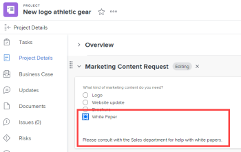
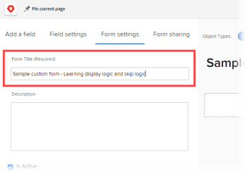
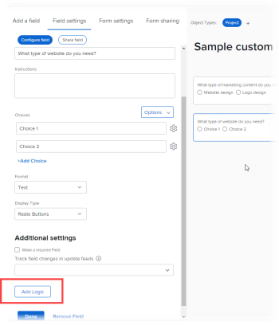
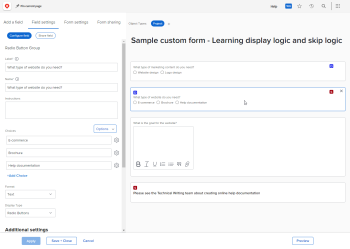

# Add display logic and skip logic to a custom form

You can use smart rules to make a custom form dynamic and more relevant for the users who fill it out. When a user responds a certain way to a multiple-choice field on a form, a smart rule shows them what you want them to see next, based on that response.

The multiple-choice field types are Dropdown, Checkboxes, and Radio Buttons.

* **Display logic**: You configure a display logic rule on the field, widget, or section that you want the user to see only after they select a specific choice in a preceding multiple-choice field. 

  **Example:** You are creating a Marketing Content Request form where people in your organization can request a new logo, website update, brochure, or other kinds of marketing content. Based on type of content that the user wants, you need to prompt them for different kinds of details, such as colors and design ideas if they need a logo, or a list of product features if they need a brochure.

  On the field asking about colors and details for a new logo, you can add a display logic rule that displays that field only after the user selects the Logo radio button in the first field.

  Likewise, on the field asking about product features, you can add a display logic rule that displays that field only after a user selects the Brochure radio button in the first field.

  

  You can configure display logic rules on any custom field, widget, or section break that follows a multiple-choice field.

* **Skip logic rule**: You configure this rule to hide parts of a form that the user doesn't need. When the user selects a specific item in a preceding multiple-choice field, the skip logic rule skips them to the end of the form or to a custom field, widget, or section that you want them to see. 

  **Example:** Someone uses the Marketing Content Request form above to ask for a white paper, which are provided by Sales, not Marketing. For this user, a skip logic rule can hide the question prompting for details and skip to a line of text referring them to the department they need.

  

  In this case, you can add a Descriptive Text field that refers the user to the Sales department. On the first custom field that asks what type of marketing content the user needs, you can add a skip logic rule that displays only the line of text when a user selects the White Paper radio button in the first field.

  This would be especially useful if you add a lot of other fields about logos, website updates, and brochures that this user doesn't need to see.
  You can apply a skip logic rule only to a custom field, not to a widget or section.

## Access requirements

You must have the following to perform the steps in this article:

<table style="table-layout:auto"> 
 <col> 
 <col> 
 <tbody> 
  <tr data-mc-conditions=""> 
   <td role="rowheader"> 
Adobe Workfront plan*
 </td> 
   <td>Any</td> 
  </tr> 
  <tr> 
   <td role="rowheader">Adobe Workfront license*</td> 
   <td> 
Plan 
 </td> 
  </tr> 
  <tr data-mc-conditions=""> 
   <td role="rowheader">Access level configurations*</td> 
   <td> 
Administrative access to custom forms
 
For information about how Workfront administrators grants this access, see <a href="../../administration-and-setup/add-users/configure-and-grant-access/grant-users-admin-access-certain-areas.md" class="MCXref xref">Grant users administrative access to certain areas</a>.
 </td> 
  </tr>  
 </tbody> 
</table>

&#42;To find out what plan, license type, or access level configurations you have, contact your Workfront administrator.

## Create a sample custom form that has display and skip logic

The best way to learn how to add display and skip logic to a custom form is through the practical example explained in the two following sections:

* [Display logic - practical example](#display-logic-practical-example) 
* [Skip logic - practical example](#skip-logic-practical-example)

### Display logic - practical example {#display-logic-practical-example}

In this example, you will create a custom form with a multiple-choice radio button field. Then you will add display logic that connects this field to a second field.

1. Click the **Main Menu** icon  in the upper-right corner of Adobe Workfront, then click **Setup** .  

1. In the left panel, select **Custom Forms** . 

1. Click **New Custom Form**, select **Project** in the box that displays, then select **Continue**.

1. In the **Form Title** text box, type **Sample custom form - Learning display logic and skip logic** to name the form.

   

1. To add the first field on the form:

   1. Open the **Add a Field** tab.

      

   1. Select the **Radio Buttons** field type, then type *What type of marketing content do you need?* as the **Label** for the field.
   
   1. Under **Choices**, replace **Choice 1** and **Choice 2** with the following text to create two options users can choose in the field:

      *Website update*

      *Logo design*

1. To add the next custom field, and add a display logic rule to it:

   1. Open the **Add a field** tab again and add a new **Radio Buttons** field called *What type of website update do you need?*

      We will add the choices for this field later.
   
   1. In the **Additional settings** section, select **Add Logic**.

      

1. In the box that appears, with the **Display Logic** tab open, configure the second field so that it appears only for users that selected *Website design* in the first field:

   1. In the first dropdown, select **What type of marketing content do you need?**
   1. In the second dropdown, select **Website design**. 
   1. Leaving the third dropdown set to **Selected**, select **Save**.

   Notice the small colored squares with a D, indicating that the second field is connected with display logic to the user's selection in the first field:

   

1. Select **Preview** to make sure the logic works the way you want it to on the form, then select **End Preview**.

1. Click **Save + Close** save the form, then continue on to [Skip logic - practical example](#skip-logic-practical-example) below.

### Skip logic - practical example {#skip-logic-practical-example}

Skip logic functions similarly to display logic, but acts as the inverse: instead of making specific custom multiple-choice fields display based on previous user selections, you determine which ones should be hidden (skipped) because they are not relevant for the user.

To learn about this, continue working on the sample custom form you created in the section [Display logic - practical example](#display-logic-practical-example) in this article.

1. Click the **Main Menu** icon  in the upper-right corner of Adobe Workfront, then click **Setup** .  

1. Click **Custom Forms**. 
1. Click the name of the form **Sample custom form - Learning display logic and skip logic** that you created in the steps above, to open it for editing. 
1. Select the drop-down field you created named *What type of website do you need?*, add the following choices for the field, then click **Apply**:

   *E-commerce*

   *Brochure*

   *Membership* 

1. Open the **Add a field** tab, create a **Text Field with Formatting **field called*What is the goal for the website?*, then click **Apply**.

   In this organization, a Help documentation site is created by the Technical Writing team, not the Marketing department. So no further information is needed from a user who selects Help documentation in the second field. We will create a line of text (a descriptive text field) telling them to see the Technical Writing team instead. And we will use a skip logic rule that skips that user to that line of text.

1. To create the line of text:

   1. Open the **Add a field** tab and create a **Descriptive Text field**.
   
   1. For the **Label**, type *See Technical Writing team*.
   
   1. For the **Descriptive Text**, type *Please see the Technical Writing team about creating online help documentation*.
   
   1. Select **Apply**.

1. To create the skip logic rule:

   1. Select the second drop-down field, *What type of website do you need?*
   1. In the **Additional setting**s section, select **Edit Logic**.
   1. In the box that displays, open the **Skip Logic** tab. 
   1. Set the first drop-down to **Help documentation**, leave the second drop-down set to **Selected**, and set the third drop-down to **See the Technical Writing team**.
   1. Select **Save**.

   Notice the small skip logic squares with an S, indicating that the user will be skipping something after selecting a certain choice in the second field.

   

1. Click **Preview** &nbsp;to make sure the logic applies&nbsp;the way you want it. 
1. Click **Save +Close**.

Building a form like this, you could add more text fields to prompt for information from users who select E-commerce or Brochure in the second field. These fields could ask who the target audience is for the website, what the goal is for creating it, what the budget is, and so on.

And, with logic rules, you could create branching question paths.

For example, for users who select E-commerce, you could create fields asking questions about product photos, descriptions, prices, and payment options. For users who select Brochure, you could create fields asking about content.

A user who selected Help documentation would never see any of these additional fields that are irrelevant to them.

>[!TIP]
>
>You can add both display logic and skip logic to a custom field if all of the following is true about the field:
>
>* It is a multiple choice field (radio buttons, dropdown, or checkboxes)
>* It is preceded by a multiple choice field
>* It is followed by another custom field
>

<!--
<h2 data-mc-conditions="QuicksilverOrClassic.Draft mode">Multi-field display logic statements</h2>
-->

