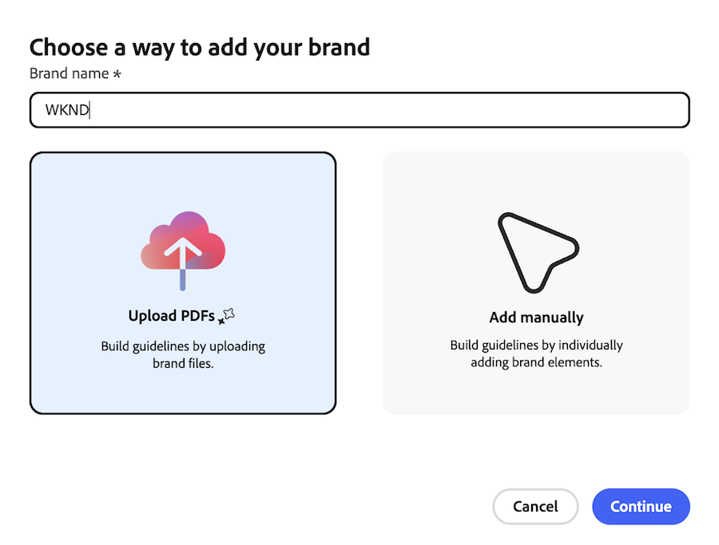
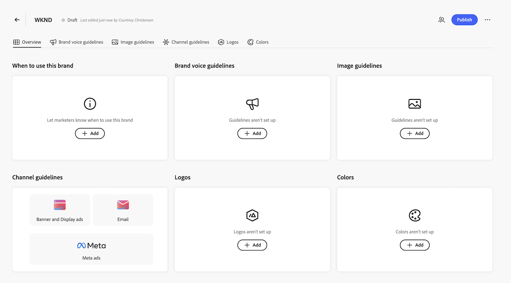

# Set up brands for the AI Reviewer

>[!IMPORTANT]
>
>This feature is currently in beta. 

The AI Reviewer uses brand guidelines to evaluate content during the review process. You can create brands in Workfront by uploading PDF files that contain your brand guidelines or by manually entering brand elements.

## Access requirements

+++ Expand to view access requirements for the functionality in this article.

<table style="table-layout:auto"> 
 <col> 
 <col> 
 <tbody> 
  <tr> 
   <td role="rowheader">Adobe Workfront package</td> 
   <td> 
Any
 </td> 
  </tr> 
  <tr> 
   <td role="rowheader">Adobe Workfront license</td> 
   <td> 
Standard
 </td> 
  </tr> 
  <tr> 
   <td role="rowheader">Access level configurations</td> 
   <td> 
You must be a system administrator.
</td> 
  </tr> 
  <tr> 
   <td role="rowheader">Admin Console permissions</td> 
   <td> 
You must GenStudio Brand Manager.
</td> 
  </tr> 
 </tbody> 
</table>

For more detail about the information in this table, see [Access requirements in Workfront documentation](/help/quicksilver/administration-and-setup/add-users/access-levels-and-object-permissions/access-level-requirements-in-documentation.md).

+++

## Prerequisites 

* Your organization must have migrated to Adobe IMS (Identity Management System).
* Your Workfront instance must have Unified Approvals enabled. 
* Your organization must have GenStudio Foundation.
* Adobe must have a signed Adobe Gen AI agreement on file.
    For more information on signing the agreement, see [Sign the Adobe Gen AI agreement](/help/quicksilver/workfront-basics/ai-assistant/ai-assistant-overview.md#sign-the-adobe-gen-ai-agreement).

## Create a brand using a PDF

{{step-1-to-setup}}

1. In the left panel, go to **Review and Approval** > **Brands**.
1. Click **Add brand** in the top-right corner of the screen.
1. Name the brand. 
1. Click Upload PDFs to upload brand files.
    
1. Click **Continue**.
1. Upload one or more PDF files that contain your brand guidelines, then click **Add brand**. 
1. Once the files are uploaded, review the extracted brand elements to ensure they align with your brand guidelines. 

    >[!IMPORTANT]
    >
    >Guidelines are generated using your files and generative AI technology and may be inaccurate. Review extracted guidelines for missing or incorrect details and edit them before you publish this brand.

1. When finished, click **Publish** to make the brand available for the AI Reviewer.

## Create a brand manually

{{step-1-to-setup}}

1. In the left panel, go to **Review and Approval** > **Brands**.
1. Click **Add brand** in the top-right corner of the screen.
1. Name the brand.
1. Click **Add manually** to create a brand with individual elements.
1. Fill in the brand details as needed. You can add the following elements:

    <table>
    <tr>
        <td>When to use</td>
        <td>Let marketers know when to use this brand.</td>
    </tr>
    <tr>
        <td>Voice guidelines</td>
        <td>Provide guidance on the tone and style of the brand's voice.</td>
    </tr>
    <tr>
        <td>Image guidelines</td>
        <td>Specify the types of images that align with the brand's identity.</td>
    </tr>
    <tr>
        <td>Channel guidelines</td>
        <td>Outline the appropriate channels for brand communication.</td>
    </tr>
    <tr>
        <td>logos</td>
        <td>Include the official logos associated with the brand.</td>
    </tr>
    <tr>
        <td>Colors</td>
        <td>Specify the brand's color palette.</td>
    </tr>
    </table>

    

1. When finished, click **Publish** to make the brand available for the AI Reviewer.
