# Create a report dashboard for review and approvals

You can create a report dashboard in the Canvas Dashboards area to display both high-level and detailed information about reviews and approvals with the new document approvals functionality. 

Chart data refreshes nightly. Real-time updates planned soon.

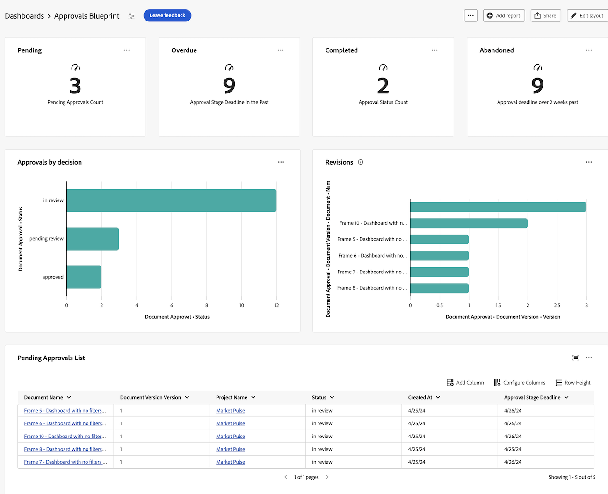

## Create a dashboard

{{step1-to-dashboards}}

1. In the left panel, click **Canvas Dashboards**.
1. Click **New Dashboard**. 
1. Name your dashboard.
1. (Optional) Add a description. 
1. Click **Create**.
    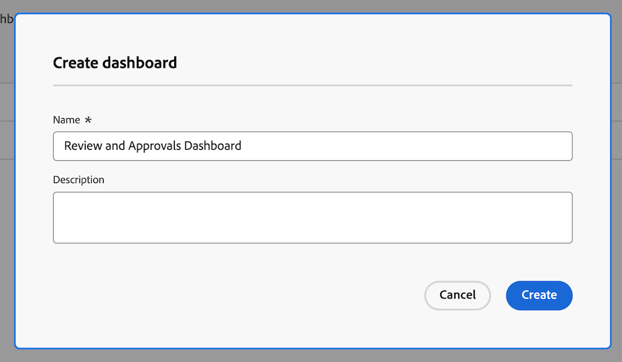

## Add high-level review and approval information with KPIs and Charts

You can view high-level information about approvals with KPIs and charts. Drill down information is not currently available in this beta but is planned. 

### KPIs

You can use KPIs to view information about approvals.

>[!IMPORTANT]
>
>Chart data refreshes nightly. Real-time updates planned soon.

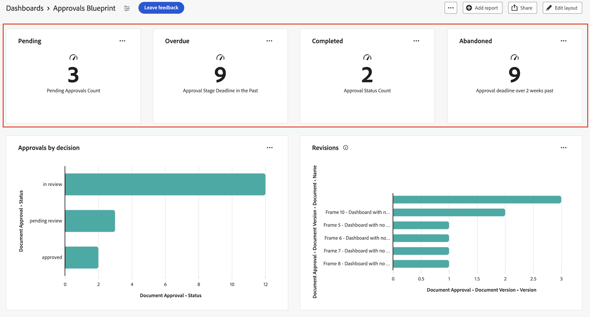

#### Pending approvals

1. [Create a dashboard](#create-a-dashboard) as described in the section above. 
1. In the KPI card, click Add. 
1. Type _Pending_ in the **KPI Title** textbox. 
1. Type _Pending approvals_ count in the **KPI Caption** textbox. This text describes what the KPI is showing.
1. At the top of the page, click **Select KPI Field**. 
1. Scroll down and find the **Document Approval folder**
1. Choose **Status**, then select **Count** from the drop-down menu. 
1. Click **Edit Filter** > **Add condition**. 
    1. Click into the empty condition filter, click **Pick a Field**, then choose **Status**.
    1. Leave the operator as **Equal**, and type _pending review_ in the textbox.
    
1. Click **Done** in the top-right corner of the screen.

#### Overdue approvals

1. [Create a dashboard](#create-a-dashboard) as described in the section above. 
1. In the KPI card, click **Add**. 
1. Type _Overdue_ in the **KPI Title** textbox. 
1. Type _Approval Stage Deadline in the Past_ count in the **KPI Caption** textbox. This text describes what the KPI is showing.
1. At the top of the page, click **Select KPI Field**. 
1. Scroll down and find the **Document Approval folder**
1. Choose **Status**, then select **Count** from the drop-down menu. 
1. Click **Edit Filter** > **Add condition**:
    1. Click into the empty condition filter, click **Pick a Field**, then choose **Deadline**.
    1. Change the operator to **Less Than**, and toggle Relative date On, then type _$$TODAY_ in the textbox.
    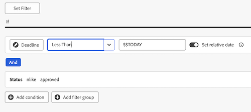
1. Click **Add condition**: 
    1. Click into the empty condition filter, click **Pick a Field**, then choose **Status**.
    1. Change the operator to **Not Contains**, then type _approved_ in the textbox.
    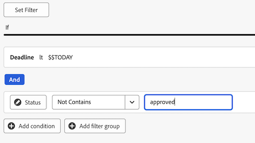
1. Click **Done** in the top-right corner of the screen.

#### Completed approvals

1. [Create a dashboard](#create-a-dashboard) as described in the section above. 
1. In the KPI card, click **Add**. 
1. Type _Completed_ in the **KPI Title** textbox. 
1. Type _Approval Status Count_ count in the **KPI Caption** textbox. This text describes what the KPI is showing.
1. At the top of the page, click **Select KPI Field**. 
1. Scroll down and find the **Document Approval folder**
1. Choose **Status**, then select **Count** from the drop-down menu. 
1. Click **Edit Filter** > **Add condition**:
    1. Click into the empty condition filter, click **Pick a Field**, then choose **Status**.
    1. Change the operator to **Contains**, and type _approved_ in the textbox.
    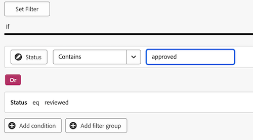
1. Click **Add condition**: 
    1. Click on **And** to change it to **Or**.
    1. Click into the empty condition filter, click **Pick a Field**, then choose **Status**.
    1. Change the operator to **Equals**, then type _reviewed_ in the textbox.
    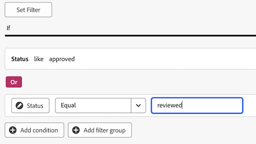
1. Click **Done** in the top-right corner of the screen.

#### Abandoned approvals

1. [Create a dashboard](#create-a-dashboard) as described in the section above. 
1. In the KPI card, click **Add**. 
1. Type _Abandoned_ in the **KPI Title** textbox. 
1. Type _Approval deadline over 2 weeks past_ count in the **KPI Caption** textbox. This text describes what the KPI is showing.
1. At the top of the page, click **Select KPI Field**. 
1. Scroll down and find the **Document Approval Stage folder**.
1. Choose **Deadline**, then select **Count** from the drop-down menu. 
1. Click **Edit Filter** > **Add condition**:
    1. Click into the empty condition filter, click **Pick a Field**, then choose **Status**.
    1. Change the operator to **Not Contains**, and type _approved_ in the textbox.
    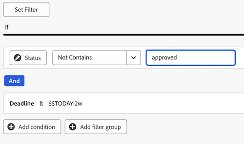
1. Click **Add condition**: 
    1. Click into the empty condition filter, click **Pick a Field**, then choose **Deadline**.
    1. Change the operator to **Less Than**, then toggle Relative date On, then type _$$TODAY-2w_ in the textbox.
    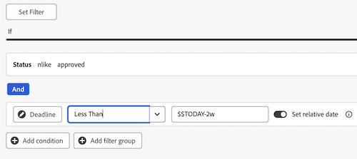
1. Click **Done** in the top-right corner of the screen.

### Charts

You can use bar charts to view information about approvals. 

>[!IMPORTANT]
>
>Chart data refreshes nightly. Real-time updates planned soon.

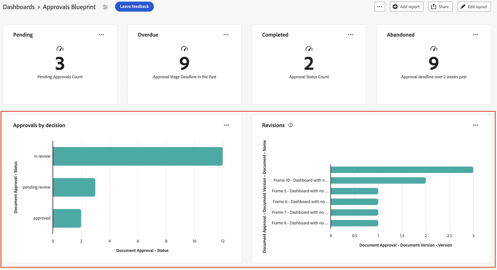

#### Approvals by decision bar chart

1. [Create a dashboard](#create-a-dashboard) as described in the section above. 
1. In the Chart card, click **Add**. 
1. Type _Approvals by decision_ in the **Name** textbox. 
1. (Optional) Type a description in the **Description** textbox. This text displays as a tooltip next to the chart name. 
1. Click **Open chart details**.
1. In the **Chart type** drop-down menu, leave **Bar Chart** selected. 
1. In the **Bar type** drop-down menu, leave **Simple** selected.
1. Click **Update field** for the **Bottom (X) axis**, and choose the first **Document Approval** folder then **Status**. 
1. Set the Aggregation type to **Count**. 
1. Click **Update field** for the **Left (Y) axis**, and choose the first **Document Approval** option then **Status**. 
1. Click on the Filter tab .
1. Click **Edit Filter** > **Add condition**:
    1. Click into the empty condition filter, click **Pick a Field**, then choose **Document Version Version**.
    1. Change the operator to **Is Not Null**.
    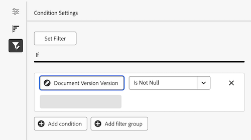
1. Click **Done** in the top-right corner of the screen.

#### Revisions bar chart

1. [Create a dashboard](#create-a-dashboard) as described in the section above. 
1. In the Chart card, click **Add**. 
1. Type _Revisions_ in the **Name** textbox. 
1. Type _Number of revisions for documents with incomplete decisions planned before the end of this month_ count in the **Description** textbox. This text displays as a tooltip next to the chart name. 
1. Click **Open chart details**.
1. In the **Chart type** drop-down menu, leave **Bar Chart** selected. 
1. In the **Bar type** drop-down menu, leave **Simple** selected.
1. Click **Update field** for the **Bottom (X) axis**, and choose the first **Document Approval** folder then **Document Version** > **Version**. 
1. Set the Aggregation type to **Count**. 
1. Click **Update field** for the **Left (Y) axis**, and choose the first **Document Approval** option then **Document Version** > **Document** > **Name**. 
1. Click on the Filter tab .
1. Click **Edit Filter** > **Add condition**:
    1. Click into the empty condition filter, click **Pick a Field**, then choose **Approval Stage Participants Decision Date**.
    1. Change the operator to **Is Null**.
    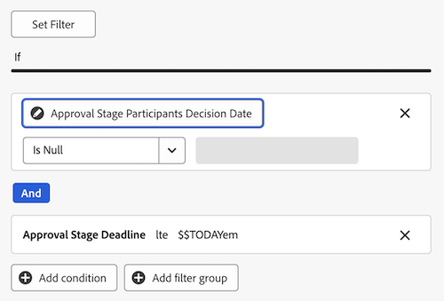
1. Click **Edit Filter** > **Add condition**:
    1. Click into the empty condition filter, click **Pick a Field**, then choose **Approval Stage deadline**.
    1. Change the operator to **Less Than or Equal**, then toggle Set relative date On and type _$$TODAYem_ in the textbox.
    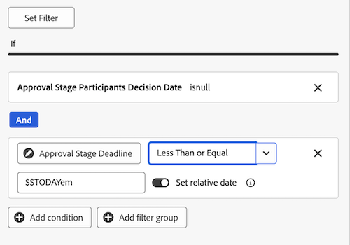
1. Click **Done** in the top-right corner of the screen.

## Add detailed review and approval information with Tables

You can view detailed information using tables. 

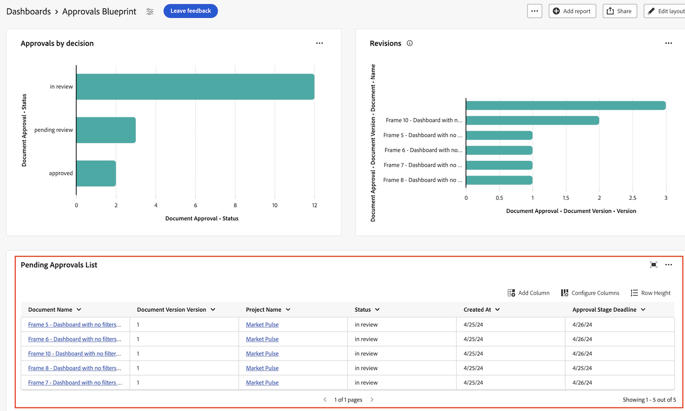

### Pending approvals list 

Required filter: Status: eql pending approval

1. [Create a dashboard](#create-a-dashboard) as described in the section above. 
1. In the Table card, click **Add**. 
1. Type _Pending Approvals_ in the **Name** textbox. 
1. (Optional) Type a description in the **Description** textbox. This text displays as a tooltip next to the chart name. 
1. Click **Open column settings**.
1. Click **Add column** and scroll to the first **Document Approvals** folder and select it.
1. Add the following columns:

    <table>
    <tr>
    <td>Status</td>
    <td>Document Approvals > Status</td>
    </tr>
    <tr>
    <td>Project name</td>
    <td>Document Version > Document > Project > Name</td>
    </tr>
    <tr>
    <td>Document name</td>
    <td>Document Version > Document > type _Name_ in the search box.</td>
    </tr>
    <tr>
    <td>Document version</td>
    <td>Document Version > Document > Version</td>
    </tr>
    <tr>
    <td>Deadline</td>
    <td>Document > Approval Stage > Deadline</td>
    </tr>
    <tr>
    <td>Requested by</td>
    <td>Document > Approval Stage > Approval Stage Participants* > Requester > type _Name_ in the search box.</td>
    </tr>
     <tr>
    <td>Requested date</td>
    <td>Document > Approval Stage > Approval Stage Participants* > Created at</td>
    </tr>
     <tr>
    <td>Approver</td>
    <td>Document > Approval Stage > Approval Stage Participants* > Participant User > type _Name_ in the search box.</td>
    </tr>
     <tr>
    <td></td>
    <td></td>
    </tr>
    <table>

    *Approval Stage Participants is truncated to Approval Stage Pa..

1. Click Status.
1. Click **Add column** 

**Optional filters**

To view more specific information depending on your use case, you can add additional filter conditions. You may want to recreate the table and add new filter conditions per use case.

+++ Expand to view additional filter options

**My Projects**

1. 

**Approvals I've submitted**

1. 

+++

### Overdue approvals list

Required filter: approval stage deadline > less than $$TODAY

1. [Create a dashboard](#create-a-dashboard) as described in the section above. 
1. In the Table card, click **Add**. 

**Optional filters**

To view more specific information depending on your use case, you can add additional filter conditions. You may want to recreate the table and add new filter conditions per use case.

+++ Expand to view additional filter options

**My Projects**

1. 

**Approvals I've submitted**

1. 

**My team**

1. 

+++

