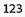
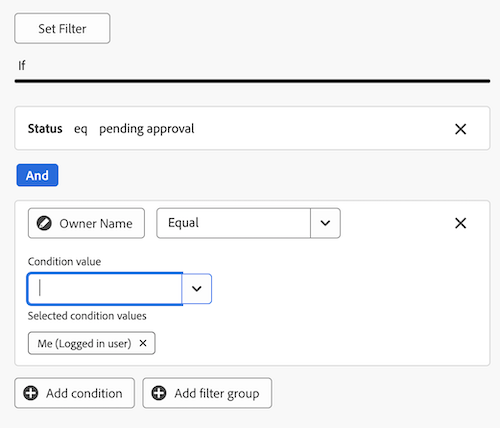
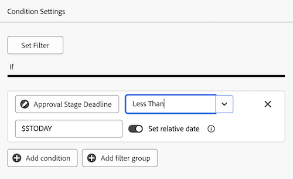

# Create a report dashboard for review and approvals

You can create a report dashboard in the Canvas Dashboards area to display both high-level and detailed information about reviews and approvals with Unified Approvals functionality.  

>[!IMPORTANT]
>
>This functionality is available only for customers using Unified Approvals service and enrolled in the Canvas Dashboards beta. For more information, see [Canvas Dashboards beta information](/help/quicksilver/product-announcements/betas/canvas-dashboards-beta/canvas-dashboards-beta-information.md).

## Create a dashboard

{{step1-to-dashboards}}

1. In the left panel, click **Canvas Dashboards**.
1. Click **New Dashboard**. 
1. Name your dashboard.
1. (Optional) Add a description. 
1. Click **Create**.
    

Once you create a dashboard, you can start adding KPIs, Charts, and Tables. See the following sections for more information:

* [Add high-level review and approval information with KPIs and Charts](#add-high-level-review-and-approval-information-with-kpis-and-charts)
* [Add detailed review and approval information with Tables](#add-detailed-review-and-approval-information-with-tables)

## Add high-level review and approval information with KPIs and Charts

You can view high-level information about document approvals with KPIs and charts. 

For more information, see [Build a KPI report](/help/quicksilver/reports-and-dashboards/canvas-dashboards/add-reports/build-kpi-report.md) and [Build a chart report](/help/quicksilver/reports-and-dashboards/canvas-dashboards/add-reports/build-chart-report.md).

### KPIs

#### Pending approvals

1. [Create a dashboard](#create-a-dashboard) as described in the section above. 
1. In the top-right corner of the dashboard details page, click **Add report**. 

1. In the **Add report** box, select **Create report**.  

1. On the left side, select **KPI**.

1. In the upper-right corner, click **Create report**.  

1. Follow the steps below to configure the **Details** section: 

    1. Type *Pending* in the **Name** field. 
    1. Type *Pending approvals* in the **Description** field. This displays as a caption below the KPI value. 

1. Follow the steps below to configure the **Build KPI** section: 

    1. In the left panel, click the **Build KPI** .

    1. Click **Select field**.  

    1. Locate and select the **Document approval** folder.

    1. Select **Status**.

    1. In the **Aggregation type** drop-down, select **Count**. 

1. Follow the steps below to configure the **Filter** section: 

    1. In the left panel, click the **Filter**  icon. 

    1. Select **Edit filter**. 

    1. Click **Add condition**. 

    1. Click into the empty condition filter, click **Pick a Field**, then choose **Status**.
    1. Leave the operator as **Equal**, then type _pending review_ in the textbox.
    
1. Click **Save** in the top-right corner of the screen.

#### Overdue approvals

1. [Create a dashboard](#create-a-dashboard) as described in the section above. 
1. In the top-right corner of the dashboard details page, click **Add report**. 

1. In the **Add report** box, select **Create report**.  

1. On the left side, select **KPI**.

1. In the upper-right corner, click **Create report**.  

1. Follow the steps below to configure the **Details** section: 

    1. Type _Overdue_ in the **Name** field. 
    1. Type _Approval Stage Deadline in the Past_ in the **Description** field. This description displays as a caption below the KPI value. 

1. Follow the steps below to configure the **Build KPI** section: 

    1. In the left panel, click the **Build KPI** .

    1. Click **Select field**.  

    1. Locate and select the **Document approval** folder.

    1. Select **Status**.

    1. In the **Aggregation type** drop-down, select **Count**. 

1. Follow the steps below to configure the **Filter** section: 

    1. In the left panel, click the **Filter**  icon. 

    1. Select **Edit filter**. 

    1. Click **Add condition**. 

    1. Click into the empty condition filter, then click **Pick a Field**.
    
    1. Select **Approval Stage** > **Deadline**.
    1. Change the operator to **Less Than**.
    1. Toggle **Set relative date** to **ON**, then type _$$TODAY_ in the textbox.
    
    1. Click **Add condition**.
    1. Click into the empty condition filter, then click **Pick a Field**.
    1. Select **Status**.
    1. Change the operator to **Not Contains**, then type _approved_ in the textbox.
    
1. Click **Save** in the top-right corner of the screen.

#### Completed approvals

1. [Create a dashboard](#create-a-dashboard) as described in the section above. 
1. In the top-right corner of the dashboard details page, click **Add report**. 

1. In the **Add report** box, select **Create report**.  

1. On the left side, select **KPI**.

1. In the upper-right corner, click **Create report**.  

1. Follow the steps below to configure the **Details** section: 

    1. Type _Completed_  in the **Name** field. 
    1. Type _Approval Status Count_ in the **Description** field. This description displays as a caption below the KPI value.  

1. Follow the steps below to configure the **Build KPI** section: 

    1. In the left panel, click the **Build KPI** .

    1. Click **Select field**.  

    1. Locate and select the **Document approval** folder.

    1. Select **Status**.

    1. In the **Aggregation type** drop-down, select **Count**.

1. Follow the steps below to configure the **Filter** section: 

    1. In the left panel, click the **Filter**  icon. 

    1. Select **Edit filter**. 

    1. Click **Add condition**. 

    1. Click into the empty condition filter, then click **Pick a Field**.
    
    1. Select **Status**.

    1. Change the operator to **Contains**, and type _approved_ in the textbox.
    
    1. Click **Add condition**. 
    1. Click **And** to change it to **Or**.
    1. Click into the empty condition filter, then click **Pick a Field**.
    1. Select **Status**.
    1. Change the operator to **Equal**, then type _reviewed_ in the textbox.
    
1. Click **Save** in the top-right corner of the screen.

#### Abandoned approvals

1. [Create a dashboard](#create-a-dashboard) as described in the section above. 
1. In the top-right corner of the dashboard details page, click **Add report**. 

1. In the **Add report** box, select **Create report**.  

1. On the left side, select **KPI**.

1. In the upper-right corner, click **Create report**.  

1. Follow the steps below to configure the **Details** section: 

    1. Type _Abandoned_  in the **Name** field. 
    1. Type _Approval deadline over 2 weeks past_ in the **Description** field. This description displays as a caption below the KPI value. 

1. Follow the steps below to configure the **Build KPI** section: 

    1. In the left panel, click the **Build KPI** .

    1. Click **Select field**.  

    1. Locate and select the **Document approval stage** folder.

    1. Select **Deadline**.

    1. In the **Aggregation type** drop-down, select **Count**.

1. Follow the steps below to configure the **Filter** section: 

    1. In the left panel, click the **Filter**  icon. 

    1. Select **Edit filter**. 

    1. Click **Add condition**. 

    1. Click into the empty condition filter, click **Pick a Field**.
    
    1. Select **Status**.

    1. Change the operator to **Not Contains**, and type _approved_ in the textbox.
    
    1. Click **Add condition**.
    1. Click into the empty condition filter, then click **Pick a Field**.
    1. Select **Deadline**.
    1. Change the operator to **Less Than**, then toggle **Set relative date** to **ON**.
    1. Type _$$TODAY-2w_ in the textbox.
    
1. Click **Save** in the top-right corner of the screen.

### Charts

#### Approvals by decision bar chart

1. [Create a dashboard](#create-a-dashboard) as described in the section above. 
1. In the top-right corner of the dashboard details page, click **Add report**. 

1. In the **Add report** box, select **Create report**.  

1. On the left side, select **Chart**.

1. In the upper-right corner, click **Create report**.  

1. Follow the steps below to configure the **Details** section: 

    1. Type _Approvals by decision_ in the **Name** field. 
    1. (Optional) Type a description in the **Description** field. This text displays as a tooltip next to the chart name. 
1. Follow the steps below to configure the **Build chart** section: 

    1. In the left panel, click the **Build chart**  icon.

    1. In the **Chart type** drop-down menu, leave **Bar** selected. 
    1. In the **Bar type** drop-down menu, leave **Simple** selected.
    1. Click **Update field** for the **Bottom (X) axis**, then select **Document Approval** > **Status**. 
    1. Set the **Aggregation type** to **Count**. 
    1. Click **Update field** for the **Left (Y) axis**, then select **Status**. 
1. Follow the steps below to configure the **Filter** section: 
    1. In the left panel, click the **Filter**  icon.
    1. Click **Edit Filter**, then **Add condition**.
    1. Click into the empty condition filter, then click **Pick a Field**.
    1. Select **Document Version** > **Version**.
    1. Change the operator to **Is Not Null**.
    
1. Click **Save** in the top-right corner of the screen.

#### Revisions bar chart

1. [Create a dashboard](#create-a-dashboard) as described in the section above. 
1. In the top-right corner of the dashboard details page, click **Add report**. 

1. In the **Add report** box, select **Create report**.  

1. On the left side, select **Chart**.

1. In the upper-right corner, click **Create report**.  

1. Follow the steps below to configure the **Details** section: 

    1. Type _Revisions_ in the **Name** field. 
    1. Type _Number of revisions for documents with incomplete decisions planned before the end of this month_ in the **Description** field. This text displays as a tooltip next to the chart name. 

1. Follow the steps below to configure the **Build chart** section: 

    1. In the left panel, click the **Build chart**  icon.

    1. In the **Chart type** drop-down menu, leave **Bar** selected. 
    1. In the **Bar type** drop-down menu, leave **Simple** selected.
    1. Click **Update field** for the **Bottom (X) axis**, then select **Document Approval** > **Document Version** > **Version**. 
    1. Set the **Aggregation type** to **Count**. 
    1. Click **Update field** for the **Left (Y) axis**, then select **Document Approval** > **Document Version** > **Document** > **Name**. 

1. Follow the steps below to configure the **Filter** section: 
    1. In the left panel, click the **Filter**  icon.
    1. Click **Edit Filter**, then **Add condition**.
    1. Click into the empty condition filter, then click **Pick a Field**.

    1. Select **Approval stage** > **Approval stage participants** > **Decision Date**.

    1. Change the operator to **Is Null**.
    
    1. Click **Add condition**.
    1. Click into the empty condition filter, then click **Pick a Field**.
    1. Select **Approval stage** > **Deadline**.
    1. Change the operator to **Less Than or Equal**, then toggle **Set relative date** to **ON**.
    1. Type _$$TODAYem_ in the textbox.
    
1. Click **Save** in the top-right corner of the screen.

## Add detailed review and approval information with Tables

For more information on building a table report, see [Build a table report](/help/quicksilver/reports-and-dashboards/canvas-dashboards/add-reports/build-table-report.md).

### Pending approvals list 

1. [Create a dashboard](#create-a-dashboard) as described in the section above. 
1. In the top-right corner of the dashboard details page, click **Add report**. 

1. In the **Add report** box, select **Create report**.  

1. On the left side, select **Table**.

1. In the upper-right corner, click **Create report**.  

1. Follow the steps below to configure the **Details** section: 

    1. Type _Pending approvals_ in the **Name** field. 
    1. Type a description in the **Description** field. This text displays as a tooltip next to the chart name. 

1. Follow the steps below to configure the **Build table** section: 

    1. In the left panel, click the **Table columns**  icon.
    1. Click **Add column**.
    1. Scroll down and select **Document Approvals** > **Status**.
    1. Add the following columns:

    <table>
    <tr>
    <td><strong>Project name</strong></td>
    <td>Document Version > Document > Project > Name</td>
    </tr>
    <tr>
    <td><strong>Document name</strong></td>
    <td>Document Version > Document > type <em>Name</em> in the search box.</td>
    </tr>
    <tr>
    <td><strong>Document version</strong></td>
    <td>Document Version > Document > Version</td>
    </tr>
    <tr>
    <td><strong>Deadline</strong></td>
    <td>Document Approval > Approval Stage > Deadline</td>
    </tr>
    <tr>
    <td><strong>Requested by</strong></td>
    <td>Document Approval > Approval Stage > Approval Stage Participants* > Requester > type <em>Name</em> in the search box.</td>
    </tr>
    <tr>
    <td><strong>Requested date</strong></td>
    <td>Document Approval > Approval Stage > Approval Stage Participants* > Created at</td>
    </tr>
    <tr>
    <td><strong>Approver</strong></td>
    <td>Document Approval > Approval Stage > Approval Stage Participants* > Participant User > type <em>Name</em> in the search box.</td>
    </tr>
    </table>

    *Approval Stage Participants is truncated to _Approval Stage Pa.._
    

1. Follow the steps below to configure the **Filter** section: 
    1. In the left panel, click the **Filter**  icon.
    1. Click **Edit Filter**, then **Add condition**.
    1. Click into the empty condition filter, then click **Pick a Field**.
    1. Select **Status**.
    1. Change the operator to **Equal**, then type _pending approval_ in the textbox.
        
    1. (Optional) Add additional filters as described in the **Optional filters** section below.
1. Click **Save** in the top-right corner of the screen.

**Optional filters**

To view more specific information depending on your use case, you can add additional filter conditions. You may want to recreate the table and add new filter conditions per use case.

+++ Expand to view additional filter options

**My Projects**

1. Click **Edit Filter** > **Add condition**:
    1. Click into the empty condition filter, then click **Pick a Field**.
    1. Select **Document version** > **Document** > **Project** > **Owner** > type _Name_ in the search box. 
    1. Change the operator to **Equal**, then choose **Me (Logged in user)** to display projects in Workfront where you are marked as the project owner.
        
1. Click **Save** in the top-right corner of the screen.

**Approvals I've submitted**

1. Click **Edit Filter** > **Add condition**:
    1. Click into the empty condition filter, click **Pick a Field**.
    1. Select **Approval Stage** > **Approval Stage Participants** > **Requester** > type _Name_ in the search box. 
    1. Change the operator to **Equal**, then choose **Me (Logged in user)** to display projects in Workfront where you are marked as the project owner.
        
1. Click **Save** in the top-right corner of the screen.

+++

### Overdue approvals list

1. [Create a dashboard](#create-a-dashboard) as described in the section above. 

1. In the top-right corner of the dashboard details page, click **Add report**. 

1. In the **Add report** box, select **Create report**.  

1. On the left side, select **Table**.

1. In the upper-right corner, click **Create report**.  

1. Follow the steps below to configure the **Details** section: 

    1. Type _Overdue approvals_ in the **Name** field. 
    1. (Optional) Type a description in the **Description** field. This text displays as a tooltip next to the chart name. 

1. Follow the steps below to configure the **Build table** section: 

    1. In the left panel, click the **Table columns**  icon.
    1. Click **Add column**.
    1. Scroll down and select **Document Approvals** > **Status**.
    1. Add the following columns:

        <table>
        <tr>
        <td><strong>Project name</strong></td>
        <td>Document Version > Document > Project > Name</td>
        </tr>
        <tr>
        <td><strong>Document name</strong></td>
        <td>Document Version > Document > type <em>Name</em> in the search box.</td>
        </tr>
        <tr>
        <td><strong>Document version</strong></td>
        <td>Document Version > Document > Version</td>
        </tr>
        <tr>
        <td><strong>Deadline</strong></td>
        <td>Document > Approval Stage > Deadline</td>
        </tr>
        <tr>
        <td><strong>Requested by</strong></td>
        <td>Document > Approval Stage > Approval Stage Participants* > Requester > type <em>Name</em> in the search box.</td>
        </tr>
        <tr>
        <td><strong>Requested date</strong></td>
        <td>Document > Approval Stage > Approval Stage Participants* > Created at</td>
        </tr>
        <tr>
        <td><strong>Approver</strong></td>
        <td>Document > Approval Stage > Approval Stage Participants* > Participant User > type <em>Name</em> in the search box.</td>
        </tr>
        </table>

        *Approval Stage Participants is truncated to _Approval Stage Pa.._

1. Follow the steps below to configure the **Filter** section: 
    1. In the left panel, click the **Filter**  icon.
    1. Click **Edit Filter**, then **Add condition**.
    1. Click into the empty condition filter, then click **Pick a Field**.
    1. Select **Approval Stage** > **Deadline**.
    1. Change the operator to **Less than**, then toggle **Set relative date** to **ON**.
    1. Type _$$TODAY_ in the text field. 
        
    1. (Optional) Add additional filters as described in the **Optional filters** section below.
1. Click **Save** in the top-right corner of the screen.

**Optional filters**

To view more specific information depending on your use case, you can add additional filter conditions. You may want to recreate the table, and add new, optional filter conditions per use case.

+++ Expand to view additional filter options

**My Projects**

1. Click **Edit Filter** > **Add condition**:
    1. Click into the empty condition filter, click **Pick a Field**.
    1. Select **Document version** > **Document** > **Project** > **Owner** > type _Name_ in the search box. 
    1. Change the operator to **Equal**, then choose **Me (Logged in User)** to display projects in Workfront in which you are marked as the project owner.
        
1. Click **Save** in the top-right corner of the screen.

**Approvals I've submitted**

1. Click **Edit Filter** > **Add condition**:
    1. Click into the empty condition filter, click **Pick a Field**.
    1. Select **Approval Stage** > **Approval Stage Participants** > **Requester** > type _Name_ in the search box. 
    1. Change the operator to **Equal**, then choose **Me (Logged in User)** to display projects in Workfront in which you are marked as the project owner.
        
1. Click **Save** in the top-right corner of the screen.

**My team**

1. Click **Edit Filter** > **Add condition**:
    1. Click into the empty condition filter, click **Pick a Field**.
    1. Select **Approval Stage** > **Approval Stage Participants** > **Participant Team** > type _Name_ in the search box. 
    1. Change the operator to **Equal**, then choose **My default teams (Logged in User)** or **My other teams (Logged in User)** to display projects assigned to either your default team or other teams you are on.
        
1. Click **Save** in the top-right corner of the screen.
+++
