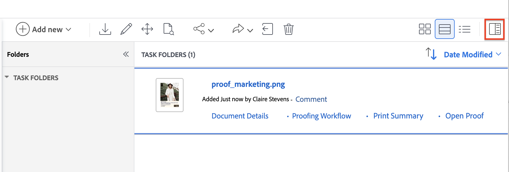
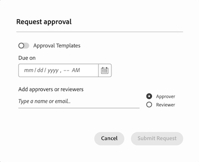

# Use new document approvals and proofing together

New document approvals in Workfront introduces a new set of features to help you review and approve documents. You can use the new document approvals workflow with the existing proofing viewer to add comments and markup to documents in review.

There are some key differences in the workflow when using new document approvals and proofing together:

* Decision buttons do not appear in viewer 

* Participants are shown in document Summary, not the proofing workflow 

* SOCD is proofing related and does not reflect the decision status of the document

## Upload a document and create a proof 

1. Go to the project, task, or issue where you want to add a new document.
1. Click the **Documents** tab, then click the **Add New** drop-down menu.
Or
Drag and drop the document into the document list.

   >[!NOTE]
   >
   >If you have **Automatically generate proofs when uploading documents** enabled in your user profile, the system automatically creates a simple proof.

1. Hover over the document, then click the **Create Proof** link that appears below the document name, and select **Simple Proof**. You need to create a simple proof because you will not use the proofing workflow for approvals. 

Users can use the proofing viewer to add comments and markup on the document. Continue to the next section to learn how to add review participants. 

## Open the document Summary and assign participants

You have the option to assign reviewers, approvers, or a mix of both:

* **Reviewers** can add comments and mark up assets. Once finished, they can mark their review as complete. Marking the review as complete is not required for the document to move forward in the approval process.
* **Approvers** can add comments and mark up assets. They must make a decision to move the approval process forward. 

To assign participants:

1. Select the document you uploaded and open the document Summary.
    

1. Scroll down to the Approvals section, then click **Add**.

1. (Optional) Choose an existing approval template. Users with a Standard license can create resuable Approval Templates from the Setup area. For more information, see [Create an Approval Template for assets and documents](/help/quicksilver/review-and-approve-work/document-reviews-and-approvals/manage-document-approvals/create-approval-template.md).

1. (Optional) Set a deadline for the approval. Users and teams are notified by email 72 hours, then 24 hours before the specified deadline.

1. To add an approver, click the Approver and and begin typing in a user or team name.

1. To add a reviewer, click the Reviewer checkbox and begin typing in a user or team name.

    
 
1. Once you've added all reviewers and approvers, click **Submit Request**. Participants are notified via email.

## Create a new version as needed

If you need another round of review and approval, you can create a new proof version.  <!-- and add the previous participants, new participants, or a mix of both. --> You can view information about previous versions and its participants in the document Summary.

To add a new version:

1. Drag and drop the new file on top of the previous document in Workfront. This automatically creates a new version. 

1. Once the document finishes uploading, select the document, then click **Create proof** > **Simple proof**. 

1. Select the document again, and open the document Summary.
    

1. Scroll down to the Approvals section, then click **Add**.

1. (Optional) Choose an existing approval template. Users with a Standard license can create resuable Approval Templates from the Setup area. For more information, see [Create an Approval Template for assets and documents](/help/quicksilver/review-and-approve-work/document-reviews-and-approvals/manage-document-approvals/create-approval-template.md).

1. (Optional) Set a deadline for the approval. Users and teams are notified by email 72 hours, then 24 hours before the specified deadline.

1. To add an approver, click the Approver and and begin typing in a user or team name.

1. To add a reviewer, click the Reviewer checkbox and begin typing in a user or team name.

    
 
1. Once you've added all reviewers and approvers, click **Submit Request**. Participants are notified via email.
 
<!-- add info about reusing previous participants once released -->

## Review the proof and make a decision 

>[!IMPORTANT]
>
>Document decision buttons do not appear in viewer. You must navigate back to the document Summary or Document Details page to make your decision or mark your review complete. 

To review and approve a document:

1. Go to your review email notification, and click to **Go to review**.

1. Once you're in Workfront, click **Go to proof**. 

1. Review the content, and add any comments or markup. For more information about how to use the proofing viewer, see [Review proofs within Adobe Workfront: article index](/help/quicksilver/review-and-approve-work/proofing/reviewing-proofs-within-workfront/review-proofs-in-wf.md).

1. When you are finished with your review, close the proofing viewer.

1. If you are on the Document Details page, the decision buttons are located in the top-right corner of the screen. 

1. Choose one of the following decisions:

    * **Approve**: The document does not need changes and is ready for use.
    * **Approve with changes**: The document needs changes and is ready for use once they are made. Additional approval is not required. 
    * **Needs work**: The document needs changes and is not ready for use. Once the specified changes are made, the document must be uploaded as a new version and go through another round of approvals. For more information on uploading a new version, see [ Create a new version as needed](#create-a-new-version-as-needed) in this article.

Once you make a decision, the document owner is notified via email.

