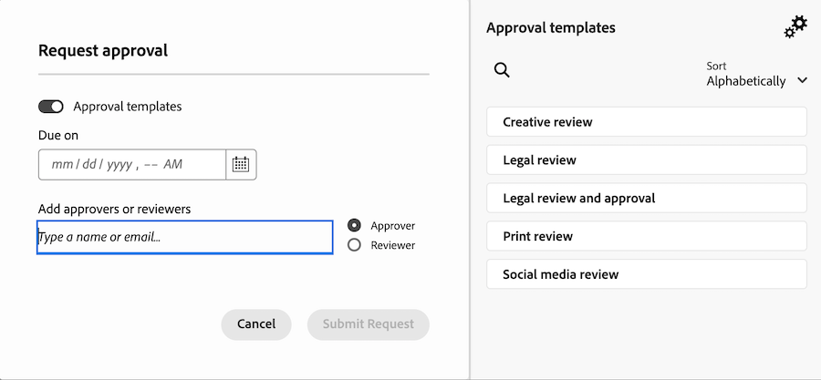

# Get started with asset review and approval with Frame.io

The new asset review and approval workflow is built around a tight integration between Workfront and Frame.io. This integration takes the best of what each product has to offer and combines them to create an experience that allows everyone involved in content creation to work in their tools of choice, while having access to comments, files, and status updates--all synchronized across both systems in real time.

For more information about Frame.io, see [Getting Started with Frame.io](https://support.frame.io/en/collections/49298-getting-started).

## Work initiation and planning in Workfront

The Workfront administrator enables the integration between Workfront and Frame.io by configuring the default Frame.io account in the Setup area and then designating Frame.io users in Workfront. This allows the coordinator to plan and initiate work using Workfront projects and formal review and approval workflows. 

### Configure the default Frame.io account [!BADGE Coming soon]{type=Informative}

Workfront administrators initiate the Workfront and Frame.io integration by adding a default Frame.io account in the Setup area of Workfront. Once the default Frame.io account is set up, any projects created in Workfront have a mirror project created in Frame.io.

>[!IMPORTANT]
>
>This feature is coming soon. For now, Frame.io accounts are added manually by the Workfront team. Contact your Adobe account representative for help. 

<!--For more information, see [Configure the [!DNL Workfront] and [!DNL Frame.io] integration](/help/quicksilver/administration-and-setup/configure-integrations/configure-wf-and-frame.md).

 in procedure article we need to cover how groups work with projects and how the frame account is associated with a group. And that accounts other than the default can be added on a 1:1 basis using the dev token. -->

### Enable Frame.io users Available now

Workfront users who regularly use Frame.io should be marked as Frame.io users. Workfront administrators can designate Frame.io users in the Workfront User Profile.

>[!TIP]
>
>We recommend enabling users who regularly work in creative tools and upload assets for review and approval as Frame.io users.

When a user is marked as a Frame.io user in Workfront and is added to a project:

* They are added as a Collaborator in Frame.io.
* They can send assets from Frame.io to Workfront for formal review and approval.
* They can view information in the one-way sync folder from Workfront. [!BADGE Coming soon]{type=Informative}

For more information, see [Configure the [!DNL Workfront] and [!DNL Frame.io] integration](/help/quicksilver/administration-and-setup/configure-integrations/configure-wf-and-frame.md).

### Create a project connected with Frame.io

Once the default Frame.io account is added and Frame.io users are designated, project coordinators can create Workfront projects connected with Frame.io. When you create a connected project, you can

* **Assign Frame.io users to tasks**: Frame.io enabled users are notified by email when they are assigned to a Workfront task, signaling there is work to complete. 
* **Share the project with Frame.io users**: When a project is shared with Frame.io enabled users, they have access to the project inside both Workfront and Frame.io.
* **Share creative materials with Frame.io**: Project coordinators can send instructions and materials from Workfront directly to the creative user in Frame.io using a one-way sync project folder. [!BADGE Coming soon]{type=Informative}
* **Track task progress**: Creatives can send finished assets and mark tasks complete--all without leaving Frame.io.

For more information, see [Create a project connected with Frame.io](/help/quicksilver/manage-work/projects/create-projects/create-frame-connected-project.md).

## Content creation and collaboration in Frame.io

Creatives can stay in their tools of choice and have the freedom to create, iterate, and conduct peer reviews inside Frame.io. 

When a creative is added to a connected project, they can do the following in Frame.io:

<!--* Access instructions from the project coordinator -->
* Conduct informal peer reviews
* Send finished assets to Workfront for formal review and approval
* Change the status of a task or mark it complete 
* Upload new versions and then resubmit them for approval <!--do they have to send to frame.io again?-->

For more information about Frame.io, see [I've been invited to collaborate on a Project](https://support.frame.io/en/articles/11125-i-ve-been-invited-to-collaborate-on-a-project).

## Review and approve assets

Once a creative sends a finished asset to Workfront from Frame.io, the project coordinator can initiate the formal review and approval process in Workfront. 

After the approval workflow is created, reviewers and approvers go back to Frame.io to add comments and mark up the asset. They can also make the approval decision in the Frame.io viewer.

### Initiate formal reviews and approvals in Workfront

Project coordinators can create one-time review and approvals or resuable approval templates. All review and approval activity in Frame.io is also recorded in Workfront.

Project coordinators have the option to assign reviewers, approvers, or a mix of both:

* **Reviewers** can add comments and mark up assets. Once finished, they can mark their review as complete. Marking the review as complete is not required for the asset to move forward in the approval process.
* **Approvers** can add comments and mark up assets. They must make a decision to move the approval process forward. 

#### Create a review and approval workflow

Reviewers and approvers can be added to a single-use approval workflow or a reusable approval template:

* **Single-use approvals**: In the project or task where the asset resides, the project coordinator can assign reviewers and approvers and set a completion deadline. Reviewers and approvers are reminded by email 72 and 24 hours before the deadline as well as on the deadline itself.

    For more information, see * [Create a review or approval request for a Frame.io asset](/help/quicksilver/review-and-approve-work/document-reviews-and-approvals/manage-document-approvals/create-request-for-frame-asset.md).

* **Approval templates**: In the Workfront Setup area, project coordinators can create resuable Approval Templates. Within a template, users can add reviewers and approvers and specify a completion timeframe. When the approval template is applied to an asset, the deadline is calculated from the specified timeframe. 

    Once a template is created, it can be applied to assets sent from Frame.io to begin the formal review and approval process in Workfront.

    For more information, see [Create an Approval Template](/help/quicksilver/review-and-approve-work/document-reviews-and-approvals/manage-document-approvals/create-approval-template.md)

    

#### Access the Frame.io viewer

Users can access the Frame.io viewer in the following ways:

* Workfront email notifications
* The Awaiting my approval widget in the new Workfront Home area
    

>[!NOTE]
>
>External Workfront users are notified via email and will be asked to create a Frame.io login to review and approve assets.

#### Add comments and mark up assets

All comments made in the Frame.io viewer are also recorded in the Workfront Updates tab. Replies made in Workfront do not appear in Frame.io. If comments are marked "Team only" in the Frame.io viewer, they will not appear in the Workfront Updates tab.

#### Make a decision

Once all review activity is complete, approvers must make one of the following decisions:

* **Approve**: The asset does not need changes and is ready for use.
* **Approve with changes**: The asset needs changes and is ready for use once they are made. Additional approval is not required. 
* **Needs work**: The asset needs changes and is not ready for use. Once the specified changes are made, the asset must be uploaded as a new version and go through another round of approvals. <!--is the same approval workflow automatically applied? Does the coordinator have to do anything to get the approval going? -->

Reviewers can mark their review complete inside of the Frame.io viewer, but this is not required for the asset to move forward in the approval process. 

For more information about decisions in Workfront, see [Document decision status overview](/help/quicksilver/review-and-approve-work/document-reviews-and-approvals/manage-document-approvals/document-approval-status.md). 

<!-- upload assets directly to workfront to be reviewed in Frame.io/ Will have to send manually at first

Reviewer/approver needs to go through email to get to frame vier
-->

### Track review and approval metrics

Project coordinators can monitor progress on all in-flight approvals in the Workfront Home area with the following widget:

* **All approvals**: Displays 2 charts with information about average approval time and decisions as well as list views of pending and overdue approvals.
    