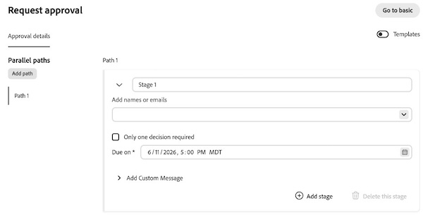

# Create a document approval workflow

{{highlighted-preview}}

You can request approval from other users or teams for a document in Adobe Workfront, or request they review a document without needing to approve it.

>[!IMPORTANT]
>
>The content of this article refers to updated document approval functionality that is only available for specific accounts. For information on standard approval processes, see the articles listed in [Work approvals](/help/quicksilver/review-and-approve-work/manage-approvals/manage-approvals.md).

## Access requirements

+++ Expand to view access requirements for the functionality in this article.

<table style="table-layout:auto"> 
 <col> 
 <col> 
 <tbody> 
  <tr> 
   <td role="rowheader">Adobe Workfront package</td> 
   <td> 
Any Workfront package to manage approvals using legacy Workfront storage

Any Workflow package to manage approvals using Adobe cloud storage
 </td> 
  </tr> 
  <tr> 
   <td role="rowheader">Adobe Workfront license</td>  
   <td>
   
Contributor or higher

   
Review or higher

   
If you are using the Frame.io integration, you must have a Standard license to create approval workflows.

   </td> 
  </tr> 
  <tr> 
   <td role="rowheader">Access level configurations</td> 
   <td> 
View or higher access to Projects, Tasks, Issues, Templates, Portfolios, Programs, Reports, Dashboards, and Calendars, Documents
 </td> 
  </tr>
  <tr> 
   <td role="rowheader">Object permissions</td> 
   <td> 
Manage access to the object associated with the request access or approval 
 </td> 
  </tr> 
 </tbody> 
</table>

For information, see [Access requirements in Workfront documentation](/help/quicksilver/administration-and-setup/add-users/access-levels-and-object-permissions/access-level-requirements-in-documentation.md). 

+++

## Create an approval workflow in the legacy documents area in Production

If your organization is on Workfront storage, you will see the legacy documents area when you access documents in Workfront. For more information about Workfront storage, see [Differences between Adobe cloud storage and legacy Workfront storage](/help/quicksilver/review-and-approve-work/esm-overview.md#differences-between-adobe-cloud-storage-and-legacy-workfront-storage).

To create an approval workflow:

1. Go to the project, task, or issue that contains the document, then select **Documents** in the left panel.

1. Click on the document you need and the Document Summary panel for that document opens.

1. Select the version of the document you would like to create an approval for in the version dropdown. The latest version is selected by default.

1. Scroll down to the **Approvals** section, then click **Create workflow**.

1. Fill in the following details:

   <table>
   <tr>
   <td><strong>Stage name</strong></td>
   <td>Add a stage name. You can change the name to something more descriptive, such as <em>Initial Review</em> or <em>Final Approval</em>.</td>
   </tr>
   <tr>
   <td><strong>Add names or emails</strong></td>
   <td>Begin typing a user or team name to add as an approver or reviewer. If you only have reviewers, they will be notified and have the option to complete the review but no decision will be required or made.</td>
   </tr>
   <tr>
   <td><strong>One decision required (optional)</strong></td>
   <td>The first person who makes a decision completes the stage.</td>
   </tr>
   <tr>
   <td><strong>Due date (optional)</strong></td>
   <td>Set a due date for the approval. Users and teams are notified by email 72 hours, then 24 hours before the specified due date.</td>
   </tr>
   </table>

1. (Optional) Repeat the previous step to add additional stages as needed.

   >[!NOTE]
   >
   >If you add multiple stages, the approval workflow proceeds in the order the stages are listed. When all required decisions are made, the next stage begins and the previous stage is locked.

   

## Create an approval workflow in the legacy documents area in Preview

If your organization is on Workfront storage, you will see the legacy documents area when you access documents in Workfront. For more information about Workfront storage, see [Differences between Adobe cloud storage and legacy Workfront storage](/help/quicksilver/review-and-approve-work/esm-overview.md#differences-between-adobe-cloud-storage-and-legacy-workfront-storage).

### Create a basic approval workflow

To create a single-stage approval workflow:

1. Go to the project, task, or issue that contains the document, then select **Documents** in the left panel.

1. Click on the document you need and the Document Summary panel for that document opens.

1. Select the version of the document you want to create an approval for in the version drop-down menu. The latest version is selected by default.

1. Scroll down to the **Approvals** section, then click **Create workflow**. The **Request approval** dialog opens in Basic mode.

1. Fill in the following details:

   <table>
   <tr>
   <td><strong>Use an approval template (optional)</strong></td>
   <td>The templates field is collapsed by default. Click the field to expand it, then select a template from the drop-down menu. If the template has one path and one stage, it applies in Basic mode. If the template has more than one stage or more than one path, the dialog automatically switches to Advanced mode and any input you entered in Basic mode is replaced by the template's content.</td>
   </tr>
   <tr>
   <td><strong>Add names or emails</strong></td>
   <td>Begin typing a user or team name to add as an approver or reviewer. If you only have reviewers, they will be notified and have the option to complete the review but no decision will be required or made.</td>
   </tr>
   <tr>
   <td><strong>Only one decision required (optional)</strong></td>
   <td>The first person who makes a decision completes the stage.</td>
   </tr>
   <tr>
   <td><strong>Due on (optional)</strong></td>
   <td>Set a due date for the approval. Users and teams are notified by email 72 hours, then 24 hours before the specified due date.</td>
   </tr>
   <tr>
   <td><strong>Add Custom Message (optional)</strong></td>
   <td>Type a message in the <strong>Add Custom Message</strong> text box. The message appears in the approval email notification and in the Approvals tab in Workfront.</td>
   </tr>
   </table>

1. Click **Request approval**.

   

>[!NOTE]
>
>* The **Request approval** dialog opens in Basic mode every time, regardless of your previous session.
>* If you edit a custom message after the approval workflow is created, an updated email notification is sent to all existing participants. If you add a participant later, the custom message is included in their email notification.
>* After an approval is saved, you can't switch it back to Basic mode. You can switch an in-progress approval from Basic to Advanced as long as the approval is not locked or completed.

### Create an advanced approval workflow 

Advanced mode supports parallel paths. Each path runs independently and contains one or more sequential stages. You can configure up to 30 paths and 100 stages total.

1. Go to the project, task, or issue that contains the document, then select **Documents** in the left panel.

1. Click on the document you need and the Document Summary panel for that document opens.

1. Select the version of the document you want to create an approval for in the version drop-down menu. The latest version is selected by default.

1. Scroll down to the **Approvals** section, then click **Create workflow**.

1. In the top right of the **Request approval** dialog, click **Go to advanced**. Any input you entered in Basic mode is preserved and applied to **Path 1**, **Stage 1**.

   >[!TIP]
   >
   >While you're creating the approval, you can return to Basic mode by clicking **Go to basic** in the top right. After you click **Request approval**, the **Go to basic** option is no longer available.

1. Fill in details for Stage 1 of Path 1:

   <table>
   <tr>
   <td><strong>Stage name</strong></td>
   <td>Stages are named <em>Stage 1</em>, <em>Stage 2</em>, and so on by default. Rename the stage to something more descriptive, such as <em>Initial Review</em> or <em>Final Approval</em>.</td>
   </tr>
   <tr>
   <td><strong>Add names or emails</strong></td>
   <td>Begin typing a user or team name to add as an approver or reviewer. If you only have reviewers, they will be notified and have the option to complete the review but no decision will be required or made.</td>
   </tr>
   <tr>
   <td><strong>Only one decision required (optional)</strong></td>
   <td>The first person who makes a decision completes the stage.</td>
   </tr>
   <tr>
   <td><strong>Due on (optional)</strong></td>
   <td>The first stage of each path supports an absolute due date. Each subsequent stage in the path supports a relative due date — the number of days from when that stage opens. Users and teams are notified by email 72 hours, then 24 hours before the due date.</td>
   </tr>
   <tr>
   <td><strong>Add Custom Message (optional)</strong></td>
   <td>Type a message in the <strong>Add Custom Message</strong> text box. The message appears in the approval email notification and in the Approvals tab in Workfront.
When you add a second stage, <strong>Show this message on all stages</strong> is selected by default. Leave it selected to use the same message in every stage. To use a different message for each stage, clear <strong>Show this message on all stages</strong>, then type the stage-specific message in each stage's <strong>Add Custom Message</strong> text box.
</td>
   </tr>
   </table>

1. (Optional) Click **Add stage** to add another stage to the path. Stages within a path run sequentially in the order they're listed. You can reorder stages within a path, but you can't move a stage from one path to another.

1. (Optional) Under **Parallel paths**, click **Add path** to add another path. The new path starts with one empty stage and becomes the selected path. To rename a path, hover the path label, click the pencil icon, then type a new name. To remove a path, hover the path label and click the trash icon.

   

   >[!TIP]
   >
   >To clear all paths and stages and start over, click **Reset** in the top right.

1. Click **Request approval**.

>[!NOTE]
>
>* Paths run independently and in parallel. Within a path, stages run sequentially. When all required decisions in a stage are made, the next stage in that path begins and the previous stage is locked.
>* **Path 1** can't be removed. Other paths can be removed only if no stage within the path is locked or completed.
>* Paths can't be reordered.

## Create an approval workflow in the new Documents area in Production

If your organization uses Adobe cloud storage, you will see the new Documents area when you access documents in Workfront. For more information about Adobe cloud storage, see [Adobe cloud storage overview](/help/quicksilver/review-and-approve-work/esm-overview.md).

To create an approval workflow:

1. Go to the project, task, or issue that contains the document, then select **Documents** in the left panel.

1. Click on the document, then click the **Approvals** icon on the right side of the page.

   

1. Click **Create workflow**, then fill in the following details:

   <table>
   <tr>
   <td><strong>Stage name</strong></td>
   <td>Add a stage name. You can change the name to something more descriptive, such as <em>Initial Review</em> or <em>Final Approval</em>.</td>
   </tr>
   <tr>
   <td><strong>Add names or emails</strong></td>
   <td>Begin typing a user or team name to add as an approver or reviewer. If you only have reviewers, they will be notified and have the option to complete the review but no decision will be required or made.</td>
   </tr>
   <tr>
   <td><strong>One decision required (optional)</strong></td>
   <td>The first person who makes a decision completes the stage.</td>
   </tr>
   <tr>
   <td><strong>Due date (optional)</strong></td>
   <td>Set a due date for the approval. Users and teams are notified by email 72 hours, then 24 hours before the specified due date.</td>
   </tr>
   </table>

1. (Optional) Repeat the previous step to add additional stages as needed.

   >[!NOTE]
   >
   >If you add multiple stages, the approval workflow proceeds in the order the stages are listed. When all required decisions are made, the next stage begins and the previous stage is locked.

   

## Create an approval workflow in the new Documents area in Preview

If your organization uses Adobe cloud storage, you will see the new Documents area when you access documents in Workfront. For more information about Adobe cloud storage, see [Adobe cloud storage overview](/help/quicksilver/review-and-approve-work/esm-overview.md).

The **Request approval** dialog opens in **Basic** mode by default. Basic mode is a single stage with one set of approvers or reviewers. Switch to **Advanced** mode to configure multi-stage approvals or parallel paths.

### Create a basic approval workflow

To create a single-stage approval workflow:

1. Go to the project, task, or issue that contains the document, then select **Documents** in the left panel.

1. Click on the document, then click the **Approvals** icon on the right side of the page.

   

1. Click **Create workflow**. The **Request approval** dialog opens in Basic mode.

1. Fill in the following details:

   <table>
   <tr>
   <td><strong>Use an approval template (optional)</strong></td>
   <td>The templates field is collapsed by default. Click the field to expand it, then select a template from the drop-down menu. If the template has one path and one stage, it applies in Basic mode. If the template has more than one stage or more than one path, the dialog automatically switches to Advanced mode and any input you entered in Basic mode is replaced by the template's content.</td>
   </tr>
   <tr>
   <td><strong>Add names or emails</strong></td>
   <td>Begin typing a user or team name to add as an approver or reviewer. If you only have reviewers, they will be notified and have the option to complete the review but no decision will be required or made.</td>
   </tr>
   <tr>
   <td><strong>Only one decision required (optional)</strong></td>
   <td>The first person who makes a decision completes the stage.</td>
   </tr>
   <tr>
   <td><strong>Due on (optional)</strong></td>
   <td>Set a due date for the approval. Users and teams are notified by email 72 hours, then 24 hours before the specified due date.</td>
   </tr>
   <tr>
   <td><strong>Add Custom Message (optional)</strong></td>
   <td>Type a message in the <strong>Add Custom Message</strong> text box. The message appears in the approval email notification and in the Approvals tab in Workfront.</td>
   </tr>
   </table>

1. Click **Request approval**.

   

>[!NOTE]
>
>* The **Request approval** dialog opens in Basic mode every time, regardless of your previous session.
>* If you edit a custom message after the approval workflow is created, an updated email notification is sent to all existing participants. If you add a participant later, the custom message is included in their email notification.
>* After an approval is saved, you can't switch it back to Basic mode. You can switch an in-progress approval from Basic to Advanced as long as the approval is not locked or completed.

### Create an advanced approval workflow with multiple stages or parallel paths

Advanced mode supports parallel paths. Each path runs independently and contains one or more sequential stages. You can configure up to 30 paths and 100 stages total.

1. Go to the project, task, or issue that contains the document, then select **Documents** in the left panel.

1. Click on the document, then click the **Approvals** icon on the right side of the page.

   

1. Click **Create workflow**.

1. In the top right of the **Request approval** dialog, click **Go to advanced**. Any input you entered in Basic mode is preserved and applied to **Path 1**, **Stage 1**.

   >[!TIP]
   >
   >While you're creating the approval, you can return to Basic mode by clicking **Go to basic** in the top right. After you click **Request approval**, the **Go to basic** option is no longer available.

1. Fill in details for Stage 1 of Path 1:

   <table>
   <tr>
   <td><strong>Stage name</strong></td>
   <td>Stages are named <em>Stage 1</em>, <em>Stage 2</em>, and so on by default. Rename the stage to something more descriptive, such as <em>Initial Review</em> or <em>Final Approval</em>.</td>
   </tr>
   <tr>
   <td><strong>Add names or emails</strong></td>
   <td>Begin typing a user or team name to add as an approver or reviewer. If you only have reviewers, they will be notified and have the option to complete the review but no decision will be required or made.</td>
   </tr>
   <tr>
   <td><strong>Only one decision required (optional)</strong></td>
   <td>The first person who makes a decision completes the stage.</td>
   </tr>
   <tr>
   <td><strong>Due on (optional)</strong></td>
   <td>The first stage of each path supports an absolute due date. Each subsequent stage in the path supports a relative due date — the number of days from when that stage opens. Users and teams are notified by email 72 hours, then 24 hours before the due date.</td>
   </tr>
   <tr>
   <td><strong>Add Custom Message (optional)</strong></td>
   <td>Type a message in the <strong>Add Custom Message</strong> text box. The message appears in the approval email notification and in the Approvals tab in Workfront.
When you add a second stage, <strong>Show this message on all stages</strong> is selected by default. Leave it selected to use the same message in every stage. To use a different message for each stage, clear <strong>Show this message on all stages</strong>, then type the stage-specific message in each stage's <strong>Add Custom Message</strong> text box.
</td>
   </tr>
   </table>

1. (Optional) Click **Add stage** to add another stage to the path. Stages within a path run sequentially in the order they're listed. You can reorder stages within a path, but you can't move a stage from one path to another.

1. (Optional) Under **Parallel paths**, click **Add path** to add another path. The new path starts with one empty stage and becomes the selected path. To rename a path, hover the path label, click the pencil icon, then type a new name. To remove a path, hover the path label and click the trash icon.

   

   >[!TIP]
   >
   >To clear all paths and stages and start over, click **Reset** in the top right.

1. Click **Request approval**.

>[!NOTE]
>
>* Paths run independently and in parallel. Within a path, stages run sequentially. When all required decisions in a stage are made, the next stage in that path begins and the previous stage is locked.
>* **Path 1** can't be removed. Other paths can be removed only if no stage within the path is locked or completed.
>* Paths can't be reordered.

<!--
## Resubmit an approval on a new version

Document approval decisions are not automatically reset when you upload a new version. For example, if your document is approved with changes, the decision will show "changes" as the decision, even if you upload a new version with the specified changes. You can clear the decision on a new version if you manually resubmit the approval.

1. Go to the project, task, or issue that contains the document, then select **Documents**.
1. Find the document you need.

1. Scroll down to the **Approvals** section in the Summary, click the More icon, then click Resubmit.

   
-->
