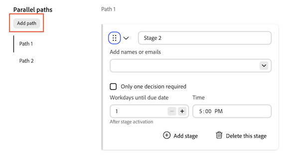

# Create an approval workflow template for documents

In the Workfront Setup area, users with a Standard license can create reusable Approval Templates. A template is visible only to the user who created it, unless the creator shares it with specific users or with everyone in the organization. Once created, Approval Templates can be applied to assets in the Documents area of an object. 
>[!IMPORTANT]
>
>The content of this article refers to updated document approval functionality that is only available for specific accounts. For information on standard approval processes, see the articles listed in [Work approvals](/help/quicksilver/review-and-approve-work/manage-approvals/manage-approvals.md).

## Access requirements

+++ Expand to view access requirements for the functionality in this article.

<table style="table-layout:auto"> 
 <col> 
 <col> 
 <tbody> 
  <tr> 
   <td role="rowheader">Adobe Workfront package</td> 
   <td>
Any Workfront package to manage approvals using legacy Workfront storage

Any Workflow package to manage approvals using Adobe cloud storage
 </td> 
  </tr> 
  <tr> 
   <td role="rowheader">Adobe Workfront license</td> 
   <td> 
Standard
 
   
Plan

   </td> 
  </tr> 
 </tbody> 
</table>

For more detail about the information in this table, see [Access requirements in Workfront documentation](/help/quicksilver/administration-and-setup/add-users/access-levels-and-object-permissions/access-level-requirements-in-documentation.md).

+++

<!--
## Create an Approval Template in Production

{{step-1-to-setup}}

1. In the left panel, click **Review and Approval** > **Approval Templates**.
1. Click **New Template** on the right side of the page. 

1. Fill in the following details:

   <table>
     <tr>
   <td><strong>Template name</strong></td>
   <td>Add a template name. </td>
   </tr>
   <tr>
   <td><strong>Stage name</strong></td>
   <td>Add a stage name. You can change the name to something more descriptive, such as <em>Initial Review</em> or <em>Final Approval</em>.</td>
   </tr>
   <tr>
   <td><strong>Add names or emails</strong></td>
   <td>Begin typing a user or team name to add as an approver or reviewer. If you only have reviewers, they will be notified and have the option to complete the review but no decision will be required or made.</td>
   </tr>
   <tr>
   <td><strong>One decision required (optional)</strong></td>
   <td>The first person who makes a decision completes the stage.</td>
   </tr>
   <tr>
   <td><strong>Workdays until due date</strong></td>
   <td>Choose how many workdays until the approval is due after a stage is activated.</td>
   </tr>
   </table>

1. (Optional) Repeat the previous step to add additional stages as needed.

   >[!NOTE]
   >
   >If you add multiple stages, the approval workflow proceeds in the order the stages are listed. When all required decisions are made, the next stage begins and the previous stage is locked.

   
    
1. Click **Save**.

Once the template is created, it can be applied to documents in the Documents area of an object to begin the formal review and approval process in Workfront.
-->

## Create an approval template

The approval template dialog always opens in Advanced mode. There is no Basic mode for templates. You can configure up to 30 parallel paths in a template, with up to 100 stages total. Each path runs independently and can contain one or more sequential stages.

To create an approval template:

{{step-1-to-setup}}

1. In the left panel, click **Review and Approval** > **Approval Templates**.

1. Click **New Template** on the right side of the page.

1. Add a **Template name**.

1. Fill in details for Stage 1 of Path 1:

   <table>
   <tr>
   <td><strong>Stage name</strong></td>
   <td>Stages are named <em>Stage 1</em>, <em>Stage 2</em>, and so on by default. Rename the stage to something more descriptive, such as <em>Initial Review</em> or <em>Final Approval</em>.</td>
   </tr>
   <tr>
   <td><strong>Add names or emails (optional)</strong></td>
   <td>Begin typing a user or team name to add as an approver or reviewer. Participants are optional in templates. You can add them when the template is applied to a document.
Note: A reviewer or approver can be assigned to only one open stage at a time on the same asset. If multiple parallel stages are open simultaneously, the same person can't be added to more than one.
</td>
   </tr>
   <tr>
   <td><strong>Only one decision required (optional)</strong></td>
   <td>The first person who makes a decision completes the stage.</td>
   </tr>
   <tr>
   <td><strong>Workdays until due date (optional)</strong></td>
   <td>Choose how many workdays the stage takes to complete after it opens. The first stage of each path also supports an absolute due date. Each subsequent stage in the path supports a relative due date only.</td>
   </tr>
   <tr>
   <td><strong>Add Custom Message (optional)</strong></td>
   <td>Type a message in the <strong>Add Custom Message</strong> text box. When the template is applied to a document, the message appears in the approval email notification and in the Approvals tab in Workfront.
When you add a second stage, <strong>Show this message on all stages</strong> is selected by default. Leave it selected to use the same message in every stage. To use a different message for each stage, clear <strong>Show this message on all stages</strong>, then type the stage-specific message in each stage's <strong>Add Custom Message</strong> text box.
</td>
   </tr>
   </table>

    

1. (Optional) Click **Add stage** to add another stage to the path. Stages within a path run sequentially in the order they're listed. When all required decisions in a stage are made, the next stage in that path begins and the previous stage is locked. You can reorder stages within a path, but you can't move a stage from one path to another. Each path can have a different number of stages.

1. (Optional) Under **Parallel paths**, click **Add path** to add another path. The new path starts with one empty stage and becomes the selected path. Paths can't be reordered.

   

1. (Optional) To rename a path, hover the path label, click the pencil icon, then type a new name. To remove a path, hover the path label and click the trash icon. **Path 1** can't be removed, and other paths can be removed only if no stage within the path is locked or completed.

1. (Optional) To clear all paths and stages and start over, click **Reset** in the upper-right corner.

1. Click **Save**.

Once the template is created, it can be applied to documents in the Documents area of an object to begin the formal review and approval process in Workfront.

>[!NOTE]
>
>New templates are visible only to you. If you want other users to be able to select this template when requesting an approval, you must share it. For more information, see [Share a template](#share-a-template) in this article.

## Share a template

By default, a template is visible only to you, the creator. You can share it with specific users, or with everyone in your organization, so they can view and use it when requesting an approval.

To share a template:

1. In the left panel, click **Review and Approval** > **Approval Templates**.
1. Select the checkbox next to the template you want to share. A bar appears at the bottom of the page.
1. In the bar, click **Share**. The **Share approval template** dialog opens.
1. Click the sharing drop-down, then select one of the following:

   <table>
   <tr>
   <td><strong>Shared with everyone</strong></td>
   <td>All users in your organization can view and use the template.</td>
   </tr>
   <tr>
   <td><strong>Only invited people can access</strong></td>
   <td>Only you and the users you add can view and use the template. This is the default for new templates.</td>
   </tr>
   </table>

1. If you selected **Only invited people can access**, under **Give approval template access to**, use the **Search for people** field to add the users you want to give access to.
1. Click **Share**.

The **Shared with** column in the Approval Templates list shows who has access to each template. You are always listed as the template's creator and can't be removed.

<!--
 Once a template is created, it can be applied to assets sent from Frame.io to begin the formal review and approval process in Workfront.

-->
