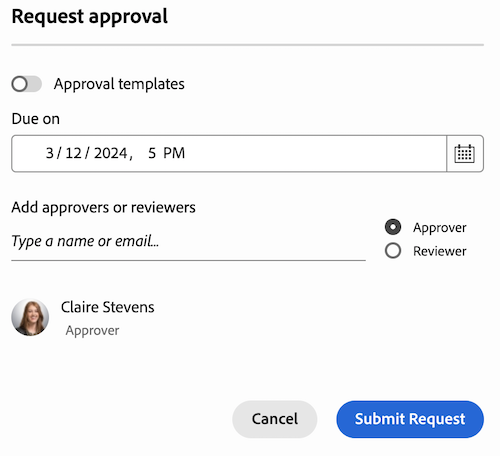
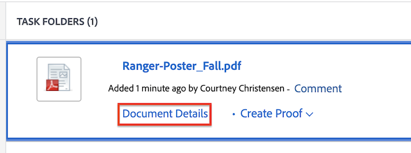

# Create a review or approval request for a Frame.io asset

>[!IMPORTANT]
>
>The content of this article refers to updated approval functionality that is only available for specific accounts. For information on standard approval processes, see the articles listed in [Work approvals](/help/quicksilver/review-and-approve-work/manage-approvals/manage-approvals.md).

<!--
## Access requirements

You must have the following access to perform the steps in this article:

<table style="table-layout:auto"> 
 <col> 
 <col> 
 <tbody> 
  <tr> 
   <td role="rowheader">Adobe Workfront plan*</td> 
   <td> 
Any
 </td> 
  </tr> 
  <tr> 
   <td role="rowheader">Adobe Workfront license*</td>  
   <td> 
Review or higher
 </td> 
  </tr> 
  <tr> 
   <td role="rowheader">Access level configurations*</td> 
   <td> 
View or higher access to Projects, Tasks, Issues, Templates, Portfolios, Programs, Reports, Dashboards, and Calendars, Documents
 
Note: If you still don't have access, ask your Workfront administrator if they set additional restrictions in your access level. For information on how a Workfront administrator can modify your access level, see <a href="/help/quicksilver/administration-and-setup/add-users/configure-and-grant-access/create-modify-access-levels.md" class="MCXref xref">Create or modify custom access levels</a>.
 </td> 
  </tr>
  <tr> 
   <td role="rowheader">Object permissions</td> 
   <td> 
Manage access to the object associated with the request access or approval 
 
For information on requesting additional access, see <a href="/help/quicksilver/workfront-basics/grant-and-request-access-to-objects/request-access.md" class="MCXref xref">Request access to objects </a>.
 </td> 
  </tr> 
 </tbody> 
</table>

&#42;To find out what plan, license type, or access you have, contact your Workfront administrator.
-->

## Create a review or approval request from the Document Summary

1. Go to the project, task, or issue that contains the Frame.io connected, then select **Documents**.

   >[!TIP]
   >
   >Frame.io connected assets have the Frame.io logo next to them.

1. Click on the Frame.io connected asset you need to open the Document Summary panel.

1. (Optional) In the **Version** drop-down menu, select the version of the asset you want to create an approval for. The latest version is selected by default.

1. Scroll down to the **Approvals** section, then click **Add**.

   

1. (Optional) Set a deadline for the approval. Users and teams are notified by email 72 hours, then 24 hours before the specified deadline.

1. To add an approver, click the **Approver** and and begin typing in a user or team name. 

1. To add a reviewer, click the **Reviewer** checkbox and begin typing in a user or team name. 

   

1. Repeat the previous step to add additional approvers or reviewers.

## Create a review or approval request from the Document Details page

1. Hover over the document, then click **Document Details**.
   

1. Near the document name, select the version of the document you would like to create an approval for. The latest version is selected by default.

1. In the left panel, click **Approvals**.

1. (Optional) Set a deadline for the approval. Users and teams are notified by email 72 hours, then 24 hours before the specified deadline.

1. To add an approver, click the **Approver** and and begin typing in a user or team name. 

1. To add a reviewer, click the **Reviewer** checkbox and begin typing in a user or team name. 

   

1. Repeat the previous step to add additional approvers or reviewers.

<!--
## Resubmit an approval on a new version

Document approval decisions are not automatically reset when you upload a new version. For example, if your document is approved with changes, the decision will show "changes" as the decision, even if you upload a new version with the specified changes. You can clear the decision on a new version if you manually resubmit the approval.

1. Go to the project, task, or issue that contains the document, then select **Documents**.
1. Find the document you need.

1. Scroll down to the **Approvals** section in the Summary, click the More icon, then click Resubmit.

   
-->
