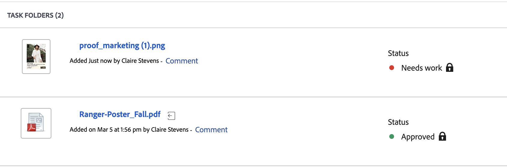

# Document decision status

You can view the document's status directly in the document list:

The following statuses are available:

<table>
            <col style="width: 50%;" />
            <col style="width: 50%;" />
            <tbody>
                 <tr>
                    <td>
                        Pending Review

                    </td>
                    <td>
                        <ul>
                            <li>
                                Reviewers and approvers have been notified, but have not yet opened the asset.
                            </li>
                        </ul>
                    </td>
                </tr>
                 <tr>
                    <td>
                        In review

                    </td>
                    <td>
                        <ul>
                            <li>
                                
At least one reviewer has viewed the asset

                            </li>
                            <li>
                                
At least one reviewer has not completed their review

                            </li>
                            <li>
                                
No approvers have been assigned to this asset

                            </li>
                        </ul>
                    </td>
                </tr>
                 <tr>
                    <td>
                        Reviewed

                    </td>
                    <td>
                        <ul>
                            <li>
                                
All reviewers have completed their review

                            </li>
                            <li>
                                
No approvers have been assigned to this asset

                            </li>
                        </ul>
                    </td>
                </tr>
                 <tr>
                    <td>Needs work

                    </td>
                    <td>
                        <ul>
                            <li>
                                
All approvals and reviews are complete

                            </li>
                            <li>
                                
At least one approver has made a decision of "Needs work"

                                
Other approvers may have given decisions of "Approved with changes" or "Approved"
                            </li>
                        </ul>
                    </td>
                </tr>
                  <tr>
                    <td>Approved with changes

                    </td>
                    <td>
                        <ul>
                            <li>
                                
All approvals and reviews are complete

                            </li>
                            <li>
                                
At least one approver has made a decision of "Approved with changes"

                                
Other approvers may have given decisions of "Approved"
                            </li>
                        </ul>
                    </td>
                </tr>
                 <tr>
                    <td>Approved

                    </td>
                    <td>
                        <ul>
                            <li>
                                
All approvals and reviews are complete

                            </li>
                            <li>
                                
All approvers may have given decisions of "Approved"
                            </li>
                        </ul>
                    </td>
                </tr>
           </tbody>
        </table>

<!--

<table>
            <col style="width: 50%;" />
            <col style="width: 50%;" />
            <tbody>
                 <tr>
                    <td>
                        Pending review

                    </td>
                    <td>
                        <ul>
                            <li>
                                Reviewers and approvers have been notified, but have not yet opened the asset.
                            </li>
                        </ul>
                    </td>
                </tr>
                 <tr>
                    <td>
                        In review

                    </td>
                    <td>
                        <ul>
                            <li>
                                
At least one reviewer or approver has viewed the asset

                            </li>
                            <li>
                                
At least one reviewer has not completed their review

Or

                                
At least one approver has not made an approval decision

                            </li>
                        </ul>
                    </td>
                </tr>
                 <tr>
                    <td>
                        Reviewed

                    </td>
                    <td>
                        <ul>
                            <li>
                                All reviews are complete
                            </li>
                            <li>
                                There are no approvers
                            </li>
                        </ul>
                    </td>
                </tr>
                 <tr>
                    <td>Needs work

                    </td>
                    <td>
                        <ul>
                            <li>
                                
All approvals and reviews are complete

                            </li>
                            <li>
                                
At least one approver has made a decision of "Needs work"

                                
Other approvers may have given decisions of "Approved with changes" or "Approved"
                            </li>
                        </ul>
                    </td>
                </tr>
                  <tr>
                    <td>Approved with changes

                    </td>
                    <td>
                        <ul>
                            <li>
                                
All approvals and reviews are complete

                            </li>
                            <li>
                                
At least one approver has made a decision of "Approved with changes"

                                
Other approvers may have given decisions of "Approved"
                            </li>
                        </ul>
                    </td>
                </tr>
                 <tr>
                    <td>Approved

                    </td>
                    <td>
                        <ul>
                            <li>
                                
All approvals and reviews are complete

                            </li>
                            <li>
                                
All approvers may have given decisions of "Approved"
                            </li>
                        </ul>
                    </td>
                </tr>
           </tbody>
        </table>

-->