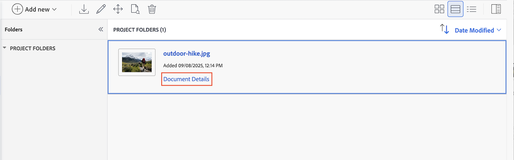
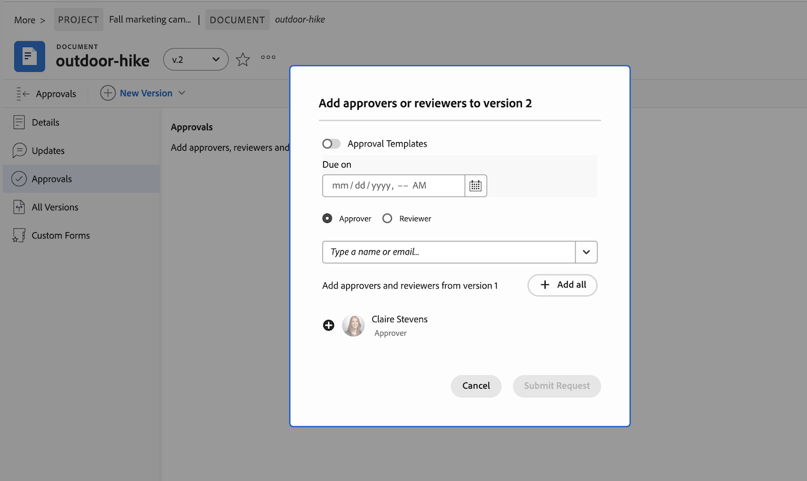

# Upload a new document version and request an approval

If a document is marked needs work in a previous review, you can upload a new version to the original document and start another round of approvals. Once you upload a new version of the document, the previous versions are locked. 

If the file name of the new version is different from the file name of the previous version, Workfront displays the document with the newer file name.

When a new version is added to a document with outstanding approvals, the approval on the previous version displays as Withdrawn. The previous approval process closes, even if some participants have not yet made a decision.

If the newest document version is deleted, the previous versions remain locked. If you need to edit a pervious version, you must manually unlock it. 

## Access requirements

+++ Expand to view access requirements for the functionality in this article.

<table style="table-layout:auto"> 
 <col> 
 </col> 
 <col> 
 </col> 
 <tbody> 
  <tr> 
   <td role="rowheader">Adobe Workfront package</td> 
   <td> 
 Any
 </td> 
  </tr> 
  <tr> 
   <td role="rowheader">Adobe Workfront licenses*</td> 
   <td> 
Request or higher

   
Contributor or higher
 </td> 
  </tr> 
  <tr data-mc-conditions=""> 
   <td role="rowheader">Access level configurations</td> 
   <td> 
Edit access to Documents
 
Note: If you still don't have access, ask your Workfront administrator if they set additional restrictions in your access level. For information on how a Workfront administrator can modify your access level, see <a href="/help/quicksilver/administration-and-setup/add-users/configure-and-grant-access/create-modify-access-levels.md" class="MCXref xref">Create or modify custom access levels</a>.
 </td> 
  </tr> 
  <tr data-mc-conditions=""> 
   <td role="rowheader">Object permissions</td> 
   <td> 
Edit access to the object associated with the document
 
For information on requesting additional access, see <a href="/help/quicksilver/workfront-basics/grant-and-request-access-to-objects/grant-and-request-access-to-objects.md" class="MCXref xref">Request access to objects </a>.
 </td> 
  </tr> 
 </tbody> 
</table>

For information, see [Access requirements in Workfront documentation](/help/quicksilver/administration-and-setup/add-users/access-levels-and-object-permissions/access-level-requirements-in-documentation.md).

+++

## Use drag-and-drop to add a new version

>[!NOTE]
>
>Drag-and-drop does not work with Internet Explorer.

If you need another round of review and approval on a document, you can create a new document version in Workfront.

You can add the previous participants, new participants, or a mix of both. You can view information about previous versions and participants on the Document Details page. 

To add a new version:

1. Navigate to the document in Workfront.
1. Drag and drop the new file on top of the previous document. This automatically creates a new version. 

1. Once the document finishes uploading, select the document, then click **Document Details**.
    

1. In the left panel, click **Approvals**, then click **Add**.

1. To add all previous participants, click **Add all**. You can also add new participants or remove previous participants as needed.

1. To add an existing approval template, click the Template button and begin typing in a template name.

   >[!TIP]
   >
   >   Users with a Standard license can create resuable Approval Templates from the Setup area. For more information, see [Create an Approval Template for assets and documents](/help/quicksilver/review-and-approve-work/document-reviews-and-approvals/manage-document-approvals/create-approval-template.md).

1. (Optional) Set a deadline for the approval. Users and teams are notified by email 72 hours, then 24 hours before the specified deadline.
 
1. Once you've added all reviewers and approvers, click **Submit Request**. Participants are notified via email.
 
    

