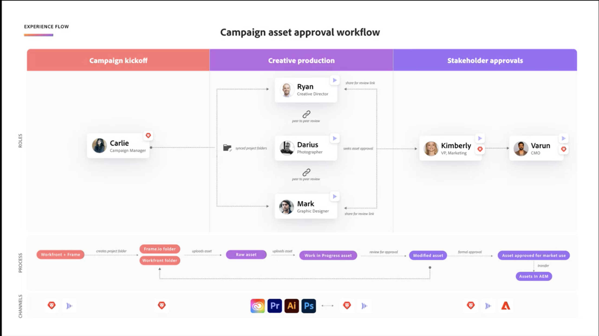

# Asset review and approval overview

The new Asset review and approval workflow is built around a tight integration between Workfront and Frame.io. This integration takes the best of what each product has to offer and combines it to create an experience that allows all personas involved in content creation to work in their tools of choice, while having access to comments, files, and status updates synchronized across both systems in real time.

For more information about Frame.io, see [Getting Started with Frame.io](https://support.frame.io/en/collections/49298-getting-started).

## Work initiation and planning in Workfront

The Workfront administrator enables the integration between Workfront and Frame.io by configuring the default Frame.io account in the Setup area and then designating Frame.io users in Workfront. This allows the coordinator to plan and initiate work using Workfront Projects and formal review and approval. 

### Configure a default Frame.io account

Workfront administrators initiate the Workfront and Frame.io integration by adding a default Frame.io account in the Setup area of Workfront. Once a default Frame.io account is set up, the integration creates connected projects between Workfront and Frame.io. 

For more information, see [].

<!-- in procedure article we need to cover how groups work with projects and how the frame account is associated with a group. And that accounts other than the default can be added on a 1:1 basis using the dev token. -->

### Enable Frame.io users

Workfront users who regularly use Frame.io should be marked as Frame.io users. Workfront administrators can designate Frame.io users in the Workfront User Profile. 

When a user is marked as a Frame.io user in Workfront and is added to a project,

* They are added as a Collaborator in Frame.io
* They can send assets from Frame.io to Workfront for formal review and approval

>[!TIP]
>
>We recommend enabling users who regularly work in creative tools and upload assets for review and approval as Frame.io users.

For more information, see [].

### Create a project connected with Frame.io

Once the default Frame.io account is added and Frame.io users are designated, project coordinators can create Workfront projects connected with Frame.io. When you create a connected project, you can

* **Assign Frame.io users to tasks**: Frame.io enabled users are notified by email when they are assinged to a task, signaling there is work to complete. 
* **Share the project with Frame.io users**: Projects shared with Frame.io enabled users grants them access to the project inside of Frame.io.
* **Share creative materials with Frame.io**: You can send instructions and materials from Workfront directly to the creative user in Frame.io using a one-way sync project folder. 
* **Track task progress**: Creatives can send finished assets and mark tasks complete without leaving Frame.io.

For more information, see [].

<!--Preassign approval templates to tasks coming in the future-->

## Content creation and collaboration in Frame.io

Creatives can stay in their tools of choice and have the freedom to create, iterate, and conduct peer reviews inside of Frame.io. 

When a creative is added to an connected project, they can do all of the following without leaving Frame.io: 

* Access instructions from the project coordinator
* Conduct informal peer reviews
* Send finished assets to Workfront for formal review and approval
* Change the status of a task or mark it complete 
<!-- * Notification of decision
* Upload new versions of connected assets marked as needs more work < will automatically connect>-->

## Review and approve assets in Frame.io

Once a creative sends a finished asset to Workfront from Frame.io, the project coordinator can kick-off the formal review and approval process in Workfront. All review and approval activity is recorded in Workfront. 

Any comments made in Frame.io are also reflected in the Updates tab in Workfront. Replies made in Workfront are not relfected in Frame.io.

Comments marked Team only will not appear in the Workfront Updates tab.

### Initiate formal reviews and approvals in Workfront

Once a creative sends a finished asset to Workfront from Frame.io, the project coordinator can kick-off the formal review and approval process in Workfront. 

Project coordinators can create one-time review and approvals, or they can create resuable Approval Templates in the Setup area of workfront: 

Project coordinators have the option to assign reviewers, approvers, or a mix of both:

* **Reviewers** can comment and markup assets. Once finished, they can mark their review as complete. <!--example of when to add reviewers-->
* **Approvers** Can comment, markup assets, and must make a decsion to move the approval process forward. 

Reviewers and approvers can be added to single-use or approval templates:

<!--can also assign teams and set deadline-->

* **Single-use approvals**: Set approval deadlines

* **Approval templates**
    In the Workfront Setup area, users with a Standard license can create resuable Approval Templates. Within a template, users can specifiy a timeframe and add reviewers and approvers. <!--do we want to mention any upcoming plans here? -->

    Once a template is created, it can be applied to assets sent from Frame.io to begin the formal review and approval process in Workfront.

<!-- can set timreframe which calculates deadline once approval is started. >

    For more information, see [Create and manage Approval Templates](/)<!--don't forget link-->

* Upload an asset from Workfront and send it to frame for review and approval - Coming soon?

### Review and approval assets

Frame.io connected asset stakeholders can review and approve inside the frame viewer with comments syncing to workfront update stream, decisions, ect

<!-- include screenshot from frame.io-->

you can access the Frame.io veiewer from whereever you work

**Review and approve assets from Frame.io**
how they are notified

**Review and approve assets from Workfront**
how they are notified

Home Awaiting my approval widget
Email - deadline emails 72, 24, and on deadline.

External WF users will be asked to create a login for frame 

If the asset is not frame connected, they can view thumbnail in WF and use comment stream. review and approval decisons can be made.

<!-- upload assets directly to workfront to be reviewed in Frame.io/ Will have to send manually at first

Reviewer/approver needs to go through email to get to frame vier
-->

### Track review and approval metrics

Widgets in home
Approval velocity report ?

<!--
### Published approved assets to Adobe Experience Manager Assets

Use the native integration to send approved assets to AEM.
-->

## Example campaign asset approval workflow

intro para?

 <!-- probbly need a different version of this but add something similar rather than typing all out?-->
