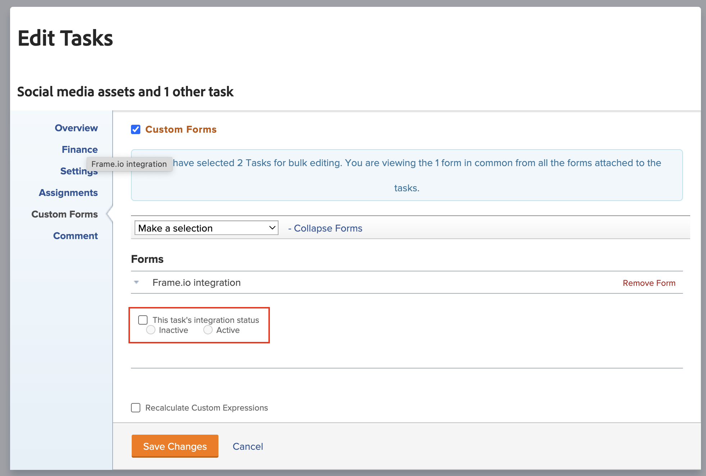

# Connect a Workfront project to a Frame.io project

You can connect a Workfornt project to a Frame.io project to streamlight the review and approval process between the two applications. We are actively improving this feature.

>[!IMPORTANT]
>
>The content of this article refers to updated document approval functionality that is only available for specific accounts. For information on standard approval processes, see the articles listed in [Work approvals](/help/quicksilver/review-and-approve-work/manage-approvals/manage-approvals.md).

## Access requirements

You must have the following access to perform the steps in this article:

<table style="table-layout:auto"> 
 <col> 
 <col> 
 <tbody> 
<!--  <tr> 
   <td role="rowheader">Adobe Workfront plan</td> 
   <td> 
Any
 </td> 
  </tr> 
  <tr> 
   <td role="rowheader">Adobe Workfront license</td> 
   <td> 
Standard
 </td> 
  </tr> -->
  <tr> 
   <td role="rowheader">Access level configurations*</td> 
   <td> 
You must be a Workfront administrator.
 </td> 
  </tr> 
   <tr>
   <td>Product
   </td>
   <td>You must have Frame.io.
   </td>
  </tr>
 </tbody> 
</table>

For more detail about the information in this table, see [Access requirements in Workfront documentation](/help/quicksilver/administration-and-setup/add-users/access-levels-and-object-permissions/access-level-requirements-in-documentation.md).

## Prerequisites

* You must have a Workfront group connected to a Frame.io team. For more info, see [Connect a Workfront group to a Frame.io team](/help/quicksilver/review-and-approve-work/document-reviews-and-approvals/review-and-approve-documents/connect-wf-to-frame.md). 

## Create the project and add a connected group 

{{step1-to-projects}}

1. Create a new project from scratch or a template. For information on how to create a project, see [Create a project](/help/quicksilver/manage-work/projects/create-projects/create-project.md). 

1. In the left panel, find **Project Details**. 

1. Find the **Group** field on the right side of the screen, and remove the Default group.  

1. In the drop-down menu, find the desired group. Groups connected with Frame.io display the Frame.io icon.

1. Make any other project configuration changes. 

1. Click **Save Changes**.   

1. Continue to the next section.

## Add a task and set the integration status to Active 

>[!NOTE]
>
>Subtasks are not currenly supported.

1. Create the tasks you need to populate in Frame.io 

1. Select the tasks you need, then click **Edit**. 

1. Scroll to the **Custom Forms** section, and find the Frame.io integration form.  

    >[!IMPORTANT]
    >
    >You must add the frame connected group to see this custom form on the tasks. 

1. Enable the checkbox, and choose **Active**. 
    

1. Click **Save Changes**. A Frame.io icon displays next to the project name. 

1. Assign users to teams tasks. 

>[!NOTE]
>
>Users or teams added to the tasks are also added to the Frame.io project. 

1. Upload any documents or creative briefs in the Project Documents area. 

The project is still not connected, you must continue to the next section to finish the integration. 

## Enable the project in Frame.io 

1. Change the status from **Planning** to **Current** or a custom status that equals current. This finishes the integration and generates the project, tasks, and any documents in Frame.io. 

The frame icon next to the project name turns purple signaling the integration was successful.