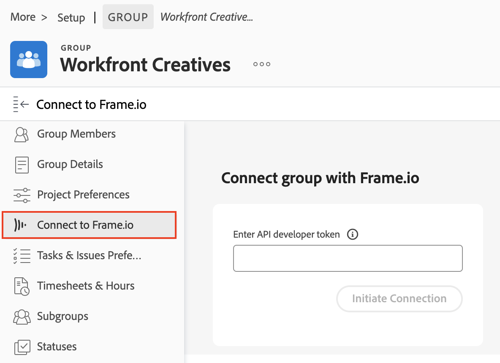

# Connect a Workfront Group to a Frame.io Team

Workfront uses Frame.io teams to start the integration  

We are actively improving this feature.

## Access requirements

You must have the following access to perform the steps in this article:

<table style="table-layout:auto"> 
 <col> 
 <col> 
 <tbody> 
  <tr> 
   <td role="rowheader">Adobe Workfront plan</td> 
   <td> 
Any
 </td> 
  </tr> 
  <tr> 
   <td role="rowheader">Adobe Workfront license</td> 
   <td> 
Standard
 </td> 
  </tr> 
  <tr> 
   <td role="rowheader">Access level configurations*</td> 
   <td> 
You must be a Workfront administrator.
 </td> 
  </tr> 
  <tr>
   <td><strong>Product</strong>
   </td>
   <td>You must have Frame.io.
   </td>
  </tr>
 </tbody> 
</table>

For more detail about the information in this table, see [Access requirements in Workfront documentation](/help/quicksilver/administration-and-setup/add-users/access-levels-and-object-permissions/access-level-requirements-in-documentation.md).

## Prerequisites

* Create a Frame.io team to map to a Workfront group.
* Find the API developer token for the team.

## Connect a Workfront Group to a Frame.io Team

To connect a Workfront group to a Frame.io Team:

{{step-1-to-setup}}

1. In the left panel, click **Groups**.
1. Choose and existing group, or click **Create group**. 
1. In the left panel, click **Connect to Frame.io**. 

1. Enter the API developer token.
1. Click **Initiate Connection**.

Workfront projects can now be connected to Frame.io. For more information, see [Connect a Workfront project to a Frame.io project](/help/quicksilver/review-and-approve-work/document-reviews-and-approvals/review-and-approve-documents/connect-wf-project-with-frame.md).