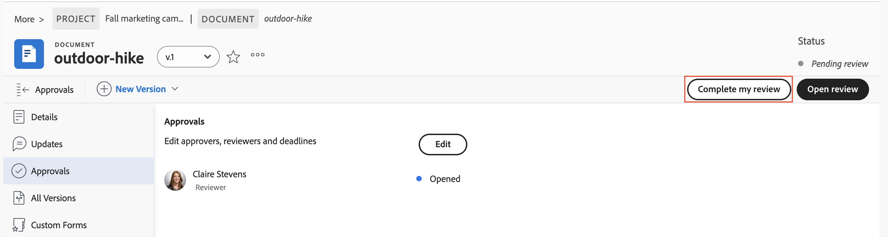
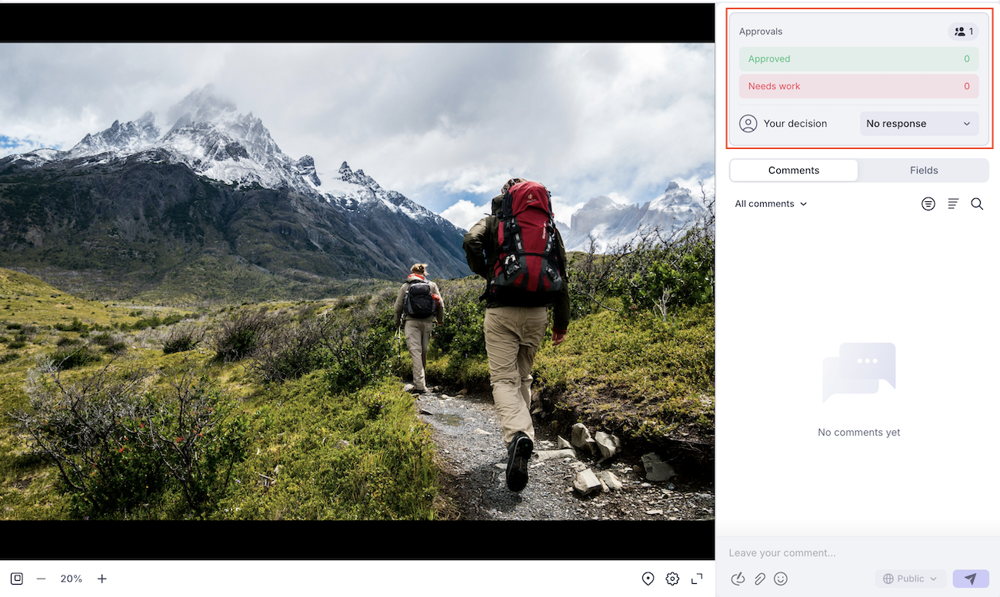

# Review and approve with the Frame.io viewer

You can review and approve documents in Workfront using the Frame.io viewer.

Reviewing Workfront documents with the Frame.io viewer allows you to leave comments or mark up specific sections of a document, image, or video to collaborate efficiently with your team and ensure that feedback is clear and actionable.

For more information on the Frame.io integration with Workfront, see [Frame.io integration overview](/help/quicksilver/review-and-approve-work/native-integrations/frame-io/frame-int-overview.md).

## Access requirements

+++ Expand to view access requirements for the functionality in this article.

<table style="table-layout:auto"> 
 <col> 
 </col> 
 <col> 
 </col> 
 <tbody> 
  <tr> 
   <td role="rowheader">Adobe Workfront package</td> 
   <td> 
 Any
 </td> 
  </tr> 
  <tr> 
   <td role="rowheader">Adobe Workfront license</td> 
   <td> 
Request or higher

   
Contributor or higher
 </td> 
  </tr> 
  <tr data-mc-conditions=""> 
   <td role="rowheader">Access level configurations</td> 
   <td> 
Edit access to Documents
  </td> 
  </tr> 
  <tr data-mc-conditions=""> 
   <td role="rowheader">Object permissions</td> 
   <td> 
Edit access to the object associated with the document
  </td> 
  </tr> 
 </tbody> 
</table>

For information, see [Access requirements in Workfront documentation](/help/quicksilver/administration-and-setup/add-users/access-levels-and-object-permissions/access-level-requirements-in-documentation.md).

+++

## Review a document

As a reviewer, you can add comments to and mark up assets. Once finished, you can mark your review complete in Workfront. Marking the review as complete is not required for the asset to move forward in the approval process.

1. Go to your review email notification, and click **Go to review**.
or
Go the Workfront Home page, find the My Approvals widget, then click **Open review**.

    >[!NOTE]
    > 
    >You may have to add the My Approvals widget to your Home page. For more information, see [Add, edit, or remove widgets in Home](/help/quicksilver/workfront-basics/using-home/using-the-home-area/add-edit-remove-widgets-in-new-home.md).

1. In Frame.io, use the commenting tools to leave feedback or ask questions.
    Comments and asset markup is visible only in the Frame.io viewer. Comments do not display in Workfront. For more information on using the Frame.io viewer, see [Commenting on your media](https://help.frame.io/en/articles/9105251-commenting-on-your-media).
1. Once you're satisfied with the document, navigate back to the Document Details page in Workfront and mark your review as complete.

   

## Approve a document

As an approver, you can add comments and mark up to assets. You must make a decision to move the approval process forward.

The document does not move to an approved status until all assigned approvers choose "approved".

To make a decision on a document:

1. Go to your review email notification, and click **Go to review**.
or
Go the Workfront Home page, find the My Approvals widget, then click **Open review**.

    >[!NOTE]
    > 
    >You may have to add the My Approvals widget to your Home page. For more information, see [Add, edit, or remove widgets in Home](/help/quicksilver/workfront-basics/using-home/using-the-home-area/add-edit-remove-widgets-in-new-home.md).

1. In Frame.io, use the commenting tools to leave feedback or ask questions. Comments and asset markup are visible only in the Frame.io viewer. For more information on using the Frame.io viewer, see [Commenting on your media](https://help.frame.io/en/articles/9105251-commenting-on-your-media).
1. Once you're satisfied with the document, you can choose one of the following decisions in the Frame.io viewer:

    * **Approve**: The asset does not need changes and is ready for use.
    * **Needs work**: The asset needs changes and is not ready for use. Once the specified changes are made, the asset must be uploaded as a new version and go through another round of approvals. For more information, see [Upload a new document version and request an approval](/help/quicksilver/review-and-approve-work/document-reviews-and-approvals/manage-document-approvals/upload-new-doc-version.md). <!--do they need to tell someone it was uploaded via comment tagging?-->

    Once you make a decision, the document owner is notified via email.

    For more information about decisions in Workfront, see [Document decision status overview](/help/quicksilver/review-and-approve-work/document-reviews-and-approvals/manage-document-approvals/document-approval-status.md). 

    

<!--is document owner the correct term?-->
