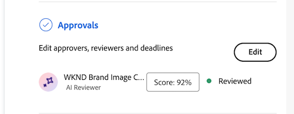
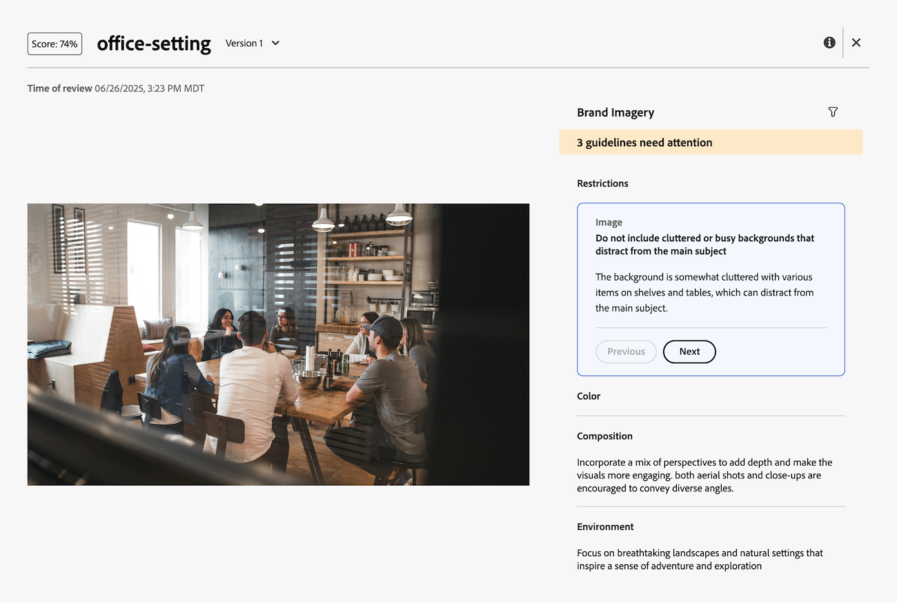

# View AI Reviewer score and feedback 

Seconds after you submit the review and approval request, you can view the score and feedback from the AI Reviewer in the Document Summary panel. 

The AI Reviewer is not designed to be a decision-maker in the review and approval workflow. It only provides a score and recommendations to align the asset with the specified brand requirements. 

## View score and feedback 

You can view the AI Reviewer's score and feedback from the Document Summary panel or in the Approvals tab on the Document Details page. 

1. In the Workfront notification email, click **Go to review**. 
or
Go to the Documents area where the document is uploaded, and open the Document summary panel.
1. Click **Score**.
    

In the score and feedback window, the AI Reviewer provides an explanation on how the asset does not meet the specified guidelines. 

## Upload a new version and add AI reviewer again

If you need to adjust the asset based on the AI Reviewer's feedback, you can upload a new version and start a new review. 

For more information, see [Upload a new document version and request an approval](/help/quicksilver/review-and-approve-work/document-reviews-and-approvals/manage-document-approvals/upload-new-doc-version.md).