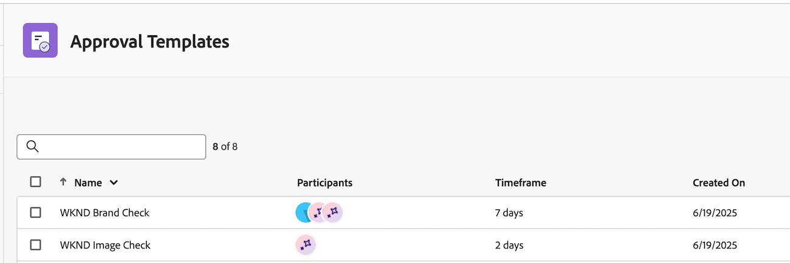
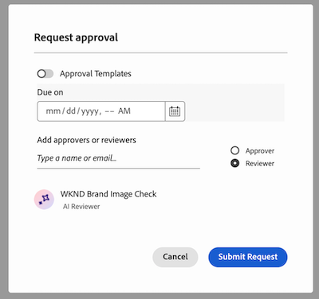
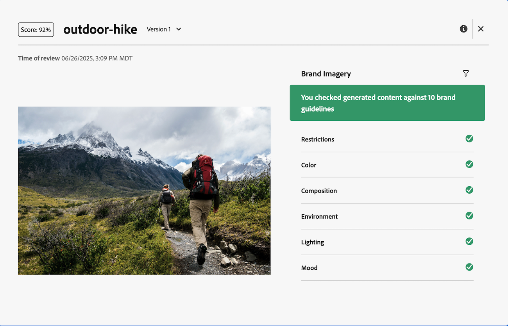

# Get started with the Workfront AI Reviewer

>[!NOTE]
>
>This feature is currently in beta. 

With the Workfront AI Reviewer, you can increase content velocity and optimize brand compliance in the review and approval workflow. You can add AI Reviewers to approval templates or individual review and approval requests in Workfront. 

## Access requirements

To set up AI Reviewers in Workfront, you must be a system administrator. 

Any user can add the AI Reviewer to a review and approval request.

## Prerequisites 

* Your organization must have migrated to Adobe IMS (Identity Management System).
* Your Workfront instance must have Unified Approvals enabled. 
* Your organization must have GenStudio Foundation.
* Adobe must have a signed Adobe Gen AI agreement on file.
    For more information on signing the agreement, see [Sign the Adobe Gen AI agreement](/help/quicksilver/workfront-basics/ai-assistant/ai-assistant-overview.md#sign-the-adobe-gen-ai-agreement).

## Join the beta

To join the beta, go to **Setup** > **Review and Approval** > **AI Reviewers**, and click **Accept Terms**.

## Supported file types {#supported-file-types-ai-reviewer}

>[!CONTEXTUALHELP]
>id="wf_document_approvals_ai_supported_files"
>title="Unsupported file type"
>abstract="This AI Reviewer doesn't support the selected file type. Upload a supported file type, or remove the AI reviewer to submit the request."

The AI Reviewer can review the following file types:

* PNG (.png)
* JPEG (.jpeg, .jpg)
* WEBP (.webp)
* Non-animated GIF (.gif)

If you upload an unsupported file type, the AI Reviewer option will not appear when creating an approval.

## Set up brand guidelines

The Workfront AI Reviewer uses the brand guidelines set up in Genstudio Foundation when reviewing your content. Currently, you can only set up brand guidelines for images. For more information, see [Get started with Adobe GenStudio for Performance Marketing](https://experienceleague.adobe.com/en/docs/genstudio-for-performance-marketing/user-guide/get-started).

## Create AI Reviewers

Once there is at least one brand set up in GenStudio Foundation, Workfront administrators can begin creating AI Reviewers in the Setup area. Those AI Reviewers can then be assigned to approval templates and individual review and approval requests. Right now, AI reviewers can only review against image brand guidelines.

For more information, see [Create AI Reviewers](/help/quicksilver/review-and-approve-work/document-reviews-and-approvals/set-up-ai-reviewer.md).

## Add AI Reviewers to review and approval requests

Users can add AI Reviewers to an existing approval templates or to individual review and approval requests. 

### Approval templates

If your organization often adds the same people to review and approval requests, Standard license users can create approval templates in the Workfront Setup area.

Users can add AI Reviewers to approval templates to automatically check for brand compliance when a template is used to create a request. 

Once created, approval templates can be applied to assets in the Documents area of a project, task, or issue.

For more information, see [Create an Approval Template for assets and documents](/help/quicksilver/review-and-approve-work/document-reviews-and-approvals/manage-document-approvals/create-approval-template.md).

### Individual review and approval request 

When users create individual review and approval requests, they can add an AI Reviewer in with other participants or they can create a single request with only the AI Reviewer to check for brand compliance. 

For more information, see [Create a document review or approval request](/help/quicksilver/review-and-approve-work/document-reviews-and-approvals/manage-document-approvals/create-a-document-approval.md).

## View AI Reviewer score and feedback 

Seconds after the review and approval request with an AI Reviewer is submitted, the score and feedback from the AI Reviewer is available in the Document Summary panel--even if other participants are still reviewing and making decisions. 

Approval owners also receive an email notifying them that a review has been completed on the asset. From the email, click **Go to review** and see the score and feedback in Workfront. 

The AI Reviewer is not designed to be a decision-maker in the review and approval workflow. It only provides a score and recommendations to align the asset with the specified brand requirements. 

If the image does long meet brand guidelines, the creative can upload a new version and the approval owner can create a second review and approval request with the AI Reviewer, allowing you to switch between versions and compare feedback.

For more information on viewing scores and feedback, see [View AI Reviewer score and feedback](/help/quicksilver/review-and-approve-work/document-reviews-and-approvals/view-ai-reviewer-feedback.md).

## Video Walkthrough

>[!VIDEO](https://video.tv.adobe.com/v/3470847/)