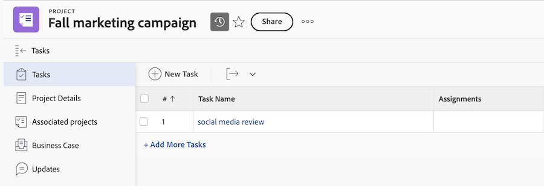

# Object permissions and access level overview for the Adobe enterprise storage model

<!--linked in UI -->

Adobe enterprise storage is a cloud-based storage solution that serves as the central storage repository for assets across Adobe enterprise products. Workfront environments that use Adobe enterprise storage have slightly different object permissions and access level behaviors than those using legacy Workfront document storage. 

## Access levels

Workfront access levels apply only within Workfront. Project and Document restrictions within Workfront don't always apply in other Adobe applications.

### Environments using both Adobe enterprise storage and legacy Workfront storage

Document access behaves differently depending on whether the project is on Adobe enterprise storage or legacy Workfront storage: 

* **Legacy Workfront storage**: Projects, programs, portfolios, and templates that use legacy Workfront storage follow standard Workfront access level logic for document access. When an access level has **No access** selected for documents, they are unable to see documents in Workfront or other Adobe products like Frame.io or Creative Cloud.
* **Adobe enterprise storage**:  Projects, programs, portfolios, and templates that use Adobe enterprise storage follow Adobe enterprise storage access level logic for other Adobe products.

    * **Projects, programs, portfolios, and templates object permissions**: When an access level has **No access** selected for projects, programs, portfolios, and templates but the object is shared with them, users are unable to see the object in Workfront, but they can still view the object name and any associated documents in other Adobe tools, such as Frame.io and Adobe Creative Cloud. 
    * **Documents permissions**: When an access level has **No access** selected for documents, users are unable to see documents on projects in Workfront, but they can still view and manage documents for projects shared with them in other Adobe tools, such as Frame.io and Adobe Creative Cloud. This is because document access is determined by project-level permissions in Adobe enterprise storage, rather than Workfront access levels alone.

If you have Adobe enterprise storage enabled in your Workfront environment, you can create both Adobe enterprise storage projects and legacy Workfront storage projects. Legacy Workfront storage projects show an icon next to the project name wherever it displays in Workfront. Adobe enterprise storage projects do not show an icon.

### Environments using only Adobe enterprise storage

You cannot modify document permissions at the access level for projects, programs, and portfolios that use Adobe enterprise storage. 

All access levels have edit access to documents. Project-level permissions determine document access in other Adobe tools.

You cannot restrict document inheritance access.

### Environments using only legacy Workfront storage

No changes to document access levels or behavior.

## Projects

Users with project-level permissions can view and manage documents for projects in other Adobe products like Frame.io and Adobe Creative Cloud.

Project names are also visible outside of Workfront for ESM projects.

Financial data is not visible outside of Workfront for ESM projects.

## Tasks and issues

Documents are stored at the project level but able to be shared to individual tasks and issues as needed. Users with task and issue access automatically inherit document access from the project. YOu cannot modify their level of access. They have manage access or no access.
