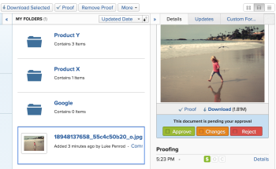
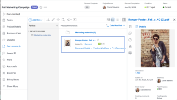

# Approving work

<!--

(NOTE:&nbsp;From&nbsp;Courtney: Linked to Training sites/ articles , don't change title and link)

-->

If you are set&nbsp;as an approver, you&nbsp;should regularly review what work is awaiting your approval.

For information about creating approval processes, see [Create an approval process for work items](../../administration-and-setup/customize-workfront/configure-approval-milestone-processes/create-approval-processes.md).

For information about associating approvals with work in Workfront, see [Associate a new or existing approval process with work](../../review-and-approve-work/manage-approvals/associate-approval-with-work.md).

## Access requirements

+++ Expand to view access requirements for the functionality in this article.

<table style="table-layout:auto"> 
 <col> 
 <col> 
 <tbody> 
  <tr> 
   <td role="rowheader">Adobe Workfront package</td> 
   <td> 
Any
 </td> 
  </tr> 
  <tr> 
   <td role="rowheader">Adobe Workfront license</td> 
   <td> 
   
Contributor or higher

   
Review or higher
 </td> 
  </tr> 
  <tr> 
   <td role="rowheader">Access level configurations</td> 
   <td> 
View or higher access to the objects associated with approvals
</td> 
  </tr> 
  <tr> 
   <td role="rowheader">Object permissions</td> 
   <td> 
View or higher permissions to the objects associated with approvals
</td> 
  </tr> 
 </tbody> 
</table>

For information, see [Access requirements in Workfront documentation](/help/quicksilver/administration-and-setup/add-users/access-levels-and-object-permissions/access-level-requirements-in-documentation.md). 

+++

## Locate approvals in Adobe Workfront

You can view and manage approvals in various areas of Workfront.

For more information about viewing items awaiting approvals or items that you have submitted for approval yourself, see [View approvals](../../review-and-approve-work/manage-approvals/view-approvals.md).

## Approve work from the Home area

1. Click the **[!UICONTROL Main Menu]**  in the upper-right corner, then click **[!UICONTROL Home]**.
1. (Conditional) Click **Customize** to add the **My Approvals** widget.
1. (Conditional) Click the **Filter** drop-down menu, then select **All** to see approvals assigned and delegated to you.

   >[!NOTE]
   >
   >Approvals assigned to Job Roles or Groups don't display in Home. Approvals assigned to Teams display in the My Approvals widget for each team member.

1. Select the item where you want to make an approval decision.

   

1. Click one of the available options when making an approval decision in the right panel. The following options display in the upper-right corner of the page, depending on the type of item you are approving:

   <table>
   <tr>
      <td>
      
<strong>Access</strong>

      </td>
      <td>
      
<strong>Work items</strong>

      </td>
      <td>
      
<strong>Documents</strong>

      </td>
      <td>
      
<strong>Proofs</strong>

      </td>
   </tr>
   <tr>
      <td>
       <ul>
      <li>Grant</li>
      <li>Ignore</li>
      </ul>
      You can adjust the level of access in the <b>Change access</b> drop-down menu if desired.
      </td>
      <td>
         <ul>
         <li>Approve</li>
         <li>Reject</li>
         </ul>
      You can leave a comment with your decision by click ing the drop-down menu in the decision button.
      </td>
      <td>
   Assigned as an approver
         <ul>
         <li>Approve</li>
         <li>Approve with changes</li>
         <li>Needs work</li>
         </ul>
   Assigned as a reviewer
         <ul>
         <li>Complete my review</li>
         </ul>
      The options in this column apply only to Unified Approvals. Legacy document approvals appear the same as Work item approvals. 
      </td>
      <td>
         <ul>
         <li>Go to proof</li>
         </ul>
         You make your decision in the proof viewer. For information about reviewing a proof, see <a href="../../review-and-approve-work/proofing/reviewing-proofs-within-workfront/review-proofs-in-wf.md">Review proofs within Adobe Workfront</a>.
      </td>
   </tr>
   </table>
      
After you make a decision, the approval is removed from the My Approval widget.   

## Approve work directly from a project, task, or issue

When a project, task, or issue is pending approval, you can approve or reject the approval directly from the project, task, or issue. You can also view details regarding the approval process.

To approve work directly from a project, task, or issue:

1. Go to the project, task, or issue that requires your approval.

   Approval information regarding the current approval process of a project, task, or issue displays in the item's header.

   

   The following approval information is available:

   <table style="table-layout:auto"> 
    <col> 
    <col> 
    <tbody> 
     <tr> 
      <td role="rowheader">Status</td> 
      <td>The current status of the project, task, or issue. This is the current status of the item that is pending the approval. The status is approved after each stage in the approval process is approved.</td> 
     </tr> 
     <tr> 
      <td role="rowheader">Approval stages</td> 
      <td>The stages of the approval process.  The current stage that is pending approval is displayed as  Pending . Stages that have already been approved are displayed as  Approved ; stages that have not yet been approved are displayed as  Not Started .</td> 
     </tr> 
    </tbody> 
   </table>

1. Click **Approve** or **Reject**, depending on whether you want to approve or reject the approval process.  
   The approval stage that was pending approval is now approved, and the approval process moves to the next stage. The status is approved after all stages have been approved.

## Approve a document directly from a document

1. Go to the documents area that contains the document that requires your approval.
1. Select the document, then click **Approve**,&nbsp;**Changes**, or **Reject**.  
     
     

1. (Optional) If a proof has been generated for the document, you can approve the document within the proofing interface, as described in [Approve a document from a proof](#approve-a-document-from-a-proof).

## Approve a document from an approval notification email

Depending on your notification settings, you may receive emails notifying you about documents for which other users need you to make an approval decision. When you receive an email containing a **Make Approval Decision** button, you can can start the approval process directly from the email:

1. From the email, click **Make Approval Decision** to open the Document Details page for the proof . 
1. Do any of the following to review the document:

   * View the metadata about the document.
   * If a proof has been created for reviewing the document with markup and comments, click **Open proof**  near the upper right corner and review the proof.    
   
     <!--   
     [Andrzej, does it make sense to leave this here if it's s document approval?&nbsp;Would there never be a proof in that situation?]   
     -->

     For information about reviewing proofs, see [Review proofs within Adobe Workfront](../../review-and-approve-work/proofing/reviewing-proofs-within-workfront/review-proofs-in-wf.md).

1. Click a **Decision** option in the  upper right corner  to approve, approve with changes, or reject the document.

## Approve a document from a proof {#approve-a-document-from-a-proof}

You can approve a document within the proofing viewer. For more information, see [Make a decision on a proof in the proofing viewer](../../review-and-approve-work/proofing/reviewing-proofs-within-workfront/make-a-decision-on-a-proof/make-decisions-on-proof.md) in the article [Make a decision on a proof in the proofing viewer](../../review-and-approve-work/proofing/reviewing-proofs-within-workfront/make-a-decision-on-a-proof/make-decisions-on-proof.md).
