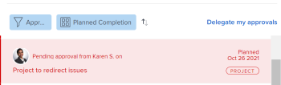
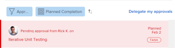
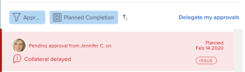
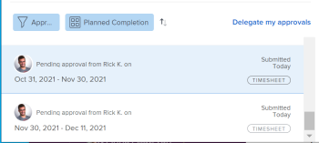

# Recall submitted approvals

You can recall any of the following objects submitted for approval:

* Projects
* Tasks
* Issues
* Timesheets
* Documents
* Access Requests

## Access requirements

+++ Expand to view access requirements for the functionality in this article.

You must have the following access to perform the steps in this article:

<table style="table-layout:auto"> 
 <col> 
 <col> 
 <tbody> 
  <tr> 
   <td role="rowheader">Adobe Workfront plan*</td> 
   <td> 
Any
 </td> 
  </tr> 
  <tr> 
   <td role="rowheader">Adobe Workfront license*</td> 
   <td> 
Request or higher
 </td> 
  </tr> 
  <tr> 
   <td role="rowheader">Access level configurations*</td> 
   <td> 
View or higher access to Projects, Tasks, Issues, Timesheets, Documents
 
Note: If you still don't have access, ask your Workfront administrator if they set additional restrictions in your access level. For information on how a Workfront administrator can modify your access level, see <a href="../../administration-and-setup/add-users/configure-and-grant-access/create-modify-access-levels.md" class="MCXref xref">Create or modify custom access levels</a>.
 </td> 
  </tr> 
  <tr> 
   <td role="rowheader">Object permissions</td> 
   <td> 
View or higher access to the object associated with the approval 
 
For information on requesting additional access, see <a href="../../workfront-basics/grant-and-request-access-to-objects/request-access.md" class="MCXref xref">Request access to objects </a>.
 </td> 
  </tr> 
 </tbody> 
</table>

To find out what plan, license type, or access you have, contact your Workfront administrator.

+++

## Projects

When you recall a project approval, the project returns to the status it was in prior to the initiation of the approval process.

If you recall an approval that is associated with the beginning status of the project, the approval process is bypassed and the project remains in the beginning status.

>[!NOTE]
>
>You can associate the first status of a project or task with an approval process by using a template.&nbsp;For more information about adding approvals to a template, see&nbsp; [Edit project templates](../../manage-work/projects/create-and-manage-templates/edit-templates.md).

To recall a project approval you submitted:

1. Click the **Home** icon  in the upper-left corner of Adobe Workfront.

   >[!NOTE]
   >
   >Your Workfront administrator might make the following changes to the Home icon in your environment:
   >
   >* Replace it with an image customized to illustrate your organization. In this case, the icon will look different that shown in this article. 
   >* Replace the page linked to it with a different page. In this case, click the **Main Menu**  in the upper-right corner of the page, then click **Home**.

1. In the **Work List** area, navigate to the **Approvals I've Submitted** grouping.

1. Click a **Project** approval in the Work List.

   This opens the project on the right of the Work List.

   

1. Click **Recall** in the upper-right corner of the right panel.

## Tasks

When you recall a task approval, the task returns to the status it was in prior to the initiation of the approval process.

If you recall an approval that is associated with the beginning status of the task, the approval process is bypassed and the task remains in the beginning status.

>[!NOTE]
>
>You can associate the first status of a project or task with an approval process by using a template. For more information about adding approvals to a template, see [Edit project templates](../../manage-work/projects/create-and-manage-templates/edit-templates.md).

To recall a task approval you submitted:

1. Click the **Home** icon  in the upper-left corner of Adobe Workfront.

   >[!NOTE]
   >
   >Your Workfront administrator might make the following changes to the Home icon in your environment:
   >
   >* Replace it with an image customized to illustrate your organization. In this case, the icon will look different that shown in this article. 
   >* Replace the page linked to it with a different page. In this case, click the **Main Menu**  in the upper-right corner of the page, then click **Home**.

1. In the **Work List** area, navigate to the **Approvals I've Submitted** grouping.

1. Click a **Task** approval in the Work List.

   This opens the task to the right of the Work List.

   

1. Click **Recall** in the upper-right corner of the right panel.

## Issues

When you recall an issue approval, the issue returns to the status it was in prior to the initiation of the approval process.

If you recall an approval that is associated with the beginning status of the issue, the approval process is bypassed and the issue remains in the beginning status.

>[!NOTE]
>
>You can associate the first status of an issue with an approval process by using a template. For more information about creating a request queue, see [Create a Request Queue](../../manage-work/requests/create-and-manage-request-queues/create-request-queue.md).

1. Click the **Home** icon  in the upper-left corner of Adobe Workfront.

   >[!NOTE]
   >
   >Your Workfront administrator might make the following changes to the Home icon in your environment:
   >
   >* Replace it with an image customized to illustrate your organization. In this case, the icon will look different that shown in this article. 
   >* Replace the page linked to it with a different page. In this case, click the **Main Menu**  in the upper-right corner of the page, then click **Home**.

1. In the **Work List** area, navigate to the **Approvals I've Submitted** grouping.

1. Click an **Issue** approval in the Work List.

   This opens the issue to the right of the Work List.

   

1. Click **Recall** in the upper-right corner of the right panel.

## Timesheets

When you recall a timesheet approval, the timesheet returns to the status it was in before it was submitted for approval.

1. Click the **Home** icon  in the upper-left corner of Adobe Workfront.

   >[!NOTE]
   >
   >Your Workfront administrator might make the following changes to the Home icon in your environment:
   >
   >* Replace it with an image customized to illustrate your organization. In this case, the icon will look different that shown in this article. 
   >* Replace the page linked to it with a different page. In this case, click the **Main Menu**  in the upper-right corner of the page, then click **Home**.

1. In the **Work List** area, navigate to the **Approvals I've Submitted** grouping.

1. Click a **Timesheet** approval in the Work List.

   This opens the timesheet to the right of the Work List.

   

1. Click **Recall** in the upper-right corner of the right panel.

## Documents

To recall a document approval, you must manually remove one or all users from the approval.

1. Click the **Home** icon  in the upper-left corner of Adobe Workfront.

   >[!NOTE]
   >
   >Your Workfront administrator might make the following changes to the Home icon in your environment:
   >
   >* Replace it with an image customized to illustrate your organization. In this case, the icon will look different that shown in this article. 
   >* Replace the page linked to it with a different page. In this case, click the **Main Menu**  in the upper-right corner of the page, then click **Home**.

1. In the **Work List** area, navigate to the **Approvals I've Submitted** grouping.

1. Click a **Document** approval in the Work List.

   This opens the document to the right of the Work List.

   

1. Click **Manage Approvals** in the upper-right corner of the right panel. This opens the Manage Approvals box. 
1. Click the **Remove** icon inline with the name of a user inside the Manage Approvals box. Remove all users to completely recall the document&nbsp;approval.

   

## Access Requests

1. Click the **Home** icon  in the upper-left corner of Adobe Workfront.

   >[!NOTE]
   >
   >Your Workfront administrator might make the following changes to the Home icon in your environment:
   >
   >* Replace it with an image customized to illustrate your organization. In this case, the icon will look different that shown in this article. 
   >* Replace the page linked to it with a different page. In this case, click the **Main Menu**  in the upper-right corner of the page, then click **Home**.

1. In the **Work List** area, navigate to the **Approvals I've Submitted** grouping.

1. Click an **Access Request** approval in the Work List.

   This opens the access request to the right of the Work&nbsp;List.

   

1. Click **Recall** in the upper-right corner of the right panel.
