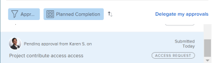

# Remind approvers about submitted approvals

You can remind approvers about pending approvals for the following objects:&nbsp;

* Access Requests
* Documents

## Access requirements

You must have the following access to perform the steps in this article:

<table style="table-layout:auto"> 
 <col> 
 <col> 
 <tbody> 
  <tr> 
   <td role="rowheader">Adobe Workfront plan*</td> 
   <td> 
Any
 </td> 
  </tr> 
  <tr> 
   <td role="rowheader">Adobe Workfront license*</td> 
   <td> 
Request or higher
 </td> 
  </tr> 
  <tr> 
   <td role="rowheader">Access level configurations*</td> 
   <td> 
View or higher access to Projects, Tasks, Issues, Templates, Portfolios, Programs, Reports, Dashboards, and Calendars, Documents
 
Note: If you still don't have access, ask your Workfront administrator if they set additional restrictions in your access level. For information on how a Workfront administrator can modify your access level, see <a href="../../administration-and-setup/add-users/configure-and-grant-access/create-modify-access-levels.md" class="MCXref xref">Create or modify custom access levels</a>.
 </td> 
  </tr> 
  <tr> 
   <td role="rowheader">Object permissions</td> 
   <td> 
View or higher access to the object associated with the request access or approval 
 
For information on requesting additional access, see <a href="../../workfront-basics/grant-and-request-access-to-objects/request-access.md" class="MCXref xref">Request access to objects </a>.
 </td> 
  </tr> 
 </tbody> 
</table>

&#42;To find out what plan, license type, or access you have, contact your Workfront administrator.

## Access Requests

You can request additional access for the following objects:

* Projects
* Tasks
* Issues
* Portfolios
* Programs
* Templates
* Reports
* Dashboards
* Calendars
* Documents

To remind another user to approve your access request for an object:

1. Click the **Home** icon  in the upper-left corner of Adobe Workfront.

   >[!NOTE]
   >
   >Your Workfront administrator might make the following changes to the Home icon in your environment:
   >
   >* Replace it with an image customized to illustrate your organization. In this case, the icon will look different that shown in this article. 
   >* Replace the page linked to it with a different page. In this case, click the **Main Menu**  in the upper-right corner of the page, then click **Home**.

1. In the **Work List** area, Go to the **Approvals I've Submitted** grouping.

1. Select an **Access Request** approval in the Work List.

   This opens the Access Request to the right of the Work List.

   

1. Click **Remind** in the upper-right corner of the right panel to send a notification to the approver.

## Documents

1. Click the **Home** icon  in the upper-left corner of Adobe Workfront.

   >[!NOTE]
   >
   >Your Workfront administrator might make the following changes to the Home icon in your environment:
   >
   >* Replace it with an image customized to illustrate your organization. In this case, the icon will look different that shown in this article. 
   >* Replace the page linked to it with a different page. In this case, click the **Main Menu**  in the upper-right corner of the page, then click **Home**.

1. In the **Work List** area, Go to the **Approvals I've Submitted** grouping.

1. Click a **Document** approval in the Work List.

   This opens the document approval to the right of the Work&nbsp;List.   
   

1. Click **Manage Approvals** in the upper-right corner of the right panel.
1. Click the **Remind** icon to send a notification to the approver.  
   
