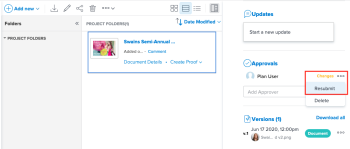

# Request document approvals

You can request approval from managers or other users for a document in Adobe Workfront. You can also request document approvals from people without Workfront accounts if your Workfront administrator has enabled this capability, as described in [Configure system security preferences](../../administration-and-setup/manage-workfront/security/configure-security-preferences.md).

## Access requirements

+++ Expand to view access requirements for the functionality in this article.

You must have the following access to perform the steps in this article:

<table style="table-layout:auto"> 
 <col> 
 <col> 
 <tbody> 
  <tr> 
   <td role="rowheader">Adobe Workfront plan*</td> 
   <td> 
Any
 </td> 
  </tr> 
  <tr> 
   <td role="rowheader">Adobe Workfront license*</td> 
   <td> 
Review or higher
 </td> 
  </tr> 
  <tr> 
   <td role="rowheader">Access level configurations*</td> 
   <td> 
View or higher access to Projects, Tasks, Issues, Templates, Portfolios, Programs, Reports, Dashboards, and Calendars, Documents
 
Note: If you still don't have access, ask your Workfront administrator if they set additional restrictions in your access level. For information on how a Workfront administrator can modify your access level, see <a href="../../administration-and-setup/add-users/configure-and-grant-access/create-modify-access-levels.md" class="MCXref xref">Create or modify custom access levels</a>.
 </td> 
  </tr> 
  <tr> 
   <td role="rowheader">Object permissions</td> 
   <td> 
Manage access to the object associated with the request access or approval 
 
For information on requesting additional access, see <a href="../../workfront-basics/grant-and-request-access-to-objects/request-access.md" class="MCXref xref">Request access to objects </a>.
 </td> 
  </tr> 
 </tbody> 
</table>

To find out what plan, license type, or access you have, contact your Workfront administrator.

+++

## Request a document approval

1. Go to the project, task, or issue that contains the document, then select **Documents**.
1. Find the document you need.

1. Scroll down to the **Approvals** section in the Summary, and begin typing in the **Add Approver** text box. You can add Workfront users by name or external users by email.

1. If your Adobe Workfront administrator has enabled the capability to collaborate with people who don't use Workfront, as described in [Configure system security preferences](../../administration-and-setup/manage-workfront/security/configure-security-preferences.md), you can type their email addresses to include them.

   You cannot request approval from teams or groups.

1. Repeat the previous step to add other approvers.

## Resubmit an approval on a new version

Document approval decisions are not automatically reset when you upload a new version. For example, if your document is approved with changes, the decision will show "changes" as the decision, even if you upload a new version with the specified changes. You can clear the decision on a new version if you manually resubmit the approval.

1. Go to the project, task, or issue that contains the document, then select **Documents**.
1. Find the document you need.

1. Scroll down to the **Approvals** section in the Summary, click the More icon, then click Resubmit.

   

## Delete a document approval request

1. Go to the project, task, or issue that contains the document, then select **Documents**.
1. Find the document you need.

1. Scroll down to the **Approvals** section in the Summary, then click the **More** menu inline with the approver's name and select **Delete**.

   The approval request is removed and the approver receives a notification that their approval is no longer needed. Their approval-related share access is also removed.

## Send a reminder to an approver

You can send a message to remind document an approver that you're waiting for their feedback.

1. Go to the project, task, or issue that contains the document, then select **Documents**.
1. Find the document you need.

1. Scroll down to the **Approvals** section in the Summary, then click the **More** menu inline with the approver's name and select **Remind**.

   The approver receives a notification informing them the approval is still pending. They may also receive an email reminder if they have that enabled.
