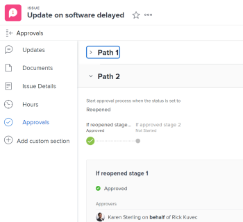

# View approvals

Approval processes provide the flexibility to create multistep approvals for projects, tasks, and issues. Adobe Workfront administrators define approval processes to provide consistency throughout the system.

For information about creating approval processes, see [Create an approval process for work items](../../administration-and-setup/customize-workfront/configure-approval-milestone-processes/create-approval-processes.md).

For information about associating approvals with work in Workfront, see [Associate a new or existing approval process with work](../../review-and-approve-work/manage-approvals/associate-approval-with-work.md).

## Access requirements

You must have the following access to perform the steps in this article:

<table style="table-layout:auto"> 
 <col> 
 <col> 
 <tbody> 
  <tr> 
   <td role="rowheader">Adobe Workfront plan*</td> 
   <td> 
Any
 </td> 
  </tr> 
  <tr> 
   <td role="rowheader">Adobe Workfront license*</td> 
   <td> 
Review or higher
 </td> 
  </tr> 
  <tr> 
   <td role="rowheader">Access level configurations*</td> 
   <td> 
View or higher access to the objects associated with approvals
 
Note: If you still don't have access, ask your Workfront administrator if they set additional restrictions in your access level. For information on how a Workfront administrator can modify your access level, see <a href="../../administration-and-setup/add-users/configure-and-grant-access/create-modify-access-levels.md" class="MCXref xref">Create or modify custom access levels</a>.
 </td> 
  </tr> 
  <tr> 
   <td role="rowheader">Object permissions</td> 
   <td> 
View or higher permissions to the objects associated with approvals
 
For information on requesting additional access, see <a href="../../workfront-basics/grant-and-request-access-to-objects/request-access.md" class="MCXref xref">Request access to objects </a>.
 </td> 
  </tr> 
 </tbody> 
</table>

&#42;To find out what plan, license type, or access you have, contact your Workfront administrator.

## Locate approvals in Adobe Workfront

You can view or manage approvals from several areas of Workfront. For information about how to manage approvals in various areas, see [Approving work](../../review-and-approve-work/manage-approvals/approving-work.md).

You can view or manage approvals from the following areas:

* In the Home area

   * All projects, tasks,&nbsp;issues, timesheets,&nbsp;documents, and access awaiting your approval are displayed in the Home area when you select to view All or Approvals.
   * Approvals that you submitted yourself also display in the Home area, in the Approvals I've Submitted section of the Work List. For more information, see the [Review work you submit for approval in the Home area](#review-work-you-submit-for-approval-in-the-home-area) section in this article.
   * Approvals&nbsp;are removed from the Home area when the associated&nbsp;project, task, or issue&nbsp;is marked&nbsp;Resolved, On Hold, Closed, or Canceled.

  For information about using Home, see [Get started with Home](../../workfront-basics/using-home/using-the-home-area/get-started-with-home.md). 

* In the header of a project, task, issue, document, or proof 
* In the Approvals section of a project, task, or issue
* In a report

  >[!NOTE]
  >
  >You cannot make a decision on an approval from a report.

  You can create a project, task, issue, or document approval report that contains approval information.

  For information about creating reports, see [Create a custom report](../../reports-and-dashboards/reports/creating-and-managing-reports/create-custom-report.md).

## Review work you submit for approval in the Home area {#review-work-you-submit-for-approval-in-the-home-area}

1. Click the **Home** icon  in the upper-left corner of Adobe Workfront.

   >[!NOTE]
   >
   >Your Workfront administrator might make the following changes to the Home icon in your environment:
   >
   >* Replace it with an image customized to illustrate your organization. In this case, the icon will look different that shown in this article. 
   >* Replace the page linked to it with a different page. In this case, click the **Main Menu**  in the upper-right corner of the page, then click **Home**.

1. Select **Work List**, then click the **Filter** drop-down menu and select **Approvals**.
1. Expand the **Approvals I've Submitted** section and find the approvals you submitted.

   

## View the approval status of an object

You can view the approval status of an object in the following sections of the object:

<table style="table-layout:auto"> 
 <col> 
 <col> 
 <tbody> 
  <tr> 
   <td role="rowheader">Updates </td> 
   <td> 
Displays all approval statuses when they occur. Approval statuses display in line with other statuses displayed on the <strong>Updates</strong> section.
 </td> 
  </tr> 
  <tr> 
   <td role="rowheader">Approvals</td> 
   <td> 
Displays more detailed information about the approval process, such as each stage of the approval process and whether approvers have granted the approval.
 </td> 
  </tr> 
 </tbody> 
</table>

* [Use the Updates area to view an approval status](#use-the-updates-area-to-view-an-approval-status) 
* [Use the Approvals area to view an approval status](#use-the-approvals-area-to-view-an-approval-status)

### Use the Updates area to view&nbsp;an approval status {#use-the-updates-area-to-view-an-approval-status}

When an approval is initiated on a project, task, or issue, a status displays in the **Updates** tab of the object,&nbsp;indicating the approval status. A new status displays&nbsp;any time the object transitions through the approval process. This includes the following events:

* An approval process is initiated on an&nbsp;object. The approval process is initiated when the status is changed.
* The object is&nbsp;rejected
* The object&nbsp;is approved&nbsp;

>[!TIP]
>
>If an approval is applied to a task, the approval updates are shown on the Updates tab of the task, not on the Updates tab of the project where the task resides.

### Use the Approvals area to view an approval status {#use-the-approvals-area-to-view-an-approval-status}

You can gain visibility into where a task or issue that you are working on currently is in&nbsp;the approval&nbsp;process. You can see the following information:

* The phase of the approval process
* Which approvers have already approved it
* Which approvers have not yet approved it

To see the current state of where a task or issue is in the approval process:

1. Go to the project, task, or issue that the approval is associated with.
1. In the left panel, click **Approvals**. You might need to first click **Show More**.

   The Approvals tab displays&nbsp;the full information about all past approval paths and stages. You can see exactly who made a decision on the approval or whether the approval is set for a team, job role, or user.

   

   For information about creating an Approval Process, see [Create an approval process for work items](../../administration-and-setup/customize-workfront/configure-approval-milestone-processes/create-approval-processes.md).
