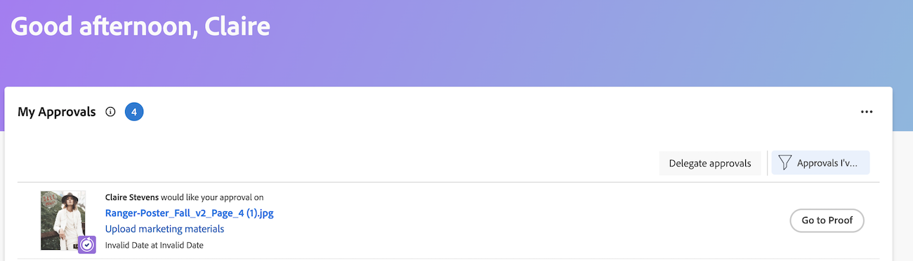

# View submitted proof approvals

Proofing approvals display in the Home area&nbsp;only if your Adobe Workfront environment is integrated with a Workfront Proof Premium account. If you cannot use proofing as discussed here, contact your Workfront administrator.

## Access requirements

+++ Expand to view access requirements for the functionality in this article.

<table style="table-layout:auto"> 
 <col> 
 <col> 
 <tbody> 
  <tr> 
   <td role="rowheader">Adobe Workfront package</td> 
   <td> 
Any
 </td> 
  </tr> 
  <tr> 
   <td role="rowheader">Adobe Workfront license</td> 
   <td> 
   
Contrbute or higher

   
Review or higher
 </td> 
  </tr> 
  <tr> 
   <td role="rowheader">Access level configurations</td> 
   <td> 
View or higher access to Projects, Tasks, Issues, Templates, Portfolios, Programs, Reports, Dashboards, and Calendars, Documents
</td> 
  </tr> 
  <tr> 
   <td role="rowheader">Object permissions</td> 
   <td> 
View or higher access to the object associated with the request access or approval 
 </td> 
  </tr> 
 </tbody> 
</table>

For information, see [Access requirements in Workfront documentation](/help/quicksilver/administration-and-setup/add-users/access-levels-and-object-permissions/access-level-requirements-in-documentation.md).

+++

## View submitted proof approvals

1. Click the **[!UICONTROL Main Menu]**  in the upper-right corner, then click **[!UICONTROL Home]**.
1. (Conditional) Click **Customize** to add the **My Approvals** widget.
1. (Conditional) Click the **Filter** drop-down menu, then select **Approvals I've submitted** to see approvals you've submitted.

   
   
   >[!NOTE]
   >
   >&nbsp;If you submit an approval to a guest proofing user, the approval doesn't display in Home.

1. (Optional) Click **Go to Proof** in the upper-right corner of the right panel to launch the proofing viewer.

   <!--
   <note type="note">
   You must have View or Edit access to Documents in your Access Level to launch the proofing viewer.
   </note>
   -->
