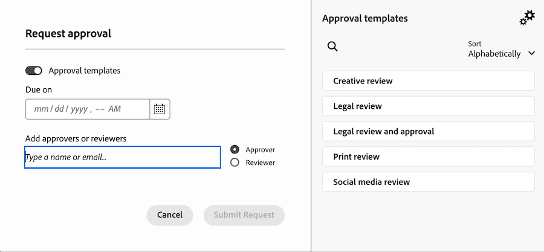
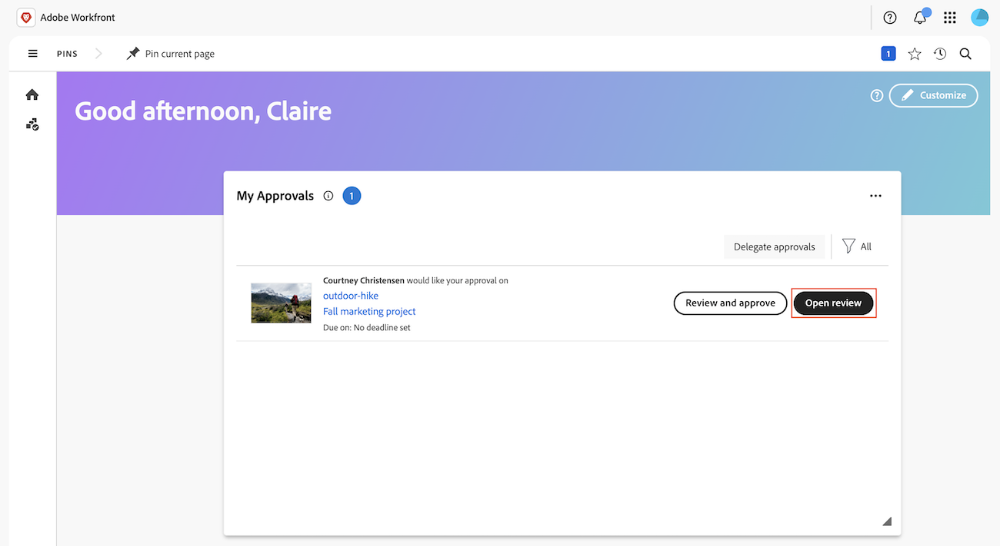
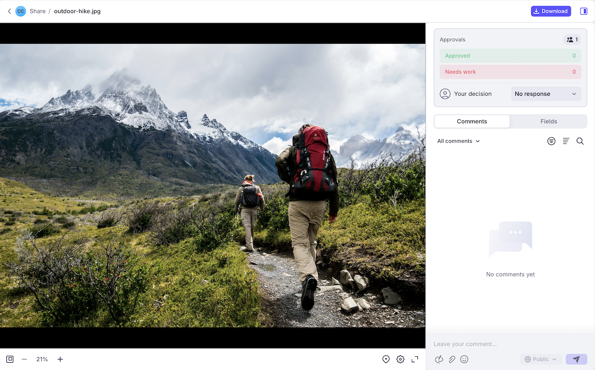
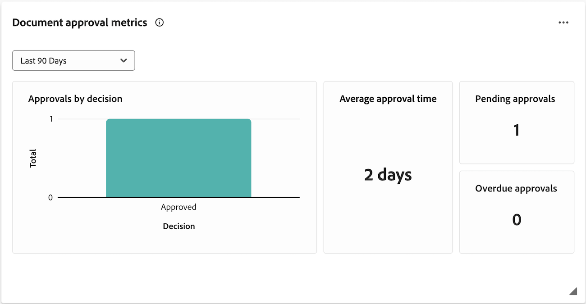

# Get started with the Frame.io integration

 The Workfront and Frame.io integration takes the best of what each product has to offer and combines them to create an experience that allows everyone involved in content creation to work in their tools of choice. Creatives can work in Frame.io and Adobe Creative Cloud applications, while project coordinators can manage work and formal review and approval processes in Workfront. <!--needs work -->

For more information about Frame.io, see [Getting Started with Frame.io](https://support.frame.io/en/collections/49298-getting-started).

## Work initiation and planning in Workfront

Project coordinators can create projects and plan work in Workfront. These projects utilize Adobe Enterprise Storage, which allows assets to be stored and managed within the Adobe ecosystem.

If your organization has a Frame.io Enterprise license, projects created in Workfront are also visible in Frame.io, allowing users to interact and upload assets in either product. 

For information about Adobe Enterprise Storage or projects in Frame.io, see

* [Adobe Enterprise Storage](link)
* [Frame.io Projects](link)

## Review and approve assets

Once an asset is finished, the project coordinator can initiate the formal review and approval process in Workfront.

After the approval workflow is created, reviewers and approvers can use the Frame.io viewer to add comments and mark up the asset. They can also make the approval decision in the Frame.io viewer.

### Initiate formal reviews and approvals in Workfront

Project coordinators can create one-time review and approvals or resuable approval templates. They can assign reviewers, approvers, or a mix of both:

* **Reviewers** can add comments and mark up assets. Once finished, they can mark their review as complete. Marking the review as complete is not required for the asset to move forward in the approval process.
* **Approvers** can add comments and mark up assets. They must make a decision to move the approval process forward. 

#### Create a review and approval workflow

Reviewers and approvers can be added to a single-use approval workflow or a reusable approval template:

* **Single-use approvals**: In the project or task where the asset resides, the project coordinator can assign reviewers and approvers and set a completion deadline. Reviewers and approvers are reminded by email 72 and then 24 hours before the deadline as well as on the deadline itself.

    For more information, see [Create a document review or approval request](/help/quicksilver/review-and-approve-work/document-reviews-and-approvals/manage-document-approvals/create-a-document-approval.md).

* **Approval templates**: In the Workfront Setup area, project coordinators can create resuable Approval Templates. Within a template, users can add reviewers and approvers and specify a completion timeframe. When the approval template is applied to an asset, the deadline is calculated from the specified timeframe. 

    Once a template is created, it can be applied to an asset to begin the formal review and approval process in Workfront.

    For more information, see [Create an Approval Template](/help/quicksilver/review-and-approve-work/document-reviews-and-approvals/manage-document-approvals/create-approval-template.md).

    
    

### Review and approve assets in the Frame.io viewer

Once the review and approval workflow is initiated in Workfront, reviewers and approvers can access the Frame.io viewer to add comments, mark up the asset, and make a decision. 

For more information, see [Review and approve with the Frame.io viewer](/help/quicksilver/review-and-approve-work/document-reviews-and-approvals/review-with-frame.md)

#### Access the Frame.io viewer

Users can access the Frame.io viewer in the following ways:

* Workfront email notifications
* The My approval widget in the Workfront Home area

>[!NOTE]
>
>External Workfront users are notified via email and will be asked to create a Frame.io login to review and approve assets. <!--is this still accurate?-->

#### Add comments and mark up assets

Comments and asset markup is visible in the Frame.io viewer. For more information on using the Frame.io viewer, see [Commenting on your media](https://help.frame.io/en/articles/9105251-commenting-on-your-media).

#### Make a decision

Once all review activity is complete, approvers must make one of the following decisions:

* **Approve**: The asset does not need changes and is ready for use.
* **Needs work**: The asset needs changes and is not ready for use. Once the specified changes are made, the asset must be uploaded as a new version and go through another round of approvals. <!--is the same approval workflow automatically applied? Does the coordinator have to do anything to get the approval going? -->

Reviewers can mark their review complete inside of the Workfront, but this is not required for the asset to move forward in the approval process. 

For more information about decisions in Workfront, see [Document decision status overview](/help/quicksilver/review-and-approve-work/document-reviews-and-approvals/manage-document-approvals/document-approval-status.md). 

### Track review and approval metrics

Project coordinators can monitor progress on all in-flight approvals in the Workfront Home area or with customized reports in Canvas Dashboards:

* **Custom dashboard**: Create a report dashboard in the Canvas Dashboards area to display both high-level and detailed information about reviews and approvals with Unified Approvals functionality. For information on how to get started, see [Create a report dashboard for review and approvals](/help/quicksilver/review-and-approve-work/document-reviews-and-approvals/create-review-and-approval-dashboard.md).
* **Document approval metrics Home widget**: Displays 2 charts with information about average approval time and decisions as well as list views of pending and overdue approvals.
    