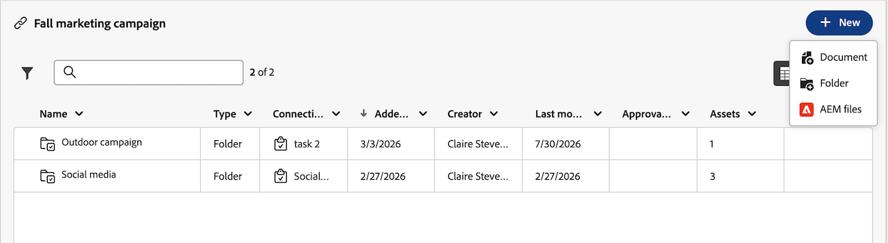

# Use Adobe Experience Manager with Workfront and Adobe cloud storage

You can use the [!DNL Experience Manager Assets]​​ to manage and store your digital assets that have gone through the review and approval cycle. This integration allows you to leverage the capabilities of Adobe Experience Manager, Frame.io, and Workfront to streamline your content management and collaboration processes.

## Configure the Experience Manager Assets integration

You can connect your work with your content in [!DNL Experience Manager Assets]​:

* Push assets and metadata from [!DNL Adobe Workfront] to [!DNL Experience Manager Assets]​
* Facilitate versioning use cases
* Track metadata for assets
* Sync project metadata between [!DNL Workfront] and [!DNL Experience Manager Assets]

>[!NOTE]
>
>You can also connect several [!DNL Experience Manager Assets] repositories to one [!UICONTROL Workfront] environment, or several [!DNL Workfront] environments to one [!DNL Experience Manager Assets] repository across Organization IDs. Follow the configuration instructions in this article for each integration you'd like to set up. 

## Access requirements

+++ Expand to view access requirements for the functionality in this article.

<table>
  <tr>
   <td>Adobe Workfront package
   </td>
   <td> 
Prime or Ultimate

    
Workflow Ultimate

   </td>
  </tr>
    <tr>
   <td>Adobe Workfront licenses
   </td>
   <td>
  
To configure the integration:

   
Standard

   
Plan

   
To send documents to Experience Manager Assets:

   
Contributor or higher

   
Request or higher

   </td>
  </tr>
  </tr>
    <tr>
   <td>Adobe Experience Manager licenses
   </td>
   <td>Standard
   </td>
  </tr>
  <tr>
   <td>Additional products
   </td>
   <td>You must have [!DNL Experience Manager Assets as a Cloud Service], and you must be added to the product as a user.
   </td>
  </tr>
   <tr>
   <td>Access level configurations
   </td>
   <td>You must be a [!DNL Workfront] administrator.
   </td>
  </tr>
</table>

For more detail about the information in this table, see [Access requirements in Workfront documentation](/help/quicksilver/administration-and-setup/add-users/access-levels-and-object-permissions/access-level-requirements-in-documentation.md). 

+++

## Prerequisites

Before you begin,

* You must have [!DNL Workfront] and [!DNL Adobe Experience Manager Assets] associated with an Organization ID in the [!DNL Adobe Admin Console]. For more information see, [Platform-based administration differences ([!DNL Adobe Workfront]/[!DNL Adobe Business Platform])](/help/quicksilver/administration-and-setup/get-started-wf-administration/actions-in-admin-console.md).
* Your Workfront instance must be using Adobe cloud storage. 

## Set up the integration information

{{step-1-to-setup}}

1. Select **[!UICONTROL Documents]** in the left panel, then select **[!UICONTROL [!DNL Experience Manager] Integration]**.
1. Select **[!UICONTROL Add [!DNL Experience Manager] Integration]**.
1. In the **[!UICONTROL Name]** field, enter the name you want users to see when interacting with this integration in Workfront and Experience Manager Assets.
1. In the **[!UICONTROL Navigation URL]** field, the system automatically populates the Navigation URL. This read-only URL is used to link to your organization's [!DNL Experience Manager] instance from the [!UICONTROL Main Menu] for quick access.
1. Choose a repository from the **[!UICONTROL [!DNL Experience Manager] Assets repository]** drop-down menu. The system automatically populates any [!DNL Experience Manager] repositories associated with the Organization ID that your user profile is assigned to.

1. Click **[!UICONTROL Save]** or move on to the [Set up metadata (Optional)](#set-up-metadata-optional) section in this article.

    >[!IMPORTANT]
    >
    >Due to the complexity of the integration, you can't change the repository after you save the initial configuration.

## Set up metadata (Optional)

You can map [!DNL Workfront] object data to asset media fields in [!DNL Experience Manager] Assets.

>[!NOTE]
>
>You can map metadata only in one direction: from [!DNL Workfront] to [!DNL Experience Manager]. Metadata for documents linked to [!DNL Workfront] from [!DNL Experience Manager] cannot be transferred to [!DNL Workfront].

### Configure metadata fields

Before you begin mapping metadata fields, you must configure metadata fields in both Workfront and Experience Manager Assets.

To configure metadata fields:

1. Configure a metadata schema in [!DNL Experience Manager Assets] as explained in [Configure asset metadata mapping between Adobe [!DNL Workfront] and [!DNL Experience Manager Assets]](https://experienceleague.adobe.com/en/docs/experience-manager-cloud-service/content/assets/integrations/configure-asset-metadata-mapping).

1. Configure custom form fields in Workfront. [!DNL Workfront] has many built-in custom fields you can use. However, you can also create your own custom fields as explained in [Create a custom form](/help/quicksilver/administration-and-setup/customize-workfront/create-manage-custom-forms/form-designer/design-a-form/design-a-form.md).

+++ **Expand to see more information about supported Workfront and Experience Manager Assets fields** 

**Experience Manager Assets Tags**

You can map any Workfront supported field to a tag in Experience Manager Assets. To do this, you must ensure that tag values in Experience Manager Assets match Workfront. 

* Tags and Workfront field values must be an exact match in spelling, and format. 
* Workfront field values that are mapped to experience Manager assets tags must be all lowercase, even if the tag in Experience Manager Assets appears to have uppercase letters.
* Workfront field values must not include spaces.
* The field value in Workfront must also include the folder structure of the Experience Manager Assets tag.
* To map multiple single-line text fields to tags, enter a comma-separated list of the tag values into the Workfront side of the metadata mapping, and `xcm:keywords` on the Experience Manager Assets side. Each field value maps to a separate tag. You can use a calculated field to combine multiple Workfront fields into a single comma-separated text field.
* You can map values from drop-down, radio button, or checkbox fields by entering a comma-separated list of the available values in that field.

>[!INFO]
>
>**Example**:  To match the tag shown in the folder structure here, the field value in Workfront would be `landscapes:trees/spruce`. Note the lowercase letters in the Workfront field value.
>
>If you want the tag to be leftmost item in the tag tree, it must be followed by a colon. In this example, to map to the landscapes tag, the field value in Workfront would be `landscapes:`.
>
>

After you have created the tags in Experience Manager Assets, they will appear under the Tags drop-down in the Metadata section. To link a field to a tag, select `xcm:keywords` in the Experience Manager Assets field dropdown in the metadata mapping area.

For more information on tags in Experience Manager Assets, including how to create and manage tags, see [Administering Tags](https://experienceleague.adobe.com/en/docs/experience-manager-64/administering/contentmanagement/tags).

**Experience Manager Assets custom metadata schema fields**

You can map both built-in and custom Workfront fields to custom metadata schema fields in Experience Manager Assets. 

Custom metadata fields created in Experience Manager Assets are organized in their own section in the Metadata setup area.

<!-- 
link to documentation about creating schema - waiting on response from Anuj about best article to link to
-->

**Workfront fields**

You can map both built-in and custom Workfront fields to Experience Manager Assets. The following field values must match in both case and spelling between Workfront and Experience Manager Assets:

* Drop-down fields
* Multi-select fields

>[!TIP]
>
> To check if the field values match exactly, go to 
>
> * Setup > Custom Forms in Workfront or the field in the object
> * Assets > metadata schemas in Experience Manager Assets

+++

### Map metadata for assets

Metadata maps when an asset is pushed from [!DNL Workfront] for the first time. Documents with the built-in or custom fields automatically map to the specified fields the first time an asset is sent to [!DNL Experience Manager Assets].

To map metadata for assets: 

<!--
1. Select **[!UICONTROL Assets]** above the metadata table.
-->
1. In the **[!UICONTROL [!DNL Workfront] field]** column, choose a built-in or custom Workfront field.

    >[!NOTE]
    >
    >You can map a single [!DNL Workfront] field to multiple [!UICONTROL Experience Manager Assets] fields. You can't map multiple [!DNL Workfront] fields to a single [!DNL Experience Manager Assets] field.
    ><!--To map a Workfront field to an Experience Manager Assets tag, see -->

1. In the [!DNL Experience Manager Assets] field, search through the pre-populated categories or enter at least two letters in the search field to access additional categories.
1. Repeat steps 2 and 3 as needed.

1. Click [!UICONTROL **Save**] or move to the [Object metadata sync](#object-metadata-sync) section in this article.

### Object metadata sync

An [!DNL Experience Manager] fields that is mapped to [!DNL Workfront] portfolio, program, project, task, issue, and document fields update automatically when the field is changed in [!DNL Workfront].

When this option is enabled, any asset that has been pushed to Adobe Experience manager displays a real-time view of the document's Adobe Experience Manager metadata on the Document Details page in Workfront.

1. Enable the **[!UICONTROL Sync object metadata]** field, then click **Save**. 

>[!IMPORTANT]
>
>Users must have write access in [!DNL Experience Manager] for assets living in the object in order for the metadata to sync when it's updated.

## Send a Document to Experience Manager Assets or Assets Essentials

You can send documents from Workfront to Experience Manager Assets or Assets Essentials. Documents uploaded and sent from Workfront to Assets Essentials still count against your overall document storage.

Assets sent to Experience Manager through this integration have a size limit of **5o TB**.

<!--In the Preview environment, Assets sent to Experience Manager through this integration have a size limit of **30 GB**.-->

Metadata fields are first mapped when you send an asset from Workfront to Experience Manager Assets or Assets Essentials. Any metadata configured to map for parent objects is sent as well. For more information on configuring metadata mapping, see [Configure the Experience Manager Assets as a Cloud Service integration](/help/quicksilver/administration-and-setup/configure-integrations/configure-aacs-integration.md) or [Configure the Experience Manager Assets Essentials integration](/help/quicksilver/documents/adobe-workfront-for-experience-manager-assets-essentials/setup-asset-essentials.md).

>[!INFO]
>
>**Example** When you first send an asset attached to a project, the metadata maps to Experience Manager Assets or Assets Essentials as well as any mapped metadata from parent objects such as a  portfolio and program.

### Send a Document from Workfront

When a user sends a document from Workfront to Experience Manager Assets or Assets Essentials, mapped metadata transfers along the document. After the document is sent, changes made to the document's metadata in Workfront are not reflected in Assets or Assets Essentials. If a mapped field in Workfront is changed, you must send a new version of the document with the updated metadata to Assets or Assets Essentials.

To send a document:

1. Go to the **Documents** area in Workfront, and select the document you want to send.
1. In the bar at the bottom of the screen, click **Send to**.

1. Choose the Experience Manager integration your administrator set up, then click **Send**.

   >[!NOTE]
   >
   >The Workfront administrator can choose any name for this integration, so it may not specifically mention Assets or Assets Essentials.

1. Choose where you want the asset to go, then click **Select Folder**.

## Link content from Experience Manager Assets

To link content:

1. Go to the Workfront object where you want to link content.
1. Click the **Documents** section in the left panel.
1. Click **New** on the right side of the page, then click **AEM files** to link an individual asset.
   

1. With Content Advisor, you can:

   <table style="table-layout:auto">
   <tbody>
      <tr>
         <td><strong>Search for assets using AI Search.</strong> Use AI-powered search that understands meaning and intent behind queries, supporting multiple languages, typos, and synonyms.</td>
         <td>For more information, see <a href="https://experienceleague.adobe.com/en/docs/experience-manager-cloud-service/content/assets/manage/content-advisor-adobe-applications#content-advisor-ai-search">AI Search for smarter asset discovery</a>.</td>
      </tr>
      <tr>
         <td><strong>View smart suggestions based on context and intent.</strong> Discover assets that align with your content needs using context-aware recommendations from the host Adobe application.</td>
         <td>For more information, see <a href="https://experienceleague.adobe.com/en/docs/experience-manager-cloud-service/content/assets/manage/content-advisor-adobe-applications#smart-suggestions-content-advisor">Smart suggestions based on context and intent</a>.</td>
      </tr>
      <tr>
         <td><strong>Upload a campaign brief to discover relevant assets.</strong> Upload a PDF, DOCX, or TXT campaign brief document so Content Advisor can analyze it and recommend relevant assets.</td>
         <td>For more information, see <a href="https://experienceleague.adobe.com/en/docs/experience-manager-cloud-service/content/assets/manage/content-advisor-adobe-applications#campaign-briefs-content-advisor">Campaign briefs to discover relevant assets</a>.</td>
      </tr>
      <tr>
         <td><strong>View and select Dynamic Media asset renditions.</strong> Browse channel-optimized renditions including image presets, Smart Crops, and format types, and apply Dynamic Media modifiers to preview adjustments in real time.</td>
         <td>For more information, see <a href="https://experienceleague.adobe.com/en/docs/experience-manager-cloud-service/content/assets/manage/content-advisor-adobe-applications#dynamic-media-renditions-content-advisor">Dynamic Media asset renditions available for use</a>.</td>
      </tr>
      <tr>
         <td><strong>Apply Dynamic Media modifiers to renditions.</strong> Add modifiers to transform asset renditions in real time and preview the results before selecting a rendition for your host application.</td>
         <td>For more information, see <a href="https://experienceleague.adobe.com/en/docs/experience-manager-cloud-service/content/assets/manage/content-advisor-adobe-applications#dynamic-media-renditions-content-advisor">Dynamic Media asset renditions available for use</a>.</td>
      </tr>
      <!--
      <tr>
         <td><strong>Discover and browse Content Fragments.</strong> Search through Content Fragments, view live thumbnail previews, check status (Draft, Modified, or Published), and inspect detailed properties, references, and variations.</td>
         <td>For more information, see <a href="https://experienceleague.adobe.com/en/docs/experience-manager-cloud-service/content/assets/manage/content-advisor-adobe-applications#content-fragments-discovery-content-advisor">Discovery of Content Fragments</a>.</td>
      </tr>
      -->
      <tr>
         <td><strong>Access asset metadata.</strong> Review asset properties such as title, description, format, size, and other metadata tabs (Product, Campaign, Tags) consistent with the Assets view.</td>
         <td>For more information, see <a href="https://experienceleague.adobe.com/en/docs/experience-manager-cloud-service/content/assets/manage/content-advisor-adobe-applications#asset-metadata-content-advisor">Access asset metadata consistent with Assets view</a>.</td>
      </tr>
      <tr>
         <td><strong>Filter assets using predefined filters.</strong> Refine asset results using filters such as File Type, File Format, Asset Status, File Size, Image Width, Image Height, Modified Date, and Created Date.</td>
         <td>For more information, see <a href="https://experienceleague.adobe.com/en/docs/experience-manager-cloud-service/content/assets/manage/content-advisor-adobe-applications#filters-content-advisor">Access filters consistent with Assets view</a>.</td>
      </tr>
      <tr>
         <td><strong>Save and reuse searches.</strong> Create saved searches by specifying a search term and filter options, then reuse them across Experience Manager Assets and other Adobe applications.</td>
         <td>For more information, see <a href="https://experienceleague.adobe.com/en/docs/experience-manager-cloud-service/content/assets/manage/content-advisor-adobe-applications#saved-searches-content-advisor">Access and reuse recent and saved searches</a>.</td>
      </tr>
      <tr>
         <td><strong>Search for assets across and within collections.</strong> Search for assets or collections across all collections, or limit your search to a specific collection.</td>
         <td>For more information, see <a href="https://experienceleague.adobe.com/en/docs/experience-manager-cloud-service/content/assets/manage/content-advisor-adobe-applications#search-collections-content-advisor">Search for assets across and within collections</a>.</td>
      </tr>
   </tbody>
   </table>

   >[!NOTE]
   >
   >Recommended Content in Content Advisor uses data from the following to determine suggested content in Workfront:
   >
   >* Workfront object name and description fields
   >* Custom form fields marked as required
   >* Data from attached documents

<!--
### Link a new version from Experience Manager Assets

You can pull new content over from Experience Manager Assets and add it to an existing asset as a new version. If the document is already linked and a new version is added in Experience Manager Assets, the new version appears automatically in Workfront.

To link a new version:

1. Go to the Workfront object where you want to link content.
1. Click the **Documents** section in the left panel.
1. Select the asset you want to replace with a new version. You can't create a new version of an asset in a linked folder.
1. Select **Add New** > **Version**, then select the Experience Manager integration your administrator set up.

   >[!NOTE]
   >
   >The Workfront administrator can choose any name for this integration, so it might not specifically mention Experience Manager Assets.

1. Select the content you want to link.
1. Click **Select**.
-->

<!--
## Link a folder from Experience Manager Assets

Permissions to view individual assets inside of a folder rely on Experience Manager Assets permissions.

To link a folder:

1. Go to the Workfront object where you want to link content.
1. Click the **Documents** section in the left panel.
1. Click **Assets** > **Files & Folders**.
1. Click the **Filter** icon, then in the **Asset Type** section, choose **Folders**.
1. Select the folder you want to link.
1. Click **Select**.
-->

## Considerations

* Review and approval workflows are not supported for linked AEM assets.
* Metadata fields are first mapped when you send an asset from Workfront to Experience Manager Assets. If your Workfront administrator has enabled object metadata sync, fields remain up to date if they are changed in either application.

<!--
 not sure if this is in yet

### Send a new version

You can add a new version to a document you have previously uploaded to Workfront. For more information, see [Upload a new version of a document](/help/quicksilver/documents/managing-documents/upload-new-document-version.md). After the latest version is uploaded, you can send it to Assets Essentials. If a mapped field in Workfront has changed, the new version updates the metadata in Assets Essentials when it sends.

>[!IMPORTANT]
>
>Before you upload a new version to Workfront, we recommend renaming the file. If you upload a new version with the exact same file name as a previous version, only the most recent version can be downloaded from Workfront. All versions can be downloaded from Experience Manager Assets or Assets Essentials regardless of the file name. - is this accuate for ESM?

To send the most recent version:

1. Go to the **Documents** area in Workfront, and locate the document.
1. In the bar at the bottom of the screen, click **Send to**. 

1. Choose the Experience Manager integration your administrator set up, then click **Send**.

   >[!NOTE]
   >
   >The Workfront administrator can choose any name for this integration, so it might not specifically mention Assets or Assets Essentials.

1. Click **Save**. The new version saves in the same location as the previous version.
 
 -->