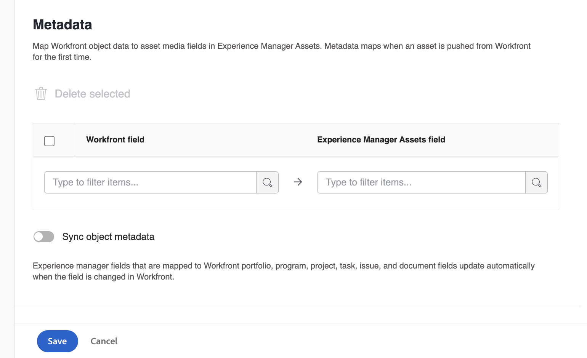

# Use the Adobe Experience Manager with the Frame.io integration 

## Configure the Experience Manager Assets integration

<!-- Audited: 1/2024 -->

>[!IMPORTANT]
>
>This functionality is available only to organizations that have been onboarded to the [!DNL Adobe Admin Console].

You can connect your work with your content in [!DNL Experience Manager Assets]​:

* Push assets and metadata from [!DNL Adobe Workfront] to [!DNL Experience Manager Assets]​
* Link assets from [!DNL Experience Manager Assets] to your projects and tasks in [!DNL Workfront​]
* Facilitate versioning use cases
* Create folders linked to [!DNL Experience Manager Assets]
* Track metadata for assets and folders
* Sync project metadata between [!DNL Workfront] and [!DNL Experience Manager Assets]

>[!NOTE]
>
>You can also connect several [!DNL Experience Manager Assets] repositories to one [!UICONTROL Workfront] environment, or several [!DNL Workfront] environments to one [!DNL Experience Manager Assets] repository across Organization IDs. Follow the configuration instructions in this article for each integration you'd like to set up. 

## Access requirements

+++ Expand to view access requirements for the functionality in this article.

<table>
  <tr>
   <td>Adobe Workfront package
   </td>
   <td> 
Prime or Ultimate

    
Workflow Ultimate

   </td>
  </tr>
    <tr>
   <td>Adobe Workfront licenses
   </td>
   <td>Standard
   
Plan

   </td>
  </tr>
  </tr>
    <tr>
   <td>Adobe Experience Manager licenses
   </td>
   <td>Standard
   </td>
  </tr>
  <tr>
   <td>Additional products
   </td>
   <td>You must have [!DNL Experience Manager Assets as a Cloud Service], and you must be added to the product as a user.
   </td>
  </tr>
   <tr>
   <td>Access level configurations
   </td>
   <td>You must be a [!DNL Workfront] administrator.
   </td>
  </tr>
</table>

For more detail about the information in this table, see [Access requirements in Workfront documentation](/help/quicksilver/administration-and-setup/add-users/access-levels-and-object-permissions/access-level-requirements-in-documentation.md). 

+++

## Prerequisites

Before you begin,

* You must have [!DNL Workfront] and [!DNL Adobe Experience Manager Assets] associated with an Organization ID in the [!DNL Adobe Admin Console]. For more information see, [Platform-based administration differences ([!DNL Adobe Workfront]/[!DNL Adobe Business Platform])](/help/quicksilver/administration-and-setup/get-started-wf-administration/actions-in-admin-console.md).

## Set up the integration information

{{step-1-to-setup}}

1. Select **[!UICONTROL Documents]** in the left panel, then select **[!UICONTROL [!DNL Experience Manager] Integration]**.

    >[!NOTE]
    >
    >This configuration area appears only if your [!DNL Workfront] environment is included under an [!DNL Adobe Admin Console].

1. Select **[!UICONTROL Add [!DNL Experience Manager] Integration]**.
1. In the **[!UICONTROL Name]** field, enter the name you want users to see when interacting with this integration in Workfront and Experience Manager Assets.
1. In the **[!UICONTROL Navigation URL]** field, the system automatically populates the Navigation URL. This read-only URL is used to link to your organization's [!DNL Experience Manager] instance from the [!UICONTROL Main Menu] for quick access.
1. Choose a repository from the **[!UICONTROL [!DNL Experience Manager] Assets repository]** drop-down menu. The system automatically populates any [!DNL Experience Manager] repositories associated with the Organization ID that your user profile is assigned to.

1. Click **[!UICONTROL Save]** or move on to the [Set up metadata (Optional)](#set-up-metadata-optional) section in this article.

    >[!NOTE]
    >
    >Due to the complexity of the integration, you can't change the repository after you save the initial configuration.

## Set up metadata (Optional)

You can map [!DNL Workfront] object data to asset media fields in [!DNL Experience Manager] Assets.

>[!IMPORTANT]
>
>You can map metadata only in one direction: from [!DNL Workfront] to [!DNL Experience Manager]. Metadata for documents linked to [!DNL Workfront] from [!DNL Experience Manager] cannot be transferred to [!DNL Workfront].

### Configure metadata fields

Before you begin mapping metadata fields, you must configure metadata fields in both Workfront and Experience Manager Assets.

To configure metadata fields:

1. Configure a metadata schema in [!DNL Experience Manager Assets] as explained in [Configure asset metadata mapping between Adobe [!DNL Workfront] and [!DNL Experience Manager Assets]](https://experienceleague.adobe.com/en/docs/experience-manager-cloud-service/content/assets/integrations/configure-asset-metadata-mapping).

1. Configure custom form fields in Workfront. [!DNL Workfront] has many built-in custom fields you can use. However, you can also create your own custom fields as explained in [Create a custom form](/help/quicksilver/administration-and-setup/customize-workfront/create-manage-custom-forms/form-designer/design-a-form/design-a-form.md).

+++ **Expand to see more information about supported Workfront and Experience Manager Assets fields** 

**Experience Manager Assets Tags**

You can map any Workfront supported field to a tag in Experience Manager Assets. To do this, you must ensure that tag values in Experience Manager Assets match Workfront. 

* Tags and Workfront field values must be an exact match in spelling, and format. 
* Workfront field values that are mapped to experience Manager assets tags must be all lowercase, even if the tag in Experience Manager Assets appears to have uppercase letters.
* Workfront field values must not include spaces.
* The field value in Workfront must also include the folder structure of the Experience Manager Assets tag.
* To map multiple single-line text fields to tags, enter a comma-separated list of the tag values into the Workfront side of the metadata mapping, and `xcm:keywords` on the Experience Manager Assets side. Each field value maps to a separate tag. You can use a calculated field to combine multiple Workfront fields into a single comma-separated text field.
* You can map values from drop-down, radio button, or checkbox fields by entering a comma-separated list of the available values in that field.

>[!INFO]
>
>**Example**:  To match the tag shown in the folder structure here, the field value in Workfront would be `landscapes:trees/spruce`. Note the lowercase letters in the Workfront field value.
>
>If you want the tag to be leftmost item in the tag tree, it must be followed by a colon. In this example, to map to the landscapes tag, the field value in Workfront would be `landscapes:`.
>
>

After you have created the tags in Experience Manager Assets, they will appear under the Tags drop-down in the Metadata section. To link a field to a tag, select `xcm:keywords` in the Experience Manager Assets field dropdown in the metadata mapping area.

For more information on tags in Experience Manager Assets, including how to create and manage tags, see [Administering Tags](https://experienceleague.adobe.com/en/docs/experience-manager-64/administering/contentmanagement/tags).

**Experience Manager Assets custom metadata schema fields**

You can map both built-in and custom Workfront fields to custom metadata schema fields in Experience Manager Assets. 

Custom metadata fields created in Experience Manager Assets are organized in their own section in the Metadata setup area.

<!-- 
link to documentation about creating schema - waiting on response from Anuj about best article to link to
-->

**Workfront fields**

You can map both built-in and custom Workfront fields to Experience Manager Assets. The following field values must match in both case and spelling between Workfront and Experience Manager Assets:

* Drop-down fields
* Multi-select fields

>[!TIP]
>
> To check if the field values match exactly, go to 
>
> * Setup > Custom Forms in Workfront or the field in the object
> * Assets > metadata schemas in Experience Manager Assets

+++

### Map metadata for assets

Metadata maps when an asset is pushed from [!DNL Workfront] for the first time. Documents with the built-in or custom fields automatically map to the specified fields the first time an asset is sent to [!DNL Experience Manager Assets].

To map metadata for assets: 

<!--
1. Select **[!UICONTROL Assets]** above the metadata table.
-->
1. In the **[!UICONTROL [!DNL Workfront] field]** column, choose a built-in or custom Workfront field.

    >[!NOTE]
    >
    >You can map a single [!DNL Workfront] field to multiple [!UICONTROL Experience Manager Assets] fields. You can't map multiple [!DNL Workfront] fields to a single [!DNL Experience Manager Assets] field.
    ><!--To map a Workfront field to an Experience Manager Assets tag, see -->

1. In the [!DNL Experience Manager Assets] field, search through the pre-populated categories or enter at least two letters in the search field to access additional categories.
1. Repeat steps 2 and 3 as needed.

1. Click [!UICONTROL Save] or move on to the [Set up Workflows](#set-up-workflows-optional) section in this article.

<!--

### Map metadata for folders

When users create a linked folder on a project, the associated project, portfolio, and program data is mapped to folder metadata fields in [!DNL Experience Manager Assets].

>[!NOTE]
>
>This integration does not support custom metadata from [!DNL Adobe Experience Manager].

To map metadata for folders: 

1. Select **[!UICONTROL Folders]** above the metadata table.
1. In the **[!UICONTROL [!DNL Workfront] field]** column, choose a built-in or custom Workfront field.

    >[!NOTE]
    >
    >You can map a single Workfront field to multiple Experience Manager Assets fields. You can't map multiple [!DNL Workfront] fields to a single [!DNL Experience Manager Assets] field.

1. In the **[!DNL Experience Manager Assets]** field, search through the pre-populated categories or enter at least two letters in the search field to access additional categories.
1. Repeat steps 2 and 3 as needed.

1. Click **[!UICONTROL Save]** or move on to the [Project metadata sync](#project-metadata-sync) section in this article.

### Object metadata sync

An [!DNL Experience Manager] fields that is mapped to [!DNL Workfront] portfolio, program, project, task, issue, and document fields update automatically when the field is changed in [!DNL Workfront].

When this option is enabled, any asset that has been pushed to Adobe Experience manager includes a card on the Document Details page that displays a real-time view of the document's Adobe Experience Manager metadata.

>[!IMPORTANT]
>
>Users must have write access in [!DNL Experience Manager] for assets living in the object in order for the metadata to sync when it's updated.

1. Enable the **[!UICONTROL Sync object metadata]** field.
1. Click **Save** or move on to the [Set up workflows (Optional)](#set-up-workflows-optional) section in this article.-->

## Set up workflows (Optional)

A workflow is a set of actions that connect Workfront to Adobe Experience Manager as a Cloud Service. As a Workfront administrator, you can configure workflows in Workfront, then assign them to Project Templates. 

When a Project is created using a Project Template to which a workflow is assigned, the actions defined in the workflow are triggered. 

Workflows are enabled and configured for the Adobe Experience Manager as a whole. These workflows can then be applied to project templates. They can be adjusted or customized at the template level, or at the project level when a project is created from that template.

The followings workflows are available in the Adobe Experience Manager integration:

* [Create Adobe Experience Manager linked folders](#create-adobe-experience-manager-linked-folders)
* [Publish assets that are sent to Adobe Experience Manager Assets](#publish-assets-that-are-sent-to-adobe-experience-manager-assets)

### Create Adobe Experience Manager linked folders

You can create up to 100 linked folders per folder tree.

1. Toggle the **[!UICONTROL Create Linked folder]** on.
1. Enter a name for the linked folder that you are creating. 
1. (Conditional) Enable the **Default folder tree** option if you want this linked folder to be the default folder for projects created with templates that use this integration. You can select one or more default folders. 
1. Choose a folder path to indicate where you want all linked folders associated with this integration.
1. (Conditional) To add a folder tree (nested folders) to this integration, do the following:

   1. Click the **Add folder** icon .
   1. In the **Name type** field, select how you want to name the folder:

      * **Name**: Type in a name for the folder.
      * **Object data**: Select the source for the folder name, such as Project name.

      >[!NOTE]
      >
      >* Folder names must be fewer than 100 characters.
      >* The following characters will be removed from folder names:
      >
      >   `/`, `:`, `[`, `]`, `|`, `*`

   1. To add a nested folder to the folder tree, click the three-dot menu next to the folder you want to create a nested folder in and select **Add Folder**. Fill in the fields as described in Step the previous step.
   1. To link a folder to Workfront, select the folder and click the **Make linked folder**   icon .
   1. (Optional) To edit a folder, select the folder and click the **Edit Folder** icon .
   1. (Optional) To delete a folder, select the folder and click the **Delete Folder** icon .
1. (Conditional) To add another folder tree, click **+ Add folder tree** and follow the steps in Step 5.

1. Click **[!UICONTROL Save]**, or move on to the [Publish assets that are sent to Adobe Experience Manager Assets](#publish-assets-that-are-sent-to-adobe-experience-manager-assets) section in this article.

>[!NOTE]
>
>* This integration will create no more than 100 folders, regardless of how many folder trees are created. For example, an integration with 4 folder trees can create up to 100 folders, not 400 folders.
>* The first folder in folder tree is automatically marked as linked to Workfront. If you do not want this folder linked, you can unlink it.
>* If no folder tree is provided, the root folder becomes the linked folder.

### Publish assets that are sent to Adobe Experience Manager Assets

1. Toggle on **[!UICONTROL Publish assets automatically]**.
1. Check the box next to the location where you want to publish assets sent to Adobe Experience Manager assets. You may enable either or both options. 
1. (Conditional) If you have enabled the Brand Portal option, Select the Brand Portal where you want to publish assets.
1. Click **[!UICONTROL Save]** or move on to the [Set up linked folders (Optional)](#set-up-linked-folders-optional) section in this article.

## Set up linked folders (Optional)

You can allow users to create folders linked to [!DNL Experience Manager] while in a [!DNL Workfront] project. When a folder is linked, any asset added to the folder automatically shows up in both [!DNL Workfront] and [!DNL Experience Manager]. When an asset is added to the linked folder in [!DNL Workfront] for the first time, the asset's metadata is pushed to [!DNL Experience Manager Assets].

In the steps below, you indicate where you want the linked folders created. Each integration can have only one location for all linked folders.

To set up linked folders:

1. Toggle the **[!UICONTROL Enable Linked folder]** on.
1. Choose a folder path to indicate where you want all linked folders associated with this integration. 

    >[!NOTE]
    >
    >Users need write access in [!DNL Adobe Experience Manager Assets] to the folder specified to create a linked folder.

1. Click **[!UICONTROL Save]**.

# Send a Document to Experience Manager Assets or Assets Essentials

You can send documents from Workfront to Experience Manager Assets or Assets Essentials. Documents uploaded and sent from Workfront to Assets Essentials still count against your overall document storage. Assets linked from Assets Essentials don't count towards overall storage.

Assets sent to Experience Manager through this integration have a size limit of **5 GB**.

In the Preview environment, Assets sent to Experience Manager through this integration have a size limit of **30 GB**.

Metadata fields are first mapped when you send an asset from Workfront to Experience Manager Assets or Assets Essentials. Any metadata configured to map for parent objects is sent as well. For more information on configuring metadata mapping, see [Configure the Experience Manager Assets as a Cloud Service integration](/help/quicksilver/administration-and-setup/configure-integrations/configure-aacs-integration.md) or [Configure the Experience Manager Assets Essentials integration](/help/quicksilver/documents/adobe-workfront-for-experience-manager-assets-essentials/setup-asset-essentials.md).

>[!INFO]
>
>**Example** When you first send an asset attached to a task, the task metadata maps to Experience Manager Assets or Assets Essentials as well as any mapped metadata from parent objects such as a project, portfolio, and program.

## Access requirements

+++ Expand to view access requirements for the functionality in this article.

You must have the following access to complete the steps in this article:

<table style="table-layout:auto"> 
 <col> 
 <col> 
 <tbody> 
  <tr> 
   <td role="rowheader"><a href="https://business.adobe.com/products/workfront/pricing.html" target="_blank">Adobe Workfront plan</a>*</td> 
   <td> 
 Any
 </td> 
  </tr> 
  <tr> 
   <td role="rowheader"><a href="../../administration-and-setup/add-users/access-levels-and-object-permissions/wf-licenses.md" class="MCXref xref">Legacy licenses overview</a>*</td> 
   <td> 
Request or higher
 </td> 
  </tr> 
  <tr> 
   <td role="rowheader">Product</td> 
   <td>You must have Experience Manager as a Cloud Service or Assets Essentials, and you must be added to the product as a user in the Admin Console.
</td> 
  </tr> 
  <tr> 
   <td role="rowheader">Access level configurations*</td> 
   <td> 
Edit access to Documents
 
Note: If you still don't have access, ask your Workfront administrator if they set additional restrictions in your access level. For information on how a Workfront administrator can modify your access level, see <a href="../../administration-and-setup/add-users/configure-and-grant-access/create-modify-access-levels.md" class="MCXref xref">Create or modify custom access levels</a>.
 </td> 
  </tr> 
  <tr> 
   <td role="rowheader">Object permissions</td> 
   <td> 
View access or higher on Documents
 
For information on requesting additional access, see <a href="../../workfront-basics/grant-and-request-access-to-objects/request-access.md" class="MCXref xref">Request access to objects </a>.
 </td> 
  </tr> 
 </tbody> 
</table>

&#42;To find out what plan, license type, or access you have, contact your Workfront administrator.

+++

## Prerequisites

Before you begin, 

* Your Workfront Administrator must configure an Experience Manager integration. For more information, see [Configure the Experience Manager Assets as a Cloud Service integration](/help/quicksilver/administration-and-setup/configure-integrations/configure-aacs-integration.md) or [Configure the Experience Manager Assets Essentials integration](/help/quicksilver/documents/adobe-workfront-for-experience-manager-assets-essentials/setup-asset-essentials.md).

## Send a Document from Workfront

When a user sends a document from Workfront to Experience Manager Assets or Assets Essentials, mapped metadata transfers along the document. After the document is sent, changes made to the document's metadata in Workfront are not reflected in Assets or Assets Essentials. If a mapped field in Workfront is changed, you must send a new version of the document with the updated metadata to Assets or Assets Essentials. To set up or edit metadata, see [Configure the Experience Manager Assets as a Cloud Service integration](/help/quicksilver/administration-and-setup/configure-integrations/configure-aacs-integration.md) or [Configure the Experience Manager Assets Essentials integration](../../documents/adobe-workfront-for-experience-manager-assets-essentials/setup-asset-essentials.md).

To send a document:

1. Go to the **Documents** area in Workfront, and select the document you want to send.
1. Click **Send to**, then choose the Experience Manager integration your administrator set up.

   >[!NOTE]
   >
   >The Workfront administrator can choose any name for this integration, so it may not specifically mention Assets or Assets Essentials.

   

1. Choose where you want the asset to go, then click **Select Folder**.
1. When you find your desired destination, click **Save**.

## Send a new version

You can add a new version to a document you have previously uploaded to Workfront. For more information, see [Upload a new version of a document](../../documents/managing-documents/upload-new-document-version.md). After the latest version is uploaded, you can send it to Assets Essentials. If a mapped field in Workfront has changed, the new version updates the metadata in Assets Essentials when it sends.

>[!IMPORTANT]
>
>Before you upload a new version to Workfront, we recommend renaming the file. If you upload a new version with the exact same file name as a previous version, only the most recent version can be downloaded from Workfront. All versions can be downloaded from Experience Manager Assets or Assets Essentials regardless of the file name.

To send the most recent version:

1. Go to the **Documents** area in Workfront, and locate the document.
1. Select **Send to**, then choose the Experience Manager integration your administrator set up.

   >[!NOTE]
   >
   >The Workfront administrator can choose any name for this integration, so it might not specifically mention Assets or Assets Essentials.

   

1. Click **Save**. The new version saves in the same location as the previous version.

## Move a document to a linked folder in Experience Manager Assets

>[!NOTE]
>
>This functionality is only available for Experience Manager Assets as a Cloud Service. It is not available for Experience Manager Assets Essentials.

You can move a document to a linked folder in Experience Manager Assets if both the document and the linked folder are in the same document list (such as the document area of a project). 

1. Locate the document that you want to move.
1. Drag and drop the document onto the linked Experience Manager Assets folder that you want to move it to.

The document options are not available while the document is in the process of moving. After the document is moved to Experience Manager Assets, is no longer visible in the document list in Workfront.

>[!NOTE]
>
> Any actions or edits you make on the document while it is moving will not appear on the document in Experience Manager Assets, and will therefore be lost.

