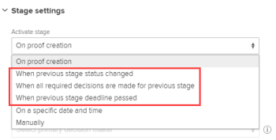
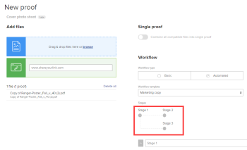

# Create an advanced proof with an Automated workflow

<!-- Audited: 2/2024 -->

An Automated Workflow makes it easier to manage the review process if your process is complex, or if you send content for review to the same people regularly. The proof moves from stage to stage and Adobe Workfront notifies each user when it is their turn to review it. For more information about Automated workflows, see [Automated Workflow overview](../../../review-and-approve-work/proofing/proofing-overview/automated-workflow.md).

## Access requirements

+++ Expand to view access requirements for the functionality in this article.

You must have the following access to perform the steps in this article:

<table style="table-layout:auto"> 
 <col> 
 <col> 
 <tbody> 
  <tr> 
   <td role="rowheader">Adobe Workfront plan</td> 
   <td> 
New: Any

Current plan: Pro or Higher

Legacy plan: Select or Higher
 
For more information about proofing access with the different plans, see <a href="/help/quicksilver/administration-and-setup/manage-workfront/configure-proofing/access-to-proofing-functionality.md" class="MCXref xref">Access to proofing functionality in Workfront</a>.
 </td> 
  </tr> 
  <tr> 
   <td role="rowheader">Adobe Workfront license</td> 
   <td> 
New: Standard

Current plan: Work or Plan
 
Legacy plan: Any (You must have proofing enabled for the user)
 </td> 
  </tr> 
  <tr> 
   <td role="rowheader">Proof Permission Profile </td> 
   <td>Manager or higher</td> 
  </tr> 
  <tr> 
   <td role="rowheader">Access level configurations</td> 
   <td> 
Edit access to Documents
</td> 
  </tr> 
 </tbody> 
</table>

For more detail about the information in this table, see [Access requirements in Workfront documentation](/help/quicksilver/administration-and-setup/add-users/access-levels-and-object-permissions/access-level-requirements-in-documentation.md).

+++

## Create an advanced proof with an Automated workflow

1. Go to the project, task, or issue where you want the proof, then click the **Documents** tab.
1. Click **Add new** > Proof, upload the content, then work through the sections listed below.

   or

   Hover over an existing document, then click the **Create Proof** > **Advanced Proof** and work through the sections listed below.

## Configure the proof Stages

1. In the Workflow type section, choose **Automated**.
1. (Optional) If you want to use an Automated Workflow template that your Workfront administrator created and shared with you, click **Add template**, select the template in the box that appears, then click **Add template**.

   >[!NOTE]
   >
   >Consider the following when you use an Automated Workflow template:
   >   
   >* An Automated Workflow template's settings determine what you can do with the Automated Workflow for a proof. For example, if the Add a stage button disabled in the template, it is not visible as you work with the Automated Workflow settings for the proof. 
   >* When a person is added to a sage in an Automated Workflow template, but also already present as a reviewer on the proof, applying the template removes the reviewer from the stage. If you don't add another reviewer to the stage, a message will prompt you to add one. 
   >* Your ability to modify an Automated Workflow template depends on the template settings configured by the Workfront administrator, as described in . If the ability to modify the template is disabled, only the owner of the template can modify it.

1. Configure the first stage of the Automated Workflow:

   1. (Optional) If you want to create a name for the first stage, click **Stage 1**, then type the name.
   1. In the **Recipients** section for the stage, add reviewers to the stage.

      >[!NOTE]
      >
      >Consider the following when adding reviewers to a stage:
      >   
      >* You can add external users to a stage with an email address.
      >* After you add a user to a stage, you can configure settings for that user on the proof.
      >* You can drag users directly to another stage, or you can drag users to a stage on the **Stages** diagram. To select multiple users, press Shift+Ctrl (on Windows) or Shift+Command (on Mac).
      >* You can add a reviewer to a proof only once, which means that you cannot add the same person to more than one stage on the proof.
      >* Reviewers who are not added to a private stage cannot see that stage on the proof or comments made in that stage.
      >* By default, adding a user to a stage grants that user access to view the proof from the moment the proof is created. Your Workfront administrator can restrict users from accessing the proof until the workflow enters the stage where the user was added.

   1. Click **Stage settings**.
   1. Click an **Activate stage** option to indicate how you want the stage to activate.

      For the first stage, you can select only **On proof creation**, **On a specific date and time**, or **Manually**. 
   
   1. (Conditional) If you selected **On a specific date and time** in the previous step, select the date and time when you want to activate the stage in the **Activate on** box that appears.
   
   1. Use any of the options below to further configure the stage.

      <table style="table-layout:auto">
       <col>
       <col>
       <tbody>
        <tr>
         <td role="rowheader">Set stage deadline</td>
         <td>
To set a deadline for the stage, click an option in the <strong>Deadline options</strong> drop-down list. Then, under <strong>Deadline</strong>, do one of the following:

          <ul>
           <li>If you chose <strong>Set specific date</strong>: Select the deadline date and time you want.</li>
           <li>If you chose <strong>Calculate from stage activation date</strong>: Select the number of business days you want to add to the stage activation date to determine the deadline.</li>
          </ul></td>
        </tr>
        <tr>
         <td role="rowheader">Lock stage</td>
         <td>Specify when the stage can be locked. </td>
        </tr>
        <tr>
         <td role="rowheader">Transfer primary decision rights to</td>
         <td>
Select the Primary decision maker on the stage (available only after you add at least one person to the stage who has a Proof role of Approver or higher). If you select a Primary decision maker, the <strong>Only one decision required</strong> option is disabled on this stage.
</td>
        </tr>
        <tr>
         <td role="rowheader">Require only one decision for this stage</td>
         <td>Ends the entire review process when one of the decision makers makes a decision.
This option is not available if you designated a user in the <strong>Primary decision maker</strong>drop-down menu.
</td>
        </tr>
        <tr>
         <td role="rowheader">Make this stage private</td>
         <td>Allows only the following people to view comments and decisions made during this stage: Supervisors, Workfront administrators, and Workfront Proof administrators</td>
        </tr>
       </tbody>
      </table>

1. To add and configure another stage:

   1. Click **New stage**.
   1. (Optional) If you want to create a name for the first stage, click **Stage 2** (or **Stage 3**, **Stage 4**, and so on), then type the name.
   
   1. Click the **Activate stage**, then select an option to specify whether the stage is activated automatically or manually.

      In addition to the options **On proof creation**, **On a specific date and time**, or **Manually**, you can select an option that is dependent on what occurred in the previous step:

      

   1. If you selected an Activate stage option that is dependent on what occurred in the previous step, use the options that appear to configure the activation setting.

      For example, if you selected **When previous stage status changes**, select the **Previous stage**, then select the status in the **Status changed to** box.

1. Repeat the previous step as needed to add more stages.

   As you add stages to the Automated Workflow, a diagram forms on the screen to represent them:

   

1. Continue with [Configure email settings for the proof](#configure-email-settings-for-the-proof) below.

## Configure email settings for the proof {#configure-email-settings-for-the-proof}

1. In the **Email notification** section, select whether to send email notifications and a custom message to the users you selected in [Create an advanced proof with an Automated workflow](#workflow) earlier in this article:

      <table>
      <tbody>
      <tr>
      <td>Notify recipients about this proof</td>
      <td>Select this option to send an email notification to users. When <strong>Basic sharing</strong> is selected in the <strong>Workflow</strong> section, an email notification is sent when the proof is created. When <strong>Automated workflow</strong> is selected in the <strong>Workflow</strong> section, an email notification is sent when the proof enters the stage of the Automated Workflow that the user is associated with.</td>
      </tr>
      <tr>
      <td>Add custom message</td>
      <td>Select this option to include a custom message in the notification. You can specify a subject and message body. The message body can include rich text formatting, such as bold, bullets, and hyperlinks.</td>
      </tr>
      </tbody>
      </table>

1. Continue with [Configure proof settings](#configure-proof-settings) below.

## Configure proof settings {#configure-proof-settings}

1. In the **Proof settings** section, select any of the following options:

   <table style="table-layout:auto"> 
    <col> 
    <col> 
    <tbody> 
     <tr> 
      <td role="rowheader">Require login - proof can only be shared with other users</td> 
      <td>When this option is disabled (default), anyone with the URL is able to view the proof.  When this option is selected:
       <ul>
        <li>Only Workfront Proof users are able to view the proof.</li>
        <li>Users cannot sign in to the proof unless they have been added to the proof.</li>
        <li>Subscriptions cannot be enabled.</li>
       </ul></td> 
     </tr> 
     <tr> 
      <td role="rowheader">Only one decision required for this proof</td> 
      <td>When this option is selected, the review is completed after one of the decision makers makes their decision. This option is disabled by default.</td> 
     </tr> 
     <tr> 
      <td role="rowheader">Require decisions to be electronically signed</td> 
      <td>Users are required to specify their user name and password at the time that they make a decision on a proof.</td> 
     </tr> 
     <tr> 
      <td role="rowheader">Lock proof when all required decisions are made</td> 
      <td>When this setting is enabled, the proof state is locked after all decisions have been made. The state is automatically changed from unlocked to locked when the final approver makes their decision. This option is disabled by default.</td> 
     </tr> 
     <tr> 
      <td role="rowheader">Download original file</td> 
      <td>When this option is selected, reviewers are able to download the original file from which the proof was created. When this option is deselected, the Download icon is no longer visible. This option is enabled by default.</td> 
     </tr> 
     <tr> 
      <td role="rowheader">Share proof via public URL or embed code</td> 
      <td>When this option is selected, the proof can be shared via a public URL or embed code.</td> 
     </tr> 
     <tr> 
      <td role="rowheader">Subscribe to proof via public URL or embed code</td> 
      <td>When this option is selected, people who have not been added explicitly to the proof can subscribe to the proof. The person subscribing to the proof is granted the role and email that you define in the following settings:
       <ul>
        <li><strong>Subscriber role:</strong> The default proof role that is assigned to all reviewers that subscribe to the proof.</li>
        <li><strong>Email alert settings for subscribers:</strong> The default email alert that is assigned to all reviewers that subscribe to the proof.</li>
       </ul>

        <ul>
         <li><strong>Proof access via email link required for:</strong> Configure whether the subscriber receives an email with a link to the proof. You can select <strong>No email</strong> (email link is not required to access the proof), <strong>Proof notification email only</strong> (subscriber receives a link to the proof via email without any verification), or <strong>Validation and proof notification emails</strong> (subscriber receives a link to the proof via email and must click the link to access a proof, the purpose of this option is to ensure that the person has entered a correct email address to which they have access).</li>
        </ul>
<strong>Note:</strong> If the proofs have Automated Workflow attached all subscriptions will generate confirmation emails to the proof Owners, so they could decide which stage the person should be added to. 

</td> 
     </tr> 
    </tbody> 
   </table>

1. Click **Create Proof**.

   Workfront begins generating a proof of the selected documents or websites. Depending on the file size and type, the lag time on a document upload can vary. Be patient as bigger files take longer to generate. You can navigate away from the page and Workfront continues to generate your file. The maximum file upload size is 4GB.

1. After the proof is generated, click **Open proof** to launch the proofing viewer.

   

   Users who do not have proofing enabled on their account are still able to view the document and make comments to the proof [.](../../../timesheets/config-timesheet-prefs/config-time-logged-hrs-days.md)
