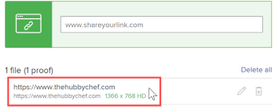

# Create an interactive proof for a website or other web content

You can generate a new interactive proof or a new version of an existing interactive proof for web content. This can be a website or other kinds of interactive content such as&nbsp;ads with streaming video or audio, HTML animations, and interactive banners.

In an interactive proof, reviewers can navigate and interact as they normally would with the website or other web content.

>[!IMPORTANT]
>
>Make sure that the website or interactive content is accessible to the people who are going to review it. They can access it in the proofing process only if they can also access it on the internet.

## Access requirements

You must have the following access to perform the steps in this article:

<table style="table-layout:auto"> 
 <col> 
 <col> 
 <tbody> 
  <tr> 
   <td role="rowheader">Adobe Workfront plan*</td> 
   <td> 
Current plan: Pro or Higher
 
or
 
Legacy plan: Premium
 
For more information about proofing access with the different plans, see <a href="/help/quicksilver/administration-and-setup/manage-workfront/configure-proofing/access-to-proofing-functionality.md" class="MCXref xref">Access to proofing functionality in Workfront</a>.
 </td> 
  </tr> 
  <tr> 
   <td role="rowheader">Adobe Workfront license*</td> 
   <td> 
Current plan: Work or Plan
 
Legacy plan: Any (You must have proofing enabled for the user)
 </td> 
  </tr> 
  <tr> 
   <td role="rowheader">Proof Permission Profile </td> 
   <td>Manager or higher</td> 
  </tr> 
  <tr> 
   <td role="rowheader">Access level configurations*</td> 
   <td> 
Edit access to Documents
 
Note: If you still don't have access, ask your Workfront administrator if they set additional restrictions in your access level. For information on how a Workfront administrator can modify your access level, see <a href="../../../administration-and-setup/add-users/configure-and-grant-access/create-modify-access-levels.md" class="MCXref xref">Create or modify custom access levels</a>.
 </td> 
  </tr> 
 </tbody> 
</table>

&#42;To find out what plan, role, or Proof Permission Profile you have, contact your Workfront or Workfront Proof administrator.

## Create an interactive proof for a website or other web content

1. Go to the project, task, or issue where you want to create a new website proof or a new version of an existing one.
1. Click **Documents** in the left panel.
1. (Conditional) If you are creating a new proof, click **Add New**, then click **Proof** in the menu that appears.

1. (Conditional) On the **New proof** page appears, if you are creating a new version of an existing proof:

   1. Hover over the URL proof for which you want to create a new version, then select it by clicking in the light blue background surrounding it.

      

   1. In the **Add new** drop-down, click **Version** > **Proof**.

1. In the **Add files** section, type the URL of the website you want to proof, then press **Enter**.  You can repeat this process to add multiple websites to be proofed.

   

  
   >[!NOTE]
   >
   > The URL must be less than 1,000 characters.

1. Click the URL you have added.

   

1. (Optional) If you want to change the name of the proof from the website URL to something else, type a **Proof name**.
1. Select **Interactive**, then click **Done**.

   >[!NOTE]
   >
   >If you are adding a new version to an existing URL proof, any options that were configured on the original proof or previous version are maintained in this version.

1. Click **Create proof** to create a simple proof with no review process.  
   or  
   Continue by configuring an advanced proof:

   * [Create an advanced proof with a Basic workflow](../../../review-and-approve-work/proofing/creating-proofs-within-workfront/configure-basic-proof-workflow.md)
   * [Create an advanced proof with an Automated workflow](../../../review-and-approve-work/proofing/creating-proofs-within-workfront/create-automated-proof-workflow.md)
