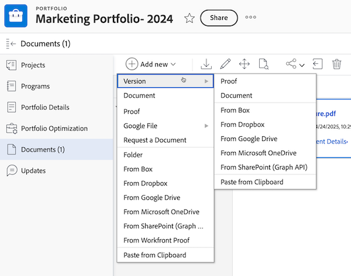
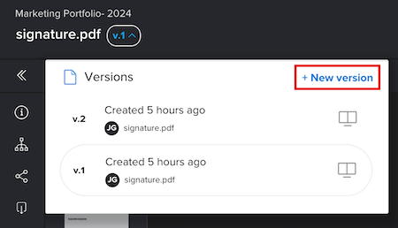

# Create a new version of a proof

<!-- Audited: 4/2025 -->

Managing feedback across multiple versions or revisions of a piece of work can be a challenge. Adobe Workfront simplifies this process by letting you create and compare multiple versions of a proof.

Consider the following information when creating a new version of a proof:

* You can give a user permission to see one version but not another. Conversely, if you share a later version with a user, that user can't see earlier versions unless you go back and grant them access to those previous versions. 
* You must have Edit rights on the proof to create a new version.

  For more information, see [Manage Proof Roles in Workfront Proof](../../../workfront-proof/wp-work-proofsfiles/share-proofs-and-files/manage-proof-roles.md) and [Proof Permissions Profiles in Workfront Proof](../../../workfront-proof/wp-acct-admin/account-settings/proof-perm-profiles-in-wp.md).

  For information about sharing proof versions, see&nbsp; [Share a Proof in Workfront Proof](../../../workfront-proof/wp-work-proofsfiles/share-proofs-and-files/share-proof.md).

>[!IMPORTANT]
>
>If a proof is created in Adobe Workfront, any new versions for that proof must also be created in Workfront. You can't create a new version of a proof within Workfront Proof if that proof was created in Workfront.

## Access requirements

+++ Expand to view access requirements for the functionality in this article.

<table style="table-layout:auto"> 
 <col> 
 <col> 
 <tbody> 
  <tr> 
   <td role="rowheader">Adobe Workfront package</td> 
   <td> 
Any
 </td> 
  </tr> 
  <tr> 
   <td role="rowheader">Adobe Workfront license</td> 
   <td> 
Standard
 
   
Work or Plan

   </td> 
  </tr> 
  <tr> 
   <td role="rowheader">Proof Permission Profile </td> 
   <td>Manager or higher</td> 
  </tr> 
  <tr> 
   <td role="rowheader">Access level configurations</td> 
   <td> 
Edit access to Documents
 </td> 
  </tr> 
 </tbody> 
</table>

For information, see [Access requirements in Workfront documentation](/help/quicksilver/administration-and-setup/add-users/access-levels-and-object-permissions/access-level-requirements-in-documentation.md). 

+++

## Create a new proof version in Workfront

There are several ways to upload a new proof version in Workfront. Default proof settings may or may not carry over from the previous version depending on the method you select:

* **Automatically generate proofs when uploading documents**: If you have this setting enabled in your user profile, default proof settings don't carry over when you drag and drop a new version.
* **Create proof > Simple**: If you select this option, default proof settings don't carry over from the previous version.
* **Add new > Version > Proof**: If you select this option, default proof settings carry over from the previous version.
* **Create proof > Advanced**: If you select this option, default proof settings carry over from the previous version.

To create a new version of a proof:

1. Open the document list that contains the proof.
1. From your computer's file system, drag and drop a new file over the proof.

   Or

   Select the row where the proof is listed, click **Add new** > **Version**, then click the option you want to use to add the new version of the proof.

   

## Create a new proof version from the proofing viewer (Workfront Proof only)

If you are using the standalone Workfront Proof, you can create a new version of a proof containing a single file or web capture.&nbsp;

>[!NOTE]
>
>If your account is on an Enterprise plan and you upload multiple files or web captures, they will be automatically combined into a single new version. Please see [Create a multi-page proof](../../../review-and-approve-work/proofing/creating-proofs-within-workfront/create-multi-page-proof.md) for more information.

To create a new version of a proof in Workfront Proof:

1. Open the proof.
1. In the upper-left corner, click the **Version** drop-down menu, then click **+ New version** in the box that appears. The new proof version page opens.

      

1. In the **Add files** section, upload a file as the new proof version by dragging and dropping it from your computer or by clicking **browse** and selecting a file. 

   Or

   Capture a web page as a new version of the proof by entering in a URL.

   >[!NOTE]
   >
   >Drag and drop is available only with browsers that fully support HTML5. This excludes Internet Explorer 7 through 9 and Safari.

1. (Optional) Select the proof title and enter a new **Proof name** for the version.

1. In the **Workflow** section, make any of the following changes to add reviewers for this proof version (this will replace the previous version's reviewers):

   * (Optional) Change the **Owner** of the version to another user in your account.  

     For information, see [Proof Permissions Profiles in Workfront Proof](../../../workfront-proof/wp-acct-admin/account-settings/proof-perm-profiles-in-wp.md).
   
   * (Optional) Using the **Type contact name or email address to add a recipient** box, add reviewers to the version. You can then select a **Proof role** and **Email alerts** type for each recipient.

     For information, see [Add Groups to a Proof](../../../workfront-proof/wp-mnguserscontacts/groups/add-groups.md) and [Manage Proof Roles in Workfront Proof](../../../workfront-proof/wp-work-proofsfiles/share-proofs-and-files/manage-proof-roles.md).

     >[!NOTE]
     >
     >If the proof creator or owner has the Proof Made email disabled by default in their personal settings, they won't receive any Proof Made or New proof emails even if the **Notify recipients about this proof** box is checked on the New proof page. For information, see [Configure email notification settings in Workfront Proof](../../../workfront-proof/wp-emailsntfctns/email-alerts/config-email-notification-settings-wp.md), [The Proof Made email](../../../workfront-proof/wp-emailsntfctns/proof-notifications-and-reminders/proof-made-email.md), and [New proof email](../../../workfront-proof/wp-emailsntfctns/proof-notifications-and-reminders/new-proof-email.md).

   * (Optional) Set a proof deadline.  

   * (Optional and Conditional) Select a new primary decision maker in the **Transfer primary decision rights to** drop-down.

   * (Optional) Select the **Require only one decision for this stage** box to remove the option to set a user as the new primary decision maker.

1. In the **Email notification** section, select any of the following settings:

   * (Optional) **Notify recipients about this proof**: Select this option to notify the reviewers of the new version. Your selection will be logged in the **Activity** section of the **Proof details** page. For more information, see [Manage Proof Details in Workfront Proof](../../../workfront-proof/wp-work-proofsfiles/manage-your-work/manage-proof-details.md).
   
   * (Conditional and Optional) **Add custom subject and message**: Select this option to add a custom subject line and message to the email notification.

1. In the **Organization** section, select any of the following settings:

   * Apply one or more tags to the proof. For more information, see [Create and Manage Tags in Workfront Proof](../../../workfront-proof/wp-work-proofsfiles/organize-your-work/create-and-manage-tags.md).  
   
   * Add the version to a folder. The folder&nbsp;will be copied from the previous version of the proof. If you select a different folder, the whole proof—which includes all versions—will be moved. For more information, see [Manage Folders in Workfront Proof](../../../workfront-proof/wp-work-proofsfiles/organize-your-work/manage-folders.md).
   
   * Billing administrators and Administrators can make the folder field mandatory across the whole account in the **Settings** tab. 

1. In the **Proof settings** section, select any of the following settings:

   * Require a user to log in to view the proof.
   * Require electronic signatures on the proof (Enterprise plan only).
   * Lock the proof when all decisions are made. 
   * Allow downloading of the original file.
   * Allow public sharing of the proof.
   * Allow subscribing to the proof.

     The selections made in this section will be shown in the **Proof details** page (where some fields can be edited). For more information, see [Manage Proof Details in Workfront Proof](../../../workfront-proof/wp-work-proofsfiles/manage-your-work/manage-proof-details.md).

<!--
<h2 data-mc-conditions="QuicksilverOrClassic.Draft mode">Create a new version of a proof from the proofing viewer</h2>
-->

<!--

To create a new version from the proofing viewer

-->

<!--
<ol data-mc-conditions="QuicksilverOrClassic.Draft mode">
<li value="1">Open the proof.</li>
<li value="2"> 
Click the <strong>Version</strong> drop-down menu in the upper-left corner, then click <strong>+ New version</strong> in the box that appears.
 
On the <strong>New proof version of</strong> page that appears, you can see all the reviewers from the previous version, including their roles and email notification settings. You can easily edit the roles and notifications of existing reviewers or remove existing reviewers from the new version on this page.
 </li>
<li value="3"> 
Under <strong>Add files</strong>, upload a file as a new version of the proof by dragging and dropping from your computer or by clicking <strong>browse</strong> and selecting the file you want. You can type a&nbsp;<strong>Proof name</strong>&nbsp;for the version or leave this box blank to&nbsp;use the same filename with a version number added on the end.
 
Or 
 
Capture a web page as a new version of the proof by typing a URL
 <note type="note">
Drag and drop is available only with browsers that fully support HTML5. This excludes Internet Explorer 7 through 9 and Safari.
 
</note> </li>
<li value="4"> 
Under <strong>Workflow</strong>, make any of the following changes to specify the reviewers for this version of the proof.
 
Reviewers from the previous version are replaced by the reviewers you add.

<ul>
<li>Change the <strong>Owner</strong> of the version to another user in your account. For information about owner permissions, see <a href="../../../workfront-proof/wp-acct-admin/account-settings/proof-perm-profiles-in-wp.md" class="MCXref xref">Proof Permissions Profiles in Workfront Proof</a>.</li>
<li> 
Using the <strong>Type contact name or email address to add a recipient box</strong>, add reviewers to the version. You can specify a <strong>Proof role</strong> and an <strong>Email alerts</strong> type for each recipient.
 
For information about adding groups to the proof, see&nbsp;<a href="../../../workfront-proof/wp-mnguserscontacts/groups/add-groups.md" class="MCXref xref">Add Groups to a Proof</a>.&nbsp;For information about roles, see <a href="../../../workfront-proof/wp-work-proofsfiles/share-proofs-and-files/manage-proof-roles.md" class="MCXref xref">Manage Proof Roles in Workfront Proof</a>.
 <note type="note">
If the creator or owner of&nbsp;&nbsp;the proof has
<a href="../../../workfront-proof/wp-emailsntfctns/proof-notifications-and-reminders/proof-made-email.md" class="MCXref xref">The Proof Made email</a> disabled by default (in their personal settings), they won't receive any Proof made or New proof emails even if the Notify people by email box is checked on the New proof page. For information about email notifications, see
<a href="../../../workfront-proof/wp-emailsntfctns/email-alerts/config-email-notification-settings-wp.md" class="MCXref xref">Configure email notification settings in Workfront Proof</a>.&nbsp;See also
<a href="../../../workfront-proof/wp-emailsntfctns/proof-notifications-and-reminders/proof-made-email.md" class="MCXref xref">The Proof Made email</a> and
<a href="../../../workfront-proof/wp-emailsntfctns/proof-notifications-and-reminders/new-proof-email.md" class="MCXref xref">New proof email</a>.
 
</note> </li>
<li>Set a proof deadline for the version.</li>
<li>Hover over a reviewer's name to see any decisions he or she made on a previous version.</li>
</ul> </li>
<li value="5">Under <strong>Email notification</strong>, do any of the following:
<ul>
<li>Specify whether you want to notify the reviewers of the new version. Your selection will be logged in the Proof activity section on the Proof details page.</li>
<li>Add a custom subject and message.</li>
</ul></li>
<li value="6">Under Proof settings, make any of the changes below:
<ul>
<li>Require login on the proof</li>
<li>Require electronic signatures on the proof (Enterprise plan only)</li>
<li>Lock the proof when all decisions are made</li>
<li>Allow or block download of original file</li>
<li>Public sharing of the proof,&nbsp;including public sharing settings</li>
<li>Subscription to the proof The selections made in this section will be shown in the Proof details page.</li>
</ul></li>
</ol>
-->

## About the New Version message

If there was a custom subject/message included in the previous version of the proof, it will show by default on the New version page. You can:

* Edit the subject and message.
* Unselect the Notify people by email box, meaning no email will be sent to your reviewers to notify them that they have a new version to review.

  >[!NOTE]
  >
  >This is not impacted by any default custom subject/message saved in your personal settings.

If you have a default subject and message saved in your personal settings, this will determine what message is shown by default on the New version page:

* If you notified your reviewers about the previous proof version using the standard email (for example, no custom subject/message), your default custom subject/message (your personal settings) will be shown on the New version page. You can then edit the custom subject and message or unselect the Notify people by email box, meaning no email will be sent to your reviewers to notify them that they have a new version to review.
* If you didn't notify your reviewers about the previous proof version (e.g. no standard or custom email), the New version page will not include a message by default. To notify your reviewers of the new version, click the Send a Message link, which will show your default custom subject/message (per your personal settings). You can then edit the custom subject and message as needed.

If you do not have a default subject and message saved in your personal settings, the following will show on the New version page:

* If you notified your reviewers about the previous proof version using the standard email (e.g. no custom subject/message), the Notify people by email option will be selected by default on the New version page. To add a custom message, click the link.
* If you didn't notify your reviewers about the previous proof version (e.g. no standard or custom email), the New version page will not include any message by default. To notify your reviewers of the new version, click the Send a Message link. You can then add a custom subject and message by clicking the Add Custom Message link.
