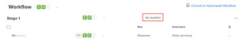

# Set a deadline for an existing basic proof

You can set a single deadline for a basic proof after it's been created.

## Access requirements

+++ Expand to view access requirements for the functionality in this article.

<table style="table-layout:auto"> 
 <col> 
 <col> 
 <tbody> 
  <tr> 
   <td role="rowheader">Adobe Workfront package</td> 
   <td> 
Any
 </td> 
  </tr> 
  <tr> 
   <td role="rowheader">Adobe Workfront license</td> 
   <td> 
   
Standard

   
Work or Plan

    </td> 
  </tr> 
  <tr> 
   <td role="rowheader">Proof Permission Profile </td> 
   <td>Manager or higher</td> 
  </tr> 
  <tr> 
   <td role="rowheader">Proof Role</td> 
   <td>Author or Manager</td> 
  </tr> 
  <tr> 
   <td role="rowheader">Access level configurations</td> 
   <td> 
Edit access to Documents
</td> 
  </tr> 
 </tbody> 
</table>

For information, see [Access requirements in Workfront documentation](/help/quicksilver/administration-and-setup/add-users/access-levels-and-object-permissions/access-level-requirements-in-documentation.md). 

+++

## Set a deadline for an existing basic proof

1. Go to the project, task, or issue that contains the document, then select **Documents**.
1. Find the proof you need.
1. Click **Proofing Workflow**.
1. In the **Workflow** area, select **No Deadline**.

   

1. Choose a date, and specify a time, then click anywhere on the screen. 
1. Choose if you want to notify reviewers of the new deadline.
