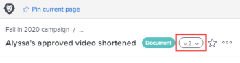
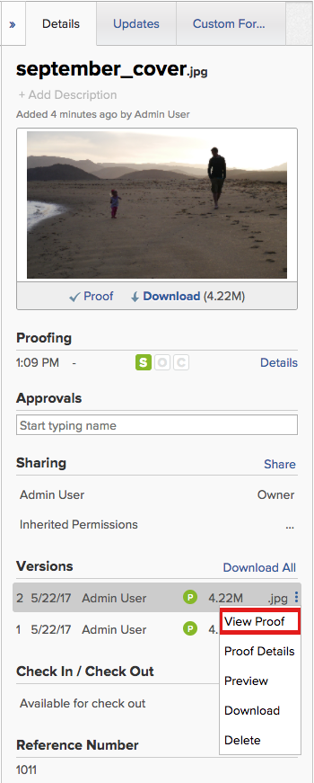

# Manage proof versions

Adobe Workfront enables you to create and manage versions of your proofs. You can create, view, download and delete proof versions.

## Access requirements

You must have the following access to perform the steps in this article:

<table cellspacing="0"> 
 <col> 
 <col> 
 <tbody> 
  <tr> 
   <td role="rowheader">Adobe Workfront plan*</td> 
   <td> 
Current plan: Pro or Higher
 
or
 
Legacy plan: Select or Premium
 
For more information about proofing access with the different plans, see <a href="../../../administration-and-setup/manage-workfront/configure-proofing/access-to-proofing-functionality.md" class="MCXref xref">Access to proofing functionality in Workfront</a>.
 </td> 
  </tr> 
  <tr> 
   <td role="rowheader">Adobe Workfront license*</td> 
   <td> 
Current plan: Work or Plan
 
Legacy plan: Any (You must have proofing enabled for the user)
 </td> 
  </tr> 
  <tr> 
   <td role="rowheader">Proof Permission Profile </td> 
   <td>Manager or higher</td> 
  </tr> 
  <tr> 
   <td role="rowheader">Access level configurations*</td> 
   <td> 
Edit access to Documents
 
For information on requesting additional access, see <a href="../../../workfront-basics/grant-and-request-access-to-objects/request-access.md" class="MCXref xref">Request access to objects in Adobe Workfront</a>.
 </td> 
  </tr> 
 </tbody> 
</table>

&#42;To find out what plan, role, or Proof Permission Profile you have, contact your Workfront or Workfront Proof administrator.

## View a list of all versions of a proof

1. Go to the Document list, and select the proof.

View and manage details for a previous proof version

1. In a document list, hover over the row containing the proof, then click `Document Details`.
1. Near the top of the Document Details page, click the drop-down menu next to the name, then click the name of the version you want to view and manage.

   

   Along with viewing the version's Details, you can make changes to the version, such as its name, metadata, and proofing settings (if it's a document proof).

Download a single proof version In the document list, click on the proof. In the Summary, under Versions, click the click the More menu to the right of the version, then click Download in the drop-down list that appears. 

## Download all versions of a proof

1. In the document list, click on the proof.

## Delete a proof version

If you upload a version of a proof by mistake, or a version is no longer needed, you can delete the version and maintain the original document.

>[!IMPORTANT]
>
>You can't recover a proof version that you delete individually.

Keep the following in mind when you consider deleting a document version:

* Only one version can be deleted at a time. If a version is deleted, this action appears in the `Updates` on the proof. 
* If you upload a new version after deleting a version, the new version receives the next sequential number. For example, if there are 3 versions of a proof and you delete version 3, the next proof uploaded will be version 4.
* System updates and comments made on a version are retained in Workfront after the version is deleted.

  <!--
  Deleting a document version in Workfront does not delete the Proof version.
  -->

To delete a proof version:

1. Go to the project, task, or issue that contains the document, then select `Documents`.Find the document you need.
1. In the Version area in the Summary, click the version, then click `Delete` in the drop-down list that appears. The `Delete` option is visible only if there are at least two versions.

## View a previous proof version

Any user in Workfront with View access to the document can view past versions of a proofed document. It is not required that the user have a proofing license.

To view the proof for a previous version of a proofed document:

1. Go to the project, task, or issue that contains the document, then select `Documents`.
1. Find the proof you need.
1. Open the Summary and hover over the image thumbnail, then click Open `Proof`.

   

   

## View the proofing details for a previous version

Users must have a proofing license in order to view the proof details of a past version of a proofed document.

1. Go to the project, task, or issue that contains the document, then select `Documents`.
1. Find the proof you need. 
1. In the Version area in the Summary, click the version, then click `Details` in the drop-down list that appears. 
1. On the Document Details page, click Proofing Workflow in the left panel to do any of the following:

  * Add an automated workflow. For more information, see the section [Create an Automated Workflow for the proof](../../../review-and-approve-work/proofing/creating-proofs-within-workfront/configure-proof.md#create2) in the article [Configure a proof](../../../review-and-approve-work/proofing/creating-proofs-within-workfront/configure-proof.md#configuring-the-automated-workflow).
  * Share the proof's public URL. For more information, see [Share a proof link](../../../review-and-approve-work/proofing/managing-proofs-within-workfront/share-a-proof-in-workfront.md#share) in [Share a proof within Adobe Workfront](../../../review-and-approve-work/proofing/managing-proofs-within-workfront/share-a-proof-in-workfront.md).
  * View all activity that has occurred on the proof.
  * Send reminder messages to reviewers on the proof.

1. Click `Done`.

