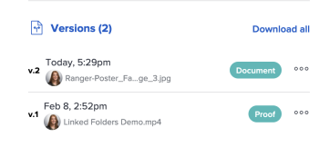
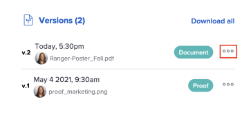

# View proof versions

You can view past versions of a proof.

## Access requirements

+++ Expand to view access requirements for the functionality in this article.

You must have the following access to perform the steps in this article:

<table style="table-layout:auto"> 
 <col> 
 <col> 
 <tbody> 
  <tr> 
   <td role="rowheader">Adobe Workfront plan*</td> 
   <td> 
Current plan: Pro or Higher
 
or
 
Legacy plan: Select or Premium
 
For more information about proofing access with the different plans, see <a href="/help/quicksilver/administration-and-setup/manage-workfront/configure-proofing/access-to-proofing-functionality.md" class="MCXref xref">Access to proofing functionality in Workfront</a>.
 </td> 
  </tr> 
  <tr> 
   <td role="rowheader">Adobe Workfront license*</td> 
   <td> 
Current plan: Work or Plan
 
Legacy plan: Any (You must have proofing enabled for the user)
 </td> 
  </tr> 
  <tr> 
   <td role="rowheader">Proof Permission Profile </td> 
   <td>Manager or higher</td> 
  </tr> 
  <tr> 
   <td role="rowheader">Access level configurations*</td> 
   <td> 
Edit access to Documents
 
For information on requesting additional access, see <a href="../../../../workfront-basics/grant-and-request-access-to-objects/request-access.md" class="MCXref xref">Request access to objects </a>.
 </td> 
  </tr> 
 </tbody> 
</table>

&#42;To find out what plan, role, or Proof Permission Profile you have, contact your Workfront or Workfront Proof administrator.

+++

## View a list of all proof versions

1. Go to the Document list, and select the proof.
1. In the Summary, scroll to the view the **All Versions** section. Here you can view all of the versions of the proof.

   

## Preview a previous proof version

Files that cannot be previewed (such as XLSX and DOC) are downloaded.

1. Go to the document list, and select a proof.
1. In the Summary, scroll down to **Versions**, click the **More** menu, then select **Preview**.

   

## View a previous proof version

Any user in Workfront with View access to the document can view past versions of a proofed document. It is not required that the user have a proofing license.

1. Go to the project, task, or issue that contains the document, then select **Documents**.
1. Find the proof you need.
1. In the Summary, scroll down to **Versions**, click the **More** menu, then select **Open proof**.

   
