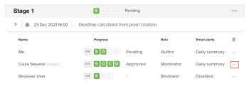

# Send email messages to reviewers on a proof

During the review and approval process, you can send a message to one or all of the reviewers on a proof. Messages are an easy way to remind reviewers to complete their review of a proof or to provide other information related to the proof.

You can choose between sending a generic reminder email or sending a customized message to one or all of the users associated with a given stage.

## Access requirements

+++ Expand to view access requirements for the functionality in this article.

<table style="table-layout:auto"> 
 <col> 
 <col> 
 <tbody> 
  <tr> 
   <td role="rowheader">Adobe Workfront package</td> 
   <td> 
Any
 </td> 
  </tr> 
  <tr> 
   <td role="rowheader">Adobe Workfront license</td> 
   <td>
   
Standard

   
Work or Plan

   </td> 
  </tr> 
  <tr> 
   <td role="rowheader">Proof Permission Profile </td> 
   <td>Manager or higher</td> 
  </tr> 
  <tr> 
   <td role="rowheader">Proof role</td> 
   <td>Author or Moderator</td> 
  </tr> 
  <tr> 
   <td role="rowheader">Access level configurations</td> 
   <td> 
Edit access to Documents
 </td> 
  </tr> 
 </tbody> 
</table>

For information, see [Access requirements in Workfront documentation](/help/quicksilver/administration-and-setup/add-users/access-levels-and-object-permissions/access-level-requirements-in-documentation.md). 

+++

## Send email messages to users on a proof

1. Find the document for the proof that contains the users you want to message.
1. Hover over the document, then click **Proofing Workflow**.

   

1. To send a message to all users on the stage, click the **More** menu on the stage and choose **Message All**.

   

1. To send a message to an individual user, click the **More** menu next to the user and choose **Message**.

   

1. In the **Message details** section, specify the following information:

   <table style="table-layout:auto"> 
    <col> 
    <col> 
    <tbody> 
     <tr> 
      <td role="rowheader">Notify people by email</td> 
      <td>This option cannot be deselected. All users receive the message via email.</td> 
     </tr> 
     <tr> 
      <td role="rowheader">Discard custom message</td> 
      <td> 
Click <strong>Discard custom message</strong> if you want to include only the default email content.
 
The default reminder email includes the following information:
 
       <ul> 
        <li>Personal link to the proof Thumbnail of the proof image </li> 
        <li>The following proof details: Proof name, version number, folder name (if applicable), and a list of the reviewers and their progress on the proof.</li> 
       </ul> </td> 
     </tr> 
     <tr> 
      <td role="rowheader">Subject</td> 
      <td>Type a message subject.</td> 
     </tr> 
     <tr> 
      <td role="rowheader">Message</td> 
      <td>Type your message content.</td> 
     </tr> 
    </tbody> 
   </table>

1. Click **Send.**
