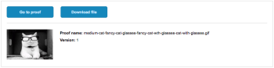

# Share a proof within Adobe Workfront

You can share a proofed document within Adobe Workfront by sharing the document or by adding users to the proof.

If you share the proof, as explained in this article, your recipient has the same access to the document and the proof. In addition, you can request approval for the proof from the recipient.

>[!TIP]
>
>You can also share a proof from within the proofing viewer. For instructions, see [Share a proof from the proofing viewer](../../../review-and-approve-work/proofing/reviewing-proofs-within-workfront/review-a-proof/share-a-proof-in-proofing-viewer.md).

## Access requirements

You must have the following access to perform the steps in this article:

<table style="table-layout:auto"> 
 <col> 
 <col> 
 <tbody> 
  <tr> 
   <td role="rowheader">Adobe Workfront plan*</td> 
   <td> 
Current plan: Pro or Higher
 
or
 
Legacy plan: Select or Premium
 
For more information about proofing access with the different plans, see <a href="/help/quicksilver/administration-and-setup/manage-workfront/configure-proofing/access-to-proofing-functionality.md" class="MCXref xref">Access to proofing functionality in Workfront</a>.
 </td> 
  </tr> 
  <tr> 
   <td role="rowheader">Adobe Workfront license*</td> 
   <td> 
Current plan: Work or Plan
 
Legacy plan: Any (You must have proofing enabled for the user)
 </td> 
  </tr> 
  <tr> 
   <td role="rowheader">Proof Permission Profile </td> 
   <td>Manager or higher</td> 
  </tr> 
  <tr> 
   <td role="rowheader">Proof Role</td> 
   <td>Author or Moderator</td> 
  </tr> 
  <tr> 
   <td role="rowheader">Access level configurations*</td> 
   <td> 
Edit access to Documents
 
For information on requesting additional access, see <a href="../../../workfront-basics/grant-and-request-access-to-objects/request-access.md" class="MCXref xref">Request access to objects </a>.
 </td> 
  </tr> 
 </tbody> 
</table>

&#42;To find out what plan, role, or Proof Permission Profile you have, contact your Workfront or Workfront Proof administrator.

## Share a proof link

Sharing a proof link grants Workfront users viewing access. Users can comment on the proof and subscribe to email notifications for the proof using their Workfront login credentials. Non-proofing users can comment and subscribe using an email address and display name.

>[!IMPORTANT]
>
>The Allow sharing proof via public URL or embed code setting must be enabled.

1. Select the document that contains the proof you want to share with users.

   You can select only one document. You cannot share the link for multiple documents at the same time.

1. Click **Share** > **Proof Link**.
1. In the **Proof link** box that appears, do either of the following:

   * To copy the link to your clipboard, click **Copy link**.

     You can now distribute the link via a third-party tool, such as a chat or an email application.
   
   * To email the link directly from Adobe Workfront, do the following:

      1. In the **Or email link to** field, begin typing and select the name of your recipient. Or specify the email address of an external user who you want to share with.

         >[!NOTE]
         >
         >If you see an alias email when sharing a proof, don't create a new guest user by entering the original email if a corresponding alias email exists.

      1. Select from the following options:

         <table style="table-layout:auto">
          <col>
          <col>
          <tbody>
           <tr>
            <td role="rowheader">Send public link</td>
            <td>
Includes a button in the email notification that directs users to the proof within the proofing viewer they are using and grants View access.

If <strong>Subscribe to proof via public URL or embed code</strong> is turned off for the proof, users can sign in with their Workfront login credentials to add comments to the proof. If it is turned on, anyone providing their email address and name (no password required) can sign and add comments to the proof.
</td>
           </tr>
           <tr>
            <td role="rowheader">Send download link</td>
            <td>Includes a button in the email notification that directs users to a download page, which provides file details, file name, and file size, with the file displayed inline. Users can click the Download link from the download page to download the file.</td>
           </tr>
           <tr>
            <td role="rowheader">Add custom message</td>
            <td>Allows you to specify a custom subject and body for the email notification.</td>
           </tr>
          </tbody>
         </table>

      1. Click **Send**.

         Your recipients receive an email notification containing information about the proof and the buttons you chose to include.

         

## Add users to a proof

You can add any Workfront user to the proof if you have Edit rights on the proof. If the proof has multiple stages, you add the user to an individual stage

>[!WARNING]
>
>In addition to the methods listed in this article, it is possible to add users to a proof by tagging them in a comment from the Updates tab of an existing proof. However, users added to a proof in this way will not receive an email notification unless they are tagged again after they have been added to the proof's workflow.
>
>As such, we recommend adding users to a proof through one of methods listed below and not by tagging them in a comment.
>

>[!NOTE]
>
>Keep the following in mind if you are using a legacy Workfront plan in which proofing can be enabled and disabled for a user:
>
>* Your recipients do not need to have proofing enabled in order to review the proof.
>* When Automated Workflow is enabled and you add a user to the proof who does not have proofing enabled in Workfront, a new stage is created within the Automated Workflow. The user who you are adding is automatically added to this new stage when they view the proof for the first time. (For more information, see [Automated Workflow overview](../../../review-and-approve-work/proofing/proofing-overview/automated-workflow.md).)
>

### Add users to an existing proof from the Documents tab

1. Select the document that contains the proof that you want to add users to.
1. If the proof does not have an automated workflow (stages), click the **More** icon in the upper-right corner of the Stage 1 section, then click **Share** in the drop-down menu.

   Or

   If the proof does have an Automated Workflow, click the **More** icon in the upper-right corner of the stage where you want to add the reviewer, then click **Share** in the drop-down menu.

1. In the **Share this version** box that appears, under **Share**, begin typing the name or email address of a user who you want to share the proof with, then click the name when it appears in the drop-down list.

1. (Optional) Repeat this step to add multiple users to the proof.
1. (Optional) Set a deadline for the reviewers.
1. (Optional) Make sure **Notify people by email** is selected if you want to let the reviewers know you have added them to the proof.
1. (Optional) **Add a custom message** to the email.
1. When you have added all the reviewers, click **Share**.

### Add users to an existing proof from the proofing viewer

You can add users to a proof while you review a proof in the Web Proofing Viewer and in the Desktop Proofing Viewer.

For more information, see [Share a proof by adding users to it](../../../review-and-approve-work/proofing/reviewing-proofs-within-workfront/review-a-proof/share-a-proof-in-proofing-viewer.md#sharing-with-individual-users) in the article [Share a proof from the proofing viewer](../../../review-and-approve-work/proofing/reviewing-proofs-within-workfront/review-a-proof/share-a-proof-in-proofing-viewer.md)

## Report on proofing approvals

You can create a report that reports on the proofing approvals that have been shared within Workfront. This report provides the following proof approval information in your system:

* Document that was submitted for approval
* Name of the approver
* Proof version
* Proof ID
* Proof creation date

You access this approval when creating a report based on an object, as described in [Create a custom report](../../../reports-and-dashboards/reports/creating-and-managing-reports/create-custom-report.md).

For more information about the Proof Approvals object report, see the [Report on objects](../../../workfront-basics/navigate-workfront/workfront-navigation/understand-objects.md#reporting-on-objects) section in [Understand objects in Adobe Workfront](../../../workfront-basics/navigate-workfront/workfront-navigation/understand-objects.md)

## Approve a shared proof

When a user adds you to a proof and grants either the Approver role or the Reviewer & Approver role using Automated Workflow, the approval request displays on the Approvals tab in your Home or My Work area. You can then view the proof and make an approval decision on the proof directly from Workfront.

For information about how to make approval decisions from the My Work area, see [Approve work from the Home area](../../../review-and-approve-work/manage-approvals/approving-work.md#approving-work-from-the-home-area) or [Approving work](../../../review-and-approve-work/manage-approvals/approving-work.md#approving-work-from-the-my-work-area) in [Approving work](../../../review-and-approve-work/manage-approvals/approving-work.md).
