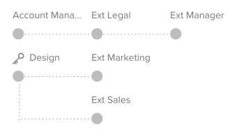

# Automated Workflow overview

<!-- Audited: 01/2024 -->

Automated Workflows allow you to create a series of sequential or parallel review stages, establish dependencies between these stages, and limit their visibility to certain users. If there are interdependent stages in your review process, Automated Workflows move your proof through the stages automatically, notifying the relevant reviewers and approvers along the way. For information on setting up an Automated Workflow, see [Create an advanced proof with an Automated workflow](../../../review-and-approve-work/proofing/creating-proofs-within-workfront/create-automated-proof-workflow.md).

**Examples:**  Automated Workflows help you manage complex proof review processes like:

* When different groups or reviewers need to review content in a particular order 
* When there are dependencies between the activity of users as they review content
* When content is reviewed regularly by the same groups of people
* When you want to control the period of time in which reviewers look at content
* When you want to keep some review activity private

## Stages

For each Automated Workflow stage, you can configure settings such as a deadline for the stage, a lock on a stage, a reviewer set as the decision maker for the stage, and a privacy setting allowing only certain people to see reviewer comments on the stage.

Stages can be activated manually, on proof creation, upon reaching a deadline, on a specific date and time, or when a decision is made on the parent stage.

Stages can be locked manually, as well as when the next stage starts or when all decisions are made on the stage. You can also choose to never lock a stage.

You can appoint a primary decision maker for a stage. This person's decision renders all other decisions for the stage unnecessary.

Similarly, you can choose to require only one decision for a stage. When you do this, the review process for the stage is marked complete after any one of the recipients makes their decision on the stage.

You can have all reviewers notified about their invitation to review the content when the review process begins, or you can have each reviewer notified only when their stage is activated.

## Private stages

By default, comments left by reviewers in all stages are visible to everyone who is reviewing the content and receiving email notifications and comment summaries about the review process.

If you want to prevent certain groups of reviewers from seeing other reviewer's comments, you can create private stages.

Private stages are only visible to reviewers added to those stages. They are also visible to users who have edit rights on the proof or edit rights on all items created in your organization's Adobe Workfront account (Supervisor and above, or users with custom profiles for whom editing of other people's information is enabled).

Comments added by private stage participants are not included in email notifications and proof comment summaries requested by anyone who doesn't have the rights to view them.

## Workflow diagram

The Workflow diagram is a visual representation of your proof's review process. It shows you the order of stages and any dependencies between stages as you create or view the details of a proof. Any private stages display with a key symbol.

In live proofs, stage dependencies display with a dashed grey line for inactive stages or a solid black line for active stages. Stages display in green if the approval process was completed within their specified deadline. Stages approaching their deadlines display in orange and stages past their deadlines display in red.

## Automated Workflow templates

If your organization uses the same review process for multiple proofs, your Workfront administrator can create Automated Workflow templates to make proof creation a lot easier. You can choose an Automated Workflow template while you are configuring a proof to add the stages and reviewers in that template to the proof. You can modify the template applied to the proof as needed before and after you create the proof.

Your Workfront administrator can create an unlimited number of templates according to your company's needs.

To find out more about creating, using, and managing templates, see your Workfront administrator.
