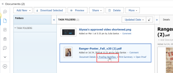

# Proof progress and status overview

You can view information about how a proof is progressing through the review process and see an overall summary of the proof's decision status from the Documents area.

## Proof progress overview

Proof progress indicates the work done on a proof from the time you send the proof to recipients to the time they make a decision on the proof. The progress icons, S, O, C, and D, appear next to the proof name and provide information about the proof's progress.

<table style="table-layout:auto"> 
 <col> 
 <col> 
 <thead> 
  <tr> 
   <td> 
<strong>Progress icon</strong> 
 </td> 
   <td> 
<strong>Description</strong> 
 </td> 
  </tr> 
 </thead> 
 <tbody> 
  <tr> 
   <td> 
  
 
<strong>Sent</strong> 
 </td> 
   <td> 
The proof has been sent to assigned recipients.
 </td> 
  </tr> 
  <tr> 
   <td> 
<strong></strong> 
 
<strong>Opened</strong> 
 </td> 
   <td> 
All assigned recipients open&nbsp;the proof or Proof details page.
 </td> 
  </tr> 
  <tr> 
   <td> 
<strong></strong> 
 
<strong>Comments made</strong> 
 </td> 
   <td> 
All assigned recipients make at least one comment on the proof.
 
If there are no reviewers&nbsp;assigned to the proof, the <strong>C</strong>&nbsp;icon does not appear in the progress bar.
 </td> 
  </tr> 
  <tr> 
   <td> 
  
 
<strong>Decision made</strong> 
 </td> 
   <td> 
All assigned approvers make a decision on the proof, All assigned approvers make a decision on the proof, unless the proof creator specifies only one decision is needed.
 
If there are no approvers (decision makers) designated for&nbsp;the proof,&nbsp;the <strong>D</strong>&nbsp;icon does not appear in the progress bar.&nbsp;
 </td> 
  </tr> 
 </tbody> 
</table>

The progress icons can appear in the following colors to indicate certain information about the proof's progress:

* **Green**: Complete.
* **White**: Not complete.
* **Orange**:&nbsp;Not&nbsp;complete and deadline is less than 24 hours. 
* **Red**: Not&nbsp;complete and past the deadline.

<!--
<h3 data-mc-conditions="QuicksilverOrClassic.Draft mode">Levels of proof progress</h3>
-->

<!--

Workfront Proof uses the progress icons to track a proof's progress at each of the following levels:

-->

  <!--
  <li data-mc-conditions="QuicksilverOrClassic.Draft mode">For each reviewer, based on that person's activity on the proof.&nbsp;</li>
  -->

  <!--
  <li data-mc-conditions="QuicksilverOrClassic.Draft mode">For each stage, based on the progress the reviewer on the stage who is most behind in the proofing process.&nbsp;To learn more about stages, see <a href="../../../review-and-approve-work/proofing/proofing-overview/stages.md" class="MCXref xref">Automated Workflow Stages overview</a>.</li>
  -->

  <!--
  <li data-mc-conditions="QuicksilverOrClassic.Draft mode">For the proof, based on the progress of the stage (group of reviewers) who is the most behind in the proofing process.</li>
  -->

<!--

For an example of how Workfront Proof determines progress using the reviewer or stage that is most behind,&nbsp;suppose three reviewers on a proof need to make a&nbsp;decision. If two of them have made their&nbsp;decision&nbsp;but the third has not, the progress bar for the proof does not show&nbsp;the D in green because of the outstanding&nbsp;decision.

-->

<!--

If the Primary Decision Maker setting is selected on a proof and the primary decision maker submits a decision, the D in the proof progress bar turns&nbsp;green for all reviewers because no other decisions are required.

-->

<!--

Similarly, if the Only One Decision Required setting is selected on a proof and any reviewer submits a decision, the D in the proof progress bar turns&nbsp;green for all reviewers because no other decisions are required.

-->

## Proof status overview

The proof status displays&nbsp;the status of decisions that are required for&nbsp;the proof. The status of the proof is driven by the "worst case" participant. For example, suppose&nbsp;there are three&nbsp;decisions&nbsp;on the proof: two have the status of **Accepted**&nbsp;and one has the status of **Rejected**. The "worst case" decision of **Rejected** over-rules the other decisions and the overall status of the proof is shown as **Rejected**.&nbsp;

The standard status options are as follows:

* Pending
* Approved
* Approved with Changes
* Changes Required
* Not Relevant

If custom decisions are configured in your account, the status options reflect your&nbsp;custom decision&nbsp;settings.

<!--
<h2 data-mc-conditions="QuicksilverOrClassic.Draft mode">Viewing proof progress and status</h2>
-->

<!--

 You can view the progress and status of proofs for individual documents. 

-->

  <!--
  <li data-mc-conditions="QuicksilverOrClassic.Draft mode"><a href="#view-proof-progress-and-status-for-a-document" class="MCXref xref">View proof progress and status&nbsp;for a document</a> </li>
  -->

  <!--
  <li data-mc-conditions="QuicksilverOrClassic.Draft mode"><a href="#view-proof-approval-information-in-home" class="MCXref xref">View proof approval information&nbsp;in Home</a> </li>
  -->

<!--
<h3 data-mc-conditions="QuicksilverOrClassic.Draft mode" id="view-proof-progress-and-status-for-a-document">View proof progress and status&nbsp;for a document</h3>
-->

   <!--
   <li value="1" data-mc-conditions="QuicksilverOrClassic.Draft mode">If a proof has not already been generated for the document in Adobe Workfront, generate it, as described in the articles.</li>
   -->

   <!--
   <li value="2" data-mc-conditions="QuicksilverOrClassic.Draft mode">In the Documents area, under the proof's name, click <strong>Proof Details</strong>.</li>
   -->

   <!--
   <li value="3" data-mc-conditions="QuicksilverOrClassic.Draft mode">In the <strong>Proofing Details</strong> box that appears, the proof's progress for each stage, then click <strong>Done</strong>.</li>
   -->

   <!--
   
Under the proof's name, click <strong>Proofing Workflow</strong>.

   -->

   <!--
   
 
   
   --> 
   <!--
   <MadCap:conditionalText data-mc-conditions="QuicksilverOrClassic.Draft mode">
   These screenshots will need to change with new terminology ("Review Workflow" for this one?)
   </MadCap:conditionalText>
     

   -->

   <!--
   
In the Workflow information that appears, scroll down to see the proof's progress for each stage:

   -->

   <!--
   
  

   -->

<!--
<h3 data-mc-conditions="QuicksilverOrClassic.Draft mode" id="view-proof-approval-information-in-home">View proof approval information&nbsp;in Home</h3>
-->

<!--

You can view information about proofs that you have submitted for approval. Proof approval information is displayed in the Home area only while the proof is pending approval.&nbsp;For information about how to view information about proof approvals in the Home area, see&nbsp;<a href="../../../review-and-approve-work/manage-approvals/view-approvals.md" class="MCXref xref">View approvals </a>.

-->
