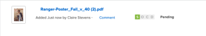

# Proof progress and status overview

You can view information about how a proof is progressing through the review process and see an overall summary of the proof's decision status from the Documents area.

## Proof progress overview

Proof progress indicates the work done on a proof from the time you send the proof to recipients to the time they make a decision on the proof. The progress icons, S, O, C, and D, appear next to the proof name and provide information about the proof's progress.

<table cellspacing="15"> 
 <col> 
 <col> 
 <thead> 
  <tr> 
   <td> 
Progress icon 
 </td> 
   <td> 
Description 
 </td> 
  </tr> 
 </thead> 
 <tbody> 
  <tr> 
   <td> 
  
 
Sent 
 </td> 
   <td> 
The proof has been sent to assigned recipients.
 </td> 
  </tr> 
  <tr> 
   <td> 
 
 
Opened&nbsp; 
 </td> 
   <td> 
All assigned recipients open&nbsp;the proof or Proof details page.
 </td> 
  </tr> 
  <tr> 
   <td> 
 
 
Comments made 
 </td> 
   <td> 
All assigned recipients make at least one comment on the proof.
 
If there are no reviewers&nbsp;assigned to the proof, the C&nbsp;icon does not appear in the progress bar.
 </td> 
  </tr> 
  <tr> 
   <td> 
  
 
Decision made 
 </td> 
   <td> 
All assigned approvers make a decision on the proof, All assigned approvers make a decision on the proof, unless the proof creator specifies only one decision is needed.
 
If there are no approvers (decision makers) designated for&nbsp;the proof,&nbsp;the D&nbsp;icon does not appear in the progress bar.&nbsp;
 </td> 
  </tr> 
 </tbody> 
</table>

The progress icons can appear in the following colors to indicate certain information about the proof's progress:

* `Green`: Complete.
* `White`: Not complete.
* `Orange`:&nbsp;Not&nbsp;complete and deadline is less than 24 hours. 
* `Red`: Not&nbsp;complete and past the deadline.

<!--
Levels of proof progress
-->

<!--
Workfront Proof uses the progress icons to track a proof's progress at each of the following levels:
-->

  <!--
  For each reviewer, based on that person's activity on the proof.
  -->

  <!--
  For each stage, based on the progress the reviewer on the stage who is most behind in the proofing process. To learn more about stages, see Automated Workflow Stages overview.
  -->

  <!--
  For the proof, based on the progress of the stage (group of reviewers) who is the most behind in the proofing process.
  -->

<!--
For an example of how Workfront Proof determines progress using the reviewer or stage that is most behind, suppose three reviewers on a proof need to make a decision. If two of them have made their decision but the third has not, the progress bar for the proof does not show the D in green because of the outstanding decision.
-->

<!--
If the Primary Decision Maker setting is selected on a proof and the primary decision maker submits a decision, the D in the proof progress bar turns green for all reviewers because no other decisions are required.
-->

<!--
Similarly, if the Only One Decision Required setting is selected on a proof and any reviewer submits a decision, the D in the proof progress bar turns green for all reviewers because no other decisions are required.
-->

## Proof status overview

The proof status displays the status of decisions that are required for the proof. The status of the proof is driven by the “worst case” participant. For example, suppose there are three decisions on the proof: two have the status of `Accepted` and one has the status of `Rejected`. The "worst case" decision of `Rejected` over-rules the other decisions and the overall status of the proof is shown as `Rejected`.&nbsp;

The standard status options are as follows:

* Pending
* Approved
* Approved with Changes
* Changes Required
* Not Relevant

If custom decisions are configured in your account, the status options reflect your&nbsp;custom decision&nbsp;settings.

<!--
Viewing proof progress and status
-->

<!--
You can view the progress and status of proofs for individual documents.
-->

  <!--
  View proof progress and status for a document
  -->

  <!--
  View proof approval information in Home
  -->

<!--
View proof progress and status for a document
-->

   <!--
   If a proof has not already been generated for the document in Adobe Workfront, generate it, as described in the Generate a proof articles.
   -->

   <!--
   In the Documents area, under the proof's name, click Proof Details.
   -->

   <!--
   In the Proofing Details box that appears, the proof's progress for each stage, then click Done.
   -->

<!--
View proof approval information in Home
-->

<!--
You can view information about proofs that you have submitted for approval. Proof approval information is displayed in the Home area only while the proof is pending approval. For information about how to view information about proof approvals in the Home area, see View approvals in Adobe Workfront.
-->

