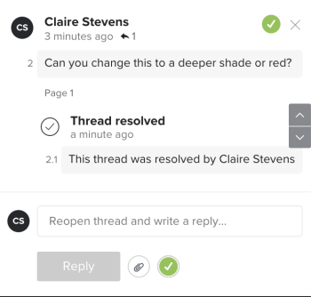

# Resolve proof comments

You can mark comments resolved after they been addressed. You can re-open a comment that you or another reviewer has resolved.

## Access requirements

+++ Expand to view access requirements for the functionality in this article.

You must have the following access to perform the steps in this article:

<table style="table-layout:auto"> 
 <col> 
 <col> 
 <tbody> 
  <tr> 
   <td role="rowheader">Adobe Workfront plan*</td> 
   <td> 
Current plan: Pro or Higher
 
or
 
Legacy plan: Select or Premium
 
For more information about proofing access with the different plans, see <a href="/help/quicksilver/administration-and-setup/manage-workfront/configure-proofing/access-to-proofing-functionality.md" class="MCXref xref">Access to proofing functionality in Workfront</a>.
 </td> 
  </tr> 
  <tr> 
   <td role="rowheader">Adobe Workfront license*</td> 
   <td> 
Current plan: Work or Plan
 
Legacy plan: Any (You must have proofing enabled for the user)
 </td> 
  </tr> 
  <tr> 
   <td role="rowheader">Proof Permission Profile </td> 
   <td>Manager or higher</td> 
  </tr> 
  <tr> 
   <td role="rowheader">Proof role</td> 
   <td>Author or Moderator</td> 
  </tr> 
  <tr> 
   <td role="rowheader">Access level configurations*</td> 
   <td> 
Edit access to Documents
 
For information on requesting additional access, see <a href="../../../../workfront-basics/grant-and-request-access-to-objects/request-access.md" class="MCXref xref">Request access to objects </a>.
 </td> 
  </tr> 
 </tbody> 
</table>

&#42;To find out what plan, role, or Proof Permission Profile you have, contact your Workfront or Workfront Proof administrator.

+++

## Resolve a comment

1. Go to the project, task, or issue that contains the document, then select **Documents**.
1. Find the proof you need, then click **Open proof**.

1. (Conditional) If the comments area is not open, click&nbsp;**View comments**&nbsp;in the upper-right corner.
1. Select the comment. 
1. Click the check mark icon in the lower-right corner of the comment. A green check mark appears in the upper-left corner of the comment and a "Thread resolved" label and message appear below it. The user who submitted the comment receives an email notification that the comment was resolved.

   

## Reopen a resolved comment

1. Go to the project, task, or issue that contains the document, then select **Documents**.
1. Find the proof you need, then click **Open proof**.

1. (Conditional) If the comments area is not open, click&nbsp;**View comments**&nbsp;in the upper-right corner.
1. Select the comment.
1. Click the green check mark icon in the lower-right corner of the comment (to the right of the **Reply** button). The check mark in the upper-left corner of the comment disappears and a "Thread reopened" label and message appear below it. The user who submitted the comment receives an email notification that the comment was reopened.

   
